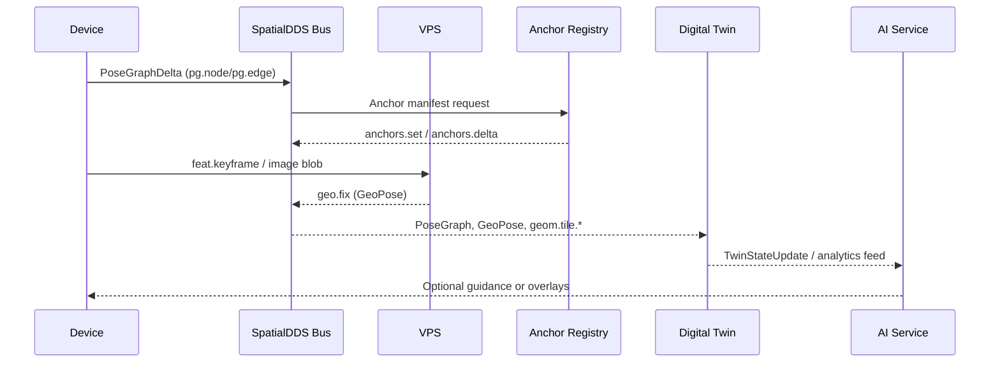

## **SpatialDDS: A Protocol for Real-World Spatial Computing**

*An open invitation to build a shared bus for spatial data, AI world models, and digital twins.*

**Version**: 1.3 (Draft)

**Date**: TBD

**Author**: James Jackson [Open AR Cloud, Metaverse Standards Forum - Real/Virtual World Integration WG Co-chair]

## Contents

### Part I – Overview
*Get oriented with the motivation, core building blocks, practical scenarios, and forward-looking roadmap before diving into the normative material.*

1. [Introduction](sections/v1.3/01-introduction.md)
2. [IDL Profiles](sections/v1.3/02-idl-profiles.md)
3. [Operational Scenarios](sections/v1.3/04-operational-scenarios.md)
4. [Conclusion](sections/v1.3/conclusion.md)
5. [Future Directions](sections/v1.3/future-directions.md)

### Part II – Reference
*Specifications, identifiers, supporting glossaries, and appendices that implementers can consult while building SpatialDDS solutions.*

6. [SpatialDDS URIs](sections/v1.3/02a-spatialdds-uris.md)
7. [Example Manifests](sections/v1.3/03-example-manifests.md)
8. [Glossary of Acronyms](sections/v1.3/glossary.md)
9. [References](sections/v1.3/references.md)
10. Appendices
    - [Appendix A: Core Profile](sections/v1.3/appendix-a.md)
    - [Appendix B: Discovery Profile](sections/v1.3/appendix-b.md)
    - [Appendix C: Anchor Registry Profile](sections/v1.3/appendix-c.md)
    - [Appendix D: Extension Profiles](sections/v1.3/appendix-d.md)
    - [Appendix E: Provisional Extension Examples](sections/v1.3/appendix-e.md)

## **1\. Introduction**

SpatialDDS is a lightweight, standards-based protocol for real-time exchange of spatial world models. It is designed as a shared data bus that allows devices, services, and AI agents to publish and subscribe to structured representations of the physical world — from pose graphs and 3D geometry to anchors, semantic detections, and service discovery. By providing a common substrate, SpatialDDS enables applications in robotics, AR/XR, digital twins, and smart cities to interoperate while also supporting new AI-driven use cases such as perception services, neural maps, and planning agents.

At its core, SpatialDDS is defined through **IDL profiles** that partition functionality into clean modules:

* **Core**: pose graphs, geometry tiles, anchors, transforms, and blobs.  
* **Discovery**: lightweight announce messages and manifests for services, coverage, anchors, and content.
* **Anchors**: durable anchors and registry updates for persistent world-locked reference points.  
* **Extensions**: optional domain-specific profiles including VIO sensors, SLAM frontend features, semantic detections, AR+Geo, and provisional Neural/Agent profiles.

This profile-based design keeps the protocol lean and interoperable, while letting communities adopt only the pieces they need.

### **Why DDS?**

SpatialDDS builds directly on the OMG Data Distribution Service (DDS), a proven standard for real-time distributed systems. DDS provides:

* **Peer-to-peer publish/subscribe** with automatic discovery, avoiding centralized brokers.  
* **Typed data** with schema enforcement, versioning, and language bindings.  
* **Fine-grained QoS** for reliability, liveliness, durability, and latency control.  
* **Scalability** across edge devices, vehicles, and cloud backends.

This foundation ensures that SpatialDDS is not just a message format, but a full-fledged, high-performance middleware for spatial computing.

### **Benefits across domains**

* **Robotics & Autonomous Vehicles**: Share pose graphs, maps, and detections across robots, fleets, and control centers.  
* **Augmented & Mixed Reality**: Fuse VPS results and anchors into persistent, shared spatial contexts; stream geometry and semantics to clients.  
* **Digital Twins & Smart Cities**: Ingest real-time streams of geometry, anchors, and semantics into twin backends, and republish predictive overlays.  
* **IoT & Edge AI**: Integrate lightweight perception services, sensors, and planners that consume and enrich the shared world model.  
* **AI World Models & Agents**: Provide foundation models and AI agents with a structured, typed view of the physical world for perception, reasoning, and planning.

### **Design Principles**

* **Keep the wire light**
  SpatialDDS defines compact, typed messages via IDL. Heavy or variable content (meshes, splats, masks, assets) is carried as blobs, referenced by stable IDs. This avoids bloating the bus while keeping payloads flexible.
* **Profiles, not monoliths**
  SpatialDDS is organized into modular profiles: Core, Discovery, and Anchors form the foundation, while optional Extensions (VIO, SLAM Frontend, Semantics, AR+Geo) and provisional profiles (Neural, Agent) add domain-specific capabilities. Implementers adopt only what they need, keeping deployments lean and interoperable.
* **AI-ready, domain-neutral**
  While motivated by SLAM, AR, robotics, and digital twins, the schema is deliberately generic. Agents, foundation models, and AI services can publish and subscribe alongside devices without special treatment.
* **Anchors as first-class citizens**
  Anchors provide durable, shared reference points that bridge positioning, mapping, and content attachment. The Anchor Registry makes them discoverable and persistent across sessions.
* **Discovery without heaviness**
  Lightweight announce messages plus JSON manifests allow services (like VPS, mapping, or anchor registries) and content/experiences to be discovered at runtime without centralized registries.
* **Interoperability with existing standards**
  SpatialDDS is designed to align with and complement related standards such as OGC GeoPose, CityGML/3D Tiles, and Khronos OpenXR. This ensures it can plug into existing ecosystems rather than reinvent them.

### **Architecture Overview & Data Flow**

Before diving into identifiers and manifests, it helps to see how SpatialDDS components interlock when a client joins the bus. The typical flow looks like:

```
SpatialDDS URI ──▶ Manifest Resolver ──▶ Discovery Topic ──▶ DDS/Data Streams ──▶ Shared State & Anchors
        │                 │                      │                   │                      │
   (Section 6)      (Manifests)         (Sections 2.2 & 3)        (Core Profile)         (Anchors & Apps)
```

1. **URI → Manifest lookup** – Durable SpatialDDS URIs point to JSON manifests that describe services, anchor sets, or content. Clients resolve the URI (often via HTTPS or a local cache) to fetch capabilities, QoS hints, and connection parameters.
2. **Discovery → selecting a service** – Guided by the manifest and Discovery profile messages, participants determine which SpatialDDS services are available in their vicinity, their coverage areas, and how to engage them.
3. **Transport → messages on stream or DDS** – With a target service selected, the client joins the appropriate DDS domain/partition or auxiliary transport identified in the manifest and begins exchanging typed IDL messages for pose graphs, geometry, or perception streams.
4. **State updates / anchor resolution** – As data flows, participants publish and subscribe to state changes. Anchor registries and anchor delta messages keep spatial references aligned so downstream applications can resolve world-locked content with shared context.

This loop repeats as participants encounter new SpatialDDS URIs—keeping discovery, transport, and shared state synchronized.

### **SpatialDDS URIs**

SpatialDDS URIs give every anchor, service, and content bundle a stable handle that can be shared across devices and transports while still resolving to rich manifest metadata. They are the glue between lightweight on-bus messages and descriptive out-of-band manifests, ensuring that discovery pointers stay durable even as infrastructure moves. Section 6 (SpatialDDS URIs) defines the precise syntax, allowed types, and resolver requirements for these identifiers.


## **2\. IDL Profiles**

The SpatialDDS IDL bundle defines the schemas used to exchange real-world spatial data over DDS. It is organized into complementary profiles: **Core**, which provides the backbone for pose graphs, geometry, and geo-anchoring; **Discovery**, which enables lightweight announcements of services, coverage, anchors, and content; and **Anchors**, which adds support for publishing and updating sets of durable world-locked anchors. Together, these profiles give devices, services, and applications a common language for building, sharing, and aligning live world models—while staying codec-agnostic, forward-compatible, and simple enough to extend for domains such as robotics, AR/XR, IoT, and smart cities.

### **2.1 Core SpatialDDS**

The Core profile defines the essential building blocks for representing and sharing a live world model over DDS. It focuses on a small, stable set of concepts: pose graphs, 3D geometry tiles, blob transport for large payloads, and geo-anchoring primitives such as anchors, transforms, and simple GeoPoses. The design is deliberately lightweight and codec-agnostic: tiles reference payloads but do not dictate mesh formats, and anchors define stable points without tying clients to a specific localization method. By centering on graph \+ geometry \+ anchoring, the Core profile provides a neutral foundation that can support diverse pipelines across robotics, AR, IoT, and smart city contexts.

### **2.2 Discovery**

The Discovery profile adds a minimal, lightweight way to announce services, anchors, content, and registries in the real world. It complements DDS’s built-in participant and topic discovery by describing what a service does, where it operates, and how to learn more. Announcements are deliberately simple—service kind, coarse coverage (via geohash or a bounding-box array `[min_lon, min_lat, max_lon, max_lat]`), and a pointer to a manifest for richer details. This keeps the bus lean while enabling clients to discover and connect to services such as VPS, mapping, anchor registries, semantics, or AR content providers without requiring heavy registries or complex protocols.

### **2.3 Anchors**

The Anchors profile provides a structured way to share and update collections of durable, world-locked anchors. While Core includes individual GeoAnchor messages, this profile introduces constructs such as AnchorSet for publishing bundles (e.g., a venue’s anchor pack) and AnchorDelta for lightweight updates. This makes it easy for clients to fetch a set of anchors on startup, stay synchronized through incremental changes, and request full snapshots when needed. Anchors complement VPS results by providing the persistent landmarks that make AR content and multi-device alignment stable across sessions and users.

### **2.4 Profiles Summary**

The complete SpatialDDS IDL bundle is organized into the following profiles:

* **Core Profile**  
  Fundamental building blocks: pose graphs, geometry tiles, anchors, transforms, and blob transport.  
* **Discovery Profile**  
   Lightweight announce messages and manifests for services, coverage areas, anchors, and spatial content or experiences.
* **Anchors Profile**  
  Durable anchors and the Anchor Registry, enabling persistent world-locked reference points.

Together, Core, Discovery, and Anchors form the foundation of SpatialDDS, providing the minimal set required for interoperability.

* **Extensions**  
  * **VIO Profile**: Raw and fused IMU and magnetometer samples for visual-inertial pipelines.  
  * **SLAM Frontend Profile**: Features, descriptors, and keyframes for SLAM and SfM pipelines.  
  * **Semantics Profile**: 2D and 3D detections for AR occlusion, robotics perception, and analytics.  
  * **AR+Geo Profile**: GeoPose, frame transforms, and geo-anchoring structures for global alignment and persistent AR content.  
* **Provisional Extensions (Optional)**  
  * **Neural Profile**: Metadata for neural fields (e.g., NeRFs, Gaussian splats) and optional view-synthesis requests.  
  * **Agent Profile**: Generic task and status messages for AI agents and planners.

Together, these profiles give SpatialDDS the flexibility to support robotics, AR/XR, digital twins, IoT, and AI world models—while ensuring that the wire format remains lightweight, codec-agnostic, and forward-compatible.


## **3. Operational Scenarios: From SLAM to AI World Models**

SpatialDDS supports a ladder of capabilities that begins with a single device mapping its surroundings and ends with AI systems consuming a live digital twin. Rather than enumerating isolated use cases, this section walks through one coherent flow — from local SLAM to shared anchors, to global positioning, to twin aggregation, and ultimately to AI world models.

### **Narrative Walkthrough: Local → Shared → Global → AI**

1. **Local SLAM on-device.** A headset, drone, or robot runs visual-inertial SLAM, generating keyframes and odometry updates in its private map frame.
2. **Sharing a pose graph.** The device publishes `pg.node` and `pg.edge` samples (often as compact PoseGraphDelta bursts) onto the SpatialDDS bus so nearby peers or edge services can extend or optimize the map.
3. **Anchors stabilize VIO.** By discovering the Anchor Registry, the device resolves durable anchor URIs, retrieves their manifests, and fuses those priors to keep its VIO estimate drift-free.
4. **VPS provides a GeoPose.** When the device needs a global fix, it queries a Visual Positioning Service (VPS). The VPS uses the shared pose graph plus anchor hints to return a `geo.fix` sample that orients the local map in a world frame.
5. **Digital twin aggregation.** Twin backends subscribe to the same streams — pose graphs, anchors, geometry, and semantics — to maintain authoritative state for places, assets, and events.
6. **AI world models consume the twin.** Analytics engines, planning agents, and foundation models read from the digital twin feeds, grounding their predictions and experiences in the synchronized world model.

The end result is a continuous chain: local sensing feeds a shared spatial data bus, anchors and VPS lift content into a global frame, digital twins maintain durable state, and AI systems reason over the fused model.



### **Example 1: Device Localization with SLAM and Anchors**

A field technician’s headset begins indoors with self-contained SLAM. As it walks the “local → shared → global” ladder:

- **Publish local mapping.** Each keyframe produces a PoseGraphDelta that streams to `pg.node` / `pg.edge`. An excerpt looks like:

  ```jsonc
  {
    "topic": "pg.node",
    "map_id": "map/facility-west",
    "node_id": "kf_0120",
    "pose": { "t": [0.12, 0.04, 1.43], "q": [0.99, 0.01, -0.02, 0.03] },
    "frame_id": "map",
    "stamp": { "sec": 1714070452, "nsec": 125000000 },
    "source_id": "device/headset-17"
  }
  ```

- **Discover anchors.** Through `disco.service`, the headset resolves `anchor://facility-west/loading-bay`, fetches the manifest (Appendix A.1), and applies the returned `FrameTransform` to pin its `map` frame to a surveyed ENU.
- **Query VPS.** When entering the yard, it uploads a `feat.keyframe` set to VPS. The service matches against the shared pose graph plus anchor hints and responds with a `geo.fix` sample:

  ```jsonc
  {
    "topic": "geo.fix",
    "anchor_id": "anchor://facility-west/loading-bay",
    "geopose": {
      "lat_deg": 37.79341,
      "lon_deg": -122.39412,
      "alt_m": 12.6,
      "q": [0.71, 0.00, 0.70, 0.05],
      "frame_kind": "ENU",
      "frame_ref": "@37.79340,-122.39410,5.2"
    },
    "cov": [0.04, 0, 0, 0.04, 0, 0, 0, 0, 0.09]
  }
  ```

- **Align to world.** The headset fuses the GeoPose with its local pose graph, hands peers a globally aligned `geo.tf`, and continues publishing drift-stable updates for others to use.

(See Appendix A.1 for the full anchor and VPS manifests referenced here.)

### **Example 2: Updating and Using a Digital Twin**

A facilities digital twin service subscribes to the same DDS topics to maintain a live model, while an AI analytics engine consumes the twin stream:

- **Twin ingestion.** The backend listens to `pg.node`, `geo.anchor`, and `geom.tile.*` to reconcile a persistent state for each asset. When a door actuator changes, an operator microservice emits:

  ```jsonc
  {
    "topic": "twin.state.update",
    "uri": "urn:spatial://facility-west/assets/door-17",
    "anchor_ref": "anchor://facility-west/loading-bay",
    "state": {
      "pose_local": {
        "t": [4.21, -1.02, 0.00],
        "q": [1, 0, 0, 0]
      },
      "door_status": "open",
      "last_maintenance": "2024-03-22"
    },
    "stamp": { "sec": 1714070520, "nsec": 0 }
  }
  ```

  The twin registry validates the anchor reference, signs a manifest (Appendix A.2), and updates the canonical record.

- **AI/analytics consumption.** A predictive maintenance model subscribes to `twin.state.update` and `semantics.det.3d.set` streams. It flags abnormal open durations, publishing alerts and AR overlays back through SpatialDDS.
- **Experience feedback.** AR clients render the AI insight, while robotics planners reuse the same URI-addressable twin objects for navigation.

(See Appendix A.2 for extended twin manifests and analytics payloads.)

### **Why the Ladder Matters**

This end-to-end chain demonstrates how SpatialDDS keeps local SLAM, shared anchors, VPS fixes, digital twins, and AI models in sync without bespoke gateways. Devices gain reliable localization, twins receive authoritative updates, and AI systems operate on a grounded, real-time world model.

## **4. Conclusion**

SpatialDDS provides a lightweight, standards-based framework for exchanging real-world spatial data over DDS. By organizing schemas into modular profiles — with Core, Discovery, and Anchors as the foundation and Extensions adding domain-specific capabilities — it supports everything from SLAM pipelines and AR clients to digital twins, smart city infrastructure, and AI-driven world models. Core elements such as pose graphs, geometry tiles, anchors, and discovery give devices and services a shared language for building and aligning live models of the world, while provisional extensions like Neural and Agent point toward richer semantics and autonomous agents. Taken together, SpatialDDS positions itself as a practical foundation for real-time spatial computing—interoperable, codec-agnostic, and ready to serve as the data bus for AI and human experiences grounded in the physical world.


## **5. Future Directions**

While SpatialDDS establishes a practical baseline for real-time spatial computing, several areas invite further exploration:

* **Reference Implementations**  
  Open-source libraries and bridges to existing ecosystems (e.g., ROS 2, OpenXR, OGC APIs) would make it easier for developers to adopt SpatialDDS in robotics, AR, and twin platforms.  
* **Semantic Enrichment**  
  Extending beyond 2D/3D detections, future work could align with ontologies and scene graphs to enable richer machine-readable semantics for AI world models and analytics.  
* **Neural Integration**  
  Provisional support for neural fields (NeRFs, Gaussian splats) could mature into a stable profile, ensuring consistent ways to stream and query neural representations across devices and services.  
* **Agent Interoperability**  
  Lightweight tasking and coordination schemas could evolve into a standard Agent profile, supporting multi-agent planning and human-AI collaboration at scale.  
* **Standards Alignment**  
  Ongoing coordination with OGC, Khronos, W3C, and GSMA initiatives will help ensure SpatialDDS complements existing geospatial, XR, and telecom standards rather than duplicating them.

Together, these directions point toward a future where SpatialDDS is not just a protocol but a foundation for an open, interoperable ecosystem of real-time world models.

We invite implementers, researchers, and standards bodies to explore SpatialDDS, contribute extensions, and help shape it into a shared backbone for real-time spatial computing and AI world models.


## **6. SpatialDDS URIs**

### 6.1 Why SpatialDDS URIs matter

SpatialDDS URIs are the shorthand that lets participants talk about anchors, content, and services without exchanging the full manifests up front. They bridge human concepts—"the anchor in Hall 1" or "the localization service for Midtown"—with machine-readable manifests that deliver the precise data, coordinate frames, and capabilities needed later in the flow.

### 6.2 Key ingredients

Every SpatialDDS URI names four ideas:

* **Authority** – who owns the namespace and keeps the identifiers stable.
* **Zone** – a slice of that authority’s catalog, such as a venue, fleet, or logical shard.
* **Type** – whether the reference points to an anchor, a bundle of anchors, a piece of content, or a service endpoint.
* **Identifier (with optional version)** – the specific record the manifest will describe.

The exact tokens and encoding rules are defined by the individual profiles, but at a glance the URIs read like `spatialdds://authority/zone/type/id;v=version`. Readers only need to recognize which part expresses ownership, scope, semantics, and revision so they can reason about the rest of the system.

### 6.3 Working with SpatialDDS URIs

Once a URI is known, clients ask the authority for the manifest it points to—typically via HTTPS, though authorities can advertise other transports if they operate private caches or field buses. The manifest reveals everything the client needs to act: anchor poses, dependency graphs for experiences, or how to reach a service. Because URIs remain lightweight, they are easy to pass around in tickets, QR codes, or discovery topics while deferring the heavier data fetch until runtime.

### 6.4 Examples

```text
spatialdds://museum.example.org/hall1/anchor/01J8QDFQX3W9X4CEX39M9ZP6TQ
spatialdds://city.example.net/downtown/service/01HA7M6XVBTF6RWCGN3X05S0SM;v=2024-q2
spatialdds://studio.example.com/stage/content/01HCQF7DGKKB3J8F4AR98MJ6EH
```

In the manifest samples later in this specification, each of these identifiers expands into a full JSON manifest. Reviewing those examples shows how a single URI flows from a discovery payload, through manifest retrieval, to runtime consumption.

## **7. Example Manifests**

While SpatialDDS keeps its on-bus messages small and generic, richer details about services, maps, and experiences are provided out-of-band through manifests. A manifest is a lightweight JSON document referenced by a `manifest_uri` in a discovery announce. In v1.3 those manifest pointers are canonical `spatialdds://` URIs (e.g., `spatialdds://acme.services/sf/service/vps-main`) that resolve using the rules described in Section 6 (SpatialDDS URIs), guaranteeing stable identifiers even when manifests are hosted on rotating infrastructure. Manifests let providers describe capabilities, formats, coverage shapes, entry points, and assets without bloating the real-time data stream. The examples here show four common cases: a Visual Positioning Service (VPS) manifest that defines request/response topics and limits, a Mapping Service manifest that specifies tiling scheme and encodings, a Content/Experience manifest that lists anchors, tiles, and media for AR experiences, and an Anchors manifest that enumerates localization anchors with associated assets. Together they illustrate how manifests complement the DDS data plane by carrying descriptive metadata and policy.

Example discovery announcements would therefore carry manifest URIs such as:

* `spatial::disco::ServiceAnnounce.manifest_uri = spatialdds://acme.services/sf/service/vps-main`
* `spatial::disco::ServiceAnnounce.manifest_uri = spatialdds://acme.services/sf/service/mapping-tiles`
* `spatial::disco::ContentAnnounce.manifest_uri = spatialdds://acme.services/sf/content/market-stroll`

Legacy HTTPS download links can still be advertised inside the manifest body, but the discovery announcements themselves now use the SpatialDDS URI scheme so clients have a consistent, scheme-agnostic handle to resolve.

### **A) VPS Manifest**

*This manifest describes a Visual Positioning Service (VPS). It specifies the service identifier, version, coverage area, and the topics used for queries and responses. It also lists supported input encodings and response types, allowing clients to determine compatibility before interacting with the service.*

```json
{
  "service_id": "svc:vps:acme/sf-downtown",
  "profiles": ["Core", "SLAM Frontend", "AR+Geo"],
  "request": {
    "features_topic": "feat.keyframe",
    "image_blob_role": "image/jpeg",
    "prior_topic": "geo.fix"
  },
  "response": {
    "rich": "pg.nodegeo",
    "minimal": "geo.fix"
  },
  "limits": { "max_fps": 10, "max_image_px": 1920 },
  "auth": { "scheme": "oauth2", "issuer": "https://auth.acme.com" },
  "coverage": { "geohash": ["9q8y","9q8z"] }
}

```

### **B) Mapping Service Manifest**

*This manifest describes a Mapping service that publishes geometry tiles for a given coverage area. It defines the service identifier, version, supported encodings, and the DDS topics used for requesting and receiving tile data. It enables clients to subscribe to live or cached geometry without ambiguity about formats or endpoints.*

```json
{
  "service_id": "svc:mapping:acme/sf-downtown",
  "version": "1.0.0",
  "provider": { "id": "acme-maps", "org": "Acme Maps Inc." },
  "title": "Acme Downtown Map Service",
  "summary": "Tiled 3D meshes for SF downtown area",
  "profiles": ["Core"],
  "topics": {
    "meta": "geom.tile.meta",
    "patch": "geom.tile.patch",
    "blob": "geom.tile.blob"
  },
  "tile_scheme": "quadtree",
  "encodings": ["glTF+Draco", "LASzip"],
  "lod_range": [12, 18],
  "coverage": {
    "geohash": ["9q8y","9q8z"],
    "polygon_uri": "https://cdn.acme.example/downtown_poly.geojson"
  },
  "auth": { "scheme": "none" },
  "terms": { "license": "CC-BY-4.0" }
}

```

### **C) Content/Experience Manifest**

*This manifest describes a spatial content or experience service. It declares a content identifier, version, anchor bindings, and optional dependencies on other manifests. This allows AR applications to discover and attach experiences to shared anchors while keeping the actual content assets (e.g., 3D models, media) external to DDS.*

```json
{
  "content_id": "xp:sculpture-walk:met-foyer",
  "version": "1.0.2",
  "provider": { "id": "svc:content:museum-inc", "org": "Museum Inc." },
  "title": "AR Sculpture Walk",
  "summary": "Guided AR overlays for five sculptures in the main foyer.",
  "tags": ["ar", "museum", "tour"],
  "profiles_required": ["Core", "AR+Geo"],
  "availability": {
    "from": "2025-09-01T09:00:00Z",
    "until": "2025-12-31T23:59:59Z",
    "local_tz": "America/New_York"
  },
  "coverage": { "geohash": ["dr5ru9","dr5rua"], "polygon_uri": "https://cdn.museum.example/foyer_poly.geojson" },
  "entrypoints": {
    "anchors": [
      { "anchor_id": "anchor/met-foyer/north-plinth", "hint": "Start here" },
      { "anchor_id": "anchor/met-foyer/central", "hint": "Checkpoint 2" }
    ]
  },
  "runtime_topics": {
    "subscribe": ["geo.tf", "geo.anchor", "geom.tile.meta", "geom.tile.patch"],
    "optional": ["semantics.det.3d.set"]
  },
  "assets": [
    { "type": "image", "role": "poster", "uri": "https://cdn.museum.example/img/poster.jpg" },
    { "type": "audio", "role": "narration", "uri": "https://cdn.museum.example/audio/room_intro.mp3", "lang": "en" }
  ]
}

```

### **D) Anchors Manifest**

*This manifest enumerates durable localization anchors for a zone and links them to relocalization or scene-alignment assets.* Each anchor entry supplies an `anchor_id`, a simplified GeoPose (latitude, longitude, altitude, quaternion), and whatever metadata or asset descriptors the publisher wants to expose (timestamps, quality hints, coverage tags, etc.). Top-level fields mirror the publisher's registry structure—no default frame assumptions or cache semantics are imposed by the specification.

```json
{
  "schema": "https://example.org/spatialdds/anchor-manifest.schema.json#v1",
  "zone_id": "knossos:palace",
  "zone_title": "Knossos Palace Archaeological Site",
  "coverage": {
    "geohash": ["sv8wkf", "sv8wkg"],
    "bbox": [
      25.1608,
      35.2965,
      25.1665,
      35.3002
    ]
  },
  "anchors": [
    {
      "anchor_id": "square:statue-east",
      "geopose": {
        "lat_deg": 35.29802,
        "lon_deg": 25.16305,
        "alt_m": 110.2,
        "qw": 1,
        "qx": 0,
        "qy": 0,
        "qz": 0
      },
      "assets": [
        {
          "kind": "features:ORB:v1",
          "uri": "https://registry.example/anchors/statue-east/orb_v1.bin",
          "count": 2048,
          "descriptor_bytes": 32,
          "patch_frame": "anchor-local",
          "hash": "sha256:placeholder...",
          "bytes": 65536
        },
        {
          "kind": "geom:pcd:lod1",
          "uri": "https://registry.example/anchors/statue-east/patch_lod1.las",
          "points": 12000,
          "hash": "sha256:placeholder...",
          "bytes": 480000
        }
      ],
      "stamp": "2025-09-07T15:45:00Z"
    },
    {
      "anchor_id": "central-court:north",
      "geopose": {
        "lat_deg": 35.29761,
        "lon_deg": 25.16391,
        "alt_m": 109.8,
        "qw": 0.707,
        "qx": 0,
        "qy": 0,
        "qz": 0.707
      },
      "assets": [
        {
          "kind": "features:SuperPoint:v1",
          "uri": "https://registry.example/anchors/central-court-n/superpoint_v1.npz",
          "count": 1500,
          "descriptor_bytes": 256,
          "hash": "sha256:placeholder...",
          "bytes": 220000
        },
        {
          "kind": "geom:mesh:lod0",
          "uri": "https://registry.example/anchors/central-court-n/patch_lod0.glb",
          "triangles": 8000,
          "hash": "sha256:placeholder...",
          "bytes": 350000
        }
      ],
      "stamp": "2025-09-08T11:12:13Z"
    }
  ],
  "stamp": "2025-09-12T22:55:00Z"
}

```

## **8. Glossary of Acronyms**

**AI** – Artificial Intelligence

**AR** – Augmented Reality

**DDS** – Data Distribution Service (OMG standard middleware)

**GSMA** – GSM Association (global mobile industry group)

**IMU** – Inertial Measurement Unit

**IoT** – Internet of Things

**MR** – Mixed Reality

**MSF** – Metaverse Standards Forum

**NeRF** – Neural Radiance Field (neural representation of 3D scenes)

**OGC** – Open Geospatial Consortium

**OMG** – Object Management Group (standards body for DDS)

**ROS** – Robot Operating System

**SfM** – Structure from Motion

**SLAM** – Simultaneous Localization and Mapping

**VIO** – Visual-Inertial Odometry

**VLM** – Vision-Language Model

**VPS** – Visual Positioning Service

**VR** – Virtual Reality

**W3C** – World Wide Web Consortium

**XR** – Extended Reality (umbrella term including AR, VR, MR)


## **9. References**

### **DDS & Middleware**

\[1\] Object Management Group. *Data Distribution Service (DDS) for Real-Time Systems.* OMG Standard. Available: [https://www.omg.org/spec/DDS](https://www.omg.org/spec/DDS)

\[2\] Object Management Group. *DDS for eXtremely Resource Constrained Environments (DDS-XRCE).* OMG Standard. Available: [https://www.omg.org/spec/DDS-XRCE](https://www.omg.org/spec/DDS-XRCE)

\[3\] eProsima. *Fast DDS Documentation.* Available: [https://fast-dds.docs.eprosima.com](https://fast-dds.docs.eprosima.com/)

\[4\] Eclipse Foundation. *Cyclone DDS.* Available: [https://projects.eclipse.org/projects/iot.cyclonedds](https://projects.eclipse.org/projects/iot.cyclonedds)

### **XR & Spatial Computing**

\[5\] Khronos Group. *OpenXR Specification.* Available: [https://www.khronos.org/openxr](https://www.khronos.org/openxr)

\[6\] Open Geospatial Consortium. *OGC GeoPose 1.0 Data Exchange Standard.* Available: [https://www.ogc.org/standards/geopose](https://www.ogc.org/standards/geopose)

### **Geospatial Standards**

\[7\] Open Geospatial Consortium. *CityGML Standard.* Available: [https://www.ogc.org/standards/citygml](https://www.ogc.org/standards/citygml)

\[8\] Geohash. *Wikipedia Entry.* Available: [https://en.wikipedia.org/wiki/Geohash](https://en.wikipedia.org/wiki/Geohash)

### **SLAM, SfM & AI World Models**

\[9\] Mur-Artal, R., Montiel, J. M. M., & Tardós, J. D. (2015). *ORB-SLAM: A Versatile and Accurate Monocular SLAM System.* IEEE Transactions on Robotics, 31(5), 1147–1163.

\[10\] Schönberger, J. L., & Frahm, J.-M. (2016). *Structure-from-Motion Revisited.* In IEEE Conference on Computer Vision and Pattern Recognition (CVPR), 4104–4113.

\[11\] Sarlin, P.-E., Unagar, A., Larsson, M., et al. (2020). *From Coarse to Fine: Robust Hierarchical Localization at Large Scale.* In IEEE Conference on Computer Vision and Pattern Recognition (CVPR), 12716–12725.

\[12\] Google Research. *ARCore Geospatial API & Visual Positioning Service.* Developer Documentation. Available: [https://developers.google.com/ar](https://developers.google.com/ar)


## **Appendix A: Core Profile**

*The Core profile defines the fundamental data structures for SpatialDDS. It includes pose graphs, 3D geometry tiles, anchors, transforms, and generic blob transport. This is the minimal interoperable baseline for exchanging world models across devices and services.*

```idl
// SPDX-License-Identifier: MIT
// SpatialDDS Core 1.2

module spatial {
  module core {

    // ---------- Utility ----------
    struct Time {
      int32  sec;     // seconds since UNIX epoch (UTC)
      uint32 nsec;    // nanoseconds [0..1e9)
    };

    struct PoseSE3 {
      double t[3];    // translation (x,y,z)
      double q[4];    // quaternion (w,x,y,z)
    };

    @appendable struct TileKey {
      @key uint32 x;     // tile coordinate (quadtree/3D grid)
      @key uint32 y;
      @key uint32 z;     // use 0 for 2D schemes
      @key uint8  level; // LOD level
    };

    // ---------- Geometry ----------
    enum PatchOp { ADD = 0, REPLACE = 1, REMOVE = 2 };

    @appendable struct BlobRef {
      string blob_id;   // UUID or content-address
      string role;      // "mesh","attr/normals","pcc/geom","pcc/attr",...
      string checksum;  // SHA-256 (hex)
    };

    @appendable struct TileMeta {
      @key TileKey key;              // unique tile key
      string tile_id_compat;         // optional human-readable id
      double min_xyz[3];             // AABB min (local frame)
      double max_xyz[3];             // AABB max (local frame)
      uint32 lod;                    // may mirror key.level
      uint64 version;                // monotonic full-state version
      string encoding;               // "glTF+Draco","MPEG-PCC","V3C","PLY",...
      string checksum;               // checksum of composed tile
      sequence<string, 32> blob_ids; // blobs composing this tile
      // optional geo hints
      double centroid_llh[3];        // lat,lon,alt (deg,deg,m) or NaN
      double radius_m;               // rough extent (m) or NaN
    };

    @appendable struct TilePatch {
      @key TileKey key;              // which tile
      uint64 revision;               // monotonic per-tile
      PatchOp op;                    // ADD/REPLACE/REMOVE
      string target;                 // submesh/attr/"all"
      sequence<BlobRef, 8> blobs;    // payload refs
      string post_checksum;          // checksum after apply
      Time   stamp;                  // production time
    };

    @appendable struct BlobChunk {
      @key string blob_id;               // which blob
      uint32 index;                      // chunk index (0..N-1)
      sequence<uint8, 262144> data;      // ≤256 KiB per sample
      boolean last;                      // true on final chunk
    };

    // ---------- Pose Graph (minimal) ----------
    enum EdgeTypeCore { ODOM = 0, LOOP = 1 };

    @appendable struct Node {
      string map_id;
      @key string node_id;     // unique keyframe id
      PoseSE3 pose;            // pose in frame_id
      double  cov[36];         // 6x6 covariance (row-major); NaN if unknown
      Time    stamp;
      string  frame_id;        // e.g., "map"
      string  source_id;
      uint64  seq;             // per-source monotonic
      uint64  graph_epoch;     // for major rebases/merges
    };

    @appendable struct Edge {
      string map_id;
      @key string edge_id;     // unique edge id
      string from_id;          // source node
      string to_id;            // target node
      EdgeTypeCore type;       // ODOM or LOOP
      double information[36];  // 6x6 info matrix (row-major)
      Time   stamp;
      string source_id;
      uint64 seq;
      uint64 graph_epoch;
    };

    // ---------- Geo anchoring ----------
    enum GeoFrameKind { ECEF = 0, ENU = 1, NED = 2 };

    @appendable struct GeoPose {
      double lat_deg;
      double lon_deg;
      double alt_m;            // ellipsoidal meters
      double q[4];             // orientation (w,x,y,z)
      GeoFrameKind frame_kind; // ECEF/ENU/NED
      string frame_ref;        // for ENU/NED: "@lat,lon,alt"
      Time   stamp;
      double cov[9];           // 3x3 pos covariance (m^2), row-major; NaN if unknown
    };

    @appendable struct GeoAnchor {
      @key string anchor_id;   // e.g., "anchor/4th-and-main"
      string map_id;
      string frame_id;         // local frame (e.g., "map")
      GeoPose geopose;         // global pose
      string  method;          // "GNSS","VisualFix","Surveyed","Fusion"
      double  confidence;      // 0..1
      string  checksum;        // integrity/versioning
    };

    @appendable struct FrameTransform {
      @key string transform_id; // e.g., "map->ENU@lat,lon,alt"
      string parent_frame;      // global frame (ENU@..., ECEF, ...)
      string child_frame;       // local frame ("map")
      PoseSE3 T_parent_child;   // transform parent->child
      Time    stamp;
      double  cov[36];          // 6x6 covariance; NaN if unknown
    };

    // ---------- Snapshot / Catch-up ----------
    @appendable struct SnapshotRequest {
      @key TileKey key;        // which tile
      uint64 up_to_revision;   // 0 = latest
    };

    @appendable struct SnapshotResponse {
      @key TileKey key;                 // tile key
      uint64 revision;                  // snapshot revision served
      sequence<string, 64> blob_ids;    // composing blobs
      string checksum;                  // composed state checksum
    };

  }; // module core
};   // module spatial

```

## **Appendix B: Discovery Profile**

*The Discovery profile defines the lightweight announce messages and manifests that allow services, coverage areas, and spatial content or experiences to be discovered at runtime. It enables SpatialDDS deployments to remain decentralized while still providing structured service discovery.*

```idl
// SPDX-License-Identifier: MIT
// SpatialDDS Discovery 1.2
// Lightweight announces for services, coverage, and content

module spatial {
  module disco {

    typedef spatial::core::Time Time;
    // Canonical manifest references use the spatialdds:// URI scheme.
    typedef string SpatialUri;

    enum ServiceKind {
      VPS = 0,
      MAPPING = 1,
      RELOCAL = 2,
      SEMANTICS = 3,
      STORAGE = 4,
      CONTENT = 5,
      ANCHOR_REGISTRY = 6,
      OTHER = 255
    };

    @appendable struct KV {
      string key;
      string value;
    };

    @appendable struct ServiceAnnounce {
      @key string service_id;
      string name;
      ServiceKind kind;
      string version;
      string org;
      sequence<string,16> rx_topics;
      sequence<string,16> tx_topics;
      sequence<KV,32> hints;
      SpatialUri manifest_uri;  // MUST be a spatialdds:// URI for this service manifest
      string auth_hint;
      Time stamp;
      uint32 ttl_sec;
    };

    @appendable struct CoverageHint {
      @key string service_id;
      sequence<string,64> geohash;
      double bbox[4];           // [min_lon, min_lat, max_lon, max_lat]
      double center_lat; double center_lon; double radius_m;
      Time stamp;
      uint32 ttl_sec;
    };

    @appendable struct ContentAnnounce {
      @key string content_id;
      string provider_id;
      string title;
      string summary;
      sequence<string,16> tags;
      string class_id;
      SpatialUri manifest_uri;  // MUST be a spatialdds:// URI for this content manifest
      double center_lat; double center_lon; double radius_m;
      Time available_from;
      Time available_until;
      Time stamp;
      uint32 ttl_sec;
    };

  }; // module disco
};

```

## **Appendix C: Anchor Registry Profile**

*The Anchors profile defines durable GeoAnchors and the Anchor Registry. Anchors act as persistent world-locked reference points, while the registry makes them discoverable and maintainable across sessions, devices, and services.*

```idl
// SPDX-License-Identifier: MIT
// SpatialDDS Anchors 1.2
// Bundles and updates for anchor registries

module spatial {
  module anchors {
    typedef spatial::core::Time Time;
    typedef spatial::core::GeoPose GeoPose;

    @appendable struct AnchorEntry {
      @key string anchor_id;
      string name;
      GeoPose geopose;
      double confidence;
      sequence<string,8> tags;
      Time stamp;
      string checksum;
    };

    @appendable struct AnchorSet {
      @key string set_id;
      string title;
      string provider_id;
      string map_frame;
      string version;
      sequence<string,16> tags;
      double center_lat; double center_lon; double radius_m;
      sequence<AnchorEntry,256> anchors;
      Time stamp;
      string checksum;
    };

    enum AnchorOp { ADD=0, UPDATE=1, REMOVE=2 };

    @appendable struct AnchorDelta {
      @key string set_id;
      AnchorOp op;
      AnchorEntry entry;
      uint64 revision;
      Time stamp;
      string post_checksum;
    };

    @appendable struct AnchorSetRequest {
      @key string set_id;
      uint64 up_to_revision;
    };

    @appendable struct AnchorSetResponse {
      @key string set_id;
      uint64 revision;
      AnchorSet set;
    };

  }; // module anchors
};

```

## **Appendix D: Extension Profiles**

*These extensions provide domain-specific capabilities beyond the Core profile. The VIO profile carries raw and fused IMU/magnetometer samples. The SLAM Frontend profile adds features and keyframes for SLAM and SfM pipelines. The Semantics profile allows 2D and 3D object detections to be exchanged for AR, robotics, and analytics use cases. The AR+Geo profile adds GeoPose, frame transforms, and geo-anchoring structures, which allow clients to align local coordinate systems with global reference frames and support persistent AR content.*

### **VIO / Inertial Extension**

*Raw IMU/mag samples, 9-DoF bundles, and fused state outputs.*

```idl
// SPDX-License-Identifier: MIT
// SpatialDDS VIO/Inertial 1.2

module spatial {
  module vio {

    typedef spatial::core::Time Time;

    // IMU calibration
    @appendable struct ImuInfo {
      @key string imu_id;
      string frame_id;
      double accel_noise_density;    // (m/s^2)/√Hz
      double gyro_noise_density;     // (rad/s)/√Hz
      double accel_random_walk;      // (m/s^3)/√Hz
      double gyro_random_walk;       // (rad/s^2)/√Hz
      Time   stamp;
    };

    // Raw IMU sample
    @appendable struct ImuSample {
      @key string imu_id;
      double accel[3];               // m/s^2
      double gyro[3];                // rad/s
      Time   stamp;
      string source_id;
      uint64 seq;
    };

    // Magnetometer
    @appendable struct MagnetometerSample {
      @key string mag_id;
      double mag[3];                 // microtesla
      Time   stamp;
      string frame_id;
      string source_id;
      uint64 seq;
    };

    // Convenience raw 9-DoF bundle
    @appendable struct SensorFusionSample {
      @key string fusion_id;         // e.g., device id
      double accel[3];               // m/s^2
      double gyro[3];                // rad/s
      double mag[3];                 // microtesla
      Time   stamp;
      string frame_id;
      string source_id;
      uint64 seq;
    };

    // Fused state (orientation ± position)
    enum FusionMode { ORIENTATION_3DOF = 0, ORIENTATION_6DOF = 1, POSE_6DOF = 2 };
    enum FusionSourceKind { EKF = 0, AHRS = 1, VIO = 2, IMU_ONLY = 3, MAG_AIDED = 4, AR_PLATFORM = 5 };

    @appendable struct FusedState {
      @key string fusion_id;
      FusionMode       mode;
      FusionSourceKind source_kind;

      double q[4];                   // quaternion (w,x,y,z)
      boolean has_position;
      double t[3];                   // meters, in frame_id

      double gravity[3];             // m/s^2 (NaN if unknown)
      double lin_accel[3];           // m/s^2 (NaN if unknown)
      double gyro_bias[3];           // rad/s (NaN if unknown)
      double accel_bias[3];          // m/s^2 (NaN if unknown)

      double cov_orient[9];          // 3x3 covariance (NaN if unknown)
      double cov_pos[9];             // 3x3 covariance (NaN if unknown)

      Time   stamp;
      string frame_id;
      string source_id;
      uint64 seq;
      double quality;                // 0..1
    };

  }; // module vio
};

```

### **SLAM Frontend Extension**

*Per-keyframe features, matches, landmarks, tracks, and camera calibration.*

```idl
// SPDX-License-Identifier: MIT
// SpatialDDS SLAM Frontend 1.2

module spatial {
  module slam_frontend {

    // Reuse core: Time, etc.
    typedef spatial::core::Time Time;

    // Camera calibration
    enum DistortionModelKind { NONE = 0, RADTAN = 1, EQUIDISTANT = 2, KANNALA_BRANDT = 3 };

    @appendable struct CameraInfo {
      @key string camera_id;
      uint32 width;  uint32 height;   // pixels
      double fx; double fy;           // focal (px)
      double cx; double cy;           // principal point (px)
      DistortionModelKind dist_kind;
      sequence<double, 8> dist;       // model params (bounded)
      string frame_id;                // camera frame
      Time   stamp;                   // calib time (or 0 if static)
    };

    // 2D features & descriptors per keyframe
    @appendable struct Feature2D {
      double u; double v;     // pixel coords
      float  scale;           // px
      float  angle;           // rad [0,2π)
      float  score;           // detector response
    };

    @appendable struct KeyframeFeatures {
      @key string node_id;                  // keyframe id
      string camera_id;
      string desc_type;                     // "ORB32","BRISK64","SPT256Q",...
      uint32 desc_len;                      // bytes per descriptor
      boolean row_major;                    // layout hint
      sequence<Feature2D, 4096> keypoints;  // ≤4096
      sequence<uint8, 1048576> descriptors; // ≤1 MiB packed bytes
      Time   stamp;
      string source_id;
      uint64 seq;
    };

    // Optional cross-frame matches
    @appendable struct FeatureMatch {
      string node_id_a;  uint32 idx_a;
      string node_id_b;  uint32 idx_b;
      float  score;      // similarity or distance
    };

    @appendable struct MatchSet {
      @key string match_id;                // e.g., "kf_12<->kf_18"
      sequence<FeatureMatch, 8192> matches;
      Time   stamp;
      string source_id;
    };

    // Sparse 3D landmarks & tracks (optional)
    @appendable struct Landmark {
      @key string lm_id;
      string map_id;
      double p[3];
      double cov[9];                       // 3x3 pos covariance; NaN if unknown
      sequence<uint8, 4096> desc;          // descriptor bytes
      string desc_type;
      Time   stamp;
      string source_id;
      uint64 seq;
    };

    @appendable struct TrackObs {
      string node_id;                      // observing keyframe
      double u; double v;                  // pixel coords
    };

    @appendable struct Tracklet {
      @key string track_id;
      string lm_id;                        // optional link to Landmark
      sequence<TrackObs, 64> obs;          // ≤64 obs
      string source_id;
      Time   stamp;
    };

  }; // module slam_frontend
};

```

### **Semantics / Perception Extension**

*2D detections tied to keyframes; 3D oriented boxes in world frames (optionally tiled).*

```idl
// SPDX-License-Identifier: MIT
// SpatialDDS Semantics 1.2

module spatial {
  module semantics {

    typedef spatial::core::Time Time;
    typedef spatial::core::TileKey TileKey;

    // 2D detections per keyframe (image space)
    @appendable struct Detection2D {
      @key string det_id;       // unique per publisher
      string node_id;           // keyframe id
      string camera_id;         // camera
      string class_id;          // ontology label
      float  score;             // [0..1]
      float  bbox[4];           // [u_min,v_min,u_max,v_max] (px)
      boolean has_mask;         // if a pixel mask exists
      string  mask_blob_id;     // BlobChunk ref (role="mask")
      Time   stamp;
      string source_id;
    };

    @appendable struct Detection2DSet {
      @key string set_id;                 // batch id (e.g., node_id + seq)
      string node_id;
      string camera_id;
      sequence<Detection2D, 256> dets;    // ≤256
      Time   stamp;
      string source_id;
    };

    // 3D detections in world/local frame (scene space)
    @appendable struct Detection3D {
      @key string det_id;
      string frame_id;           // e.g., "map" (pose known elsewhere)
      boolean has_tile;
      TileKey tile_key;          // valid when has_tile = true

      string class_id;           // semantic label
      float  score;              // [0..1]

      // Oriented bounding box in frame_id
      double center[3];          // m
      double size[3];            // width,height,depth (m)
      double q[4];               // orientation (w,x,y,z)

      // Uncertainty (optional; NaN if unknown)
      double cov_pos[9];         // 3x3 position covariance
      double cov_rot[9];         // 3x3 rotation covariance

      // Optional instance tracking
      string track_id;

      Time   stamp;
      string source_id;
    };

    @appendable struct Detection3DSet {
      @key string set_id;                 // batch id
      string frame_id;                    // common frame for the set
      boolean has_tile;
      TileKey tile_key;                   // valid when has_tile = true
      sequence<Detection3D, 128> dets;    // ≤128
      Time   stamp;
      string source_id;
    };

  }; // module semantics
};

```

### **AR + Geo Extension**

*Geo-fixed nodes for easy consumption by AR clients & multi-agent alignment.*

```idl
// SPDX-License-Identifier: MIT
// SpatialDDS AR+Geo 1.2

module spatial {
  module argeo {

    typedef spatial::core::Time Time;
    typedef spatial::core::PoseSE3 PoseSE3;
    typedef spatial::core::GeoPose GeoPose;

    @appendable struct NodeGeo {
      string map_id;
      @key string node_id;      // same id as core::Node
      PoseSE3 pose;             // local pose in map frame
      GeoPose geopose;          // corresponding global pose (WGS84/ECEF/ENU/NED)
      double  cov[36];          // 6x6 covariance in local frame; NaN if unknown
      Time    stamp;
      string  frame_id;         // local frame
      string  source_id;
      uint64  seq;
      uint64  graph_epoch;
    };

  }; // module argeo
};

```

## **Appendix E: Provisional Extension Examples**

The following examples illustrate how provisional extensions might be used in practice. They are not normative and are provided only to show how Neural and Agent profiles could appear on the wire.

### **Example: Neural Extension (Provisional)**

*This example shows how a service might publish metadata for a Gaussian splat field covering part of a city block.*

```idl
neural::NeuralFieldMeta {
  field_id = "sf-market-01";
  kind = GAUSSIANS;
  encoding = "gsplat-2024";
  min_x = -50; min_y = -20; min_z = 0;
  max_x = 80;  max_y = 40;  max_z = 60;
  base_res_x = 0; base_res_y = 0; base_res_z = 0; // not applicable
  channels = 4; // RGBA
  blob_ids = ["blob:shard01", "blob:shard02"];
  revision = 12;
  stamp = { sec=1700000000, nsec=0 };
}

```

### **Example: Agent Extension (Provisional)**

*This example shows how an AI planner could issue a navigation task and later update its status.*

```idl
agent::Task {
  task_id = "route-2025-001";
  kind = "navigate";
  subject_id = "robot-42";
  inputs = ["geo.anchor:main-entrance"];
  due = { sec=1700000500, nsec=0 };
  notes = "Deliver package to lobby.";
}

agent::TaskStatus {
  task_id = "route-2025-001";
  status = RUNNING;
  result_uri = "";
  log = "En route, ETA 3 min.";
  stamp = { sec=1700000520, nsec=0 };
}

```
