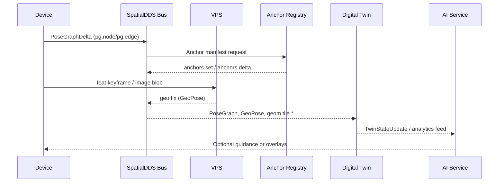

## **SpatialDDS: A Protocol for Real-World Spatial Computing**

*An open invitation to build a shared bus for spatial data, AI world models, and digital twins.*

**Version**: 1.4 (Draft)

**Date**: TBD

**Author**: James Jackson [Open AR Cloud] – james.jackson [at] openarcloud [dot] org

## Contents

### Part I – Overview
*Get oriented with the motivation, core building blocks, practical scenarios, and forward-looking roadmap before diving into the normative material.*

1. [Introduction](sections/v1.4/01-introduction.md)
2. [IDL Profiles](sections/v1.4/02-idl-profiles.md)
3. [Operational Scenarios](sections/v1.4/04-operational-scenarios.md)
4. [Conclusion](sections/v1.4/conclusion.md)
5. [Future Directions](sections/v1.4/future-directions.md)

### Part II – Reference
*Specifications, identifiers, supporting glossaries, and appendices that implementers can consult while building SpatialDDS solutions.*

6. [SpatialDDS URIs](sections/v1.4/02a-spatialdds-uris.md)
7. [Example Manifests](sections/v1.4/03-example-manifests.md)
8. [Glossary of Acronyms](sections/v1.4/glossary.md)
9. [References](sections/v1.4/references.md)
10. Appendices
    - [Appendix A: Core Profile](sections/v1.4/appendix-a.md)
    - [Appendix B: Discovery Profile](sections/v1.4/appendix-b.md)
    - [Appendix C: Anchor Registry Profile](sections/v1.4/appendix-c.md)
    - [Appendix D: Extension Profiles](sections/v1.4/appendix-d.md)
    - [Appendix E: Provisional Extension Examples](sections/v1.4/appendix-e.md)
    - [Appendix F: SpatialDDS URI Scheme (ABNF)](sections/v1.4/appendix-f.md)

## **1\. Introduction**

SpatialDDS is a lightweight, standards-based protocol for real-time exchange of spatial world models. It is designed as a shared data bus that allows devices, services, and AI agents to publish and subscribe to structured representations of the physical world — from pose graphs and 3D geometry to anchors, semantic detections, and service discovery. By providing a common substrate, SpatialDDS enables applications in robotics, AR/XR, digital twins, and smart cities to interoperate while also supporting new AI-driven use cases such as perception services, neural maps, and planning agents.

At its core, SpatialDDS is defined through **IDL profiles** that partition functionality into clean modules:

* **Core**: pose graphs, geometry tiles, anchors, transforms, and blobs.  
* **Discovery**: lightweight announce messages and manifests for services, coverage, anchors, and content.
* **Anchors**: durable anchors and registry updates for persistent world-locked reference points.  
* **Extensions**: optional domain-specific profiles including the shared **Sensing Common** base types plus VIO sensors, vision streams, SLAM frontend features, semantic detections, radar tensors, lidar streams, AR+Geo, and provisional Neural/Agent profiles.

This profile-based design keeps the protocol lean and interoperable, while letting communities adopt only the pieces they need.

### Profile Matrix (SpatialDDS 1.4)
- spatial.core/1.0
- spatial.discovery/1.0
- spatial.anchors/1.0
- spatial.argeo/1.0
- spatial.sensing.common/1.0
- spatial.sensing.rad/1.0
- spatial.sensing.lidar/1.0
- spatial.sensing.vision/1.0
- spatial.slam_frontend/1.0
- spatial.vio/1.0
- spatial.semantics/1.0

### **Why DDS?**

SpatialDDS builds directly on the OMG Data Distribution Service (DDS), a proven standard for real-time distributed systems. DDS provides:

* **Peer-to-peer publish/subscribe** with automatic discovery, avoiding centralized brokers.  
* **Typed data** with schema enforcement, versioning, and language bindings.  
* **Fine-grained QoS** for reliability, liveliness, durability, and latency control.  
* **Scalability** across edge devices, vehicles, and cloud backends.

This foundation ensures that SpatialDDS is not just a message format, but a full-fledged, high-performance middleware for spatial computing.

### **Benefits across domains**

* **Robotics & Autonomous Vehicles**: Share pose graphs, maps, and detections across robots, fleets, and control centers.  
* **Augmented & Mixed Reality**: Fuse VPS results and anchors into persistent, shared spatial contexts; stream geometry and semantics to clients.  
* **Digital Twins & Smart Cities**: Ingest real-time streams of geometry, anchors, and semantics into twin backends, and republish predictive overlays.  
* **IoT & Edge AI**: Integrate lightweight perception services, sensors, and planners that consume and enrich the shared world model.  
* **AI World Models & Agents**: Provide foundation models and AI agents with a structured, typed view of the physical world for perception, reasoning, and planning.

### **Design Principles**

* **Keep the wire light**
  SpatialDDS defines compact, typed messages via IDL. Heavy or variable content (meshes, splats, masks, assets) is carried as blobs, referenced by stable IDs. This avoids bloating the bus while keeping payloads flexible.
* **Profiles, not monoliths**
 SpatialDDS is organized into modular profiles: Core, Discovery, and Anchors form the foundation, while optional Extensions (Sensing Common, VIO, Vision, SLAM Frontend, Semantics, Radar, Lidar, AR+Geo) and provisional profiles (Neural, Agent) add domain-specific capabilities. Implementers adopt only what they need, keeping deployments lean and interoperable.
* **AI-ready, domain-neutral**
  While motivated by SLAM, AR, robotics, and digital twins, the schema is deliberately generic. Agents, foundation models, and AI services can publish and subscribe alongside devices without special treatment.
* **Anchors as first-class citizens**
  Anchors provide durable, shared reference points that bridge positioning, mapping, and content attachment. The Anchor Registry makes them discoverable and persistent across sessions.
* **Discovery without heaviness**
  Lightweight announce messages plus JSON manifests allow services (like VPS, mapping, or anchor registries) and content/experiences to be discovered at runtime without centralized registries.
* **Interoperability with existing standards**
  SpatialDDS is designed to align with and complement related standards such as OGC GeoPose, CityGML/3D Tiles, and Khronos OpenXR. This ensures it can plug into existing ecosystems rather than reinvent them.

### **Architecture Overview & Data Flow**

Before diving into identifiers and manifests, it helps to see how SpatialDDS components interlock when a client joins the bus. The typical flow looks like:

```
SpatialDDS URI ──▶ Manifest Resolver ──▶ Discovery Topic ──▶ DDS/Data Streams ──▶ Shared State & Anchors
        │                 │                      │                   │                      │
   (Section 6)      (Manifests)         (Sections 2.2 & 3)        (Core Profile)         (Anchors & Apps)
```

1. **URI → Manifest lookup** – Durable SpatialDDS URIs point to JSON manifests that describe services, anchor sets, or content. Clients resolve the URI (often via HTTPS or a local cache) to fetch capabilities, QoS hints, and connection parameters.
2. **Discovery → selecting a service** – Guided by the manifest and Discovery profile messages, participants determine which SpatialDDS services are available in their vicinity, their coverage areas, and how to engage them.
3. **Transport → messages on stream or DDS** – With a target service selected, the client joins the appropriate DDS domain/partition or auxiliary transport identified in the manifest and begins exchanging typed IDL messages for pose graphs, geometry, or perception streams.
4. **State updates / anchor resolution** – As data flows, participants publish and subscribe to state changes. Anchor registries and anchor delta messages keep spatial references aligned so downstream applications can resolve world-locked content with shared context.

This loop repeats as participants encounter new SpatialDDS URIs—keeping discovery, transport, and shared state synchronized.

### **SpatialDDS URIs**

SpatialDDS URIs give every anchor, service, and content bundle a stable handle that can be shared across devices and transports while still resolving to rich manifest metadata. They are the glue between lightweight on-bus messages and descriptive out-of-band manifests, ensuring that discovery pointers stay durable even as infrastructure moves. Section 6 (SpatialDDS URIs) defines the precise syntax, allowed types, and resolver requirements for these identifiers.


## **2\. IDL Profiles**

The SpatialDDS IDL bundle defines the schemas used to exchange real-world spatial data over DDS. It is organized into complementary profiles: **Core**, which provides the backbone for pose graphs, geometry, and geo-anchoring; **Discovery**, which enables lightweight announcements of services, coverage, anchors, and content; and **Anchors**, which adds support for publishing and updating sets of durable world-locked anchors. Together, these profiles give devices, services, and applications a common language for building, sharing, and aligning live world models—while staying codec-agnostic, forward-compatible, and simple enough to extend for domains such as robotics, AR/XR, IoT, and smart cities.

### **2.0 IDL Profile Versioning & Negotiation (Normative)**

**Version model.** Each profile is `name@MAJOR.MINOR`. Breaking changes bump MAJOR; additive changes bump MINOR.

**Advertisement (wire).** Participants publish `disco::ServiceAnnounce.caps.supported_profiles`, where each row is `{ name, major, min_minor, max_minor, preferred }`.

**Selection rule (Highest-Compatible-Minor).** For each profile *name*:
1. Intersect supported **MAJOR** sets. If none → no match.
2. Within the common MAJOR, choose the **highest** common **MINOR** (HCM).
3. If multiple rows per side cover the same MAJOR, union their minor ranges before step 2.
4. Use `preferred` only to break ties **within a common MAJOR**.

**Identity & observability.** Implementations SHOULD surface the negotiated `{ name, major, minor }` in diagnostics and topic metadata. Discovery queries MAY filter using `name@MAJOR.*` or `name@MAJOR.MINOR`.

### **2.1 Core SpatialDDS**

The Core profile defines the essential building blocks for representing and sharing a live world model over DDS. It focuses on a small, stable set of concepts: pose graphs, 3D geometry tiles, blob transport for large payloads, and geo-anchoring primitives such as anchors, transforms, and simple GeoPoses. The design is deliberately lightweight and codec-agnostic: tiles reference payloads but do not dictate mesh formats, and anchors define stable points without tying clients to a specific localization method. All quaternion fields follow the OGC GeoPose component order `(x, y, z, w)` so orientation data can flow between GeoPose-aware systems without reordering. By centering on graph \+ geometry \+ anchoring, the Core profile provides a neutral foundation that can support diverse pipelines across robotics, AR, IoT, and smart city contexts.

#### Frame Identifiers (Normative)

SpatialDDS replaces legacy string frame identifiers with the **FrameRef** structure:

```
FrameRef {
  uuid: 16-byte stable identifier (required)
  fqn:  normalized fully qualified name (required)
}
```

- **Equality & identity.** The `uuid` field is authoritative; consumers MUST compare frames by UUID. The `fqn` is a normalized, human-readable alias for logging and debugging.
- **FQN normalization.** Frame FQNs MUST be lowercase, Unicode NFC-normalized, match `^[a-z0-9]([a-z0-9._-]{0,62}[a-z0-9])?$`, and SHOULD follow `<org>/<system>/<frame>` (for example, `oarc/rig01/cam_front`). Reserved roots include: `earth-fixed`, `ecef`, `enu`, `map`, `body`, `sensor`, `ship-fixed`.
- **Graph rule.** The frame graph MUST remain a DAG. Each transform declares `parent_ref` and `child_ref`; consumers MUST detect cycles and reject invalid graphs.
- **Manifests.** Producers SHOULD publish a **Frame Manifest** that enumerates `{uuid, fqn, parent_uuid}` tuples and advertise its location via discovery/manifests.

### **2.2 Discovery**

The Discovery profile adds a minimal, lightweight way to announce services, anchors, content, and registries in the real world. It complements DDS’s built-in participant and topic discovery by describing what a service does, where it operates, and how to learn more. Announcements are deliberately simple—service kind, coarse coverage (via geohash or a bounding-box array), and a pointer to a manifest for richer details. This keeps the bus lean while enabling clients to discover and connect to services such as VPS, mapping, anchor registries, semantics, or AR content providers without requiring heavy registries or complex protocols.

SpatialDDS augments these announcements with an active discovery model so clients can query for relevant resources instead of waiting passively. Deployments can expose this discovery interface using either an **HTTP binding**—where a resolver serves a well-known endpoint that accepts queries and returns filtered results—or a **DDS binding**, which maps the same query/announce pattern onto well-known topics for low-latency, distributed environments. Installations may adopt either approach or both; HTTP resolvers may also act as gateways to a DDS bus without changing the client-facing contract.

Both bindings share a common message model. A **query** identifies the resource type (for example, `tileset` or `anchor`) and an area of interest expressed as a coverage element. **Announcements** respond with matching resources, providing the resource identity, coverage, and the endpoint clients should use. For now the spatial predicate is simply *intersects*: a resource is relevant if its coverage overlaps the requested volume. The same request/response shape means applications can switch transports—or operate across mixed deployments—without rewriting discovery logic.

#### Example: HTTP resolver

An HTTP client searching for tilesets that intersect a bounding box in San Francisco would issue:

```http
POST /.well-known/spatialdds/search
Content-Type: application/json

{
  "rtype": "tileset",
  "volume": {
    "type": "bbox",
    "frame": "earth-fixed",
    "crs": "EPSG:4979",
    "bbox": [-122.42, 37.79, -122.40, 37.80]
  }
}
```

A matching response could be:

```json
[
  {
    "self_uri": "spatialdds://openarcloud.org/zone:sf/service/tileset:city3d",
    "rtype": "tileset",
    "bounds": {
      "type": "bbox",
      "frame": "earth-fixed",
      "crs": "EPSG:4979",
      "bbox": [-122.42, 37.79, -122.40, 37.80]
    },
    "endpoint": "https://example.org/tiles/city3d.json",
    "mime": "application/vnd.ogc.3dtiles+json"
  }
]
```

This is the typical shape of an HTTP discovery response. Each entry corresponds to a `ContentAnnounce` object (the same structure used in the DDS binding), keeping resolver results and bus announcements aligned.

The DDS binding mirrors this interaction with query and announce topics, letting edge deployments deliver the same discovery experience without leaving the data bus.

### **2.3 Anchors**

The Anchors profile provides a structured way to share and update collections of durable, world-locked anchors. While Core includes individual GeoAnchor messages, this profile introduces constructs such as AnchorSet for publishing bundles (e.g., a venue’s anchor pack) and AnchorDelta for lightweight updates. This makes it easy for clients to fetch a set of anchors on startup, stay synchronized through incremental changes, and request full snapshots when needed. Anchors complement VPS results by providing the persistent landmarks that make AR content and multi-device alignment stable across sessions and users.

### **2.4 Canonical Ordering & Identity (Normative)**

This section applies to any message that includes the trio: `Time stamp`, `string source_id`, and `uint64 seq`.

**Field semantics**

* `stamp` — Event time chosen by the producer (may reflect device/measurement time and is not guaranteed globally monotonic across sources).
* `source_id` — Stable writer identity within a deployment (e.g., a sensor, process, or node).
* `seq` — Per-`source_id` strictly monotonic unsigned 64-bit counter that increments by 1 for each new sample.

**Identity & idempotency**

* The canonical identity of a sample is the tuple **(`source_id`, `seq`)**.
* Consumers MUST treat duplicated **(`source_id`, `seq`)** as the same logical sample (idempotent).
* If `seq` wraps or resets, the producer MUST change `source_id` (or use a profile that defines an explicit writer epoch).

**Ordering rules**

1. **Within a single source (intra-source):** Order by `seq` only.
   * If two samples share the same `seq`, the later-arriving one supersedes the earlier; implementations SHOULD log a single warning per stream.
   * Missing `seq` values indicate loss under RELIABLE QoS and MAY trigger application-level recovery.
2. **Across multiple sources (inter-source merge):** Order by the tuple **(`stamp`, `source_id`, `seq`)** within a bounded reordering window Δ chosen by the consumer (e.g., 100–200 ms).
   * `stamp` provides the coarse global axis; `source_id` and `seq` disambiguate ties and ensure stability.
   * Consumers MUST NOT enforce global monotonicity by `stamp` alone; clock skew and late arrivals MUST be tolerated within Δ.

**Clock guidance**

* Producers SHOULD time-sync (NTP/PTP) where feasible.
* Consumers SHOULD bound out-of-order buffering by Δ and proceed deterministically when the window elapses.

**Notes**

* These rules are additive to transport-level ordering; they define application-level determinism independent of QoS.
* Profiles MAY further refine recovery behavior on gaps (e.g., retries, hole-filling) without altering this canonical ordering.

### **2.5 Profiles Summary**

The complete SpatialDDS IDL bundle is organized into the following profiles:

* **Core Profile**  
  Fundamental building blocks: pose graphs, geometry tiles, anchors, transforms, and blob transport.  
* **Discovery Profile**
   Lightweight announce messages plus active query/response bindings for services, coverage areas, anchors, and spatial content or experiences.
* **Anchors Profile**  
  Durable anchors and the Anchor Registry, enabling persistent world-locked reference points.

Together, Core, Discovery, and Anchors form the foundation of SpatialDDS, providing the minimal set required for interoperability.

* **Extensions**
  * **Sensing Common Extension**: Shared enums, region-of-interest negotiation, frame metadata, and codec descriptors reused by the specialized sensing profiles.
  * **VIO Profile**: Raw and fused IMU and magnetometer samples for visual-inertial pipelines.
  * **Vision Profile**: Camera intrinsics, encoded frames, and optional keypoint/track outputs for vision sensors.
  * **SLAM Frontend Profile**: Features, descriptors, and keyframes for SLAM and SfM pipelines.
  * **Semantics Profile**: 2D and 3D detections for AR occlusion, robotics perception, and analytics.
  * **Radar Profile**: Radar tensor metadata, frames, ROI controls, and derived detections for radar sensors.
  * **Lidar Profile**: Sensor metadata, compressed point cloud frames, and optional detections for lidar payloads.
  * **AR+Geo Profile**: GeoPose, frame transforms, and geo-anchoring structures for global alignment and persistent AR content.
* **Provisional Extensions (Optional)**
  * **Neural Profile**: Metadata for neural fields (e.g., NeRFs, Gaussian splats) and optional view-synthesis requests.
  * **Agent Profile**: Generic task and status messages for AI agents and planners.

Together, these profiles give SpatialDDS the flexibility to support robotics, AR/XR, digital twins, IoT, and AI world models—while ensuring that the wire format remains lightweight, codec-agnostic, and forward-compatible.

The **Sensing Common** module deserves special mention: it standardizes ROI negotiation, shared enums for codecs and payload kinds, reusable frame metadata, and quality reporting structures. Radar, lidar, vision, and other sensing extensions build on these types so multi-sensor deployments can negotiate payload shapes and interpret frame metadata consistently without redefining the same scaffolding in each profile.


## **3. Operational Scenarios: From SLAM to AI World Models**

SpatialDDS supports a ladder of capabilities that begins with a single device mapping its surroundings and ends with AI systems consuming a live digital twin. Rather than enumerating isolated use cases, this section walks through one coherent flow — from local SLAM to shared anchors, to global positioning, to twin aggregation, and ultimately to AI world models.

### **Narrative Walkthrough: Local → Shared → Global → AI**

1. **Local SLAM on-device.** A headset, drone, or robot runs visual-inertial SLAM, generating keyframes and odometry updates in its private map frame.
2. **Sharing a pose graph.** The device publishes `pg.node` and `pg.edge` samples (often as compact PoseGraphDelta bursts) onto the SpatialDDS bus so nearby peers or edge services can extend or optimize the map.
3. **Anchors stabilize VIO.** By discovering the Anchor Registry, the device resolves durable anchor URIs, retrieves their manifests, and fuses those priors to keep its VIO estimate drift-free.
4. **VPS provides a GeoPose.** When the device needs a global fix, it queries a Visual Positioning Service (VPS). The VPS uses the shared pose graph plus anchor hints to return a `geo.fix` sample that orients the local map in a world frame.
5. **Digital twin aggregation.** Twin backends subscribe to the same streams — pose graphs, anchors, geometry, and semantics — to maintain authoritative state for places, assets, and events.
6. **AI world models consume the twin.** Analytics engines, planning agents, and foundation models read from the digital twin feeds, grounding their predictions and experiences in the synchronized world model.

The end result is a continuous chain: local sensing feeds a shared spatial data bus, anchors and VPS lift content into a global frame, digital twins maintain durable state, and AI systems reason over the fused model.



### **Example 1: Device Localization with SLAM and Anchors**

A field technician’s headset begins indoors with self-contained SLAM. As it walks the “local → shared → global” ladder:

- **Publish local mapping.** Each keyframe produces a PoseGraphDelta that streams to `pg.node` / `pg.edge`. An excerpt looks like:

    ```json
    {
      "topic": "pg.node",
      "map_id": "map/facility-west",
      "node_id": "kf_0120",
      "pose": { "t": [0.12, 0.04, 1.43], "q": [0.99, 0.01, -0.02, 0.03] },
      "frame_ref": {
        "uuid": [0, 1, 2, 3, 4, 5, 6, 7, 8, 9, 10, 11, 12, 13, 14, 15],
        "fqn": "facility-west/map"
      },
      "stamp": { "sec": 1714070452, "nsec": 125000000 },
      "source_id": "device/headset-17"
    }
    ```

- **Discover anchors.** Through `disco.service`, the headset resolves `anchor://facility-west/loading-bay`, fetches the manifest (Appendix A.1), and applies the returned `FrameTransform` to pin its `map` frame to a surveyed ENU.
- **Query VPS.** When entering the yard, it uploads a `feat.keyframe` set to VPS. The service matches against the shared pose graph plus anchor hints and responds with a `geo.fix` sample:

    ```json
    {
      "topic": "geo.fix",
      "anchor_id": "anchor://facility-west/loading-bay",
      "geopose": {
        "lat_deg": 37.79341,
        "lon_deg": -122.39412,
        "alt_m": 12.6,
        "q": [0.71, 0.00, 0.70, 0.05],
        "frame_kind": "ENU",
        "frame_ref": "@37.79340,-122.39410,5.2"
      },
      "cov": [0.04, 0, 0, 0.04, 0, 0, 0, 0, 0.09]
    }
    ```

- **Align to world.** The headset fuses the GeoPose with its local pose graph, hands peers a globally aligned `geo.tf`, and continues publishing drift-stable updates for others to use.

(See Appendix A.1 for the full anchor and VPS manifests referenced here.)

### **Example 2: Updating and Using a Digital Twin**

A facilities digital twin service subscribes to the same DDS topics to maintain a live model, while an AI analytics engine consumes the twin stream:

- **Twin ingestion.** The backend listens to `pg.node`, `geo.anchor`, and `geom.tile.*` to reconcile a persistent state for each asset. When a door actuator changes, an operator microservice emits:

    ```json
    {
      "topic": "twin.state.update",
      "uri": "urn:spatial://facility-west/assets/door-17",
      "anchor_ref": "anchor://facility-west/loading-bay",
      "state": {
        "pose_local": {
          "t": [4.21, -1.02, 0.00],
          "q": [1, 0, 0, 0]
        },
        "door_status": "open",
        "last_maintenance": "2024-03-22"
      },
      "stamp": { "sec": 1714070520, "nsec": 0 }
    }
    ```

  The twin registry validates the anchor reference, signs a manifest (Appendix A.2), and updates the canonical record.

- **AI/analytics consumption.** A predictive maintenance model subscribes to `twin.state.update` and `semantics.det.3d.set` streams. It flags abnormal open durations, publishing alerts and AR overlays back through SpatialDDS.
- **Experience feedback.** AR clients render the AI insight, while robotics planners reuse the same URI-addressable twin objects for navigation.

(See Appendix A.2 for extended twin manifests and analytics payloads.)

### **Why the Ladder Matters**

This end-to-end chain demonstrates how SpatialDDS keeps local SLAM, shared anchors, VPS fixes, digital twins, and AI models in sync without bespoke gateways. Devices gain reliable localization, twins receive authoritative updates, and AI systems operate on a grounded, real-time world model.

## 4.7 Typed Topics Registry (Normative)

**Rationale.** To avoid overloading a single “blob” channel with heterogeneous media (e.g., geometry tiles, video frames, radar tensors, segmentation masks, descriptor arrays), SpatialDDS standardizes a small set of **typed topics**. The **on-wire message framing remains unchanged**. Interoperability is achieved via shared **topic naming**, **discovery metadata**, and **QoS profiles**.

### 4.7.1 Topic Naming
Topics SHOULD follow:
```
spatialdds/<domain>/<stream>/<type>/<version>
```
Where:
- `<domain>` is a logical app domain (e.g., `mapping`, `perception`, `ar`)
- `<stream>` is a producer-meaningful stream id (e.g., `cam_front`, `radar_1`)
- `<type>` is one of the registered values in §4.7.2
- `<version>` is a semantic guard (e.g., `v1`)

**Examples**
- `spatialdds/perception/cam_front/video_frame/v1`
- `spatialdds/mapping/tiles/geometry_tile/v1`

> Note: This section does **not** alter message headers or chunk framing. Existing `ChunkHeader + bytes` remains the on-wire format.

### 4.7.2 Registered Types (v1)
A topic MUST carry **exactly one** registered type value from the table below.

| Type (string)     | Canonical Suffix | Notes (payload examples)                      |
|-------------------|------------------|-----------------------------------------------|
| `geometry_tile`   | `geometry_tile`  | 3D tiles, GLB, 3D Tiles content               |
| `video_frame`     | `video_frame`    | Encoded frames (AV1/H.264/JPEG/etc.)          |
| `radar_tensor`    | `radar_tensor`   | N-D tensors, fixed/float layouts              |
| `seg_mask`        | `seg_mask`       | Binary/RLE/PNG masks; frame-aligned           |
| `desc_array`      | `desc_array`     | Feature descriptors (e.g., ORB/NetVLAD batches)|

### 4.7.3 QoS Profiles (Normative Names)
Implementations MUST expose the following **named profiles**, mapped to their underlying transport/DDS QoS. These names are used in discovery (§4.7.4).

| Profile         | Reliability | Ordering | Deadline | Reassembly Window | Typical Chunk Size |
|-----------------|-------------|----------|----------|-------------------|--------------------|
| `GEOM_TILE`     | Reliable    | Ordered  | 200 ms   | 2 s               | L/XL               |
| `VIDEO_LIVE`    | Best-effort | Ordered  | 33 ms    | 100 ms            | S/M                |
| `VIDEO_ARCHIVE` | Reliable    | Ordered  | 200 ms   | 1 s               | M                  |
| `RADAR_RT`      | Partial     | Ordered  | 20 ms    | 150 ms            | M                  |
| `SEG_MASK_RT`   | Best-effort | Ordered  | 33 ms    | 150 ms            | S/M                |
| `DESC_BATCH`    | Reliable    | Ordered  | 100 ms   | 500 ms            | S/M                |

> “Partial” reliability: implementations MAY drop late in-window chunks while acknowledging first/last to meet deadline constraints.

### 4.7.4 Discovery (Required)
Each producer MUST announce, **per topic**, the following **topic-level** metadata (e.g., via the existing discovery/announce channel):
- `type` — one of the registered values in §4.7.2 (e.g., `video_frame`)
- `version` — the type version (e.g., `v1`)
- `qos_profile` — one of the names in §4.7.3 (e.g., `VIDEO_LIVE`)

This requirement is **topic-level** only; it does **not** introduce per-message fields and does **not** change the on-wire layout.

### 4.7.5 Conformance
- A topic MUST NOT mix different `type` values.
- Consumers MAY rely on `qos_profile` to select latency/reliability behavior without parsing payload bytes.
- Brokers/routers SHOULD isolate lanes by `(topic, stream_id, qos_profile)` to avoid head-of-line blocking across types.

### 4.7.6 Informative Guidance (non-normative)
Producers MAY attach **topic-level** metadata to assist subscribers (does not affect wire format):
- `video_frame`: `codec`, `width`, `height`, `frame_rate_hint`
- `geometry_tile`: `lod`, `content_type` (e.g., `application/3d-tiles+glb`)
- `radar_tensor`: `shape`, `dtype`, `layout`
- `seg_mask`: `width`, `height`, `encoding` (e.g., `rle`, `png`)
- `desc_array`: `descriptor_type`, `dim`, `count`

These keys are **advisory** and may be extended; normative interoperability derives from `type`, `version`, and `qos_profile`.

## **4. Conclusion**

SpatialDDS provides a lightweight, standards-based framework for exchanging real-world spatial data over DDS. By organizing schemas into modular profiles — with Core, Discovery, and Anchors as the foundation and Extensions adding domain-specific capabilities — it supports everything from SLAM pipelines and AR clients to digital twins, smart city infrastructure, and AI-driven world models. Core elements such as pose graphs, geometry tiles, anchors, and discovery give devices and services a shared language for building and aligning live models of the world, while provisional extensions like Neural and Agent point toward richer semantics and autonomous agents. Taken together, SpatialDDS positions itself as a practical foundation for real-time spatial computing—interoperable, codec-agnostic, and ready to serve as the data bus for AI and human experiences grounded in the physical world.


## **5. Future Directions**

While SpatialDDS establishes a practical baseline for real-time spatial computing, several areas invite further exploration:

* **Reference Implementations**  
  Open-source libraries and bridges to existing ecosystems (e.g., ROS 2, OpenXR, OGC APIs) would make it easier for developers to adopt SpatialDDS in robotics, AR, and twin platforms.  
* **Semantic Enrichment**  
  Extending beyond 2D/3D detections, future work could align with ontologies and scene graphs to enable richer machine-readable semantics for AI world models and analytics.  
* **Neural Integration**  
  Provisional support for neural fields (NeRFs, Gaussian splats) could mature into a stable profile, ensuring consistent ways to stream and query neural representations across devices and services.  
* **Agent Interoperability**  
  Lightweight tasking and coordination schemas could evolve into a standard Agent profile, supporting multi-agent planning and human-AI collaboration at scale.  
* **Standards Alignment**  
  Ongoing coordination with OGC, Khronos, W3C, and GSMA initiatives will help ensure SpatialDDS complements existing geospatial, XR, and telecom standards rather than duplicating them.

Together, these directions point toward a future where SpatialDDS is not just a protocol but a foundation for an open, interoperable ecosystem of real-time world models.

We invite implementers, researchers, and standards bodies to explore SpatialDDS, contribute extensions, and help shape it into a shared backbone for real-time spatial computing and AI world models.


## **6. SpatialDDS URIs**

### 6.1 Why SpatialDDS URIs matter

SpatialDDS URIs are the shorthand that lets participants talk about anchors, content, and services without exchanging the full manifests up front. They bridge human concepts—"the anchor in Hall 1" or "the localization service for Midtown"—with machine-readable manifests that deliver the precise data, coordinate frames, and capabilities needed later in the flow.

### 6.2 Key ingredients

Every SpatialDDS URI names four ideas:

* **Authority** – who owns the namespace and keeps the identifiers stable.
* **Zone** – a slice of that authority’s catalog, such as a venue, fleet, or logical shard.
* **Type** – whether the reference points to an anchor, a bundle of anchors, a piece of content, or a service endpoint.
* **Identifier (with optional version)** – the specific record the manifest will describe.

The exact tokens and encoding rules are defined by the individual profiles, but at a glance the URIs read like `spatialdds://authority/zone/type/id;v=version`. Readers only need to recognize which part expresses ownership, scope, semantics, and revision so they can reason about the rest of the system.

Formal syntax is given in Appendix F.

### 6.3 Working with SpatialDDS URIs

Once a URI is known, clients ask the authority for the manifest it points to—typically via HTTPS, though authorities can advertise other transports if they operate private caches or field buses. The manifest reveals everything the client needs to act: anchor poses, dependency graphs for experiences, or how to reach a service. Because URIs remain lightweight, they are easy to pass around in tickets, QR codes, or discovery topics while deferring the heavier data fetch until runtime.

### 6.4 Examples

```text
spatialdds://museum.example.org/hall1/anchor/01J8QDFQX3W9X4CEX39M9ZP6TQ
spatialdds://city.example.net/downtown/service/01HA7M6XVBTF6RWCGN3X05S0SM;v=2024-q2
spatialdds://studio.example.com/stage/content/01HCQF7DGKKB3J8F4AR98MJ6EH
```

In the manifest samples later in this specification, each of these identifiers expands into a full JSON manifest. Reviewing those examples shows how a single URI flows from a discovery payload, through manifest retrieval, to runtime consumption.

## **7. Example Manifests**

While SpatialDDS keeps its on-bus messages small and generic, richer details about services, maps, and experiences are provided out-of-band through manifests. A manifest is a lightweight JSON document referenced by a `manifest_uri` in a discovery announce. SpatialDDS 1.4 continues the convention introduced in v1.3: manifest pointers are canonical `spatialdds://` URIs (e.g., `spatialdds://acme.services/sf/service/vps-main`) that resolve using the rules described in Section 6 (SpatialDDS URIs), guaranteeing stable identifiers even when manifests are hosted on rotating infrastructure. Manifests let providers describe capabilities, formats, coverage shapes, entry points, and assets without bloating the real-time data stream. The examples here show four common cases: a Visual Positioning Service (VPS) manifest that defines request/response topics and limits, a Mapping Service manifest that specifies tiling scheme and encodings, a Content/Experience manifest that lists anchors, tiles, and media for AR experiences, and an Anchors manifest that enumerates localization anchors with associated assets. Together they illustrate how manifests complement the DDS data plane by carrying descriptive metadata and policy.

### Manifest Versioning (Normative)

**Purpose.** Manifest schema identifiers keep discovery clients and services aligned on layout and semantics.

**Schema identifier.** Every manifest MUST include a top-level field:

```json
{ "schema_version": "manifest@1.4" }
```

**Version model.**

* Identifiers follow `name@MAJOR.MINOR` (e.g., `manifest@1.4`).
* **MAJOR** signals breaking layout or semantics; **MINOR** captures additive, backward-compatible changes.

**Reader behavior.**

* If the manifest MAJOR equals the reader’s supported MAJOR and the manifest MINOR is greater than or equal to the reader’s MINOR, the reader MUST parse the manifest and ignore unknown fields.
* If the manifest MAJOR exceeds the reader’s supported MAJOR, the reader MUST reject the manifest with a clear error.
* Producers MUST populate all fields required by the declared MAJOR version.

**Changelog & schema artifacts.**

* Each MINOR revision MUST appear in the manifest changelog and SHOULD ship with a JSON Schema (e.g., `schemas/manifest/1.4.schema.json`).

### Capabilities via Manifests (Out-of-Band, Normative)

**Purpose.** Allow consumers to evaluate compatibility and select streams using only a manifest (for example, fetched from the web or bundled with an application) without relying on live discovery.

**Placement.** Capabilities are declared both at the **manifest root** and within each **topic** entry.

#### Root-level capabilities
Manifests **SHOULD** include a `capabilities` block that advertises supported IDL profile ranges and optional feature flags:

```json
{
  "schema_version": "manifest@1.4",
  "capabilities": {
    "supported_profiles": [
      { "name": "core",           "major": 1, "min_minor": 0, "max_minor": 3 },
      { "name": "discovery",      "major": 1, "min_minor": 1, "max_minor": 2 },
      { "name": "sensing.common", "major": 1, "min_minor": 0, "max_minor": 1 },
      { "name": "sensing.rad",    "major": 1, "min_minor": 1, "max_minor": 1 }
    ],
    "preferred_profiles": [ "discovery@1.2", "core@1.*" ],
    "features": [ "blob.crc32", "rad.tensor.zstd" ]
  }
}
```

**Semantics.**
* `supported_profiles` follows the same version model as IDL negotiation: `name@MAJOR.MINOR` with Highest-Compatible-Minor selection within a shared **MAJOR** (see Section 2.0).
* `preferred_profiles` is an **optional** ordered hint to break ties **within a common MAJOR**.
* `features` is an **optional** list of vendor- or spec-defined boolean capabilities (namespaced strings recommended, for example `rad.tensor.zstd`). Unknown features MUST be ignored by readers.

#### Topic descriptors (selection hints)
Each topic entry **SHALL** declare the typed-topic keys so consumers can filter without parsing payloads:

```json
{
  "topics": [
    {
      "name": "spatialdds/perception/cam_front/video_frame/v1",
      "type": "video_frame",
      "version": "v1",
      "qos_profile": "VIDEO_LIVE"
    },
    {
      "name": "spatialdds/perception/radar_1/radar_tensor/v1",
      "type": "radar_tensor",
      "version": "v1",
      "qos_profile": "RADAR_RT"
    }
  ]
}
```

**Requirements.**
* `type`, `version`, and `qos_profile` MUST match the **Typed Topics Registry** (Section 4.7).
* A topic MUST NOT mix types; the `name` SHOULD follow the canonical path pattern (Section 4.7.1).
* Readers MAY filter topics by `type`, `version`, and `qos_profile` using only manifest contents.

#### Reader behavior (deterministic, no live discovery)
Given a manifest, a reader:
1. Parses `capabilities.supported_profiles` and selects the **Highest-Compatible-Minor** per profile.
2. Filters `topics[]` by desired `type`/`qos_profile`.
3. Optionally checks `features[]` for required capabilities.
4. Proceeds to subscribe/connect using the referenced topic names/URIs.

Unknown fields in the capabilities block MUST be ignored to preserve forward compatibility within the same manifest major.

### **Assets**

Every manifest asset now adheres to a **uniform base contract** with an optional, namespaced metadata bag:

**Base (required for every asset)**

* `uri` — how to retrieve the asset
* `media_type` — IANA or registry-friendly identifier (parameters allowed)
* `hash` — content hash, e.g., `sha256:<hex>`
* `bytes` — content length in bytes

**meta (optional, extensible)**

* `meta` is an object keyed by **namespaces**; each value is a **JSON object** whose schema is owned by that namespace.
* The base remains stable; metadata can evolve independently without changing the manifest base schema.

**Prohibited**

* Free-form `kind` strings and mixing type-specific fields into the base (for example `count`, `descriptor_bytes`, or `patch_frame`).
  Put those details under a namespaced `meta` entry instead.

**Example**

```json
  "assets": [
    {
      "uri": "s3://bucket/path/image_001.jpg",
      "media_type": "image/jpeg",
      "hash": "sha256:9b0a…",
      "bytes": 342187
    },
    {
      "uri": "https://cdn.example.com/features/scene123.json",
      "media_type": "application/vnd.sdds.features+json;algo=orb;v=1",
      "hash": "sha256:ab12…",
      "bytes": 65536,
      "meta": {
        "sensing.vision.features": {
          "count": 2048,
          "descriptor_bytes": 32
        }
      }
    }
  ]
```

All manifests in SpatialDDS 1.4 **must** publish quaternions using the canonical GeoPose component order `(x, y, z, w)` inside a single `q_xyzw` array.

Example discovery announcements would therefore carry manifest URIs such as:

* `spatial::disco::ServiceAnnounce.manifest_uri = spatialdds://acme.services/sf/service/vps-main`
* `spatial::disco::ServiceAnnounce.manifest_uri = spatialdds://acme.services/sf/service/mapping-tiles`
* `spatial::disco::ContentAnnounce.manifest_uri = spatialdds://acme.services/sf/content/market-stroll`

### Example: Discovery announce with capabilities (minimal)

```json
{
  "caps": {
    "supported_profiles": [
      { "name": "core",           "major": 1, "min_minor": 0, "max_minor": 3, "preferred": true  },
      { "name": "discovery",      "major": 1, "min_minor": 1, "max_minor": 2, "preferred": true  },
      { "name": "sensing.common", "major": 1, "min_minor": 0, "max_minor": 1, "preferred": false }
    ]
  }
}
```

SpatialDDS 1.4 retains the lighter way to explain where a service operates. Publishers can name the frame for their coverage, add a few transforms back to `"earth-fixed"`, and optionally list coarse `coverage.volumes[]` boxes. Those hints help clients decide, at a glance, whether a service overlaps the space they care about before loading heavier details.

### Frame Manifest Reference
Producers SHOULD include a manifest hint that points to a frame manifest:

```json
{
  "frames_uri": "https://example.com/rig01/frames.json",
  "frames_hash": "sha256:…"
}
```

The referenced document enumerates frames as `{uuid, fqn, parent_uuid}` tuples so consumers can validate topology and aliases independently of on-bus samples.

Discovery mirrors that upgrade with optional `CoverageVolume` hints on announces and an opt-in `CoverageQuery` message for active volume requests. In v1.4 the query now carries a caller-supplied `query_id` plus a `reply_topic` so responders can correlate answers and route them to the right pub/sub path, and a new paged `CoverageResponse` mirrors the `query_id` when returning matching `ContentAnnounce` records. Implementations that ignore the active-query fields continue to interoperate.

### **A) VPS Manifest**

*This manifest describes a Visual Positioning Service (VPS). It specifies the service identifier, version, coverage area, and the topics used for queries and responses. It also lists supported input encodings and response types, allowing clients to determine compatibility before interacting with the service.*

```json
{
  "schema_version": "manifest@1.4",
  "service_id": "svc:vps:acme/sf-downtown",
  "profiles": [
    "Core",
    "SLAM Frontend",
    "AR+Geo"
  ],
  "request": {
    "features_topic": "feat.keyframe",
    "image_blob_role": "image/jpeg",
    "prior_topic": "geo.fix"
  },
  "response": {
    "rich": "pg.nodegeo",
    "minimal": "geo.fix"
  },
  "limits": {
    "max_fps": 10,
    "max_image_px": 1920
  },
  "auth": {
    "scheme": "oauth2",
    "issuer": "https://auth.acme.com"
  },
  "coverage": {
    "$comment": "If multiple coverage elements are present, they must bound the same resource. geohash (if used) is always earth-fixed.",
    "geohash": [
      "9q8y",
      "9q8z"
    ],
    "elements": [
      {
        "type": "bbox",
        "frame": "earth-fixed",
        "crs": "EPSG:4979",
        "bbox": [
          -122.4186,
          37.7931,
          -122.4123,
          37.7982
        ],
        "$comment": "Earth-fixed bbox uses degrees [west,south,east,north]. If crossing 180°, west may be > east."
      },
      {
        "type": "volume",
        "frame": "ship-fixed",
        "aabb": {
          "min_xyz": [
            -25.0,
            -30.0,
            -5.0
          ],
          "max_xyz": [
            25.0,
            30.0,
            20.0
          ]
        },
        "$comment": "Local AABB in meters in the declared frame."
      }
    ]
  },
  "transforms": [
    {
      "from": "ship-fixed",
      "to": "earth-fixed",
      "stamp": "2025-05-01T12:00:00Z",
      "valid_from": "2025-05-01T12:00:00Z",
      "valid_for_s": 5,
      "pose": {
        "t_m": [
          -2650.4,
          15.2,
          8.6
        ],
        "q_xyzw": [
          0.0,
          0.3827,
          0.0,
          0.9239
        ]
      },
      "$comment": "Pose maps FROM 'from' TO 'to'. q_xyzw follows GeoPose: [x,y,z,w], unit-norm. Validity window starts at valid_from (default stamp); expiry = valid_from + valid_for_s."
    }
  ]
}

```

### **B) Mapping Service Manifest**

*This manifest describes a Mapping service that publishes geometry tiles for a given coverage area. It defines the service identifier, version, supported encodings, and the DDS topics used for requesting and receiving tile data. It enables clients to subscribe to live or cached geometry without ambiguity about formats or endpoints.*

```json
{
  "schema_version": "manifest@1.4",
  "service_id": "svc:mapping:acme/sf-downtown",
  "version": "1.0.0",
  "provider": {
    "id": "acme-maps",
    "org": "Acme Maps Inc."
  },
  "title": "Acme Downtown Map Service",
  "summary": "Tiled 3D meshes for SF downtown area",
  "profiles": [
    "Core"
  ],
  "topics": {
    "meta": "geom.tile.meta",
    "patch": "geom.tile.patch",
    "blob": "geom.tile.blob"
  },
  "tile_scheme": "quadtree",
  "encodings": [
    "glTF+Draco",
    "LASzip"
  ],
  "lod_range": [
    12,
    18
  ],
  "coverage": {
    "$comment": "If multiple coverage elements are present, they must bound the same resource. geohash (if used) is always earth-fixed.",
    "geohash": [
      "9q8y",
      "9q8z"
    ],
    "polygon_uri": "https://cdn.acme.example/downtown_poly.geojson",
    "elements": [
      {
        "type": "bbox",
        "frame": "earth-fixed",
        "bbox": [
          -122.4195,
          37.7925,
          -122.4115,
          37.799
        ],
        "$comment": "Earth-fixed bbox uses degrees [west,south,east,north]. If crossing 180°, west may be > east."
      },
      {
        "type": "volume",
        "frame": "earth-fixed",
        "aabb": {
          "min_xyz": [
            -122.4195,
            37.7925,
            -10.0
          ],
          "max_xyz": [
            -122.4115,
            37.799,
            250.0
          ]
        },
        "$comment": "Local AABB in meters in the declared frame."
      }
    ]
  },
  "auth": {
    "scheme": "none"
  },
  "terms": {
    "license": "CC-BY-4.0"
  }
}

```

### **C) Content/Experience Manifest**

*This manifest describes a spatial content or experience service. It declares a content identifier, version, anchor bindings, and optional dependencies on other manifests. This allows AR applications to discover and attach experiences to shared anchors while keeping the actual content assets (e.g., 3D models, media) external to DDS.*

```json
{
  "schema_version": "manifest@1.4",
  "content_id": "xp:sculpture-walk:met-foyer",
  "version": "1.0.2",
  "provider": {
    "id": "svc:content:museum-inc",
    "org": "Museum Inc."
  },
  "title": "AR Sculpture Walk",
  "summary": "Guided AR overlays for five sculptures in the main foyer.",
  "tags": [
    "ar",
    "museum",
    "tour"
  ],
  "profiles_required": [
    "Core",
    "AR+Geo"
  ],
  "availability": {
    "from": "2025-09-01T09:00:00Z",
    "until": "2025-12-31T23:59:59Z",
    "local_tz": "America/New_York"
  },
  "coverage": {
    "$comment": "If multiple coverage elements are present, they must bound the same resource. geohash (if used) is always earth-fixed.",
    "geohash": [
      "dr5ru9",
      "dr5rua"
    ],
    "polygon_uri": "https://cdn.museum.example/foyer_poly.geojson",
    "elements": [
      {
        "type": "bbox",
        "frame": "earth-fixed",
        "bbox": [
          -73.9635,
          40.7793,
          -73.9631,
          40.7796
        ],
        "$comment": "Earth-fixed bbox uses degrees [west,south,east,north]. If crossing 180°, west may be > east."
      },
      {
        "type": "volume",
        "frame": "foyer-local",
        "aabb": {
          "min_xyz": [
            -8.0,
            -12.0,
            0.0
          ],
          "max_xyz": [
            8.0,
            12.0,
            5.0
          ]
        },
        "$comment": "Local AABB in meters in the declared frame."
      }
    ]
  },
  "transforms": [
    {
      "from": "foyer-local",
      "to": "earth-fixed",
      "stamp": "2025-09-01T09:00:00Z",
      "valid_from": "2025-09-01T09:00:00Z",
      "valid_for_s": 3600,
      "pose": {
        "t_m": [
          -73.9633,
          40.7794,
          25.5
        ],
        "q_xyzw": [
          0.0,
          0.3827,
          0.0,
          0.9239
        ]
      },
      "$comment": "Pose maps FROM 'from' TO 'to'. q_xyzw follows GeoPose: [x,y,z,w], unit-norm. Validity window starts at valid_from (default stamp); expiry = valid_from + valid_for_s."
    }
  ],
  "entrypoints": {
    "anchors": [
      {
        "anchor_id": "anchor/met-foyer/north-plinth",
        "hint": "Start here"
      },
      {
        "anchor_id": "anchor/met-foyer/central",
        "hint": "Checkpoint 2"
      }
    ]
  },
  "runtime_topics": {
    "subscribe": [
      "geo.tf",
      "geo.anchor",
      "geom.tile.meta",
      "geom.tile.patch"
    ],
    "optional": [
      "semantics.det.3d.set"
    ]
  },
  "assets": [
    {
      "uri": "https://cdn.museum.example/img/poster.jpg",
      "media_type": "image/jpeg",
      "hash": "sha256:posterplaceholder...",
      "bytes": 421337,
      "meta": {
        "experiences.asset": {
          "role": "poster"
        }
      }
    },
    {
      "uri": "https://cdn.museum.example/audio/room_intro.mp3",
      "media_type": "audio/mpeg",
      "hash": "sha256:narrationplaceholder...",
      "bytes": 1987654,
      "meta": {
        "experiences.asset": {
          "role": "narration",
          "lang": "en"
        }
      }
    }
  ]
}

```

### **D) Anchors Manifest**

*This manifest enumerates durable localization anchors for a zone and links them to relocalization or scene-alignment assets.* Each anchor entry supplies an `anchor_id`, a simplified GeoPose (latitude, longitude, altitude, quaternion), and whatever metadata or asset descriptors the publisher wants to expose (timestamps, quality hints, coverage tags, etc.). Top-level fields mirror the publisher's registry structure—no default frame assumptions or cache semantics are imposed by the specification.

```json
{
  "schema_version": "manifest@1.4",
  "schema": "https://example.org/spatialdds/anchor-manifest.schema.json#v1",
  "zone_id": "knossos:palace",
  "zone_title": "Knossos Palace Archaeological Site",
  "coverage": {
    "$comment": "If multiple coverage elements are present, they must bound the same resource. geohash (if used) is always earth-fixed.",
    "geohash": [
      "sv8wkf",
      "sv8wkg"
    ],
    "elements": [
      {
        "type": "volume",
        "frame": "gallery-local",
        "aabb": {
          "min_xyz": [
            -15.0,
            -20.0,
            -2.0
          ],
          "max_xyz": [
            15.0,
            20.0,
            6.0
          ]
        },
        "$comment": "Local AABB in meters in the declared frame."
      },
      {
        "type": "bbox",
        "frame": "earth-fixed",
        "bbox": [
          25.1608,
          35.2965,
          25.1665,
          35.3002
        ],
        "$comment": "Earth-fixed bbox uses degrees [west,south,east,north]. If crossing 180°, west may be > east."
      }
    ]
  },
  "transforms": [
    {
      "from": "gallery-local",
      "to": "earth-fixed",
      "stamp": "2025-02-18T08:00:00Z",
      "valid_from": "2025-02-18T08:00:00Z",
      "valid_for_s": 600,
      "pose": {
        "t_m": [
          25.1635,
          35.298,
          112.0
        ],
        "q_xyzw": [
          0.0,
          0.2588,
          0.0,
          0.9659
        ]
      },
      "$comment": "Pose maps FROM 'from' TO 'to'. q_xyzw follows GeoPose: [x,y,z,w], unit-norm. Validity window starts at valid_from (default stamp); expiry = valid_from + valid_for_s."
    }
  ],
  "anchors": [
    {
      "anchor_id": "square:statue-east",
      "geopose": {
        "lat_deg": 35.29802,
        "lon_deg": 25.16305,
        "alt_m": 110.2,
        "q_xyzw": [
          0,
          0,
          0,
          1
        ]
      },
      "assets": [
        {
          "uri": "https://registry.example/anchors/statue-east/orb_v1.bin",
          "media_type": "application/vnd.sdds.features+binary;algo=orb;v=1",
          "hash": "sha256:placeholder...",
          "bytes": 65536,
          "meta": {
            "sensing.vision.features": {
              "count": 2048,
              "descriptor_bytes": 32,
              "frame": "anchor-local"
            }
          }
        },
        {
          "uri": "https://registry.example/anchors/statue-east/patch_lod1.las",
          "media_type": "application/vnd.sdds.pointcloud+las;lod=1",
          "hash": "sha256:placeholder...",
          "bytes": 480000,
          "meta": {
            "sensing.vision.pointcloud": {
              "points": 12000
            }
          }
        }
      ],
      "stamp": "2025-09-07T15:45:00Z"
    },
    {
      "anchor_id": "central-court:north",
      "geopose": {
        "lat_deg": 35.29761,
        "lon_deg": 25.16391,
        "alt_m": 109.8,
        "q_xyzw": [
          0,
          0,
          0.707,
          0.707
        ]
      },
      "assets": [
        {
          "uri": "https://registry.example/anchors/central-court-n/superpoint_v1.npz",
          "media_type": "application/vnd.sdds.features+npz;algo=superpoint;v=1",
          "hash": "sha256:placeholder...",
          "bytes": 220000,
          "meta": {
            "sensing.vision.features": {
              "count": 1500,
              "descriptor_bytes": 256
            }
          }
        },
        {
          "uri": "https://registry.example/anchors/central-court-n/patch_lod0.glb",
          "media_type": "model/gltf-binary;lod=0",
          "hash": "sha256:placeholder...",
          "bytes": 350000,
          "meta": {
            "sensing.vision.mesh": {
              "triangles": 8000
            }
          }
        }
      ],
      "stamp": "2025-09-08T11:12:13Z"
    }
  ],
  "stamp": "2025-09-12T22:55:00Z"
}

```

## **8. Glossary of Acronyms**

**AI** – Artificial Intelligence

**AR** – Augmented Reality

**DDS** – Data Distribution Service (OMG standard middleware)

**GSMA** – GSM Association (global mobile industry group)

**IMU** – Inertial Measurement Unit

**IoT** – Internet of Things

**MR** – Mixed Reality

**MSF** – Metaverse Standards Forum

**NeRF** – Neural Radiance Field (neural representation of 3D scenes)

**OGC** – Open Geospatial Consortium

**OMG** – Object Management Group (standards body for DDS)

**ROS** – Robot Operating System

**SfM** – Structure from Motion

**SLAM** – Simultaneous Localization and Mapping

**VIO** – Visual-Inertial Odometry

**VLM** – Vision-Language Model

**VPS** – Visual Positioning Service

**VR** – Virtual Reality

**W3C** – World Wide Web Consortium

**XR** – Extended Reality (umbrella term including AR, VR, MR)


## **9. References**

### **DDS & Middleware**

\[1\] Object Management Group. *Data Distribution Service (DDS) for Real-Time Systems.* OMG Standard. Available: [https://www.omg.org/spec/DDS](https://www.omg.org/spec/DDS)

\[2\] Object Management Group. *DDS for eXtremely Resource Constrained Environments (DDS-XRCE).* OMG Standard. Available: [https://www.omg.org/spec/DDS-XRCE](https://www.omg.org/spec/DDS-XRCE)

\[3\] eProsima. *Fast DDS Documentation.* Available: [https://fast-dds.docs.eprosima.com](https://fast-dds.docs.eprosima.com/)

\[4\] Eclipse Foundation. *Cyclone DDS.* Available: [https://projects.eclipse.org/projects/iot.cyclonedds](https://projects.eclipse.org/projects/iot.cyclonedds)

### **XR & Spatial Computing**

\[5\] Khronos Group. *OpenXR Specification.* Available: [https://www.khronos.org/openxr](https://www.khronos.org/openxr)

\[6\] Open Geospatial Consortium. *OGC GeoPose 1.0 Data Exchange Standard.* Available: [https://www.ogc.org/standards/geopose](https://www.ogc.org/standards/geopose)

### **Geospatial Standards**

\[7\] Open Geospatial Consortium. *CityGML Standard.* Available: [https://www.ogc.org/standards/citygml](https://www.ogc.org/standards/citygml)

\[8\] Geohash. *Wikipedia Entry.* Available: [https://en.wikipedia.org/wiki/Geohash](https://en.wikipedia.org/wiki/Geohash)

### **SLAM, SfM & AI World Models**

\[9\] Mur-Artal, R., Montiel, J. M. M., & Tardós, J. D. (2015). *ORB-SLAM: A Versatile and Accurate Monocular SLAM System.* IEEE Transactions on Robotics, 31(5), 1147–1163.

\[10\] Schönberger, J. L., & Frahm, J.-M. (2016). *Structure-from-Motion Revisited.* In IEEE Conference on Computer Vision and Pattern Recognition (CVPR), 4104–4113.

\[11\] Sarlin, P.-E., Unagar, A., Larsson, M., et al. (2020). *From Coarse to Fine: Robust Hierarchical Localization at Large Scale.* In IEEE Conference on Computer Vision and Pattern Recognition (CVPR), 12716–12725.

\[12\] Google Research. *ARCore Geospatial API & Visual Positioning Service.* Developer Documentation. Available: [https://developers.google.com/ar](https://developers.google.com/ar)


## **Appendix A: Core Profile**

*The Core profile defines the fundamental data structures for SpatialDDS. It includes pose graphs, 3D geometry tiles, anchors, transforms, and generic blob transport. This is the minimal interoperable baseline for exchanging world models across devices and services.*

```idl
// SPDX-License-Identifier: MIT
// SpatialDDS Core 1.0

module spatial {
  module core {

    // Module identity (authoritative string for interop)
    const string MODULE_ID = "spatial.core/1.0";

    // ---------- Utility ----------
    struct Time {
      int32  sec;     // seconds since UNIX epoch (UTC)
      uint32 nsec;    // nanoseconds [0..1e9)
    };

    struct PoseSE3 {
      double t[3];    // translation (x,y,z)
      double q[4];    // quaternion (x,y,z,w) in GeoPose order
    };

    struct Aabb3 {
      double min_xyz[3];
      double max_xyz[3];
    };

    @appendable struct TileKey {
      @key uint32 x;     // tile coordinate (quadtree/3D grid)
      @key uint32 y;
      @key uint32 z;     // use 0 for 2D schemes
      @key uint8  level; // LOD level
    };

    // ---------- Geometry ----------
    enum PatchOp { ADD = 0, REPLACE = 1, REMOVE = 2 };

    @appendable struct BlobRef {
      string blob_id;   // UUID or content-address
      string role;      // "mesh","attr/normals","pcc/geom","pcc/attr",...
      string checksum;  // SHA-256 (hex)
    };

    typedef spatial::geometry::FrameRef FrameRef;

    @appendable struct TileMeta {
      @key TileKey key;              // unique tile key
      string tile_id_compat;         // optional human-readable id
      double min_xyz[3];             // AABB min (local frame)
      double max_xyz[3];             // AABB max (local frame)
      uint32 lod;                    // may mirror key.level
      uint64 version;                // monotonic full-state version
      string encoding;               // "glTF+Draco","MPEG-PCC","V3C","PLY",...
      string checksum;               // checksum of composed tile
      sequence<string, 32> blob_ids; // blobs composing this tile
      // optional geo hints
      double centroid_llh[3];        // lat,lon,alt (deg,deg,m) or NaN
      double radius_m;               // rough extent (m) or NaN
      string schema_version;         // MUST be "spatial.core/1.0"
    };

    @appendable struct TilePatch {
      @key TileKey key;              // which tile
      uint64 revision;               // monotonic per-tile
      PatchOp op;                    // ADD/REPLACE/REMOVE
      string target;                 // submesh/attr/"all"
      sequence<BlobRef, 8> blobs;    // payload refs
      string post_checksum;          // checksum after apply
      Time   stamp;                  // production time
    };

    @appendable struct BlobChunk {
      @key string blob_id;               // which blob
      uint32 index;                      // chunk index (0..N-1)
      sequence<uint8, 262144> data;      // ≤256 KiB per sample

      // --- Additive fields for robust reassembly ---

      // Total number of chunks expected for this blob_id.
      // Enables preallocation and deterministic completion even if 'last' arrives late.
      uint32 total_chunks;

      // Monotonic sequence number within this blob_id.
      // Detects gaps and helps reorder on BEST_EFFORT QoS.
      uint32 seq;

      // CRC32 checksum over 'data' for per-chunk integrity verification.
      uint32 crc32;
    };

    // ---------- Pose Graph (minimal) ----------
    enum EdgeTypeCore { ODOM = 0, LOOP = 1 };

    @appendable struct Node {
      string map_id;
      @key string node_id;     // unique keyframe id
      PoseSE3 pose;            // pose in frame_ref
      double  cov[36];         // 6x6 covariance (row-major); NaN if unknown
      Time    stamp;
      FrameRef frame_ref;      // e.g., "map"
      string  source_id;
      uint64  seq;             // per-source monotonic
      uint64  graph_epoch;     // for major rebases/merges
    };

    @appendable struct Edge {
      string map_id;
      @key string edge_id;     // unique edge id
      string from_id;          // source node
      string to_id;            // target node
      EdgeTypeCore type;       // ODOM or LOOP
      double information[36];  // 6x6 info matrix (row-major)
      Time   stamp;
      string source_id;
      uint64 seq;
      uint64 graph_epoch;
    };

    // ---------- Geo anchoring ----------
    enum GeoFrameKind { ECEF = 0, ENU = 1, NED = 2 };

    enum CovarianceType {
      COV_NONE = 0,   // no covariance provided
      COV_POS3 = 3,   // 3x3 over (x, y, z)
      COV_POSE6 = 6   // 6x6 over (x, y, z, roll, pitch, yaw) [radians]
    };
    typedef double Mat3x3[9];   // row-major
    typedef double Mat6x6[36];  // row-major

    @appendable struct GeoPose {
      double lat_deg;
      double lon_deg;
      double alt_m;            // ellipsoidal meters
      double q[4];             // orientation (x,y,z,w) in GeoPose order
      GeoFrameKind frame_kind; // ECEF/ENU/NED
      string frame_ref;        // for ENU/NED: "@lat,lon,alt"
      Time   stamp;
      CovarianceType cov_type; // explicit covariance typing
      // Exactly one of the following is meaningful based on cov_type:
      // If cov_type == COV_POS3  → use pos_cov_3x3 (x,y,z)
      // If cov_type == COV_POSE6 → use pose_cov_6x6 (x,y,z,roll,pitch,yaw)
      // If cov_type == COV_NONE  → both matrices are ignored.
      Mat3x3 pos_cov_3x3;
      Mat6x6 pose_cov_6x6;
    };

    @appendable struct GeoAnchor {
      @key string anchor_id;   // e.g., "anchor/4th-and-main"
      string map_id;
      FrameRef frame_ref;      // local frame (e.g., "map")
      GeoPose geopose;         // global pose
      string  method;          // "GNSS","VisualFix","Surveyed","Fusion"
      double  confidence;      // 0..1
      string  checksum;        // integrity/versioning
    };

    @appendable struct FrameTransform {
      @key string transform_id; // e.g., "map->ENU@lat,lon,alt"
      FrameRef parent_ref;      // global frame (ENU@..., ECEF, ...)
      FrameRef child_ref;       // local frame ("map")
      PoseSE3 T_parent_child;   // transform parent->child
      Time    stamp;
      double  cov[36];          // 6x6 covariance; NaN if unknown
    };

    // ---------- Snapshot / Catch-up ----------
    @appendable struct SnapshotRequest {
      @key TileKey key;        // which tile
      uint64 up_to_revision;   // 0 = latest
    };

    @appendable struct SnapshotResponse {
      @key TileKey key;                 // tile key
      uint64 revision;                  // snapshot revision served
      sequence<string, 64> blob_ids;    // composing blobs
      string checksum;                  // composed state checksum
    };

  }; // module core
};   // module spatial

```

## **Appendix B: Discovery Profile**

*The Discovery profile defines the lightweight announce messages and manifests that allow services, coverage areas, and spatial content or experiences to be discovered at runtime. It enables SpatialDDS deployments to remain decentralized while still providing structured service discovery.*

```idl
// SPDX-License-Identifier: MIT
// SpatialDDS Discovery 1.0
// Lightweight announces for services, coverage, and content

module spatial {
    module disco {

      const string MODULE_ID = "spatial.discovery/1.0";

      typedef spatial::core::Time Time;
      typedef spatial::geometry::FrameRef FrameRef;
      typedef spatial::core::Aabb3 Aabb3;
      // Canonical manifest references use the spatialdds:// URI scheme.
      typedef string SpatialUri;

      // --- Profile version advertisement (additive) ---
      // Semver per profile: name@MAJOR.MINOR
      // Each row declares a contiguous range of MINORs within a single MAJOR.
      @appendable struct ProfileSupport {
        string name;        // e.g., "core", "discovery", "sensing.common", "sensing.rad"
        uint32 major;       // compatible major (e.g., 1)
        uint32 min_minor;   // lowest supported minor within 'major' (e.g., 0)
        uint32 max_minor;   // highest supported minor within 'major' (e.g., 2)  // supports 1.0..1.2
        boolean preferred;  // optional tie-breaker hint (usually false)
      };

      @appendable struct Capabilities {
        sequence<ProfileSupport, 64> supported_profiles;
      };

    enum ServiceKind {
      VPS = 0,
      MAPPING = 1,
      RELOCAL = 2,
      SEMANTICS = 3,
      STORAGE = 4,
      CONTENT = 5,
      ANCHOR_REGISTRY = 6,
      OTHER = 255
    };

    @appendable struct KV {
      string key;
      string value;
    };

    // CoverageElement: if frame == "earth-fixed", bbox is [west,south,east,north] in degrees (EPSG:4326/4979);
    // otherwise local meters; volume is AABB in meters.
    @appendable struct CoverageElement {
      string type;              // "bbox" | "volume"
      string frame;             // coordinate frame for this element (e.g., "earth-fixed", "map")
      string crs;               // optional CRS identifier for earth-fixed frames (e.g., EPSG code)
      double bbox[4];           // [west, south, east, north] when type == "bbox"
      Aabb3 aabb;               // axis-aligned bounds when type == "volume"
      // Explicit global coverage toggle: when true, bbox and aabb may be ignored by consumers.
      boolean global;
    };

    // Quaternion follows GeoPose: unit [x,y,z,w]; pose maps FROM 'from' TO 'to'
    @appendable struct Transform {
      string from;              // source frame (e.g., "map")
      string to;                // target frame (e.g., "earth-fixed")
      string stamp;             // ISO-8601 timestamp for this transform
      uint32 valid_for_s;       // validity horizon in seconds
      // New: explicit origin for validity window. Consumers evaluate expiry at
      // (valid_from + valid_for_s). If absent, treat valid_from == stamp.
      Time   valid_from;
      double t_m[3];            // meters in 'from' frame
      double q_xyzw[4];         // GeoPose order [x,y,z,w]
    };

      @appendable struct ServiceAnnounce {
        @key string service_id;
        string name;
        ServiceKind kind;
        string version;
        string org;
        sequence<string,16> rx_topics;
        sequence<string,16> tx_topics;
        sequence<KV,32> hints;
        // New: wire-level capability advertisement for version negotiation.
        Capabilities caps;
        sequence<CoverageElement,16> coverage;
        string coverage_canonical_frame;  // canonical frame consumers should use when evaluating coverage
        Time coverage_eval_time;          // optional evaluation time for transforming coverage elements
        sequence<Transform,8> transforms;
        SpatialUri manifest_uri;  // MUST be a spatialdds:// URI for this service manifest
        string auth_hint;
        Time stamp;
        uint32 ttl_sec;
    };

    @appendable struct CoverageHint {
      @key string service_id;
      sequence<CoverageElement,16> coverage;
      string coverage_canonical_frame;
      Time coverage_eval_time;
      sequence<Transform,8> transforms;
      Time stamp;
      uint32 ttl_sec;
    };

    @appendable struct CoverageQuery {
      // Correlates responses to a specific query instance.
      @key uint64 query_id;
      sequence<CoverageElement,4> coverage;  // requested regions of interest
      string coverage_canonical_frame;
      Time coverage_eval_time;
      // Responders publish CoverageResponse samples to this topic.
      string reply_topic;
      Time stamp;
      uint32 ttl_sec;
    };

    @appendable struct CoverageResponse {
      // Mirrors CoverageQuery.query_id for correlation.
      uint64 query_id;
      // Result page.
      sequence<ContentAnnounce,65535> results;
      // Empty when no further pages remain.
      string next_page_token;
    };

    @appendable struct ContentAnnounce {
      @key string content_id;
      string provider_id;
      string title;
      string summary;
      sequence<string,16> tags;
      string class_id;
      SpatialUri manifest_uri;  // MUST be a spatialdds:// URI for this content manifest
      sequence<CoverageElement,16> coverage;
      string coverage_canonical_frame;
      Time coverage_eval_time;
      sequence<Transform,8> transforms;
      Time available_from;
      Time available_until;
      Time stamp;
      uint32 ttl_sec;
    };

  }; // module disco
};

```

## **Appendix C: Anchor Registry Profile**

*The Anchors profile defines durable GeoAnchors and the Anchor Registry. Anchors act as persistent world-locked reference points, while the registry makes them discoverable and maintainable across sessions, devices, and services.*

```idl
// SPDX-License-Identifier: MIT
// SpatialDDS Anchors 1.0
// Bundles and updates for anchor registries

module spatial {
  module anchors {
    const string MODULE_ID = "spatial.anchors/1.0";

    typedef spatial::core::Time Time;
    typedef spatial::core::GeoPose GeoPose;
    typedef spatial::geometry::FrameRef FrameRef;

    @appendable struct AnchorEntry {
      @key string anchor_id;
      string name;
      GeoPose geopose;
      double confidence;
      sequence<string,8> tags;
      Time stamp;
      string checksum;
    };

    @appendable struct AnchorSet {
      @key string set_id;
      string title;
      string provider_id;
      string map_frame;
      string version;
      sequence<string,16> tags;
      double center_lat; double center_lon; double radius_m;
      sequence<AnchorEntry,256> anchors;
      Time stamp;
      string checksum;
    };

    enum AnchorOp { ADD=0, UPDATE=1, REMOVE=2 };

    @appendable struct AnchorDelta {
      @key string set_id;
      AnchorOp op;
      AnchorEntry entry;
      uint64 revision;
      Time stamp;
      string post_checksum;
    };

    @appendable struct AnchorSetRequest {
      @key string set_id;
      uint64 up_to_revision;
    };

    @appendable struct AnchorSetResponse {
      @key string set_id;
      uint64 revision;
      AnchorSet set;
    };

  }; // module anchors
};

```

## **Appendix D: Extension Profiles**

*These extensions provide domain-specific capabilities beyond the Core profile. The **Sensing Common** module supplies reusable sensing metadata, ROI negotiation structures, and codec/payload descriptors that the specialized sensor profiles build upon. The VIO profile carries raw and fused IMU/magnetometer samples. The Vision profile shares camera metadata, encoded frames, and optional feature tracks for perception pipelines. The SLAM Frontend profile adds features and keyframes for SLAM and SfM pipelines. The Semantics profile allows 2D and 3D object detections to be exchanged for AR, robotics, and analytics use cases. The Radar profile streams radar tensors, derived detections, and optional ROI control. The Lidar profile transports compressed point clouds, associated metadata, and optional detections for mapping and perception workloads. The AR+Geo profile adds GeoPose, frame transforms, and geo-anchoring structures, which allow clients to align local coordinate systems with global reference frames and support persistent AR content.*

### **Geometry Primitives**

*Stable frame references shared across profiles.*

```idl
// SPDX-License-Identifier: MIT
// SpatialDDS Geometry 1.0

module spatial {
  module geometry {

    // Stable, typo-proof frame identity (breaking change).
    // Equality is by uuid; fqn is a normalized, human-readable alias.
    @appendable struct FrameRef {
      uint8  uuid[16];  // REQUIRED: stable identifier for the frame
      string fqn;       // REQUIRED: normalized FQN, e.g., "oarc/rig01/cam_front"
    };

  }; // module geometry
};

```

### **Sensing Common Extension**

*Shared base types, enums, and ROI negotiation utilities reused by all sensing profiles (radar, lidar, vision).* 

```idl
// SPDX-License-Identifier: MIT
// SpatialDDS Sensing Common 1.0 (Extension module)

module spatial { module sensing { module common {

  const string MODULE_ID = "spatial.sensing.common/1.0";

  // Reuse Core primitives (time, pose, blob references)
  typedef spatial::core::Time    Time;
  typedef spatial::core::PoseSE3 PoseSE3;
  typedef spatial::core::BlobRef BlobRef;
  typedef spatial::geometry::FrameRef FrameRef;

  // ---- Axes & Regions (for tensors or scans) ----
  @appendable struct Axis {
    string name;                       // "range","azimuth","elevation","doppler","time","channel"
    string unit;                       // "m","deg","m/s","Hz","s",...
    sequence<float, 65535> centers;    // optional: bin centers
    float start;
    float step;
    boolean has_centers;               // true => use centers[]; false => use start/step
  };

  @appendable struct ROI {
    // Unset ROI bounds MUST be encoded as NaN; consumers MUST treat NaN as an open interval (no clipping).
    float range_min; float range_max;
    float az_min;    float az_max;
    float el_min;    float el_max;
    float dop_min;   float dop_max;
    // Image-plane ROI for vision (pixels); -1 if unused
    int32 u_min; int32 v_min; int32 u_max; int32 v_max; // -1 if unused
    // Indicates this ROI covers the entire valid domain of its axes. When true, all numeric bounds may be ignored.
    boolean global;
  };

  // ---- Codecs / Payload kinds (shared enums) ----
  enum Codec {
    CODEC_NONE = 0, LZ4 = 1, ZSTD = 2, GZIP = 3,
    DRACO = 10,     // geometry compression
    JPEG = 20, H264 = 21, H265 = 22, AV1 = 23, // vision
    FP8Q = 40, FP4Q = 41, AE_V1 = 42          // quant/learned (tensors)
  };

  enum PayloadKind {
    DENSE_TILES = 0,    // tiled dense blocks (e.g., tensor tiles)
    SPARSE_COO = 1,     // sparse indices + values
    LATENT = 2,         // learned latent vectors
    BLOB_GEOMETRY = 10, // PCC/PLY/glTF+Draco
    BLOB_RASTER = 11    // JPEG/GOP chunk(s)
  };

  enum SampleType {        // post-decode voxel/point sample type
    U8_MAG = 0, F16_MAG = 1, CF16 = 2, CF32 = 3, MAGPHASE_S8 = 4
  };

  // ---- Stream identity & calibration header shared by sensors ----
  @appendable struct StreamMeta {
    @key string stream_id;        // stable id for this sensor stream
    FrameRef frame_ref;           // mounting frame (Core frame naming)
    PoseSE3  T_bus_sensor;        // extrinsics (sensor in bus frame)
    double   nominal_rate_hz;     // advertised cadence
    string   schema_version;      // MUST be "spatial.sensing.common/1.0"
  };

  // ---- Frame index header shared by sensors (small, on-bus) ----
  @appendable struct FrameHeader {
    @key string stream_id;
    uint64 frame_seq;
    Time   t_start;
    Time   t_end;
    // optional sensor pose at acquisition (moving platforms)
    PoseSE3 sensor_pose;
    boolean has_sensor_pose;
    // data pointers: heavy bytes referenced as blobs
    sequence<BlobRef, 256> blobs;
  };

  // ---- Quality & health (uniform across sensors) ----
  enum Health { OK = 0, DEGRADED = 1, ERROR = 2 };

  @appendable struct FrameQuality {
    float snr_db;            // NaN if unknown
    float percent_valid;     // 0..100
    Health health;
    string note;             // short diagnostic
  };

  // ---- ROI request/reply (control-plane pattern) ----
  @appendable struct ROIRequest {
    @key string stream_id;
    uint64 request_id;
    Time   t_start; Time t_end;
    ROI    roi;
    boolean wants_payload_kind; PayloadKind desired_payload_kind;
    boolean wants_codec;       Codec       desired_codec;
    boolean wants_sample_type; SampleType  desired_sample_type;
    int32  max_bytes;          // -1 for unlimited
  };

  @appendable struct ROIReply {
    @key string stream_id;
    uint64 request_id;
    // Typically returns new frames whose blobs contain only the ROI
    sequence<spatial::sensing::common::FrameHeader, 64> frames;
  };

}; }; };

```

### **VIO / Inertial Extension**

*Raw IMU/mag samples, 9-DoF bundles, and fused state outputs.*

```idl
// SPDX-License-Identifier: MIT
// SpatialDDS VIO/Inertial 1.0

module spatial {
  module vio {

    const string MODULE_ID = "spatial.vio/1.0";

    typedef spatial::core::Time Time;

    // IMU calibration
    @appendable struct ImuInfo {
      @key string imu_id;
      FrameRef frame_ref;
      double accel_noise_density;    // (m/s^2)/√Hz
      double gyro_noise_density;     // (rad/s)/√Hz
      double accel_random_walk;      // (m/s^3)/√Hz
      double gyro_random_walk;       // (rad/s^2)/√Hz
      Time   stamp;
    };

    // Raw IMU sample
    @appendable struct ImuSample {
      @key string imu_id;
      double accel[3];               // m/s^2
      double gyro[3];                // rad/s
      Time   stamp;
      string source_id;
      uint64 seq;
    };

    // Magnetometer
    @appendable struct MagnetometerSample {
      @key string mag_id;
      double mag[3];                 // microtesla
      Time   stamp;
      FrameRef frame_ref;
      string source_id;
      uint64 seq;
    };

    // Convenience raw 9-DoF bundle
    @appendable struct SensorFusionSample {
      @key string fusion_id;         // e.g., device id
      double accel[3];               // m/s^2
      double gyro[3];                // rad/s
      double mag[3];                 // microtesla
      Time   stamp;
      FrameRef frame_ref;
      string source_id;
      uint64 seq;
    };

    // Fused state (orientation ± position)
    enum FusionMode { ORIENTATION_3DOF = 0, ORIENTATION_6DOF = 1, POSE_6DOF = 2 };
    enum FusionSourceKind { EKF = 0, AHRS = 1, VIO = 2, IMU_ONLY = 3, MAG_AIDED = 4, AR_PLATFORM = 5 };

    @appendable struct FusedState {
      @key string fusion_id;
      FusionMode       mode;
      FusionSourceKind source_kind;

      double q[4];                   // quaternion (x,y,z,w) in GeoPose order
      boolean has_position;
      double t[3];                   // meters, in frame_ref

      double gravity[3];             // m/s^2 (NaN if unknown)
      double lin_accel[3];           // m/s^2 (NaN if unknown)
      double gyro_bias[3];           // rad/s (NaN if unknown)
      double accel_bias[3];          // m/s^2 (NaN if unknown)

      double cov_orient[9];          // 3x3 covariance (NaN if unknown)
      double cov_pos[9];             // 3x3 covariance (NaN if unknown)

      Time   stamp;
      FrameRef frame_ref;
      string source_id;
      uint64 seq;
      double quality;                // 0..1
    };

  }; // module vio
};

```

### **Vision Extension**

*Camera intrinsics, video frames, and keypoints/tracks for perception and analytics pipelines. ROI semantics follow Sensing Common (NaN=open, has_centers selects the encoding).*

```idl
// SPDX-License-Identifier: MIT
// SpatialDDS Vision (sensing.vision) 1.0 — Extension profile

module spatial { module sensing { module vision {

  const string PROFILE_ID = "spatial.sensing.vision/1.0";

  // Reuse Core + Sensing Common
  typedef spatial::core::Time                      Time;
  typedef spatial::core::PoseSE3                   PoseSE3;
  typedef spatial::core::BlobRef                   BlobRef;
  typedef spatial::geometry::FrameRef              FrameRef;
  typedef spatial::geometry::FrameRef              FrameRef;

  typedef spatial::sensing::common::Codec          Codec;        // JPEG/H264/H265/AV1, etc.
  typedef spatial::sensing::common::PayloadKind    PayloadKind;  // use BLOB_RASTER for frames/GOPs
  typedef spatial::sensing::common::SampleType     SampleType;
  typedef spatial::sensing::common::Axis           Axis;
  typedef spatial::sensing::common::ROI            ROI;
  typedef spatial::sensing::common::StreamMeta     StreamMeta;
  typedef spatial::sensing::common::FrameHeader    FrameHeader;
  typedef spatial::sensing::common::FrameQuality   FrameQuality;
  typedef spatial::sensing::common::ROIRequest     ROIRequest;
  typedef spatial::sensing::common::ROIReply       ROIReply;

  // ROI bounds and axis semantics follow Sensing Common (NaN = open interval, has_centers selects the encoding).

  // Camera / imaging specifics
  enum CamModel     { PINHOLE=0, FISHEYE_EQUIDISTANT=1, KB_4=2, OMNI=3 };
  enum Distortion   { NONE=0, RADTAN=1, KANNALA_BRANDT=2 };
  enum PixFormat    { UNKNOWN=0, YUV420=1, RGB8=2, BGR8=3, RGBA8=4, RAW10=10, RAW12=12, RAW16=16 };
  enum ColorSpace   { SRGB=0, REC709=1, REC2020=2, LINEAR=10 };
  enum RigRole      { LEFT=0, RIGHT=1, CENTER=2, AUX=3 };

  @appendable struct CamIntrinsics {
    CamModel model;
    uint16 width;  uint16 height;
    float fx; float fy; float cx; float cy;
    Distortion dist;
    sequence<float,16> dist_params;     // k1,k2,p1,p2,k3,... or KB params
    float shutter_us;                   // exposure time
    float readout_us;                   // rolling-shutter line time (0=global)
    PixFormat pix;  ColorSpace color;
    string calib_version;               // hash or tag
  };

  // Static description — RELIABLE + TRANSIENT_LOCAL (late joiners receive the latest meta)
  @appendable struct VisionMeta {
    @key string stream_id;
    StreamMeta base;                    // frame_ref, T_bus_sensor, nominal_rate_hz
    CamIntrinsics K;                    // intrinsics
    RigRole role;                       // for stereo/rigs
    string rig_id;                      // shared id across synchronized cameras

    // Default payload (frames ride as blobs)
    Codec codec;                        // JPEG/H264/H265/AV1 or NONE
    PixFormat pix;                      // for RAW payloads
    ColorSpace color;
    string schema_version;              // MUST be "spatial.sensing.vision/1.0"
  };

  // Per-frame index — BEST_EFFORT + KEEP_LAST=1 (large payloads referenced via blobs)
  @appendable struct VisionFrame {
    @key string stream_id;
    uint64 frame_seq;

    FrameHeader hdr;                    // t_start/t_end, optional sensor_pose, blobs[]

    // May override meta per-frame
    Codec codec;
    PixFormat pix;
    ColorSpace color;

    float line_readout_us;              // rolling-shutter timing (0 if unknown)
    boolean rectified;                  // true if pre-rectified to pinhole

    FrameQuality quality;               // shared health/SNR notes
  };

  // Optional lightweight derivatives (for VIO/SfM/analytics)
  @appendable struct Keypoint2D { float u; float v; float score; };
  @appendable struct Track2D {
    uint64 id;
    sequence<Keypoint2D, 4096> trail;
  };

  // Detections topic — BEST_EFFORT
  @appendable struct VisionDetections {
    @key string stream_id;
    uint64 frame_seq;
    Time   stamp;
    sequence<Keypoint2D, 8192> keypoints;
    sequence<Track2D, 1024>    tracks;
    // Masks/boxes can be added in Semantics profile to keep Vision lean
  };

}; }; };

```

### **SLAM Frontend Extension**

*Per-keyframe features, matches, landmarks, tracks, and camera calibration.*

```idl
// SPDX-License-Identifier: MIT
// SpatialDDS SLAM Frontend 1.0

module spatial {
  module slam_frontend {

    const string MODULE_ID = "spatial.slam_frontend/1.0";

    // Reuse core: Time, etc.
    typedef spatial::core::Time Time;
    typedef spatial::geometry::FrameRef FrameRef;

    // Camera calibration
    enum DistortionModelKind { NONE = 0, RADTAN = 1, EQUIDISTANT = 2, KANNALA_BRANDT = 3 };

    @appendable struct CameraInfo {
      @key string camera_id;
      uint32 width;  uint32 height;   // pixels
      double fx; double fy;           // focal (px)
      double cx; double cy;           // principal point (px)
      DistortionModelKind dist_kind;
      sequence<double, 8> dist;       // model params (bounded)
      FrameRef frame_ref;             // camera frame
      Time   stamp;                   // calib time (or 0 if static)
    };

    // 2D features & descriptors per keyframe
    @appendable struct Feature2D {
      double u; double v;     // pixel coords
      float  scale;           // px
      float  angle;           // rad [0,2π)
      float  score;           // detector response
    };

    @appendable struct KeyframeFeatures {
      @key string node_id;                  // keyframe id
      string camera_id;
      string desc_type;                     // "ORB32","BRISK64","SPT256Q",...
      uint32 desc_len;                      // bytes per descriptor
      boolean row_major;                    // layout hint
      sequence<Feature2D, 4096> keypoints;  // ≤4096
      sequence<uint8, 1048576> descriptors; // ≤1 MiB packed bytes
      Time   stamp;
      string source_id;
      uint64 seq;
    };

    // Optional cross-frame matches
    @appendable struct FeatureMatch {
      string node_id_a;  uint32 idx_a;
      string node_id_b;  uint32 idx_b;
      float  score;      // similarity or distance
    };

    @appendable struct MatchSet {
      @key string match_id;                // e.g., "kf_12<->kf_18"
      sequence<FeatureMatch, 8192> matches;
      Time   stamp;
      string source_id;
    };

    // Sparse 3D landmarks & tracks (optional)
    @appendable struct Landmark {
      @key string lm_id;
      string map_id;
      double p[3];
      double cov[9];                       // 3x3 pos covariance; NaN if unknown
      sequence<uint8, 4096> desc;          // descriptor bytes
      string desc_type;
      Time   stamp;
      string source_id;
      uint64 seq;
    };

    @appendable struct TrackObs {
      string node_id;                      // observing keyframe
      double u; double v;                  // pixel coords
    };

    @appendable struct Tracklet {
      @key string track_id;
      string lm_id;                        // optional link to Landmark
      sequence<TrackObs, 64> obs;          // ≤64 obs
      string source_id;
      Time   stamp;
    };

  }; // module slam_frontend
};

```

### **Semantics / Perception Extension**

*2D detections tied to keyframes; 3D oriented boxes in world frames (optionally tiled).*

```idl
// SPDX-License-Identifier: MIT
// SpatialDDS Semantics 1.0

module spatial {
  module semantics {

    const string MODULE_ID = "spatial.semantics/1.0";

    typedef spatial::core::Time Time;
    typedef spatial::core::TileKey TileKey;
    typedef spatial::geometry::FrameRef FrameRef;

    // 2D detections per keyframe (image space)
    @appendable struct Detection2D {
      @key string det_id;       // unique per publisher
      string node_id;           // keyframe id
      string camera_id;         // camera
      string class_id;          // ontology label
      float  score;             // [0..1]
      float  bbox[4];           // [u_min,v_min,u_max,v_max] (px)
      boolean has_mask;         // if a pixel mask exists
      string  mask_blob_id;     // BlobChunk ref (role="mask")
      Time   stamp;
      string source_id;
    };

    @appendable struct Detection2DSet {
      @key string set_id;                 // batch id (e.g., node_id + seq)
      string node_id;
      string camera_id;
      sequence<Detection2D, 256> dets;    // ≤256
      Time   stamp;
      string source_id;
    };

    // 3D detections in world/local frame (scene space)
    @appendable struct Detection3D {
      @key string det_id;
      FrameRef frame_ref;        // e.g., "map" (pose known elsewhere)
      boolean has_tile;
      TileKey tile_key;          // valid when has_tile = true

      string class_id;           // semantic label
      float  score;              // [0..1]

      // Oriented bounding box in frame_ref
      double center[3];          // m
      double size[3];            // width,height,depth (m)
      double q[4];               // orientation (x,y,z,w) in GeoPose order

      // Uncertainty (optional; NaN if unknown)
      double cov_pos[9];         // 3x3 position covariance
      double cov_rot[9];         // 3x3 rotation covariance

      // Optional instance tracking
      string track_id;

      Time   stamp;
      string source_id;
    };

    @appendable struct Detection3DSet {
      @key string set_id;                 // batch id
      FrameRef frame_ref;                 // common frame for the set
      boolean has_tile;
      TileKey tile_key;                   // valid when has_tile = true
      sequence<Detection3D, 128> dets;    // ≤128
      Time   stamp;
      string source_id;
    };

  }; // module semantics
};

```

### **Radar Extension**

*Radar tensor metadata, frame indices, ROI negotiation, and derived detection sets. ROI semantics follow Sensing Common (NaN=open, has_centers selects the encoding).*

```idl
// SPDX-License-Identifier: MIT
// SpatialDDS Radar (RAD) 1.0 — Extension profile

module spatial { module sensing { module rad {

  // Profile identity (authoritative string for this profile/version)
  const string PROFILE_ID = "spatial.sensing.rad/1.0";

  // Reuse Core + Sensing Common types
  typedef spatial::core::Time                      Time;
  typedef spatial::core::PoseSE3                   PoseSE3;
  typedef spatial::core::BlobRef                   BlobRef;

  typedef spatial::sensing::common::Axis           Axis;
  typedef spatial::sensing::common::ROI            ROI;
  typedef spatial::sensing::common::Codec          Codec;
  typedef spatial::sensing::common::PayloadKind    PayloadKind;
  typedef spatial::sensing::common::SampleType     SampleType;
  typedef spatial::sensing::common::StreamMeta     StreamMeta;
  typedef spatial::sensing::common::FrameHeader    FrameHeader;
  typedef spatial::sensing::common::FrameQuality   FrameQuality;
  typedef spatial::sensing::common::ROIRequest     ROIRequest;
  typedef spatial::sensing::common::ROIReply       ROIReply;

  // ROI bounds and axis semantics follow Sensing Common (NaN = open interval, has_centers selects the encoding).

  // Layout of the RAD tensor
  enum RadTensorLayout { RA_D = 0, R_AZ_EL_D = 1, CUSTOM = 255 };

  // Static description — RELIABLE + TRANSIENT_LOCAL (late joiners receive the latest meta)
  @appendable struct RadMeta {
    @key string stream_id;                 // stable id for this radar stream
    StreamMeta base;                       // frame_ref, T_bus_sensor, nominal_rate_hz
    RadTensorLayout layout;                // order of axes
    sequence<Axis, 8> axes;                // axis definitions (range/az/el/doppler)
    SampleType voxel_type;                 // pre-compression sample type (e.g., CF16, U8_MAG)
    string physical_meaning;               // e.g., "post 3D-FFT complex baseband"
    string schema_version;                 // MUST be "spatial.sensing.rad/1.0"

    // Default payload settings for frames
    PayloadKind payload_kind;              // DENSE_TILES, SPARSE_COO, or LATENT
    Codec       codec;                     // LZ4, ZSTD, FP8Q, AE_V1, ...
    float       quant_scale;               // valid if has_quant_scale
    boolean     has_quant_scale;
    uint32      tile_size[4];              // for DENSE_TILES; unused dims = 1
  };

  // Per-frame index — BEST_EFFORT + KEEP_LAST=1 (large payloads referenced via blobs)
  @appendable struct RadFrame {
    @key string stream_id;
    uint64 frame_seq;

    FrameHeader hdr;                       // t_start/t_end, optional sensor_pose, blobs[]
    PayloadKind payload_kind;              // may override defaults
    Codec       codec;                     // may override defaults
    SampleType  voxel_type_after_decode;   // post-decode type (e.g., CF16 → MAG_F16)
    float       quant_scale;               // valid if has_quant_scale
    boolean     has_quant_scale;

    FrameQuality quality;                  // SNR/valid%/health note
    string proc_chain;                     // e.g., "FFT3D->hann->OS-CFAR"
  };

  // Lightweight derivative for fast fusion/tracking (optional)
  @appendable struct RadDetection {
    double xyz_m[3];       // Cartesian point in base.frame_ref
    double v_r_mps;        // radial velocity (optional; NaN if unknown)
    float  intensity;      // reflectivity/magnitude
    float  quality;        // 0..1
  };

  // Detections topic — BEST_EFFORT
  @appendable struct RadDetectionSet {
    @key string stream_id;
    uint64 frame_seq;
    FrameRef frame_ref;    // coordinate frame of xyz_m
    sequence<RadDetection, 32768> dets;
    Time   stamp;
  };

}; }; };

```

### **Lidar Extension**

*Lidar metadata, compressed point cloud frames, and detections. ROI semantics follow Sensing Common (NaN=open, has_centers selects the encoding).*

```idl
// SPDX-License-Identifier: MIT
// SpatialDDS LiDAR (sensing.lidar) 1.0 — Extension profile

module spatial { module sensing { module lidar {

  const string PROFILE_ID = "spatial.sensing.lidar/1.0";

  // Reuse Core + Sensing Common
  typedef spatial::core::Time                      Time;
  typedef spatial::core::PoseSE3                   PoseSE3;
  typedef spatial::core::BlobRef                   BlobRef;

  typedef spatial::sensing::common::Codec          Codec;
  typedef spatial::sensing::common::PayloadKind    PayloadKind; // use BLOB_GEOMETRY for clouds
  typedef spatial::sensing::common::SampleType     SampleType;  // optional for per-point extras
  typedef spatial::sensing::common::Axis           Axis;
  typedef spatial::sensing::common::ROI            ROI;
  typedef spatial::sensing::common::StreamMeta     StreamMeta;
  typedef spatial::sensing::common::FrameHeader    FrameHeader;
  typedef spatial::sensing::common::FrameQuality   FrameQuality;
  typedef spatial::sensing::common::ROIRequest     ROIRequest;
  typedef spatial::sensing::common::ROIReply       ROIReply;

  // ROI bounds and axis semantics follow Sensing Common (NaN = open interval, has_centers selects the encoding).

  // Device + data model
  enum LidarType    { SPINNING_2D=0, MULTI_BEAM_3D=1, SOLID_STATE=2 };
  enum CloudEncoding{ PCD=0, PLY=1, LAS=2, LAZ=3, GLTF_DRACO=10, MPEG_PCC=20, CUSTOM_BIN=255 };
  enum PointLayout  { XYZ_I=0, XYZ_I_R=1, XYZ_I_R_N=2 }; // intensity, ring, normal

  // Static description — RELIABLE + TRANSIENT_LOCAL (late joiners receive the latest meta)
  @appendable struct LidarMeta {
    @key string stream_id;
    StreamMeta base;                  // frame_ref, T_bus_sensor, nominal_rate_hz
    LidarType     type;
    uint16        n_rings;            // 0 if N/A
    float         min_range_m; float max_range_m;
    float         horiz_fov_deg_min; float horiz_fov_deg_max;
    float         vert_fov_deg_min;  float vert_fov_deg_max;

    // Default payload for frames (clouds ride as blobs)
    CloudEncoding encoding;           // PCD/PLY/LAS/LAZ/etc.
    Codec         codec;              // ZSTD/LZ4/DRACO/…
    PointLayout   layout;             // expected fields when decoded
    string schema_version;            // MUST be "spatial.sensing.lidar/1.0"
  };

  // Per-frame index — BEST_EFFORT + KEEP_LAST=1 (large payloads referenced via blobs)
  @appendable struct LidarFrame {
    @key string stream_id;
    uint64 frame_seq;

    FrameHeader  hdr;                 // t_start/t_end, optional sensor_pose, blobs[]
    CloudEncoding encoding;           // may override meta
    Codec         codec;              // may override meta
    PointLayout   layout;             // may override meta

    // Optional quick hints (for health/telemetry)
    float average_range_m;
    float percent_valid;              // 0..100
    FrameQuality quality;             // shared SNR/health note
  };

  // Lightweight derivative for immediate fusion/tracking (optional)
  @appendable struct LidarDetection {
    double xyz_m[3];
    float  intensity;
    uint16 ring;
    float  quality;                   // 0..1
  };

  // Detections topic — BEST_EFFORT
  @appendable struct LidarDetectionSet {
    @key string stream_id;
    uint64 frame_seq;
    FrameRef frame_ref;               // coordinate frame of xyz_m
    sequence<LidarDetection, 65536> dets;
    Time   stamp;
  };

}; }; };

```

### **AR + Geo Extension**

*Geo-fixed nodes for easy consumption by AR clients & multi-agent alignment.*

```idl
// SPDX-License-Identifier: MIT
// SpatialDDS AR+Geo 1.0

module spatial {
  module argeo {

    const string MODULE_ID = "spatial.argeo/1.0";

    typedef spatial::core::Time Time;
    typedef spatial::core::PoseSE3 PoseSE3;
    typedef spatial::core::GeoPose GeoPose;

    @appendable struct NodeGeo {
      string map_id;
      @key string node_id;      // same id as core::Node
      PoseSE3 pose;             // local pose in map frame
      GeoPose geopose;          // corresponding global pose (WGS84/ECEF/ENU/NED)
      double  cov[36];          // 6x6 covariance in local frame; NaN if unknown
      Time    stamp;
      FrameRef frame_ref;       // local frame
      string  source_id;
      uint64  seq;
      uint64  graph_epoch;
    };

  }; // module argeo
};

```

## **Appendix E: Provisional Extension Examples**

The following examples illustrate how provisional extensions might be used in practice. They are not normative and are provided only to show how Neural and Agent profiles could appear on the wire.

### **Example: Neural Extension (Provisional)**

*This example shows how a service might publish metadata for a Gaussian splat field covering part of a city block.*

```idl
neural::NeuralFieldMeta {
  field_id = "sf-market-01";
  kind = GAUSSIANS;
  encoding = "gsplat-2024";
  min_x = -50; min_y = -20; min_z = 0;
  max_x = 80;  max_y = 40;  max_z = 60;
  base_res_x = 0; base_res_y = 0; base_res_z = 0; // not applicable
  channels = 4; // RGBA
  blob_ids = ["blob:shard01", "blob:shard02"];
  revision = 12;
  stamp = { sec=1700000000, nsec=0 };
}

```

### **Example: Agent Extension (Provisional)**

*This example shows how an AI planner could issue a navigation task and later update its status.*

```idl
agent::Task {
  task_id = "route-2025-001";
  kind = "navigate";
  subject_id = "robot-42";
  inputs = ["geo.anchor:main-entrance"];
  due = { sec=1700000500, nsec=0 };
  notes = "Deliver package to lobby.";
}

agent::TaskStatus {
  task_id = "route-2025-001";
  status = RUNNING;
  result_uri = "";
  log = "En route, ETA 3 min.";
  stamp = { sec=1700000520, nsec=0 };
}

```

## **Appendix F: SpatialDDS URI Scheme (ABNF)**

SpatialDDS defines a URI scheme for anchors, content, and services. The human-readable pattern is:

```text
spatialdds://<authority>/<zone>/<rtype>/<rid>[;param][?query][#fragment]
```

- **authority** — a DNS name, case-insensitive.
- **zone** — a namespace identifier (letters, digits, `-`, `_`, `:`).
- **rtype** — resource type (for example `anchor`, `content`, `tileset`, `service`, `stream`).
- **rid** — resource identifier (letters, digits, `-`, `_`).
- **param** — optional `key=value` parameters separated by `;`.
- **query/fragment** — follow RFC 3986 semantics.

### **ABNF**

The grammar below reuses RFC 3986 terminals (`ALPHA`, `DIGIT`, `unreserved`, `pct-encoded`, `query`, `fragment`).

```abnf
spatialdds-URI = "spatialdds://" authority "/" zone "/" rtype "/" rid
                 *( ";" param ) [ "?" query ] [ "#" fragment ]

authority      = dns-name
dns-name       = label *( "." label )
label          = alnum [ *( alnum / "-" ) alnum ]
alnum          = ALPHA / DIGIT

zone           = 1*( zone-char )
zone-char      = ALPHA / DIGIT / "-" / "_" / ":"

rtype          = "anchor" / "content" / "tileset" / "service" / "stream"

rid            = 1*( rid-char )
rid-char       = ALPHA / DIGIT / "-" / "_"

param          = pname [ "=" pvalue ]
pname          = 1*( ALPHA / DIGIT / "-" / "_" )
pvalue         = 1*( unreserved / pct-encoded / ":" / "@" / "." )
```

### **Notes**

- **Comparison rules**: authority is case-insensitive; all other components are case-sensitive after percent-decoding.
- **Reserved params**: `v` (revision identifier), `ts` (RFC 3339 timestamp). Others are vendor-specific.
- **Semantics**: URIs without `;v=` act as persistent identifiers (PID). With `;v=` they denote immutable revisions (RID).

### **Examples**

```text
spatialdds://museum.example.org/hall1/anchor/01J9Q0A6KZ;v=12
spatialdds://openarcloud.org/zone:sf/tileset/city3d;v=3?lang=en
```

