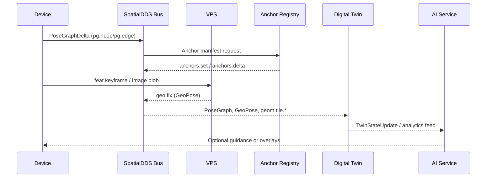

## **SpatialDDS: A Protocol for Real-World Spatial Computing**

*An open invitation to build a shared bus for spatial data, AI world models, and digital twins.*

**Version**: 1.4 (Draft)

**Date**: TBD

**Author**: James Jackson [Open AR Cloud] – james.jackson [at] openarcloud [dot] org

## Contents

### Part I – Overview
*Get oriented with the motivation, core building blocks, practical scenarios, and forward-looking roadmap before diving into the normative material.*

1. [Introduction](sections/v1.4/01-introduction.md)
2. [Conventions (Normative)](sections/v1.4/02-conventions.md)
3. [IDL Profiles](sections/v1.4/02-idl-profiles.md)
   - 3.3.1 [Topic Naming (Normative)](sections/v1.4/02-idl-profiles.md#331-topic-naming-normative)
   - 3.3.4 [Coverage Model (Normative)](sections/v1.4/02-idl-profiles.md#334-coverage-model-normative)
4. [Operational Scenarios](sections/v1.4/04-operational-scenarios.md)
5. [Conclusion](sections/v1.4/conclusion.md)
6. [Future Directions](sections/v1.4/future-directions.md)

### Part II – Reference
*Specifications, identifiers, supporting glossaries, and appendices that implementers can consult while building SpatialDDS solutions.*

7. [SpatialDDS URIs](sections/v1.4/02a-spatialdds-uris.md)
8. [Example Manifests](sections/v1.4/03-example-manifests.md)
9. [Glossary of Acronyms](sections/v1.4/glossary.md)
10. [References](sections/v1.4/references.md)
11. Appendices
    - [Appendix A: Core Profile](sections/v1.4/appendix-a.md)
    - [Appendix B: Discovery Profile](sections/v1.4/appendix-b.md)
    - [Appendix C: Anchor Registry Profile](sections/v1.4/appendix-c.md)
    - [Appendix D: Extension Profiles](sections/v1.4/appendix-d.md)
    - [Appendix E: Provisional Extension Examples](sections/v1.4/appendix-e.md)
    - [Appendix F: SpatialDDS URI Scheme (ABNF)](sections/v1.4/appendix-f.md)
    - [Appendix F.X: Discovery Query Expression (ABNF)](sections/v1.4/appendix-fx-discovery-query-expression.md)
    - [Appendix G: Frame Identifiers (Normative)](sections/v1.4/appendix-g-frame-identifiers.md)

## **1\. Introduction**

SpatialDDS is a lightweight, standards-based protocol, built on OMG DDS, for real-time exchange of spatial world models. It is designed as a shared data bus that allows devices, services, and AI agents to publish and subscribe to structured representations of the physical world — from pose graphs and 3D geometry to anchors, semantic detections, and service discovery. By providing a common substrate, SpatialDDS enables applications in robotics, AR/XR, digital twins, and smart cities to interoperate while also supporting new AI-driven use cases such as perception services, neural maps, and planning agents.

At its core, SpatialDDS is defined through IDL profiles that partition functionality into clean modules:

* **Core**: pose graphs, geometry tiles, anchors, transforms, and blobs.  
* **Discovery**: lightweight announce messages and manifests for services, coverage, anchors, and content.
* **Anchors**: durable anchors and registry updates for persistent world-locked reference points.  
* **Extensions**: optional domain-specific profiles including the shared Sensing Common base types plus VIO sensors, vision streams, SLAM frontend features, semantic detections, radar tensors, lidar streams, AR+Geo, and provisional Neural/Agent profiles.

This profile-based design keeps the protocol lean and interoperable, while letting communities adopt only the pieces they need.

### **Reading Guide (Informative)**

- **Architects & product planners** — Start with §1 and §2 to internalize the motivation, shared conventions, and global rules before drilling into profiles.
- **Implementers & SDK authors** — Focus on Part II plus Appendix A (core IDLs), Appendix B (discovery), Appendix C (anchors), and Appendix D (extensions).
- **Routing, filtering, and coverage developers** — Read §3.3 (Discovery), §3.3.4 (Coverage Model), and Appendix B/F.X for the binding grammars.

### **Why DDS?**

SpatialDDS builds directly on the OMG Data Distribution Service (DDS), a proven standard for real-time distributed systems. DDS provides:

* **Peer-to-peer publish/subscribe** with automatic discovery, avoiding centralized brokers.  
* **Typed data** with schema enforcement, versioning, and language bindings.  
* **Fine-grained QoS** for reliability, liveliness, durability, and latency control.  
* **Scalability** across edge devices, vehicles, and cloud backends.

This foundation ensures that SpatialDDS is not just a message format, but a full-fledged, high-performance middleware for spatial computing.

### **Benefits across domains**

* **Robotics & Autonomous Vehicles**: Share pose graphs, maps, and detections across robots, fleets, and control centers.  
* **Augmented & Mixed Reality**: Fuse VPS results and anchors into persistent, shared spatial contexts; stream geometry and semantics to clients.  
* **Digital Twins & Smart Cities**: Ingest real-time streams of geometry, anchors, and semantics into twin backends, and republish predictive overlays.  
* **IoT & Edge AI**: Integrate lightweight perception services, sensors, and planners that consume and enrich the shared world model.  
* **AI World Models & Agents**: Provide foundation models and AI agents with a structured, typed view of the physical world for perception, reasoning, and planning.

### **Design Principles**

* **Keep the wire light**
  SpatialDDS defines compact, typed messages via IDL. Heavy or variable content (meshes, splats, masks, assets) is carried as blobs, referenced by stable IDs. This avoids bloating the bus while keeping payloads flexible.
* **Profiles, not monoliths**
  SpatialDDS is organized into modular profiles: Core, Discovery, and Anchors form the foundation, while optional Extensions (Sensing Common, VIO, Vision, SLAM Frontend, Semantics, Radar, Lidar, AR+Geo) and provisional profiles (Neural, Agent) add domain-specific capabilities. Implementers adopt only what they need, keeping deployments lean and interoperable.
* **AI-ready, domain-neutral**
  While motivated by SLAM, AR, robotics, and digital twins, the schema is deliberately generic. Agents, foundation models, and AI services can publish and subscribe alongside devices without special treatment.
* **Anchors as first-class citizens**
  Anchors provide durable, shared reference points that bridge positioning, mapping, and content attachment. The Anchor Registry makes them discoverable and persistent across sessions.
* **Discovery without heaviness**
  Lightweight announce messages plus JSON manifests allow services (like VPS, mapping, or anchor registries) and content/experiences to be discovered at runtime without centralized registries.
* **Interoperability with existing standards**
  SpatialDDS is designed to align with and complement related standards such as OGC GeoPose, CityGML/3D Tiles, and Khronos OpenXR. This ensures it can plug into existing ecosystems rather than reinvent them.

### **Specification Layers (Informative)**

| Layer | Purpose | Core Artifacts |
|-------|---------|----------------|
| **Core Transport** | Pub/Sub framing, QoS, reliability | `core`, `discovery` IDLs |
| **Spatial Semantics** | Anchors, poses, transforms, manifests | `anchors`, `geo`, `manifests` |
| **Sensing Extensions** | Radar, LiDAR, Vision modules | `sensing.*` profiles |

### **Architecture Overview & Data Flow**

Before diving into identifiers and manifests, it helps to see how SpatialDDS components interlock when a client joins the bus. The typical flow looks like:

```
SpatialDDS URI ──▶ Manifest Resolver ──▶ Discovery Topic ──▶ DDS/Data Streams ──▶ Shared State & Anchors
        │                 │                      │                   │                      │
   (§7)             (§8)                (§3.3)                   (§3)                   (§5 & Appendix C)
```

1. **URI → Manifest lookup** – Durable SpatialDDS URIs point to JSON manifests that describe services, anchor sets, or content. Clients resolve the URI (often via HTTPS or a local cache) to fetch capabilities, QoS hints, and connection parameters.
2. **Discovery → selecting a service** – Guided by the manifest and Discovery profile messages, participants determine which SpatialDDS services are available in their vicinity, their coverage areas, and how to engage them.
3. **Transport → messages on stream or DDS** – With a target service selected, the client joins the appropriate DDS domain/partition or auxiliary transport identified in the manifest and begins exchanging typed IDL messages for pose graphs, geometry, or perception streams.
4. **State updates / anchor resolution** – As data flows, participants publish and subscribe to state changes. Anchor registries and anchor delta messages keep spatial references aligned so downstream applications can resolve world-locked content with shared context.

This loop repeats as participants encounter new SpatialDDS URIs—keeping discovery, transport, and shared state synchronized.

### **SpatialDDS URIs**

SpatialDDS URIs give every anchor, service, and content bundle a stable handle that can be shared across devices and transports while still resolving to rich manifest metadata. They are the glue between lightweight on-bus messages and descriptive out-of-band manifests, ensuring that discovery pointers stay durable even as infrastructure moves. Section 6 (SpatialDDS URIs) defines the precise syntax, allowed types, and resolver requirements for these identifiers.


// SPDX-License-Identifier: MIT
// SpatialDDS Specification 1.4 (© Open AR Cloud Initiative)

## **2. Conventions (Normative)**

This section centralizes the rules that apply across every SpatialDDS profile. Individual sections reference these shared requirements instead of repeating them. See Appendix A (core), Appendix B (discovery), Appendix C (anchors), and Appendix D (extensions) for the canonical IDL definitions that implement these conventions.

### **2.1 Orientation & Frame References**

- All quaternion fields, manifests, and IDLs SHALL use the `(x, y, z, w)` order that aligns with OGC GeoPose.
- Frames are represented exclusively with `FrameRef { uuid, fqn }`. The UUID is authoritative; the fully qualified name is a human-readable alias. Appendix G defines the authoritative frame model.
- Example JSON shape:
  ```json
  "frame_ref": { "uuid": "00000000-0000-4000-8000-000000000000", "fqn": "earth-fixed/map/device" }
  ```

### **2.2 Optional Fields & Discriminated Unions**

- Optional scalars, structs, and arrays MUST be guarded by an explicit `has_*` boolean immediately preceding the field.
- Mutually exclusive payloads SHALL be modeled as discriminated unions; do not overload presence flags to signal exclusivity.
- Schema evolution leverages `@extensibility(APPENDABLE)`; omit fields only when the IDL version removes them, never as an on-wire sentinel.

### **2.3 Numeric Validity & NaN Deprecation**

- `NaN`, `Inf`, or other sentinels SHALL NOT signal absence or "unbounded" values; explicit presence flags govern validity.
- Fields guarded by `has_*` flags are meaningful only when the flag is `true`. When the flag is `false`, consumers MUST ignore the payload regardless of its contents.
- When a `has_*` flag is `true`, non-finite numbers MUST be rejected wherever geographic coordinates, quaternions, coverage bounds, or similar numeric payloads appear.

### **2.4 Canonical Ordering & Identity**

These rules apply to any message that carries the trio `{ stamp, source_id, seq }`.

**Field semantics**

- `stamp` — Event time chosen by the producer.
- `source_id` — Stable writer identity within a deployment.
- `seq` — Per-`source_id` strictly monotonic unsigned 64-bit counter.

**Identity & idempotency**

- The canonical identity of a sample is the tuple (`source_id`, `seq`).
- Consumers MUST treat duplicate tuples as the same logical sample.
- If `seq` wraps or resets, the producer MUST change `source_id` (or use a profile with an explicit writer epoch).

**Ordering rules**

1. **Intra-source** — Order solely by `seq`. Missing values under RELIABLE QoS indicate loss.
2. **Inter-source merge** — Order by (`stamp`, `source_id`, `seq`) within a bounded window selected by the consumer.

### **2.5 DDS / IDL Structure**

- All SpatialDDS modules conform to OMG IDL 4.2 and DDS-XTypes 1.3.
- Extensibility SHALL be declared via `@extensibility(APPENDABLE)`.
- Compound identity SHALL be declared with multiple `@key` annotations.
- Field initialization remains a runtime concern and SHALL NOT be encoded in IDL.
- Abridged snippets within the main body are informative; the appendices contain the authoritative IDLs listed above.


// SPDX-License-Identifier: MIT
// SpatialDDS Specification 1.4 (© Open AR Cloud Initiative)

## **3\. IDL Profiles**

The SpatialDDS IDL bundle defines the schemas used to exchange real-world spatial data over DDS. It is organized into complementary profiles: **Core**, which provides the backbone for pose graphs, geometry, and geo-anchoring; **Discovery**, which enables lightweight announcements of services, coverage, anchors, and content; and **Anchors**, which adds support for publishing and updating sets of durable world-locked anchors. Together, these profiles give devices, services, and applications a common language for building, sharing, and aligning live world models—while staying codec-agnostic, forward-compatible, and simple enough to extend for domains such as robotics, AR/XR, IoT, and smart cities.

_See §2 Conventions for global normative rules._

### **3.1 IDL Profile Versioning & Negotiation (Normative)**

SpatialDDS uses semantic versioning tokens of the form `name@MAJOR.MINOR`.

* **MAJOR** increments for breaking schema or wire changes.
* **MINOR** increments for additive, compatible changes.

**Identifier conventions.** Profile tokens use the form `name@MAJOR.MINOR` (e.g., `core@1.4`, `discovery@1.4`) and appear in manifests plus capability negotiation. The corresponding module identifiers use `spatial.<profile>/<MAJOR.MINOR>` (e.g., `spatial.core/1.4`, `spatial.discovery/1.4`) and surface as `MODULE_ID` constants or in fields such as `schema_version`. These forms are canonically related: `core@1.4 ⇔ spatial.core/1.4`.

Participants advertise supported ranges via `caps.supported_profiles` (discovery) and manifest capabilities blocks. Consumers select the **highest compatible minor** within any shared major. Backward-compatibility clauses from 1.3 are retired; implementations only negotiate within their common majors. SpatialDDS 1.4 uses a single canonical quaternion order `(x, y, z, w)` across manifests, discovery payloads, and IDL messages.

### **3.2 Core SpatialDDS**

The Core profile defines the essential building blocks for representing and sharing a live world model over DDS. It focuses on a small, stable set of concepts: pose graphs, 3D geometry tiles, blob transport for large payloads, and geo-anchoring primitives such as anchors, transforms, and simple GeoPoses. The design is deliberately lightweight and codec-agnostic: tiles reference payloads but do not dictate mesh formats, and anchors define stable points without tying clients to a specific localization method. All quaternion fields follow the OGC GeoPose component order `(x, y, z, w)` so orientation data can flow between GeoPose-aware systems without reordering. By centering on graph \+ geometry \+ anchoring, the Core profile provides a neutral foundation that can support diverse pipelines across robotics, AR, IoT, and smart city contexts.

#### Frame Identifiers (Reference)

SpatialDDS uses structured frame references via the `FrameRef { uuid, fqn }` type.  
See *Appendix G Frame Identifiers (Normative)* for the complete definition and naming rules.

### **3.3 Discovery**

Discovery is how SpatialDDS peers **find each other**, **advertise what they publish**, and **select compatible streams**. Think of it as a built-in directory that rides the same bus: nodes announce, others filter and subscribe.

#### How it works (at a glance)
1. **Announce** — each node periodically publishes an announcement with capabilities and topics.
2. **Query** — clients publish simple filters (by profile version, type, QoS) to narrow results.
3. **Select** — clients subscribe to chosen topics; negotiation picks the highest compatible minor per profile.

#### Key messages (abridged IDL)
*(Abridged IDL — see Appendix B for full definitions.)*
```idl
// Message shapes shown for orientation only
@extensibility(APPENDABLE) struct ProfileSupport { string name; uint32 major; uint32 min_minor; uint32 max_minor; boolean preferred; }
@extensibility(APPENDABLE) struct Capabilities   { sequence<ProfileSupport,64> supported_profiles; sequence<string,32> preferred_profiles; sequence<string,64> features; }
@extensibility(APPENDABLE) struct TopicMeta      { string name; string type; string version; string qos_profile; float32 target_rate_hz; uint32 max_chunk_bytes; }

@extensibility(APPENDABLE) struct Announce {
  // ... node identity, endpoints ...
  Capabilities caps;                  // profiles, preferences, features
  sequence<TopicMeta,128> topics;     // typed topics offered by this node
}

@extensibility(APPENDABLE) struct CoverageQuery {
  // minimal illustrative fields
  string expr;        // Appendix F.X grammar; e.g., "type==\"radar_tensor\" && profile==\"discovery@1.*\""
  string reply_topic; // topic to receive results
  string query_id;    // correlate request/response
}

@extensibility(APPENDABLE) struct CoverageResponse {
  string query_id;
  sequence<Announce,256> results;
  string next_page_token;
}
```

#### Minimal examples (JSON)
**Announce (capabilities + topics)**
```json
{
  "caps": {
    "supported_profiles": [
      { "name": "core",           "major": 1, "min_minor": 0, "max_minor": 3 },
      { "name": "discovery",      "major": 1, "min_minor": 1, "max_minor": 2 }
    ],
    "preferred_profiles": ["discovery@1.2"],
    "features": ["blob.crc32"]
  },
  "topics": [
    { "name": "spatialdds/perception/cam_front/video_frame/v1", "type": "video_frame", "version": "v1", "qos_profile": "VIDEO_LIVE" },
    { "name": "spatialdds/perception/radar_1/radar_tensor/v1",  "type": "radar_tensor", "version": "v1", "qos_profile": "RADAR_RT"   }
  ]
}
```

**Query + Response**
```json
{ "query_id": "q1", "expr": "type==\"radar_tensor\" && profile==\"discovery@1.*\"", "reply_topic": "spatialdds/sys/queries/q1" }
```
```json
{ "query_id": "q1", "results": [ { "caps": { "supported_profiles": [ { "name": "discovery", "major": 1, "min_minor": 1, "max_minor": 2 } ] }, "topics": [ { "name": "spatialdds/perception/radar_1/radar_tensor/v1", "type": "radar_tensor", "version": "v1", "qos_profile": "RADAR_RT" } ] } ], "next_page_token": "" }
```

#### Norms & filters
* Announces **MUST** include `caps.supported_profiles`; peers choose the highest compatible minor within a shared major.
* Each advertised topic **MUST** declare `name`, `type`, `version`, and `qos_profile` per Topic Identity (§3.3.1); optional throughput hints (`target_rate_hz`, `max_chunk_bytes`) are additive.
* Discovery topics SHALL restrict `type` to {`geometry_tile`, `video_frame`, `radar_tensor`, `seg_mask`, `desc_array`}, `version` to `v1`, and `qos_profile` to {`GEOM_TILE`, `VIDEO_LIVE`, `RADAR_RT`, `SEG_MASK_RT`, `DESC_BATCH`}.
* `caps.preferred_profiles` is an optional tie-breaker **within the same major**.
* `caps.features` carries namespaced feature flags; unknown flags **MUST** be ignored.
* `CoverageQuery.expr` follows the boolean grammar in Appendix F.X and MAY filter on profile tokens (`name@MAJOR.*` or `name@MAJOR.MINOR`), topic `type`, and `qos_profile` strings.
* Responders page large result sets via `next_page_token`; every response **MUST** echo the caller’s `query_id`.

#### What fields mean (quick reference)
| Field | Use |
|------|-----|
| `caps.supported_profiles` | Version ranges per profile. Peers select the **highest compatible minor** within a shared major. |
| `caps.preferred_profiles` | Optional tie-breaker hint (only within a major). |
| `caps.features` | Optional feature flags (namespaced strings). Unknown flags can be ignored. |
| `topics[].type` / `version` / `qos_profile` | Topic Identity keys used to filter and match streams; see the allowed sets above. |
| `reply_topic`, `query_id` | Allows asynchronous, paged responses and correlation. |

#### Practical notes
* Announce messages stay small and periodic; re-announce whenever capabilities, coverage, or topics change.
* Queries are stateless filters. Responders may page through results; clients track `next_page_token` until empty.
* Topic names follow `spatialdds/<domain>/<stream>/<type>/<version>` per §3.3.1; filter by `type` and `qos_profile` instead of parsing payloads.
* Negotiation is automatic once peers see each other’s `supported_profiles`; emit diagnostics like `NO_COMMON_MAJOR(name)` when selection fails.

#### Summary
Discovery keeps the wire simple: nodes publish what they have, clients filter for what they need, and the system converges on compatible versions. Use typed topic metadata to choose streams, rely on capabilities to negotiate versions without handshakes, and treat discovery traffic as the lightweight directory for every SpatialDDS deployment.

#### **3.3.1 Topic Naming (Normative)**

SpatialDDS topics are identified by a structured **name**, a **type**, a **version**, and a declared **Quality-of-Service (QoS)** profile. Together these define both *what* a stream carries and *how* it behaves on the wire.

Each topic follows this pattern:
```
spatialdds/<domain>/<stream>/<type>/<version>
```
| Segment | Meaning | Example |
|----------|----------|----------|
| `<domain>` | Logical app domain | `perception` |
| `<stream>` | Sensor or stream ID | `cam_front` |
| `<type>` | Registered data type | `video_frame` |
| `<version>` | Schema or message version | `v1` |

###### Example
```json
{
  "name": "spatialdds/perception/radar_1/radar_tensor/v1",
  "type": "radar_tensor",
  "version": "v1",
  "qos_profile": "RADAR_RT"
}
```

#### **3.3.2 Typed Topics Registry**

| Type | Typical Payload | Notes |
|------|------------------|-------|
| `geometry_tile` | 3D tile data (GLB, 3D Tiles) | Large, reliable transfers |
| `video_frame` | Encoded video/image | Real-time camera streams |
| `radar_tensor` | N-D float/int tensor | Structured radar data |
| `seg_mask` | Binary or PNG mask | Frame-aligned segmentation |
| `desc_array` | Feature descriptor sets | Vector or embedding batches |

These registered types ensure consistent topic semantics without altering wire framing. New types can be registered additively through this table or extensions.

#### **3.3.3 QoS Profiles**

QoS profiles define delivery guarantees and timing expectations for each topic type.

| Profile | Reliability | Ordering | Typical Deadline | Use Case |
|----------|--------------|----------|------------------|-----------|
| `GEOM_TILE` | Reliable | Ordered | 200 ms | 3D geometry, large tile data |
| `VIDEO_LIVE` | Best-effort | Ordered | 33 ms | Live video feeds |
| `VIDEO_ARCHIVE` | Reliable | Ordered | 200 ms | Replay or stored media |
| `RADAR_RT` | Partial | Ordered | 20 ms | Real-time radar tensors |
| `SEG_MASK_RT` | Best-effort | Ordered | 33 ms | Live segmentation masks |
| `DESC_BATCH` | Reliable | Ordered | 100 ms | Descriptor or feature batches |

###### Notes

* Each topic advertises its `qos_profile` during discovery.
* Profiles capture trade-offs between latency, reliability, and throughput.
* Implementations may tune low-level DDS settings, but the profile name is canonical.
* Mixing unrelated data (e.g., radar + video) in a single QoS lane is discouraged.

##### Discovery and Manifest Integration

Every `Announce.topics[]` entry and manifest topic reference SHALL include:
- `type` — one of the registered type values
- `version` — the schema or message version
- `qos_profile` — one of the standard or extended QoS names

Consumers use these three keys to match and filter streams without inspecting payload bytes. Brokers and routers SHOULD isolate lanes by `(topic, stream_id, qos_profile)` to avoid head-of-line blocking.

#### **3.3.4 Coverage Model (Normative)**

- `coverage_frame_ref` is the canonical frame for all coverage elements in a given announcement. `CoverageElement` geometries SHOULD be expressed in this frame. Per-element overrides via `CoverageElement.frame_ref` are allowed, but SHOULD be used sparingly (e.g., when mixing a small number of local frames in the same announcement).
- When `coverage_eval_time` is present, consumers SHALL evaluate any referenced transforms at that instant before interpreting `coverage_frame_ref`.
- `global == true` means worldwide coverage regardless of regional hints. Producers MAY omit `bbox`, `geohash`, or `elements` in that case.
- When `global == false`, producers MAY supply any combination of regional hints; consumers SHOULD treat the union of all regions as the effective coverage.
- Manifests MAY express coverage using any combination of `bbox`, `geohash`, and `elements`. Discovery coverage MAY omit `geohash` and rely solely on `bbox`, `aabb`, and `elements` while preserving the same coverage semantics.
- `has_bbox` and `has_aabb` govern whether the associated coordinates are meaningful:
  - When `has_bbox == true`, consumers MUST treat `bbox` as authoritative and SHALL reject non-finite values (`NaN`, `Inf`).
  - When `has_bbox == false`, consumers MUST ignore `bbox` entirely, regardless of its contents. The same rules apply to `has_aabb`/`aabb`.
- Earth-fixed frames (`fqn` rooted at `earth-fixed`) encode WGS84 longitude/latitude/height. Local frames MUST reference anchors or manifests that describe the transform back to an earth-fixed root (Appendix G).
- Discovery announces and manifests share the same coverage semantics and flags. `CoverageQuery` responders SHALL apply these rules consistently when filtering or paginating results.
- See §2 Conventions for global normative rules.

##### Implementation Guidance (Non-Normative)

* No change to on-wire framing — this metadata lives at the discovery layer.
* Named QoS profiles simplify cross-vendor interoperability and diagnostics.
* For custom types, follow the same naming pattern and document new QoS presets.
* All examples and tables herein are **additive**.

##### Discovery recipe (tying the examples together)

1. **Announce** — the producer sends `Announce` (see JSON example above) to advertise `caps` and `topics`.
2. **CoverageQuery** — the consumer issues a `CoverageQuery` (see query JSON) to filter by profile, topic type, or QoS.
3. **CoverageResponse** — the producer replies with `CoverageResponse` (see response JSON), returning results plus an optional `next_page_token` for pagination.

### **3.4 Anchors**

The Anchors profile provides a structured way to share and update collections of durable, world-locked anchors. While Core includes individual GeoAnchor messages, this profile introduces constructs such as AnchorSet for publishing bundles (e.g., a venue’s anchor pack) and AnchorDelta for lightweight updates. This makes it easy for clients to fetch a set of anchors on startup, stay synchronized through incremental changes, and request full snapshots when needed. Anchors complement VPS results by providing the persistent landmarks that make AR content and multi-device alignment stable across sessions and users.

### **3.5 Profiles Summary**

The complete SpatialDDS IDL bundle is organized into the following profiles:

* **Core Profile**  
  Fundamental building blocks: pose graphs, geometry tiles, anchors, transforms, and blob transport.  
* **Discovery Profile**
   Lightweight announce messages plus active query/response bindings for services, coverage areas, anchors, and spatial content or experiences.
* **Anchors Profile**  
  Durable anchors and the Anchor Registry, enabling persistent world-locked reference points.

Together, Core, Discovery, and Anchors form the foundation of SpatialDDS, providing the minimal set required for interoperability.

* **Extensions**
  * **Sensing Module Family**: `sensing.common` defines shared frame metadata, calibration, QoS hints, and codec descriptors. Radar, lidar, and vision profiles inherit those types and layer on their minimal deltas—`RadDetectionSet`/`RadTensor`/`beam_params` for radar, `PointCloud`/`ScanBlock`/`return_type` for lidar, and `ImageFrame`/`SegMask`/`FeatureArray` for vision. Deployments MAY import the specialized profiles independently but SHOULD declare the `sensing.common@1.x` dependency when they do.
  * **VIO Profile**: Raw and fused IMU and magnetometer samples for visual-inertial pipelines.
  * **SLAM Frontend Profile**: Features, descriptors, and keyframes for SLAM and SfM pipelines.
  * **Semantics Profile**: 2D and 3D detections for AR occlusion, robotics perception, and analytics.
  * **AR+Geo Profile**: GeoPose, frame transforms, and geo-anchoring structures for global alignment and persistent AR content.
* **Provisional Extensions (Optional)**
  * **Neural Profile**: Metadata for neural fields (e.g., NeRFs, Gaussian splats) and optional view-synthesis requests.
  * **Agent Profile**: Generic task and status messages for AI agents and planners.

Together, these profiles give SpatialDDS the flexibility to support robotics, AR/XR, digital twins, IoT, and AI world models—while ensuring that the wire format remains lightweight, codec-agnostic, and forward-compatible.

#### **Profile Matrix (SpatialDDS 1.4)**

- spatial.core/1.4
- spatial.discovery/1.4
- spatial.anchors/1.4
- spatial.argeo/1.4
- spatial.sensing.common/1.4
- spatial.sensing.rad/1.4
- spatial.sensing.lidar/1.4
- spatial.sensing.vision/1.4
- spatial.slam_frontend/1.4
- spatial.vio/1.4
- spatial.semantics/1.4

The Sensing module family keeps sensor data interoperable: `sensing.common` unifies pose stamps, calibration blobs, ROI negotiation, and quality reporting. Radar, lidar, and vision modules extend that base without redefining shared scaffolding, ensuring multi-sensor deployments can negotiate payload shapes and interpret frame metadata consistently.


## **4. Operational Scenarios: From SLAM to AI World Models**

SpatialDDS supports a ladder of capabilities that begins with a single device mapping its surroundings and ends with AI systems consuming a live digital twin. Rather than enumerating isolated use cases, this section walks through one coherent flow — from local SLAM to shared anchors, to global positioning, to twin aggregation, and ultimately to AI world models.

### **Narrative Walkthrough: Local → Shared → Global → AI**

1. **Local SLAM on-device.** A headset, drone, or robot runs visual-inertial SLAM, generating keyframes and odometry updates in its private map frame.
2. **Sharing a pose graph.** The device publishes `pg.node` and `pg.edge` samples (often as compact PoseGraphDelta bursts) onto the SpatialDDS bus so nearby peers or edge services can extend or optimize the map.
3. **Anchors stabilize VIO.** By discovering the Anchor Registry, the device resolves durable anchor URIs, retrieves their manifests, and fuses those priors to keep its VIO estimate drift-free.
4. **VPS provides a GeoPose.** When the device needs a global fix, it queries a Visual Positioning Service (VPS). The VPS uses the shared pose graph plus anchor hints to return a `geo.fix` sample that orients the local map in a world frame.
5. **Digital twin aggregation.** Twin backends subscribe to the same streams — pose graphs, anchors, geometry, and semantics — to maintain authoritative state for places, assets, and events.
6. **AI world models consume the twin.** Analytics engines, planning agents, and foundation models read from the digital twin feeds, grounding their predictions and experiences in the synchronized world model.

The end result is a continuous chain: local sensing feeds a shared spatial data bus, anchors and VPS lift content into a global frame, digital twins maintain durable state, and AI systems reason over the fused model.



### **Example 1: Device Localization with SLAM and Anchors**

A field technician’s headset begins indoors with self-contained SLAM. As it walks the “local → shared → global” ladder:

- **Publish local mapping.** Each keyframe produces a PoseGraphDelta that streams to `pg.node` / `pg.edge`. An excerpt looks like:

    ```json
    {
      "topic": "pg.node",
      "map_id": "map/facility-west",
      "node_id": "kf_0120",
      "pose": { "t": [0.12, 0.04, 1.43], "q": [0.99, 0.01, -0.02, 0.03] },
      "frame_ref": {
        "uuid": "6c2333a0-8bfa-4b43-9ad9-7f22ee4b0001",
        "fqn": "facility-west/map"
      },
      "stamp": { "sec": 1714070452, "nsec": 125000000 },
      "source_id": "device/headset-17"
    }
    ```

- **Discover anchors.** Through `disco.service`, the headset resolves `anchor://facility-west/loading-bay`, fetches the manifest (Appendix A.1), and applies the returned `FrameTransform` to pin its `map` frame to a surveyed ENU.
- **Query VPS.** When entering the yard, it uploads a `feat.keyframe` set to VPS. The service matches against the shared pose graph plus anchor hints and responds with a `geo.fix` sample:

    ```json
    {
      "topic": "geo.fix",
      "anchor_id": "anchor://facility-west/loading-bay",
      "geopose": {
        "lat_deg": 37.79341,
        "lon_deg": -122.39412,
        "alt_m": 12.6,
        "q": [0.71, 0.00, 0.70, 0.05],
        "frame_kind": "ENU",
        "frame_ref": {
          "uuid": "fc6a63e0-99f7-445b-9e38-0a3c8a0c1234",
          "fqn": "earth-fixed"
        }
      },
      "cov": [0.04, 0, 0, 0.04, 0, 0, 0, 0, 0.09]
    }
    ```

- **Align to world.** The headset fuses the GeoPose with its local pose graph, hands peers a globally aligned `geo.tf`, and continues publishing drift-stable updates for others to use.

(See Appendix A.1 for the full anchor and VPS manifests referenced here.)

### **Example 2: Updating and Using a Digital Twin**

A facilities digital twin service subscribes to the same DDS topics to maintain a live model, while an AI analytics engine consumes the twin stream:

- **Twin ingestion.** The backend listens to `pg.node`, `geo.anchor`, and `geom.tile.*` to reconcile a persistent state for each asset. When a door actuator changes, an operator microservice emits:

    ```json
    {
      "topic": "twin.state.update",
      "uri": "urn:spatial://facility-west/assets/door-17",
      "anchor_ref": "anchor://facility-west/loading-bay",
      "state": {
        "pose_local": {
          "t": [4.21, -1.02, 0.00],
          "q": [1, 0, 0, 0]
        },
        "door_status": "open",
        "last_maintenance": "2024-03-22"
      },
      "stamp": { "sec": 1714070520, "nsec": 0 }
    }
    ```

  The twin registry validates the anchor reference, signs a manifest (Appendix A.2), and updates the canonical record.

- **AI/analytics consumption.** A predictive maintenance model subscribes to `twin.state.update` and `semantics.det.3d.set` streams. It flags abnormal open durations, publishing alerts and AR overlays back through SpatialDDS.
- **Experience feedback.** AR clients render the AI insight, while robotics planners reuse the same URI-addressable twin objects for navigation.

(See Appendix A.2 for extended twin manifests and analytics payloads.)

### **Why the Ladder Matters**

This end-to-end chain demonstrates how SpatialDDS keeps local SLAM, shared anchors, VPS fixes, digital twins, and AI models in sync without bespoke gateways. Devices gain reliable localization, twins receive authoritative updates, and AI systems operate on a grounded, real-time world model.

## **5. Conclusion**

SpatialDDS provides a lightweight, standards-based framework for exchanging real-world spatial data over DDS. By organizing schemas into modular profiles — with Core, Discovery, and Anchors as the foundation and Extensions adding domain-specific capabilities — it supports everything from SLAM pipelines and AR clients to digital twins, smart city infrastructure, and AI-driven world models. Core elements such as pose graphs, geometry tiles, anchors, and discovery give devices and services a shared language for building and aligning live models of the world, while provisional extensions like Neural and Agent point toward richer semantics and autonomous agents. Taken together, SpatialDDS positions itself as a practical foundation for real-time spatial computing—interoperable, codec-agnostic, and ready to serve as the data bus for AI and human experiences grounded in the physical world.


## **6. Future Directions**

While SpatialDDS establishes a practical baseline for real-time spatial computing, several areas invite further exploration:

* **Reference Implementations**  
  Open-source libraries and bridges to existing ecosystems (e.g., ROS 2, OpenXR, OGC APIs) would make it easier for developers to adopt SpatialDDS in robotics, AR, and twin platforms.  
* **Semantic Enrichment**  
  Extending beyond 2D/3D detections, future work could align with ontologies and scene graphs to enable richer machine-readable semantics for AI world models and analytics.  
* **Neural Integration**  
  Provisional support for neural fields (NeRFs, Gaussian splats) could mature into a stable profile, ensuring consistent ways to stream and query neural representations across devices and services.  
* **Agent Interoperability**  
  Lightweight tasking and coordination schemas could evolve into a standard Agent profile, supporting multi-agent planning and human-AI collaboration at scale.  
* **Standards Alignment**  
  Ongoing coordination with OGC, Khronos, W3C, and GSMA initiatives will help ensure SpatialDDS complements existing geospatial, XR, and telecom standards rather than duplicating them.

Together, these directions point toward a future where SpatialDDS is not just a protocol but a foundation for an open, interoperable ecosystem of real-time world models.

We invite implementers, researchers, and standards bodies to explore SpatialDDS, contribute extensions, and help shape it into a shared backbone for real-time spatial computing and AI world models.


## **7. SpatialDDS URIs**

### 7.1 Why SpatialDDS URIs matter

SpatialDDS URIs are the shorthand that lets participants talk about anchors, content, and services without exchanging the full manifests up front. They bridge human concepts—"the anchor in Hall 1" or "the localization service for Midtown"—with machine-readable manifests that deliver the precise data, coordinate frames, and capabilities needed later in the flow.

### 7.2 Key ingredients

Every SpatialDDS URI names four ideas:

* **Authority** – who owns the namespace and keeps the identifiers stable.
* **Zone** – a slice of that authority’s catalog, such as a venue, fleet, or logical shard.
* **Type** – whether the reference points to an anchor, a bundle of anchors, a piece of content, or a service endpoint.
* **Identifier (with optional version)** – the specific record the manifest will describe.

The exact tokens and encoding rules are defined by the individual profiles, but at a glance the URIs read like `spatialdds://authority/zone/type/id;v=version`. Readers only need to recognize which part expresses ownership, scope, semantics, and revision so they can reason about the rest of the system.

Formal syntax is given in Appendix F.

### 7.3 Working with SpatialDDS URIs

Once a URI is known, clients ask the authority for the manifest it points to—typically via HTTPS, though authorities can advertise other transports if they operate private caches or field buses. The manifest reveals everything the client needs to act: anchor poses, dependency graphs for experiences, or how to reach a service. Because URIs remain lightweight, they are easy to pass around in tickets, QR codes, or discovery topics while deferring the heavier data fetch until runtime.

### 7.4 Examples

```text
spatialdds://museum.example.org/hall1/anchor/01J8QDFQX3W9X4CEX39M9ZP6TQ
spatialdds://city.example.net/downtown/service/01HA7M6XVBTF6RWCGN3X05S0SM;v=2024-q2
spatialdds://studio.example.com/stage/content/01HCQF7DGKKB3J8F4AR98MJ6EH
```

In the manifest samples later in this specification, each of these identifiers expands into a full JSON manifest. Reviewing those examples shows how a single URI flows from a discovery payload, through manifest retrieval, to runtime consumption.

## 8. Example Manifests

Manifests describe what a SpatialDDS node or dataset provides: **capabilities**, **coverage**, and **assets**. They are small JSON documents discoverable via the same bus or HTTP endpoints.

## Structure Overview
| Field | Purpose |
|-------|----------|
| `id` | Unique manifest identifier (UUID or URI) |
| `profile` | Manifest schema name and version (e.g., `spatial.manifest@1.4`) |
| `caps` | Supported profiles, features, and capabilities |
| `coverage` | Spatial or temporal extent of data |
| `assets` | Referenced content (tiles, descriptors, etc.) |

## Example Manifest (minimal)
```json
{
  "id": "manifest-001",
  "profile": "spatial.manifest@1.4",
  "caps": {
    "supported_profiles": [
      { "name": "core", "major": 1, "min_minor": 0, "max_minor": 3 }
    ],
    "features": ["lidar.range", "radar.tensor"]
  },
  "coverage": {
    "frame_ref": { "fqn": "earth-fixed", "uuid": "ae6f0a3e-7a3e-4b1e-9b1f-0e9f1b7c1a10" },
    "has_bbox": true,
    "bbox": [-122.420, 37.790, -122.410, 37.800],
    "geohash": ["9q8y"],
    "elements": [{
      "type": "volume",
      "has_bbox": false,
      "has_aabb": true,
      "aabb": { "min": [-122.420, 37.790, -10], "max": [-122.410, 37.800, 100] },
      "global": false
    }],
    "global": false
  },
  "assets": [{
    "kind": "features:ORB:v1",
    "uri": "https://example.org/descriptors/1",
    "mime": "application/x-array",
    "hash": "sha256:0000000000000000000000000000000000000000000000000000000000000000"
  }]
}
```

## Field Notes
* **Capabilities (`caps`)** — declares supported profiles and feature flags. Peers use this to negotiate versions.  
* **Coverage (`coverage`)** — See §3.3.4 Coverage Model (Normative). Coverage blocks in manifests and discovery announces share the same semantics. See §2 Conventions for global normative rules.
* **Frame identity.** The `uuid` field is authoritative; `fqn` is a human-readable alias. Consumers SHOULD match frames by UUID and MAY show `fqn` in logs or UIs. See Appendix G for the full FrameRef model.
* **Assets (`assets`)** — URIs referencing external content. Each has a `kind`, `uri`, and optional `mime` and `hash`.
* All orientation fields follow the quaternion order defined in §2.1; older forms like `q_wxyz` are removed.

## Practical Guidance
* Keep manifests small and cacheable; they are for discovery, not bulk metadata.  
* When multiple frames exist, use one manifest per frame for clarity.  
* Use HTTPS, DDS, or file URIs interchangeably — the `uri` scheme is transport-agnostic.  
* Assets should prefer registered MIME types for interoperability.

## Summary
Manifests give every SpatialDDS resource a compact, self-describing identity. They express *what exists*, *where it is*, and *how to reach it*.

## **9. Glossary of Acronyms**

**AI** – Artificial Intelligence

**AR** – Augmented Reality

**DDS** – Data Distribution Service (OMG standard middleware)

**GSMA** – GSM Association (global mobile industry group)

**IMU** – Inertial Measurement Unit

**IoT** – Internet of Things

**MR** – Mixed Reality

**MSF** – Metaverse Standards Forum

**NeRF** – Neural Radiance Field (neural representation of 3D scenes)

**OGC** – Open Geospatial Consortium

**OMG** – Object Management Group (standards body for DDS)

**ROS** – Robot Operating System

**SfM** – Structure from Motion

**SLAM** – Simultaneous Localization and Mapping

**VIO** – Visual-Inertial Odometry

**VLM** – Vision-Language Model

**VPS** – Visual Positioning Service

**VR** – Virtual Reality

**W3C** – World Wide Web Consortium

**XR** – Extended Reality (umbrella term including AR, VR, MR)


## **10. References**

### **DDS & Middleware**

\[1\] Object Management Group. *Data Distribution Service (DDS) for Real-Time Systems.* OMG Standard. Available: [https://www.omg.org/spec/DDS](https://www.omg.org/spec/DDS)

\[2\] Object Management Group. *DDS for eXtremely Resource Constrained Environments (DDS-XRCE).* OMG Standard. Available: [https://www.omg.org/spec/DDS-XRCE](https://www.omg.org/spec/DDS-XRCE)

\[3\] eProsima. *Fast DDS Documentation.* Available: [https://fast-dds.docs.eprosima.com](https://fast-dds.docs.eprosima.com/)

\[4\] Eclipse Foundation. *Cyclone DDS.* Available: [https://projects.eclipse.org/projects/iot.cyclonedds](https://projects.eclipse.org/projects/iot.cyclonedds)

### **XR & Spatial Computing**

\[5\] Khronos Group. *OpenXR Specification.* Available: [https://www.khronos.org/openxr](https://www.khronos.org/openxr)

\[6\] Open Geospatial Consortium. *OGC GeoPose 1.0 Data Exchange Standard.* Available: [https://www.ogc.org/standards/geopose](https://www.ogc.org/standards/geopose)

### **Geospatial Standards**

\[7\] Open Geospatial Consortium. *CityGML Standard.* Available: [https://www.ogc.org/standards/citygml](https://www.ogc.org/standards/citygml)

\[8\] Geohash. *Wikipedia Entry.* Available: [https://en.wikipedia.org/wiki/Geohash](https://en.wikipedia.org/wiki/Geohash)

### **SLAM, SfM & AI World Models**

\[9\] Mur-Artal, R., Montiel, J. M. M., & Tardós, J. D. (2015). *ORB-SLAM: A Versatile and Accurate Monocular SLAM System.* IEEE Transactions on Robotics, 31(5), 1147–1163.

\[10\] Schönberger, J. L., & Frahm, J.-M. (2016). *Structure-from-Motion Revisited.* In IEEE Conference on Computer Vision and Pattern Recognition (CVPR), 4104–4113.

\[11\] Sarlin, P.-E., Unagar, A., Larsson, M., et al. (2020). *From Coarse to Fine: Robust Hierarchical Localization at Large Scale.* In IEEE Conference on Computer Vision and Pattern Recognition (CVPR), 12716–12725.

\[12\] Google Research. *ARCore Geospatial API & Visual Positioning Service.* Developer Documentation. Available: [https://developers.google.com/ar](https://developers.google.com/ar)


## **Appendix A: Core Profile**

*The Core profile defines the fundamental data structures for SpatialDDS. It includes pose graphs, 3D geometry tiles, anchors, transforms, and generic blob transport. This is the minimal interoperable baseline for exchanging world models across devices and services.*

```idl
// SPDX-License-Identifier: MIT
// SpatialDDS Core 1.4

#ifndef SPATIAL_COMMON_TYPES_INCLUDED
#include "types.idl"
#endif
#ifndef SPATIAL_GEOMETRY_INCLUDED
#include "geometry.idl"
#endif

module spatial {
  module core {

    // Module identity (authoritative string for interop)
    const string MODULE_ID = "spatial.core/1.4";

    // ---------- Utility ----------
    // Expose builtin Time under spatial::core
    typedef builtin::Time Time;

    @extensibility(APPENDABLE) struct PoseSE3 {
      spatial::common::Vec3 t;               // translation (x,y,z)
      spatial::common::QuaternionXYZW q;     // quaternion (x,y,z,w) in GeoPose order
    };

    @extensibility(APPENDABLE) struct Aabb3 {
      spatial::common::Vec3 min_xyz;
      spatial::common::Vec3 max_xyz;
    };

    @extensibility(APPENDABLE) struct TileKey {
      @key uint32 x;     // tile coordinate (quadtree/3D grid)
      @key uint32 y;
      @key uint32 z;     // use 0 for 2D schemes
      @key uint8  level; // LOD level
    };

    // ---------- Geometry ----------
    enum PatchOp {
      @value(0) ADD,
      @value(1) REPLACE,
      @value(2) REMOVE
    };

    @extensibility(APPENDABLE) struct BlobRef {
      string blob_id;   // UUID or content-address
      string role;      // "mesh","attr/normals","pcc/geom","pcc/attr",...
      string checksum;  // SHA-256 (hex)
    };

    typedef spatial::geometry::FrameRef FrameRef;

    @extensibility(APPENDABLE) struct TileMeta {
      @key TileKey key;              // unique tile key
      boolean has_tile_id_compat;
      string  tile_id_compat;        // optional human-readable id
      spatial::common::Vec3 min_xyz; // AABB min (local frame)
      spatial::common::Vec3 max_xyz; // AABB max (local frame)
      uint32 lod;                    // may mirror key.level
      uint64 version;                // monotonic full-state version
      string encoding;               // "glTF+Draco","MPEG-PCC","V3C","PLY",...
      string checksum;               // checksum of composed tile
      sequence<string, 32> blob_ids; // blobs composing this tile
      // optional geo hints
      boolean has_centroid_llh;
      spatial::common::Vec3  centroid_llh; // lat,lon,alt (deg,deg,m)
      boolean has_radius_m;
      double  radius_m;              // rough extent (m)
      string schema_version;         // MUST be "spatial.core/1.4"
    };

    @extensibility(APPENDABLE) struct TilePatch {
      @key TileKey key;              // which tile
      uint64 revision;               // monotonic per-tile
      PatchOp op;                    // ADD/REPLACE/REMOVE
      string target;                 // submesh/attr/"all"
      sequence<BlobRef, 8> blobs;    // payload refs
      string post_checksum;          // checksum after apply
      Time   stamp;                  // production time
    };

    @extensibility(APPENDABLE) struct BlobChunk {
      // Composite key: (blob_id, index) uniquely identifies a chunk instance.
      @key string blob_id;   // which blob
      @key uint32 index;     // chunk index (0..N-1)
      uint32 total_chunks;   // total number of chunks expected for this blob_id
      uint32 crc32;          // CRC32 checksum over 'data'
      boolean last;          // true when this is the final chunk for blob_id
      sequence<uint8, 262144> data; // ≤256 KiB per sample
    };

    // ---------- Pose Graph (minimal) ----------
    enum EdgeTypeCore {
      @value(0) ODOM,
      @value(1) LOOP
    };

    @extensibility(APPENDABLE) struct Node {
      string map_id;
      @key string node_id;     // unique keyframe id
      PoseSE3 pose;            // pose in frame_ref
      CovMatrix cov;           // covariance payload (COV_NONE when absent)
      Time    stamp;
      FrameRef frame_ref;      // e.g., "map"
      string  source_id;
      uint64  seq;             // per-source monotonic
      uint64  graph_epoch;     // for major rebases/merges
    };

    @extensibility(APPENDABLE) struct Edge {
      string map_id;
      @key string edge_id;     // unique edge id
      string from_id;          // source node
      string to_id;            // target node
      EdgeTypeCore type;       // ODOM or LOOP
      spatial::common::Mat6x6 information; // 6x6 info matrix (row-major)
      Time   stamp;
      string source_id;
      uint64 seq;
      uint64 graph_epoch;
    };

    // ---------- Geo anchoring ----------
    enum GeoFrameKind {
      @value(0) ECEF,
      @value(1) ENU,
      @value(2) NED
    };

    // Discriminated union: exactly one covariance payload (or none) is serialized.
    @extensibility(APPENDABLE) union CovMatrix switch (spatial::common::CovarianceType) {
      case spatial::common::COV_NONE: octet _unused;
      case spatial::common::COV_POS3:  spatial::common::Mat3x3 pos;
      case spatial::common::COV_POSE6: spatial::common::Mat6x6 pose;
    };

    @extensibility(APPENDABLE) struct GeoPose {
      double lat_deg;
      double lon_deg;
      double alt_m;            // ellipsoidal meters
      spatial::common::QuaternionXYZW q; // orientation (x,y,z,w) in GeoPose order
      GeoFrameKind frame_kind; // ECEF/ENU/NED
      FrameRef frame_ref;      // for ENU/NED: canonical frame reference
      Time   stamp;
      // Exactly one covariance payload will be present based on the discriminator.
      CovMatrix cov;
    };

    @extensibility(APPENDABLE) struct GeoAnchor {
      @key string anchor_id;   // e.g., "anchor/4th-and-main"
      string map_id;
      FrameRef frame_ref;      // local frame (e.g., "map")
      GeoPose geopose;         // global pose
      string  method;          // "GNSS","VisualFix","Surveyed","Fusion"
      double  confidence;      // 0..1
      string  checksum;        // integrity/versioning
    };

    @extensibility(APPENDABLE) struct FrameTransform {
      @key string transform_id; // e.g., "map->ENU@lat,lon,alt"
      FrameRef parent_ref;      // global frame (ENU@..., ECEF, ...)
      FrameRef child_ref;       // local frame ("map")
      PoseSE3 T_parent_child;   // transform parent->child
      Time    stamp;
      CovMatrix cov;             // covariance payload (COV_NONE when absent)
    };

    // ---------- Snapshot / Catch-up ----------
    @extensibility(APPENDABLE) struct SnapshotRequest {
      @key TileKey key;        // which tile
      uint64 up_to_revision;   // 0 = latest
    };

    @extensibility(APPENDABLE) struct SnapshotResponse {
      @key TileKey key;                 // tile key
      uint64 revision;                  // snapshot revision served
      sequence<string, 64> blob_ids;    // composing blobs
      string checksum;                  // composed state checksum
    };

  }; // module core
};   // module spatial

```

## **Appendix B: Discovery Profile**

*The Discovery profile defines the lightweight announce messages and manifests that allow services, coverage areas, and spatial content or experiences to be discovered at runtime. It enables SpatialDDS deployments to remain decentralized while still providing structured service discovery.*

See **Appendix F.X (Discovery Query Expression)** for the normative grammar used by `CoverageQuery.expr` filters.

```idl
// SPDX-License-Identifier: MIT
// SpatialDDS Discovery 1.4
// Lightweight announces for services, coverage, and content

#ifndef SPATIAL_CORE_INCLUDED
#define SPATIAL_CORE_INCLUDED
#include "core.idl"
#endif

module spatial {
  module disco {

    // -----------------------------
    // Asset references (middle-ground model)
    // -----------------------------
    //
    // Base contract: uniform access + integrity for all assets.
    // Optional, namespaced metadata bags carry type-specific details
    // without inflating the base schema.
    //
    // Example: media_type could be
    //   "application/vnd.sdds.features+json;algo=orb;v=1"
    //
    // Namespaced metadata uses JSON strings so producers can include
    // structured details without schema churn.
    //
    @extensibility(APPENDABLE) struct AssetMetaKV {
      string namespace;  // e.g., "sensing.vision.features"
      string json;       // JSON object string; producer-defined for this namespace
    };

    @extensibility(APPENDABLE) struct AssetRef {
      string uri;          // required: how to fetch
      string media_type;   // required: IANA or registry-friendly type (with params)
      string hash;         // required: e.g., "sha256:<hex>"
      uint64 bytes;        // required: size in bytes
      sequence<AssetMetaKV, 32> meta;  // optional: zero or more namespaced bags
    };

    const string MODULE_ID = "spatial.discovery/1.4";

    typedef spatial::core::Time Time;
    typedef spatial::core::Aabb3 Aabb3;
    typedef spatial::core::FrameRef FrameRef;
    typedef spatial::core::PoseSE3 PoseSE3;
    // Canonical manifest references use the spatialdds:// URI scheme.
    typedef string SpatialUri;

    // --- Profile version advertisement (additive) ---
    // Semver per profile: name@MAJOR.MINOR
    // Each row declares a contiguous range of MINORs within a single MAJOR.
    @extensibility(APPENDABLE) struct ProfileSupport {
      string name;        // e.g., "core", "discovery", "sensing.common", "sensing.rad"
      uint32 major;       // compatible major (e.g., 1)
      uint32 min_minor;   // lowest supported minor within 'major' (e.g., 0)
      uint32 max_minor;   // highest supported minor within 'major' (e.g., 2)  // supports 1.0..1.2
      boolean preferred;  // optional tie-breaker hint (usually false)
    };

    // --- Optional feature flags (namespaced strings, e.g., "blob.crc32", "rad.tensor.zstd") ---
    @extensibility(APPENDABLE) struct FeatureFlag {
      string name;
    };

    // --- Capabilities advertised in-band on the discovery bus ---
    @extensibility(APPENDABLE) struct Capabilities {
      sequence<ProfileSupport, 64> supported_profiles;
      sequence<string, 32>         preferred_profiles; // e.g., ["discovery@1.2","core@1.*"]
      sequence<FeatureFlag, 64>    features;           // optional feature flags
    };

    // --- Topic metadata to enable selection without parsing payloads ---
    @extensibility(APPENDABLE) struct TopicMeta {
      string name;        // e.g., "spatialdds/perception/cam_front/video_frame/v1"
      string type;        // geometry_tile | video_frame | radar_tensor | seg_mask | desc_array
      string version;     // currently fixed to "v1"
      string qos_profile; // GEOM_TILE | VIDEO_LIVE | RADAR_RT | SEG_MASK_RT | DESC_BATCH
      // optional advisory hints (topic-level, not per-message)
      float target_rate_hz;
      uint32  max_chunk_bytes;
    };

    enum ServiceKind {
      @value(0)   VPS,
      @value(1)   MAPPING,
      @value(2)   RELOCAL,
      @value(3)   SEMANTICS,
      @value(4)   STORAGE,
      @value(5)   CONTENT,
      @value(6)   ANCHOR_REGISTRY,
      @value(255) OTHER
    };

    @extensibility(APPENDABLE) struct KV {
      string key;
      string value;
    };

    // CoverageElement geometry is expressed in the parent coverage_frame_ref unless has_frame_ref overrides it.
    // If that frame is earth-fixed, bbox is [west,south,east,north] in degrees (EPSG:4326/4979);
    // otherwise coordinates are in local meters.
    @extensibility(APPENDABLE) struct CoverageElement {
      string type;              // "bbox" | "volume"
      boolean has_crs;
      string  crs;              // optional CRS identifier for earth-fixed frames (e.g., EPSG code)

      // Presence flags indicate which geometry payloads are provided.
      // When has_bbox == true, bbox is authoritative and MUST contain finite coordinates.
      boolean has_bbox;
      spatial::common::BBox2D bbox; // [west, south, east, north]

      // When has_aabb == true, aabb is authoritative and MUST contain finite coordinates.
      boolean has_aabb;
      Aabb3  aabb;              // axis-aligned bounds in the declared frame

      // Explicit global coverage toggle: when true, bbox/aabb may be ignored by consumers.
      boolean global;
      // Optional per-element frame override. If has_frame_ref == false, consumers MUST interpret this element in coverage_frame_ref.
      boolean has_frame_ref;
      FrameRef frame_ref;       // Use sparingly to mix a few local frames within one announcement.
    };

    // Validity window for time-bounded transforms.
    @extensibility(APPENDABLE) struct ValidityWindow {
      Time   from;              // inclusive start time
      uint32 seconds;           // duration from 'from'
    };

    // Quaternion follows GeoPose: unit [x,y,z,w]; pose maps FROM 'from' TO 'to'
    @extensibility(APPENDABLE) struct Transform {
      FrameRef from;            // source frame (e.g., "map")
      FrameRef to;              // target frame (e.g., "earth-fixed")
      PoseSE3 pose;             // transform payload parent->child
      Time    stamp;            // publication timestamp
      boolean has_validity;     // when true, 'validity' bounds the transform
      ValidityWindow validity;  // explicit validity window
    };

    @extensibility(APPENDABLE) struct Announce {
      @key string service_id;
      string name;
      ServiceKind kind;
      string version;
      string org;
      sequence<string,16> rx_topics;
      sequence<string,16> tx_topics;
      sequence<KV,32> hints;
      // New: wire-level capability advertisement for version negotiation.
      Capabilities caps;                 // in-band capabilities (profiles + features)
      sequence<TopicMeta,128> topics;    // topic list with typed-topic metadata
      sequence<CoverageElement,16> coverage;
      FrameRef coverage_frame_ref;      // canonical frame consumers should use when evaluating coverage
      boolean has_coverage_eval_time;
      Time    coverage_eval_time;       // evaluate time-varying transforms at this instant when interpreting coverage_frame_ref
      sequence<Transform,8> transforms;
      SpatialUri manifest_uri;  // MUST be a spatialdds:// URI for this service manifest
      string auth_hint;
      Time stamp;
      uint32 ttl_sec;
    };

    @extensibility(APPENDABLE) struct CoverageHint {
      @key string service_id;
      sequence<CoverageElement,16> coverage;
      FrameRef coverage_frame_ref;
      boolean has_coverage_eval_time;
      Time    coverage_eval_time;       // evaluate transforms at this instant when interpreting coverage_frame_ref
      sequence<Transform,8> transforms;
      Time stamp;
      uint32 ttl_sec;
    };

    @extensibility(APPENDABLE) struct CoverageQuery {
      // Correlates responses to a specific query instance.
      @key string query_id;
      sequence<CoverageElement,4> coverage;  // requested regions of interest
      FrameRef coverage_frame_ref;
      boolean has_coverage_eval_time;
      Time    coverage_eval_time;       // evaluate transforms at this instant when interpreting coverage_frame_ref
      // Optional search expression per Appendix F.X (Discovery Query Expression ABNF).
      // Example: "type==\"radar_tensor\" && module_id==\"spatial.sensing.rad/1.4\""
      string expr;
      // Responders publish CoverageResponse samples to this topic.
      string reply_topic;
      Time stamp;
      uint32 ttl_sec;
    };

    @extensibility(APPENDABLE) struct ContentAnnounce {
      @key string content_id;
      string provider_id;
      string title;
      string summary;
      sequence<string,16> tags;
      string class_id;
      SpatialUri manifest_uri;  // MUST be a spatialdds:// URI for this content manifest
      sequence<CoverageElement,16> coverage;
      FrameRef coverage_frame_ref;
      boolean has_coverage_eval_time;
      Time    coverage_eval_time;
      sequence<Transform,8> transforms;
      Time available_from;
      Time available_until;
      Time stamp;
      uint32 ttl_sec;
    };

    @extensibility(APPENDABLE) struct CoverageResponse {
      string query_id;                    // Mirrors CoverageQuery.query_id for correlation.
      sequence<Announce,256> results;     // Result page (caps + typed topics)
      string next_page_token;             // Empty when no further pages remain.
    };

  }; // module disco
};

```


## **Appendix C: Anchor Registry Profile**

*The Anchors profile defines durable GeoAnchors and the Anchor Registry. Anchors act as persistent world-locked reference points, while the registry makes them discoverable and maintainable across sessions, devices, and services.*

```idl
// SPDX-License-Identifier: MIT
// SpatialDDS Anchors 1.4
// Bundles and updates for anchor registries

#ifndef SPATIAL_CORE_INCLUDED
#define SPATIAL_CORE_INCLUDED
#include "core.idl"
#endif

module spatial {
  module anchors {
    const string MODULE_ID = "spatial.anchors/1.4";

    typedef spatial::core::Time Time;
    typedef spatial::core::GeoPose GeoPose;
    typedef spatial::core::FrameRef FrameRef;

    @extensibility(APPENDABLE) struct AnchorEntry {
      @key string anchor_id;
      string name;
      GeoPose geopose;
      double confidence;
      sequence<string,8> tags;
      Time stamp;
      string checksum;
    };

    @extensibility(APPENDABLE) struct AnchorSet {
      @key string set_id;
      string title;
      string provider_id;
      FrameRef map_frame;
      string version;
      sequence<string,16> tags;
      double center_lat; double center_lon; double radius_m;
      sequence<AnchorEntry,256> anchors;
      Time stamp;
      string checksum;
    };

    enum AnchorOp {
      @value(0) ADD,
      @value(1) UPDATE,
      @value(2) REMOVE
    };

    @extensibility(APPENDABLE) struct AnchorDelta {
      @key string set_id;
      AnchorOp op;
      AnchorEntry entry;
      uint64 revision;
      Time stamp;
      string post_checksum;
    };

    @extensibility(APPENDABLE) struct AnchorSetRequest {
      @key string set_id;
      uint64 up_to_revision;
    };

    @extensibility(APPENDABLE) struct AnchorSetResponse {
      @key string set_id;
      uint64 revision;
      AnchorSet set;
    };

  }; // module anchors
};

```

## **Appendix D: Extension Profiles**

*These extensions provide domain-specific capabilities beyond the Core profile. The **Sensing Common** module supplies reusable sensing metadata, ROI negotiation structures, and codec/payload descriptors that the specialized sensor profiles build upon. The VIO profile carries raw and fused IMU/magnetometer samples. The Vision profile shares camera metadata, encoded frames, and optional feature tracks for perception pipelines. The SLAM Frontend profile adds features and keyframes for SLAM and SfM pipelines. The Semantics profile allows 2D and 3D object detections to be exchanged for AR, robotics, and analytics use cases. The Radar profile streams radar tensors, derived detections, and optional ROI control. The Lidar profile transports compressed point clouds, associated metadata, and optional detections for mapping and perception workloads. The AR+Geo profile adds GeoPose, frame transforms, and geo-anchoring structures, which allow clients to align local coordinate systems with global reference frames and support persistent AR content.*

### **Common Type Aliases**

*Shared numeric array typedefs used across SpatialDDS modules.*

```idl
// SPDX-License-Identifier: MIT
// SpatialDDS Common Type Aliases 1.4

#ifndef SPATIAL_COMMON_TYPES_INCLUDED
#define SPATIAL_COMMON_TYPES_INCLUDED

module builtin {
  @extensibility(FINAL) struct Time {
    int32 sec;      // seconds since UNIX epoch (UTC)
    uint32 nanosec; // nanoseconds [0, 1e9)
  };
};

module spatial {
  module common {
    typedef double BBox2D[4];
    typedef double Aabb3D[6];
    typedef double Vec3[3];
    typedef double Mat3x3[9];
    typedef double Mat6x6[36];
    typedef double QuaternionXYZW[4];  // GeoPose order (x, y, z, w)

    enum CovarianceType {
      @value(0) COV_NONE,
      @value(3) COV_POS3,
      @value(6) COV_POSE6
    };
  };
};

#endif // SPATIAL_COMMON_TYPES_INCLUDED

```

### **Geometry Primitives**

*Stable frame references shared across profiles.*

```idl
#ifndef SPATIAL_GEOMETRY_INCLUDED
#define SPATIAL_GEOMETRY_INCLUDED

// SPDX-License-Identifier: MIT
// SpatialDDS Geometry 1.0

module spatial {
  module geometry {

    // Stable, typo-proof frame identity (breaking change).
    // Equality is by uuid; fqn is a normalized, human-readable alias.
    @extensibility(APPENDABLE) struct FrameRef {
      uint8  uuid[16];  // REQUIRED: stable identifier for the frame
      string fqn;       // REQUIRED: normalized FQN, e.g., "oarc/rig01/cam_front"
    };

  }; // module geometry
};

#endif // SPATIAL_GEOMETRY_INCLUDED

```

### **Sensing Common Extension**

*Shared base types, enums, and ROI negotiation utilities reused by all sensing profiles (radar, lidar, vision).* 

```idl
// SPDX-License-Identifier: MIT
// SpatialDDS Sensing Common 1.4 (Extension module)

#ifndef SPATIAL_CORE_INCLUDED
#define SPATIAL_CORE_INCLUDED
#include "core.idl"
#endif

module spatial { module sensing { module common {

  const string MODULE_ID = "spatial.sensing.common/1.4";

  // --- Standard sizing tiers ---
  // Use these to bound sequences for detections and other per-frame arrays.
  const uint32 SZ_TINY   = 64;
  const uint32 SZ_SMALL  = 256;
  const uint32 SZ_MEDIUM = 2048;
  const uint32 SZ_LARGE  = 8192;
  const uint32 SZ_XL     = 32768;

  // Reuse Core primitives (time, pose, blob references)
  typedef spatial::core::Time    Time;
  typedef spatial::core::PoseSE3 PoseSE3;
  typedef spatial::core::BlobRef BlobRef;
  typedef spatial::geometry::FrameRef FrameRef;

  // ---- Axes & Regions (for tensors or scans) ----
  enum AxisEncoding {
    @value(0) CENTERS,
    @value(1) LINSPACE
  };

  // Compact parametric axis definition
  @extensibility(APPENDABLE) struct Linspace {
    double start;   // first point
    double step;    // spacing (may be negative for descending axes)
    uint32 count;   // number of samples (>=1)
  };

  // Discriminated union: carries only one encoding on wire
  @extensibility(APPENDABLE) union AxisSpec switch (AxisEncoding) {
    case CENTERS:  sequence<double, 65535> centers;
    case LINSPACE: Linspace lin;
  };

  @extensibility(APPENDABLE) struct Axis {
    string   name;    // "range","azimuth","elevation","doppler","time","channel"
    string   unit;    // "m","deg","m/s","Hz","s",...
    AxisSpec spec;    // encoding of the axis samples (centers or linspace)
  };

  @extensibility(APPENDABLE) struct ROI {
    // Range bounds (meters). When has_range == false, consumers MUST ignore range_min/range_max.
    boolean has_range;
    float   range_min;
    float   range_max;

    // Azimuth bounds (degrees). When has_azimuth == false, azimuth bounds are unspecified.
    boolean has_azimuth;
    float   az_min;
    float   az_max;

    // Elevation bounds (degrees). When has_elevation == false, elevation bounds are unspecified.
    boolean has_elevation;
    float   el_min;
    float   el_max;

    // Doppler bounds (m/s). When has_doppler == false, doppler_min/doppler_max are unspecified.
    boolean has_doppler;
    float   dop_min;
    float   dop_max;

    // Image-plane ROI for vision (pixels). When has_image_roi == false, u/v bounds are unspecified.
    boolean has_image_roi;
    int32   u_min;
    int32   v_min;
    int32   u_max;
    int32   v_max;

    // Indicates this ROI covers the entire valid domain of its axes. When true, all numeric bounds may be ignored.
    boolean global;
  };

  // ---- Codecs / Payload kinds (shared enums) ----
  enum Codec {
    @value(0)  CODEC_NONE,
    @value(1)  LZ4,
    @value(2)  ZSTD,
    @value(3)  GZIP,
    @value(10) DRACO,     // geometry compression
    @value(20) JPEG,
    @value(21) H264,
    @value(22) H265,
    @value(23) AV1,
    @value(40) FP8Q,
    @value(41) FP4Q,
    @value(42) AE_V1
  };

  enum PayloadKind {
    @value(0)  DENSE_TILES,    // tiled dense blocks (e.g., tensor tiles)
    @value(1)  SPARSE_COO,     // sparse indices + values
    @value(2)  LATENT,         // learned latent vectors
    @value(10) BLOB_GEOMETRY,  // PCC/PLY/glTF+Draco
    @value(11) BLOB_RASTER     // JPEG/GOP chunk(s)
  };

  enum SampleType {        // post-decode voxel/point sample type
    @value(0) U8_MAG,
    @value(1) F16_MAG,
    @value(2) CF16,
    @value(3) CF32,
    @value(4) MAGPHASE_S8
  };

  // ---- Stream identity & calibration header shared by sensors ----
  @extensibility(APPENDABLE) struct StreamMeta {
    @key string stream_id;        // stable id for this sensor stream
    FrameRef frame_ref;           // mounting frame (Core frame naming)
    PoseSE3  T_bus_sensor;        // extrinsics (sensor in bus frame)
    double   nominal_rate_hz;     // advertised cadence
    string   schema_version;      // MUST be "spatial.sensing.common/1.4"
  };

  // ---- Frame index header shared by sensors (small, on-bus) ----
  @extensibility(APPENDABLE) struct FrameHeader {
    @key string stream_id;
    uint64 frame_seq;
    Time   t_start;
    Time   t_end;
    // Optional sensor pose at acquisition (moving platforms)
    boolean has_sensor_pose;
    PoseSE3 sensor_pose;
    // data pointers: heavy bytes referenced as blobs
    sequence<BlobRef, SZ_SMALL> blobs;
  };

  // ---- Quality & health (uniform across sensors) ----
  enum Health {
    @value(0) OK,
    @value(1) DEGRADED,
    @value(2) ERROR
  };

  @extensibility(APPENDABLE) struct FrameQuality {
    boolean has_snr_db;
    float   snr_db;          // valid when has_snr_db == true
    float   percent_valid;   // 0..100
    Health health;
    string note;             // short diagnostic
  };

  // ---- ROI request/reply (control-plane pattern) ----
  @extensibility(APPENDABLE) struct ROIRequest {
    @key string stream_id;
    uint64 request_id;
    Time   t_start; Time t_end;
    ROI    roi;
    boolean wants_payload_kind; PayloadKind desired_payload_kind;
    boolean wants_codec;       Codec       desired_codec;
    boolean wants_sample_type; SampleType  desired_sample_type;
    int32  max_bytes;          // -1 for unlimited
  };

  @extensibility(APPENDABLE) struct ROIReply {
    @key string stream_id;
    uint64 request_id;
    // Typically returns new frames whose blobs contain only the ROI
    sequence<spatial::sensing::common::FrameHeader, 64> frames;
  };

}; }; };

```

### **Standard Sequence Bounds (Normative)**

| Payload                           | Recommended Bound   | Rationale                              |
|-----------------------------------|---------------------|----------------------------------------|
| 2D Detections (per frame)         | `SZ_MEDIUM` (2048)  | Typical object detectors               |
| 3D Detections (LiDAR)             | `SZ_SMALL` (256)    | Clusters/objects, not raw points       |
| Radar Detections (micro-dets)     | `SZ_XL` (32768)     | Numerous sparse returns per frame      |
| Keypoints/Tracks (per frame)      | `SZ_LARGE` (8192)   | Feature-rich frames                    |

Producers SHOULD choose the smallest tier that covers real workloads; exceeding these bounds requires a new profile minor.

#### Axis Encoding (Normative)

The `Axis` struct embeds a discriminated union to ensure only one encoding is transmitted on the wire.

```idl
enum AxisEncoding { CENTERS = 0, LINSPACE = 1 };
@extensibility(APPENDABLE) struct Linspace { double start; double step; uint32 count; };
@extensibility(APPENDABLE) union AxisSpec switch (AxisEncoding) {
  case CENTERS:  sequence<double, 65535> centers;
  case LINSPACE: Linspace lin;
  default: ;
};
@extensibility(APPENDABLE) struct Axis { string name; string unit; AxisSpec spec; };
```

* `CENTERS` — Explicit sample positions carried as `double` values.
* `LINSPACE` — Uniform grid defined by `start + i * step` for `i ∈ [0, count‑1]`.
* Negative `step` indicates descending axes.
* `count` MUST be ≥ 1 and `step * (count – 1) + start` yields the last coordinate.


### **VIO / Inertial Extension**

*Raw IMU/mag samples, 9-DoF bundles, and fused state outputs.*

```idl
// SPDX-License-Identifier: MIT
// SpatialDDS VIO/Inertial 1.4

#ifndef SPATIAL_CORE_INCLUDED
#define SPATIAL_CORE_INCLUDED
#include "core.idl"
#endif

module spatial {
  module vio {

    const string MODULE_ID = "spatial.vio/1.4";

    typedef spatial::core::Time Time;
    typedef spatial::geometry::FrameRef FrameRef;

    // IMU calibration
    @extensibility(APPENDABLE) struct ImuInfo {
      @key string imu_id;
      FrameRef frame_ref;
      double accel_noise_density;    // (m/s^2)/√Hz
      double gyro_noise_density;     // (rad/s)/√Hz
      double accel_random_walk;      // (m/s^3)/√Hz
      double gyro_random_walk;       // (rad/s^2)/√Hz
      Time   stamp;
    };

    // Raw IMU sample
    @extensibility(APPENDABLE) struct ImuSample {
      @key string imu_id;
      spatial::common::Vec3 accel;   // m/s^2
      spatial::common::Vec3 gyro;    // rad/s
      Time   stamp;
      string source_id;
      uint64 seq;
    };

    // Magnetometer
    @extensibility(APPENDABLE) struct MagnetometerSample {
      @key string mag_id;
      spatial::common::Vec3 mag;     // microtesla
      Time   stamp;
      FrameRef frame_ref;
      string source_id;
      uint64 seq;
    };

    // Convenience raw 9-DoF bundle
    @extensibility(APPENDABLE) struct SensorFusionSample {
      @key string fusion_id;         // e.g., device id
      spatial::common::Vec3 accel;   // m/s^2
      spatial::common::Vec3 gyro;    // rad/s
      spatial::common::Vec3 mag;     // microtesla
      Time   stamp;
      FrameRef frame_ref;
      string source_id;
      uint64 seq;
    };

    // Fused state (orientation ± position)
    enum FusionMode {
      @value(0) ORIENTATION_3DOF,
      @value(1) ORIENTATION_6DOF,
      @value(2) POSE_6DOF
    };
    enum FusionSourceKind {
      @value(0) EKF,
      @value(1) AHRS,
      @value(2) VIO,
      @value(3) IMU_ONLY,
      @value(4) MAG_AIDED,
      @value(5) AR_PLATFORM
    };

    @extensibility(APPENDABLE) struct FusedState {
      @key string fusion_id;
      FusionMode       mode;
      FusionSourceKind source_kind;

      spatial::common::QuaternionXYZW q; // quaternion (x,y,z,w) in GeoPose order
      boolean has_position;
      spatial::common::Vec3 t;       // meters, in frame_ref

      boolean has_gravity;
      spatial::common::Vec3  gravity;    // m/s^2
      boolean has_lin_accel;
      spatial::common::Vec3  lin_accel;  // m/s^2
      boolean has_gyro_bias;
      spatial::common::Vec3  gyro_bias;  // rad/s
      boolean has_accel_bias;
      spatial::common::Vec3  accel_bias; // m/s^2

      boolean has_cov_orient;
      spatial::common::Mat3x3  cov_orient; // 3x3 covariance
      boolean has_cov_pos;
      spatial::common::Mat3x3  cov_pos;    // 3x3 covariance

      Time   stamp;
      FrameRef frame_ref;
      string source_id;
      uint64 seq;
      double quality;                // 0..1
    };

  }; // module vio
};

```

### **Vision Extension**

*Camera intrinsics, video frames, and keypoints/tracks for perception and analytics pipelines. ROI semantics follow §2 Conventions for global normative rules; axes use the Sensing Common CENTERS/LINSPACE union encoding.* See §2 Conventions for global normative rules.

```idl
// SPDX-License-Identifier: MIT
// SpatialDDS Vision (sensing.vision) 1.4 — Extension profile

#ifndef SPATIAL_CORE_INCLUDED
#define SPATIAL_CORE_INCLUDED
#include "core.idl"
#endif
#ifndef SPATIAL_SENSING_COMMON_INCLUDED
#define SPATIAL_SENSING_COMMON_INCLUDED
#include "common.idl"
#endif

module spatial { module sensing { module vision {

  // Module identifier for discovery and schema registration
  const string MODULE_ID = "spatial.sensing.vision/1.4";

  // Reuse Core + Sensing Common
  typedef spatial::core::Time                      Time;
  typedef spatial::core::PoseSE3                   PoseSE3;
  typedef spatial::core::BlobRef                   BlobRef;
  typedef spatial::geometry::FrameRef              FrameRef;

  typedef spatial::sensing::common::Codec          Codec;        // JPEG/H264/H265/AV1, etc.
  typedef spatial::sensing::common::PayloadKind    PayloadKind;  // use BLOB_RASTER for frames/GOPs
  typedef spatial::sensing::common::SampleType     SampleType;
  typedef spatial::sensing::common::Axis           Axis;
  typedef spatial::sensing::common::ROI            ROI;
  typedef spatial::sensing::common::StreamMeta     StreamMeta;
  typedef spatial::sensing::common::FrameHeader    FrameHeader;
  typedef spatial::sensing::common::FrameQuality   FrameQuality;
  typedef spatial::sensing::common::ROIRequest     ROIRequest;
  typedef spatial::sensing::common::ROIReply       ROIReply;

  // ROI bounds follow Sensing Common presence flags.
  // Axis samples are encoded via the Sensing Common union (CENTERS or LINSPACE).

  // Camera / imaging specifics
  enum CamModel {
    @value(0) PINHOLE,
    @value(1) FISHEYE_EQUIDISTANT,
    @value(2) KB_4,
    @value(3) OMNI
  };
  enum Distortion {
    @value(0) NONE,
    @value(1) RADTAN,
    @value(2) KANNALA_BRANDT
  };
  enum PixFormat {
    @value(0)  UNKNOWN,
    @value(1)  YUV420,
    @value(2)  RGB8,
    @value(3)  BGR8,
    @value(4)  RGBA8,
    @value(10) RAW10,
    @value(12) RAW12,
    @value(16) RAW16
  };
  enum ColorSpace {
    @value(0)  SRGB,
    @value(1)  REC709,
    @value(2)  REC2020,
    @value(10) LINEAR
  };
  enum RigRole {
    @value(0) LEFT,
    @value(1) RIGHT,
    @value(2) CENTER,
    @value(3) AUX
  };

  @extensibility(APPENDABLE) struct CamIntrinsics {
    CamModel model;
    uint16 width;  uint16 height;
    float fx; float fy; float cx; float cy;
    Distortion dist;
    sequence<float,16> dist_params;     // k1,k2,p1,p2,k3,... or KB params
    float shutter_us;                   // exposure time
    float readout_us;                   // rolling-shutter line time (0=global)
    PixFormat pix;  ColorSpace color;
    string calib_version;               // hash or tag
  };

  // Static description — RELIABLE + TRANSIENT_LOCAL (late joiners receive the latest meta)
  @extensibility(APPENDABLE) struct VisionMeta {
    @key string stream_id;
    StreamMeta base;                    // frame_ref, T_bus_sensor, nominal_rate_hz
    CamIntrinsics K;                    // intrinsics
    RigRole role;                       // for stereo/rigs
    string rig_id;                      // shared id across synchronized cameras

    // Default payload (frames ride as blobs)
    Codec codec;                        // JPEG/H264/H265/AV1 or NONE
    PixFormat pix;                      // for RAW payloads
    ColorSpace color;
    string schema_version;              // MUST be "spatial.sensing.vision/1.4"
  };

  // Per-frame index — BEST_EFFORT + KEEP_LAST=1 (large payloads referenced via blobs)
  @extensibility(APPENDABLE) struct VisionFrame {
    @key string stream_id;
    uint64 frame_seq;

    FrameHeader hdr;                    // t_start/t_end, optional sensor_pose, blobs[]

    // May override meta per-frame
    Codec codec;
    PixFormat pix;
    ColorSpace color;

    boolean has_line_readout_us;
    float   line_readout_us;            // valid when has_line_readout_us == true
    boolean rectified;                  // true if pre-rectified to pinhole

    FrameQuality quality;               // shared health/SNR notes
  };

  // Optional lightweight derivatives (for VIO/SfM/analytics)
  @extensibility(APPENDABLE) struct Keypoint2D { float u; float v; float score; };
  @extensibility(APPENDABLE) struct Track2D {
    uint64 id;
    sequence<Keypoint2D, spatial::sensing::common::SZ_LARGE> trail;
  };

  // Detections topic — BEST_EFFORT
  @extensibility(APPENDABLE) struct VisionDetections {
    @key string stream_id;
    uint64 frame_seq;
    Time   stamp;
    sequence<Keypoint2D, spatial::sensing::common::SZ_LARGE> keypoints;
    sequence<Track2D, spatial::sensing::common::SZ_MEDIUM>    tracks;
    // Masks/boxes can be added in Semantics profile to keep Vision lean
  };

}; }; };

```

### **SLAM Frontend Extension**

*Per-keyframe features, matches, landmarks, tracks, and camera calibration.*

```idl
// SPDX-License-Identifier: MIT
// SpatialDDS SLAM Frontend 1.4

#ifndef SPATIAL_CORE_INCLUDED
#define SPATIAL_CORE_INCLUDED
#include "core.idl"
#endif

module spatial {
  module slam_frontend {

    const string MODULE_ID = "spatial.slam_frontend/1.4";

    // Reuse core: Time, etc.
    typedef spatial::core::Time Time;
    typedef spatial::geometry::FrameRef FrameRef;

    // Camera calibration
    enum DistortionModelKind {
      @value(0) NONE,
      @value(1) RADTAN,
      @value(2) EQUIDISTANT,
      @value(3) KANNALA_BRANDT
    };

    @extensibility(APPENDABLE) struct CameraInfo {
      @key string camera_id;
      uint32 width;  uint32 height;   // pixels
      double fx; double fy;           // focal (px)
      double cx; double cy;           // principal point (px)
      DistortionModelKind dist_kind;
      sequence<double, 8> dist;       // model params (bounded)
      FrameRef frame_ref;             // camera frame
      Time   stamp;                   // calib time (or 0 if static)
    };

    // 2D features & descriptors per keyframe
    @extensibility(APPENDABLE) struct Feature2D {
      double u; double v;     // pixel coords
      float  scale;           // px
      float  angle;           // rad [0,2π)
      float  score;           // detector response
    };

    @extensibility(APPENDABLE) struct KeyframeFeatures {
      @key string node_id;                  // keyframe id
      string camera_id;
      string desc_type;                     // "ORB32","BRISK64","SPT256Q",...
      uint32 desc_len;                      // bytes per descriptor
      boolean row_major;                    // layout hint
      sequence<Feature2D, 4096> keypoints;  // ≤4096
      sequence<uint8, 1048576> descriptors; // ≤1 MiB packed bytes
      Time   stamp;
      string source_id;
      uint64 seq;
    };

    // Optional cross-frame matches
    @extensibility(APPENDABLE) struct FeatureMatch {
      string node_id_a;  uint32 idx_a;
      string node_id_b;  uint32 idx_b;
      float  score;      // similarity or distance
    };

    @extensibility(APPENDABLE) struct MatchSet {
      @key string match_id;                // e.g., "kf_12<->kf_18"
      sequence<FeatureMatch, 8192> matches;
      Time   stamp;
      string source_id;
    };

    // Sparse 3D landmarks & tracks (optional)
    @extensibility(APPENDABLE) struct Landmark {
      @key string lm_id;
      string map_id;
      spatial::common::Vec3 p;
      boolean has_cov;
      spatial::common::Mat3x3  cov;        // 3x3 pos covariance (row-major)
      sequence<uint8, 4096> desc;          // descriptor bytes
      string desc_type;
      Time   stamp;
      string source_id;
      uint64 seq;
    };

    @extensibility(APPENDABLE) struct TrackObs {
      string node_id;                      // observing keyframe
      double u; double v;                  // pixel coords
    };

    @extensibility(APPENDABLE) struct Tracklet {
      @key string track_id;
      boolean has_lm_id;                   // true when lm_id is populated
      string  lm_id;                       // link to Landmark when present
      sequence<TrackObs, 64> obs;          // ≤64 obs
      string source_id;
      Time   stamp;
    };

  }; // module slam_frontend
};

```

### **Semantics / Perception Extension**

*2D detections tied to keyframes; 3D oriented boxes in world frames (optionally tiled).*

```idl
// SPDX-License-Identifier: MIT
// SpatialDDS Semantics 1.4

#ifndef SPATIAL_CORE_INCLUDED
#define SPATIAL_CORE_INCLUDED
#include "core.idl"
#endif
#ifndef SPATIAL_SENSING_COMMON_INCLUDED
#define SPATIAL_SENSING_COMMON_INCLUDED
#include "common.idl"
#endif

module spatial {
  module semantics {

    const string MODULE_ID = "spatial.semantics/1.4";

    typedef spatial::core::Time Time;
    typedef spatial::core::TileKey TileKey;
    typedef spatial::geometry::FrameRef FrameRef;

    // 2D detections per keyframe (image space)
    @extensibility(APPENDABLE) struct Detection2D {
      @key string det_id;       // unique per publisher
      string node_id;           // keyframe id
      string camera_id;         // camera
      string class_id;          // ontology label
      float  score;             // [0..1]
      spatial::common::BBox2D bbox; // [u_min,v_min,u_max,v_max] (px)
      boolean has_mask;         // if a pixel mask exists
      string  mask_blob_id;     // BlobChunk ref (role="mask")
      Time   stamp;
      string source_id;
    };

    @extensibility(APPENDABLE) struct Detection2DSet {
      @key string set_id;                 // batch id (e.g., node_id + seq)
      string node_id;
      string camera_id;
      sequence<Detection2D, spatial::sensing::common::SZ_SMALL> dets;    // ≤256
      Time   stamp;
      string source_id;
    };

    // 3D detections in world/local frame (scene space)
    @extensibility(APPENDABLE) struct Detection3D {
      @key string det_id;
      FrameRef frame_ref;        // e.g., "map" (pose known elsewhere)
      boolean has_tile;
      TileKey tile_key;          // valid when has_tile = true

      string class_id;           // semantic label
      float  score;              // [0..1]

      // Oriented bounding box in frame_ref
      spatial::common::Vec3 center;      // m
      spatial::common::Vec3 size;        // width,height,depth (m)
      spatial::common::QuaternionXYZW q; // orientation (x,y,z,w) in GeoPose order

      // Uncertainty (optional)
      boolean has_covariance;
      spatial::common::Mat3x3 cov_pos; // 3x3 position covariance (row-major)
      spatial::common::Mat3x3 cov_rot; // 3x3 rotation covariance (row-major)

      // Optional instance tracking
      boolean has_track_id;
      string  track_id;

      Time   stamp;
      string source_id;
    };

    @extensibility(APPENDABLE) struct Detection3DSet {
      @key string set_id;                 // batch id
      FrameRef frame_ref;                 // common frame for the set
      boolean has_tile;
      TileKey tile_key;                   // valid when has_tile = true
      sequence<Detection3D, spatial::sensing::common::SZ_SMALL> dets;    // ≤128
      Time   stamp;
      string source_id;
    };

  }; // module semantics
};

```

### **Radar Extension**

*Radar tensor metadata, frame indices, ROI negotiation, and derived detection sets. ROI semantics follow §2 Conventions for global normative rules; axes use the Sensing Common CENTERS/LINSPACE union encoding.* See §2 Conventions for global normative rules.

```idl
// SPDX-License-Identifier: MIT
// SpatialDDS Radar (RAD) 1.4 — Extension profile

#ifndef SPATIAL_CORE_INCLUDED
#define SPATIAL_CORE_INCLUDED
#include "core.idl"
#endif
#ifndef SPATIAL_SENSING_COMMON_INCLUDED
#define SPATIAL_SENSING_COMMON_INCLUDED
#include "common.idl"
#endif

module spatial { module sensing { module rad {

  // Module identifier for discovery and schema registration
  const string MODULE_ID = "spatial.sensing.rad/1.4";

  // Reuse Core + Sensing Common types
  typedef spatial::core::Time                      Time;
  typedef spatial::core::PoseSE3                   PoseSE3;
  typedef spatial::core::BlobRef                   BlobRef;
  typedef spatial::geometry::FrameRef              FrameRef;

  typedef spatial::sensing::common::Axis           Axis;
  typedef spatial::sensing::common::ROI            ROI;
  typedef spatial::sensing::common::Codec          Codec;
  typedef spatial::sensing::common::PayloadKind    PayloadKind;
  typedef spatial::sensing::common::SampleType     SampleType;
  typedef spatial::sensing::common::StreamMeta     StreamMeta;
  typedef spatial::sensing::common::FrameHeader    FrameHeader;
  typedef spatial::sensing::common::FrameQuality   FrameQuality;
  typedef spatial::sensing::common::ROIRequest     ROIRequest;
  typedef spatial::sensing::common::ROIReply       ROIReply;

  // ROI bounds follow Sensing Common presence flags.
  // Axis samples are encoded via the Sensing Common union (CENTERS or LINSPACE).

  // Layout of the RAD tensor
  enum RadTensorLayout {
    @value(0)   RA_D,
    @value(1)   R_AZ_EL_D,
    @value(255) CUSTOM
  };

  // Static description — RELIABLE + TRANSIENT_LOCAL (late joiners receive the latest meta)
  @extensibility(APPENDABLE) struct RadMeta {
    @key string stream_id;                 // stable id for this radar stream
    StreamMeta base;                       // frame_ref, T_bus_sensor, nominal_rate_hz
    RadTensorLayout layout;                // order of axes
    sequence<Axis, 8> axes;                // axis definitions (range/az/el/doppler)
    SampleType voxel_type;                 // pre-compression sample type (e.g., CF16, U8_MAG)
    string physical_meaning;               // e.g., "post 3D-FFT complex baseband"
    string schema_version;                 // MUST be "spatial.sensing.rad/1.4"

    // Default payload settings for frames
    PayloadKind payload_kind;              // DENSE_TILES, SPARSE_COO, or LATENT
    Codec       codec;                     // LZ4, ZSTD, FP8Q, AE_V1, ...
    boolean     has_quant_scale;
    float       quant_scale;               // valid when has_quant_scale == true
    uint32      tile_size[4];              // for DENSE_TILES; unused dims = 1
  };

  // Per-frame index — BEST_EFFORT + KEEP_LAST=1 (large payloads referenced via blobs)
  @extensibility(APPENDABLE) struct RadFrame {
    @key string stream_id;
    uint64 frame_seq;

    FrameHeader hdr;                       // t_start/t_end, optional sensor_pose, blobs[]
    PayloadKind payload_kind;              // may override defaults
    Codec       codec;                     // may override defaults
    SampleType  voxel_type_after_decode;   // post-decode type (e.g., CF16 → MAG_F16)
    boolean     has_quant_scale;
    float       quant_scale;               // valid when has_quant_scale == true

    FrameQuality quality;                  // SNR/valid%/health note
    string proc_chain;                     // e.g., "FFT3D->hann->OS-CFAR"
  };

  // Lightweight derivative for fast fusion/tracking (optional)
  @extensibility(APPENDABLE) struct RadDetection {
    spatial::common::Vec3 xyz_m;       // Cartesian point in base.frame_ref
    boolean has_v_r_mps;
    double  v_r_mps;       // valid when has_v_r_mps == true
    float  intensity;      // reflectivity/magnitude
    float  quality;        // 0..1
  };

  // Detections topic — BEST_EFFORT
  @extensibility(APPENDABLE) struct RadDetectionSet {
    @key string stream_id;
    uint64 frame_seq;
    FrameRef frame_ref;    // coordinate frame of xyz_m
    sequence<RadDetection, spatial::sensing::common::SZ_XL> dets;
    Time   stamp;
  };

}; }; };

```

### **Lidar Extension**

*Lidar metadata, compressed point cloud frames, and detections. ROI semantics follow §2 Conventions for global normative rules; axes use the Sensing Common CENTERS/LINSPACE union encoding.* See §2 Conventions for global normative rules.

```idl
// SPDX-License-Identifier: MIT
// SpatialDDS LiDAR (sensing.lidar) 1.4 — Extension profile

#ifndef SPATIAL_CORE_INCLUDED
#define SPATIAL_CORE_INCLUDED
#include "core.idl"
#endif
#ifndef SPATIAL_SENSING_COMMON_INCLUDED
#define SPATIAL_SENSING_COMMON_INCLUDED
#include "common.idl"
#endif

module spatial { module sensing { module lidar {

  // Module identifier for discovery and schema registration
  const string MODULE_ID = "spatial.sensing.lidar/1.4";

  // Reuse Core + Sensing Common
  typedef spatial::core::Time                      Time;
  typedef spatial::core::PoseSE3                   PoseSE3;
  typedef spatial::core::BlobRef                   BlobRef;
  typedef spatial::geometry::FrameRef              FrameRef;

  typedef spatial::sensing::common::Codec          Codec;
  typedef spatial::sensing::common::PayloadKind    PayloadKind; // use BLOB_GEOMETRY for clouds
  typedef spatial::sensing::common::SampleType     SampleType;  // optional for per-point extras
  typedef spatial::sensing::common::Axis           Axis;
  typedef spatial::sensing::common::ROI            ROI;
  typedef spatial::sensing::common::StreamMeta     StreamMeta;
  typedef spatial::sensing::common::FrameHeader    FrameHeader;
  typedef spatial::sensing::common::FrameQuality   FrameQuality;
  typedef spatial::sensing::common::ROIRequest     ROIRequest;
  typedef spatial::sensing::common::ROIReply       ROIReply;

  // ROI bounds follow Sensing Common presence flags.
  // Axis samples are encoded via the Sensing Common union (CENTERS or LINSPACE).

  // Device + data model
  enum LidarType {
    @value(0) SPINNING_2D,
    @value(1) MULTI_BEAM_3D,
    @value(2) SOLID_STATE
  };
  enum CloudEncoding {
    @value(0)   PCD,
    @value(1)   PLY,
    @value(2)   LAS,
    @value(3)   LAZ,
    @value(10)  GLTF_DRACO,
    @value(20)  MPEG_PCC,
    @value(255) CUSTOM_BIN
  };
  enum PointLayout { // intensity, ring, normal
    @value(0) XYZ_I,
    @value(1) XYZ_I_R,
    @value(2) XYZ_I_R_N
  };

  // Static description — RELIABLE + TRANSIENT_LOCAL (late joiners receive the latest meta)
  @extensibility(APPENDABLE) struct LidarMeta {
    @key string stream_id;
    StreamMeta base;                  // frame_ref, T_bus_sensor, nominal_rate_hz
    LidarType     type;
    uint16        n_rings;            // 0 if N/A
    float         min_range_m; float max_range_m;
    float         horiz_fov_deg_min; float horiz_fov_deg_max;
    float         vert_fov_deg_min;  float vert_fov_deg_max;

    // Default payload for frames (clouds ride as blobs)
    CloudEncoding encoding;           // PCD/PLY/LAS/LAZ/etc.
    Codec         codec;              // ZSTD/LZ4/DRACO/…
    PointLayout   layout;             // expected fields when decoded
    string schema_version;            // MUST be "spatial.sensing.lidar/1.4"
  };

  // Per-frame index — BEST_EFFORT + KEEP_LAST=1 (large payloads referenced via blobs)
  @extensibility(APPENDABLE) struct LidarFrame {
    @key string stream_id;
    uint64 frame_seq;

    FrameHeader  hdr;                 // t_start/t_end, optional sensor_pose, blobs[]
    CloudEncoding encoding;           // may override meta
    Codec         codec;              // may override meta
    PointLayout   layout;             // may override meta

    // Optional quick hints (for health/telemetry)
    boolean      has_average_range_m;
    float        average_range_m;     // valid when has_average_range_m == true
    boolean      has_percent_valid;
    float        percent_valid;       // valid when has_percent_valid == true (0..100)
    boolean      has_quality;
    FrameQuality quality;             // valid when has_quality == true
  };

  // Lightweight derivative for immediate fusion/tracking (optional)
  @extensibility(APPENDABLE) struct LidarDetection {
    spatial::common::Vec3 xyz_m;
    float  intensity;
    uint16 ring;
    float  quality;                   // 0..1
  };

  // Detections topic — BEST_EFFORT
  @extensibility(APPENDABLE) struct LidarDetectionSet {
    @key string stream_id;
    uint64 frame_seq;
    FrameRef frame_ref;               // coordinate frame of xyz_m
    sequence<LidarDetection, spatial::sensing::common::SZ_SMALL> dets;
    Time   stamp;
  };

}; }; };

```

### **AR + Geo Extension**

*Geo-fixed nodes for easy consumption by AR clients & multi-agent alignment.*

```idl
// SPDX-License-Identifier: MIT
// SpatialDDS AR+Geo 1.4

#ifndef SPATIAL_CORE_INCLUDED
#define SPATIAL_CORE_INCLUDED
#include "core.idl"
#endif

module spatial {
  module argeo {

    const string MODULE_ID = "spatial.argeo/1.4";

    typedef spatial::core::Time Time;
    typedef spatial::core::PoseSE3 PoseSE3;
    typedef spatial::core::GeoPose GeoPose;
    typedef spatial::geometry::FrameRef FrameRef;

    @extensibility(APPENDABLE) struct NodeGeo {
      string map_id;
      @key string node_id;      // same id as core::Node
      PoseSE3 pose;             // local pose in map frame
      GeoPose geopose;          // corresponding global pose (WGS84/ECEF/ENU/NED)
      spatial::core::CovMatrix cov; // covariance payload (COV_NONE when absent)
      Time    stamp;
      FrameRef frame_ref;       // local frame
      string  source_id;
      uint64  seq;
      uint64  graph_epoch;
    };

  }; // module argeo
};

```

## **Appendix E: Provisional Extension Examples**

The following examples illustrate how provisional extensions might be used in practice. They are not normative and are provided only to show how Neural and Agent profiles could appear on the wire.

### **Example: Neural Extension (Provisional)**

*This example shows how a service might publish metadata for a Gaussian splat field covering part of a city block.*

```idl
neural::NeuralFieldMeta {
  field_id = "sf-market-01";
  kind = GAUSSIANS;
  encoding = "gsplat-2024";
  min_x = -50; min_y = -20; min_z = 0;
  max_x = 80;  max_y = 40;  max_z = 60;
  base_res_x = 0; base_res_y = 0; base_res_z = 0; // not applicable
  channels = 4; // RGBA
  blob_ids = ["blob:shard01", "blob:shard02"];
  revision = 12;
  stamp = { sec=1700000000, nsec=0 };
}

```

### **Example: Agent Extension (Provisional)**

*This example shows how an AI planner could issue a navigation task and later update its status.*

```idl
agent::Task {
  task_id = "route-2025-001";
  kind = "navigate";
  subject_id = "robot-42";
  inputs = ["geo.anchor:main-entrance"];
  due = { sec=1700000500, nsec=0 };
  notes = "Deliver package to lobby.";
}

agent::TaskStatus {
  task_id = "route-2025-001";
  status = RUNNING;
  result_uri = "";
  log = "En route, ETA 3 min.";
  stamp = { sec=1700000520, nsec=0 };
}

```

## **Appendix F: SpatialDDS URI Scheme (ABNF)**

SpatialDDS defines a URI scheme for anchors, content, and services. The human-readable pattern is:

```text
spatialdds://<authority>/<zone>/<rtype>/<rid>[;param][?query][#fragment]
```

- **authority** — a DNS name, case-insensitive.
- **zone** — a namespace identifier (letters, digits, `-`, `_`, `:`).
- **rtype** — resource type (for example `anchor`, `content`, `tileset`, `service`, `stream`).
- **rid** — resource identifier (letters, digits, `-`, `_`).
- **param** — optional `key=value` parameters separated by `;`.
- **query/fragment** — follow RFC 3986 semantics.

### **ABNF**

The grammar below reuses RFC 3986 terminals (`ALPHA`, `DIGIT`, `unreserved`, `pct-encoded`, `query`, `fragment`).

```abnf
spatialdds-URI = "spatialdds://" authority "/" zone "/" rtype "/" rid
                 *( ";" param ) [ "?" query ] [ "#" fragment ]

authority      = dns-name
dns-name       = label *( "." label )
label          = alnum [ *( alnum / "-" ) alnum ]
alnum          = ALPHA / DIGIT

zone           = 1*( zone-char )
zone-char      = ALPHA / DIGIT / "-" / "_" / ":"

rtype          = "anchor" / "content" / "tileset" / "service" / "stream"

rid            = 1*( rid-char )
rid-char       = ALPHA / DIGIT / "-" / "_"

param          = pname [ "=" pvalue ]
pname          = 1*( ALPHA / DIGIT / "-" / "_" )
pvalue         = 1*( unreserved / pct-encoded / ":" / "@" / "." )
```

### **Notes**

- **Comparison rules**: authority is case-insensitive; all other components are case-sensitive after percent-decoding.
- **Reserved params**: `v` (revision identifier), `ts` (RFC 3339 timestamp). Others are vendor-specific.
- **Semantics**: URIs without `;v=` act as persistent identifiers (PID). With `;v=` they denote immutable revisions (RID).

### **Examples**

```text
spatialdds://museum.example.org/hall1/anchor/01J9Q0A6KZ;v=12
spatialdds://openarcloud.org/zone:sf/tileset/city3d;v=3?lang=en
```

## **Appendix F.X Discovery Query Expression (Normative)**

This appendix defines the boolean filter grammar used by `disco.CoverageQuery.expr`. The language is case-sensitive,
UTF-8, and whitespace-tolerant. Identifiers target announced metadata fields (for example `type`, `profile`,
`module_id`); string literals are double-quoted and use a C-style escape subset.

```abnf
expr       = or-expr
or-expr    = and-expr *( WS "||" WS and-expr )
and-expr   = unary-expr *( WS "&&" WS unary-expr )
unary-expr = [ "!" WS ] primary
primary    = comparison / "(" WS expr WS ")"
comparison = ident WS op WS value
op         = "==" / "!="
ident      = 1*( ALPHA / DIGIT / "_" / "." )
value      = string
string     = DQUOTE *( string-char ) DQUOTE
string-char= %x20-21 / %x23-5B / %x5D-10FFFF / escape
escape     = "\\" ( DQUOTE / "\\" / "n" / "r" / "t" )
WS         = *( SP / HTAB )

; Notes:
; - Identifiers address announced metadata fields (e.g., "type", "profile", "module_id").
; - Values are double-quoted strings; escapes follow C-style subset.
; - Operators: equality and inequality only. Boolean ops: &&, ||, unary !
; - Parentheses group precedence; otherwise, ! > && > ||
; - Unknown identifiers evaluate to false in comparisons.
```

## **Appendix G: Frame Identifiers (Normative)**

SpatialDDS represents reference frames using the `FrameRef` structure:

```idl
struct FrameRef {
  uuid uuid;           // globally unique frame ID
  string fqn;          // optional fully-qualified name, e.g. "earth-fixed/map/cam_front"
};
```

### UUID Rules
- `uuid` is authoritative for identity.
- `fqn` is an optional human-readable alias.
- Implementations MUST treat `uuid` uniqueness as the identity key.
- Deployments SHOULD establish well-known UUIDs for standard roots (e.g., `earth-fixed`, `map`, `body`) and document them for participants.

### Name and Hierarchy Rules
- `fqn` components are slash-delimited.
- Reserved roots include `earth-fixed`, `map`, `body`, `anchor`, `local`.
- A `FrameRef` DAG MUST be acyclic.

### Manifest References
Manifest entries that refer to frames MUST use a `FrameRef` object rather than raw strings. Each manifest MAY define local frame aliases resolvable by `fqn`.

### Notes
This appendix defines the authoritative encoding for `FrameRef`. Additional derived schemas (e.g. GeoPose, Anchors) SHALL refer to this definition by reference and MUST NOT re-declare frame semantics. The conventions in §2.1 and the coverage/discovery rules in §3.3 reference this appendix for their frame requirements.
