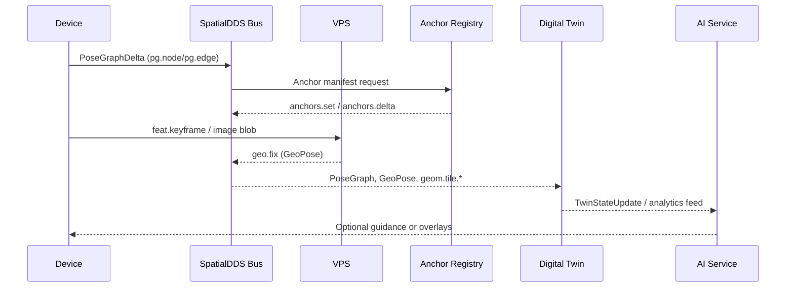

## **SpatialDDS: A Protocol for Real-World Spatial Computing**

*An open invitation to build a shared bus for spatial data, AI world models, and digital twins.*

**Version**: 1.5 (Draft)

**Date**: TBD

**Author**: James Jackson [Open AR Cloud] – james.jackson [at] openarcloud [dot] org

## Contents

### Part I – Overview
*Get oriented with the motivation, core building blocks, practical scenarios, and forward-looking roadmap before diving into the normative material.*

1. [Introduction](sections/v1.5/01-introduction.md)
2. [Conventions (Normative)](sections/v1.5/02-conventions.md)
3. [IDL Profiles](sections/v1.5/02-idl-profiles.md)
   3.3.1 [Topic Naming (Normative)](sections/v1.5/02-idl-profiles.md#331-topic-naming-normative)
   3.3.4 [Coverage Model (Normative)](sections/v1.5/02-idl-profiles.md#334-coverage-model-normative)
4. [Operational Scenarios](sections/v1.5/04-operational-scenarios.md)
5. [Conclusion](sections/v1.5/conclusion.md)
6. [Future Directions](sections/v1.5/future-directions.md)

### Part II – Reference
*Specifications, identifiers, supporting glossaries, and appendices that implementers can consult while building SpatialDDS solutions.*

7. [SpatialDDS URIs](sections/v1.5/02a-spatialdds-uris.md)
8. [Example Manifests](sections/v1.5/03-example-manifests.md)
9. [Glossary of Acronyms](sections/v1.5/glossary.md)
10. [References](sections/v1.5/references.md)
11. Appendices
    - [Appendix A: Core Profile](sections/v1.5/appendix-a.md)
    - [Appendix B: Discovery Profile](sections/v1.5/appendix-b.md)
    - [Appendix C: Anchor Registry Profile](sections/v1.5/appendix-c.md)
    - [Appendix D: Extension Profiles](sections/v1.5/appendix-d.md)
    - [Appendix E: Provisional Extension Examples](sections/v1.5/appendix-e.md)
    - [Appendix F: SpatialDDS URI Scheme (ABNF)](sections/v1.5/appendix-f.md)
    - [Appendix F.X: Discovery Query Expression (ABNF)](sections/v1.5/appendix-fx-discovery-query-expression.md)
    - [Appendix G: Frame Identifiers (Normative)](sections/v1.5/appendix-g-frame-identifiers.md)
    - [Appendix H: Operational Scenarios & AI World Model Ladder (Informative)](sections/v1.5/appendix-h-operational-scenarios.md)
    - [Appendix I: Dataset Conformance Testing (Informative)](sections/v1.5/appendix-i.md)
    - [Appendix J: Comparison with ROS 2 (Informative)](sections/v1.5/appendix-j.md)

## **1\. Introduction**

SpatialDDS is a lightweight, standards-based protocol, built on OMG DDS, for real-time exchange of spatial world models. It is designed as a shared data bus that allows devices, services, and AI agents to publish and subscribe to structured representations of the physical world — from pose graphs and 3D geometry to anchors, semantic detections, and service discovery. By providing a common substrate, SpatialDDS enables applications in robotics, AR/XR, digital twins, and smart cities to interoperate while also supporting new AI-driven use cases such as perception services, neural maps, and planning agents.

At its core, SpatialDDS is defined through IDL profiles that partition functionality into clean modules:

* **Core**: pose graphs, geometry tiles, anchors, transforms, and blobs.  
* **Discovery**: lightweight announce messages and manifests for services, coverage, anchors, and content.
* **Anchors**: durable anchors and registry updates for persistent world-locked reference points.  
* **Extensions**: optional domain-specific profiles including the shared Sensing Common base types plus VIO sensors, vision streams, SLAM frontend features, semantic detections, radar detections/tensors, lidar streams, and AR+Geo.

This profile-based design keeps the protocol lean and interoperable, while letting communities adopt only the pieces they need.

### **1.1 Conceptual Overview (Informative)**

This section explains the core ideas behind SpatialDDS without reference to specific IDL types or field names. Readers who understand these six concepts can navigate the rest of the specification efficiently. Everything below is informative — normative rules appear in §2 onward.

#### The Bus

SpatialDDS is a shared data bus. Devices, services, and AI agents publish and subscribe to typed messages describing the physical world — poses, geometry, anchors, detections, sensor streams. The bus is peer-to-peer (no central broker) and built on OMG DDS, which provides automatic discovery, schema enforcement, and fine-grained quality-of-service control. If you've used ROS 2 topics or MQTT with schemas, the publish/subscribe model is familiar. The difference is that SpatialDDS defines what the messages mean spatially, not just how they're delivered.

#### Profiles

SpatialDDS is modular. Functionality is organized into profiles — self-contained groups of message types that can be adopted independently:

* **Core** defines the universal building blocks: pose graphs, 3D geometry tiles, blob transport, and geo-anchoring primitives.
* **Discovery** lets participants find each other, advertise what they publish, and negotiate compatible versions.
* **Anchors** adds durable, world-locked reference points that persist across sessions.
* **Extensions** add domain-specific capabilities. A shared Sensing Common base provides frame metadata, calibration, ROI negotiation, and codec descriptors. Radar, lidar, and vision profiles build on that base. Additional extensions cover VIO, SLAM frontends, semantics, and AR+Geo alignment.

An implementation includes only the profiles it needs. An AR headset might use Core + Discovery + Anchors. A radar truck adds the radar extension. A digital twin backend subscribes to everything. Profile negotiation happens automatically — participants advertise what they support and the system converges on compatible versions.

#### Frames and Anchors

Every spatial message exists in a reference frame — a coordinate system identified by a UUID and a human-readable fully qualified name. Frames form a directed acyclic graph: a device has a body frame, sensors have frames relative to the body, and the body frame is related to a map frame by a transform. Anchors are special frames that are durable and globally positioned — a surveyed point on a building corner, a VPS-derived fix at a street intersection. They bridge the gap between local device coordinates and the real world, allowing multiple devices to share a common spatial context.

#### Discovery: Two Layers

Finding things happens in two stages:

1. Network bootstrap answers "where is the DDS domain?" A device arriving at a venue, connecting to a network, or scanning a QR code obtains a small bootstrap manifest containing a domain ID and initial peer addresses. Mechanisms include DNS-SD, a well-known HTTPS path, QR codes, and BLE beacons. (See §3.3.0 for the full bootstrap specification.)
2. On-bus discovery answers "what's available on this domain?" Once connected, the device subscribes to well-known discovery topics and receives announcements from services and content providers, each describing their capabilities, spatial coverage, and available data streams. The device filters for what it needs and subscribes.

#### URIs and Manifests

Every significant resource — an anchor, a service, a content bundle, a tileset — has a stable SpatialDDS URI (e.g., `spatialdds://museum.example.org/hall1/anchor/main-entrance`). URIs are lightweight handles passed around in discovery messages, QR codes, and application logic. When a client needs the full details, it resolves the URI to a manifest — a small JSON document describing the resource's capabilities, spatial coverage, and assets. Resolution follows a defined chain: check cache, try an advertised resolver, fall back to HTTPS. (See §7 for URI syntax and resolution rules; §8 for manifest structure.)

#### The Wire Stays Light

SpatialDDS messages are small and typed. Heavy content — meshes, point clouds, video frames, neural network weights — is never inlined in messages. Instead, messages carry blob references (IDs + checksums), and the actual bytes are transferred as blob chunks or fetched out-of-band via asset URIs. This keeps the bus fast and predictable even when the data behind it is large.

#### Navigating This Document

The specification is organized in two parts, as shown in the table of contents:

* **Part I (§1–§6)** provides motivation, conventions, profile descriptions, operational scenarios, and forward-looking discussion.
* **Part II (§7–Appendices)** contains the reference material: URI scheme and resolution, manifest examples, glossary, and the authoritative IDL appendices (A through E).

Most of Part I is informative context. Three sections within it contain normative rules and are labeled accordingly in their headings:

* **§2 Conventions (Normative)** — global rules for optional fields, numeric validity, quaternion order, ordering, IDL structure, and security.
* **§3.3.1 Topic Naming (Normative)** — how topic names are structured and what fields are required.
* **§3.3.4 Coverage Model (Normative)** — how spatial coverage is declared and evaluated.

In the appendices, IDL definitions (Appendices A–D) are always normative. Appendix E contains provisional extension examples and is explicitly informative. Appendix F defines the URI ABNF (normative). Appendix F.X (query expression grammar) is informative. Appendix G (frame identifiers) is an informative reference. Appendix H (operational scenarios) is informative.

When in doubt about whether something is normative: if it uses RFC 2119 keywords (MUST, SHALL, SHOULD, MAY), it's normative regardless of where it appears.

For role-specific guidance on which sections to read first, see the Reading Guide below.

### **Reading Guide (Informative)**

- **Architects & product planners** — Start with §1 and §2 to internalize the motivation, shared conventions, and global rules before drilling into profiles.
- **Implementers & SDK authors** — Focus on Part II plus Appendix A (core IDLs), Appendix B (discovery), Appendix C (anchors), and Appendix D (extensions).
- **Routing, filtering, and coverage developers** — Read §3.3 (Discovery), §3.3.4 (Coverage Model), and Appendix B/F.X for the binding grammars.

### **Why DDS?**

SpatialDDS builds directly on the OMG Data Distribution Service (DDS), a proven standard for real-time distributed systems. DDS provides:

* **Peer-to-peer publish/subscribe** with automatic discovery, avoiding centralized brokers.  
* **Typed data** with schema enforcement, versioning, and language bindings.  
* **Fine-grained QoS** for reliability, liveliness, durability, and latency control.  
* **Scalability** across edge devices, vehicles, and cloud backends.

This foundation ensures that SpatialDDS is not just a message format, but a full-fledged, high-performance middleware for spatial computing.

### **Benefits across domains**

* **Robotics & Autonomous Vehicles**: Share pose graphs, maps, and detections across robots, fleets, and control centers.  
* **Augmented & Mixed Reality**: Fuse VPS results and anchors into persistent, shared spatial contexts; stream geometry and semantics to clients.  
* **Digital Twins & Smart Cities**: Ingest real-time streams of geometry, anchors, and semantics into twin backends, and republish predictive overlays.  
* **IoT & Edge AI**: Integrate lightweight perception services, sensors, and planners that consume and enrich the shared world model.  
* **AI World Models & Agents**: Provide foundation models and AI agents with a structured, typed view of the physical world for perception, reasoning, and planning.

### **Design Principles**

* **Keep the wire light**
  SpatialDDS defines compact, typed messages via IDL. Heavy or variable content (meshes, splats, masks, assets) is carried as blobs, referenced by stable IDs. This avoids bloating the bus while keeping payloads flexible.
* **Profiles, not monoliths**
  SpatialDDS is organized into modular profiles. Core, Discovery, and Anchors form the foundation; Extension Profiles add domain-specific capabilities. Implementations include only what they need while maintaining interoperability.
* **AI-ready, domain-neutral**
  While motivated by SLAM, AR, robotics, and digital twins, the schema is deliberately generic. Agents, foundation models, and AI services can publish and subscribe alongside devices without special treatment.
* **Anchors as first-class citizens**
  Anchors provide durable, shared reference points that bridge positioning, mapping, and content attachment. The Anchor Registry makes them discoverable and persistent across sessions.
* **Discovery without heaviness**
  Lightweight announce messages plus JSON manifests allow services (like VPS, mapping, or anchor registries) and content/experiences to be discovered at runtime without centralized registries.
* **Interoperability with existing standards**
  SpatialDDS is designed to align with and complement related standards such as OGC GeoPose, CityGML/3D Tiles, and Khronos OpenXR. This ensures it can plug into existing ecosystems rather than reinvent them.

### **Specification Layers (Informative)**

| Layer | Purpose | Core Artifacts |
|-------|---------|----------------|
| **Core Transport** | Pub/Sub framing, QoS, reliability | `core`, `discovery` IDLs |
| **Spatial Semantics** | Anchors, poses, transforms, manifests | `anchors`, `geo`, `manifests` |
| **Sensing Extensions** | Radar, LiDAR, Vision modules | `sensing.*` profiles |

### **Architecture Overview & Data Flow**

Before diving into identifiers and manifests, it helps to see how SpatialDDS components interlock when a client joins the bus. The typical flow looks like:

### High-level layering

SpatialDDS follows the same four-layer model shown in the architecture diagrams:

```
Applications
    ↓ use
SpatialDDS Profiles
    ↓ define
DDS Topics (typed + QoS)
    ↓ are described by
Discovery & Manifests
    ↓ reference
spatial:// URIs
```

- Applications (AR, robotics, digital twins, telco sensing, AI runtimes) use
  SpatialDDS profiles instead of raw DDS topics.
- Profiles define the shared types, semantics, and QoS groupings.
- DDS topics carry typed streams with well-known QoS names.
- Discovery and manifests describe the available streams and their spatial
  coverage.
- URIs provide stable identifiers for anchors, maps, content, and services.

This textual view matches the layered diagrams used in the presentation.

```
SpatialDDS URI ──▶ Manifest Resolver ──▶ Discovery Topic ──▶ DDS/Data Streams ──▶ Shared State & Anchors
        │                 │                      │                   │                      │
   (§7)             (§8)                (§3.3)                   (§3)                   (§5 & Appendix C)
```

1. **URI → Manifest lookup** – Durable SpatialDDS URIs point to JSON manifests that describe services, anchor sets, or content. Clients resolve the URI via HTTPS/TLS or a validated local cache per the SpatialURI Resolution rules (§7.5.5) to fetch capabilities, QoS hints, and connection parameters.
2. **Discovery → selecting a service** – Guided by the manifest and Discovery profile messages, participants determine which SpatialDDS services are available in their vicinity, their coverage areas, and how to engage them.
3. **Transport → messages on stream or DDS** – With a target service selected, the client joins the appropriate DDS domain/partition or auxiliary transport identified in the manifest and begins exchanging typed IDL messages for pose graphs, geometry, or perception streams.
4. **State updates / anchor resolution** – As data flows, participants publish and subscribe to state changes. Anchor registries and anchor delta messages keep spatial references aligned so downstream applications can resolve world-locked content with shared context.

This loop repeats as participants encounter new SpatialDDS URIs—keeping discovery, transport, and shared state synchronized.

### **SpatialDDS URIs**

SpatialDDS URIs give every anchor, service, and content bundle a stable handle that can be shared across devices and transports while still resolving to rich manifest metadata. They are the glue between lightweight on-bus messages and descriptive out-of-band manifests, ensuring that discovery pointers stay durable even as infrastructure moves. Section 6 (SpatialDDS URIs) defines the precise syntax, allowed types, and resolver requirements for these identifiers.

// SPDX-License-Identifier: MIT
// SpatialDDS Specification 1.5 (© Open AR Cloud Initiative)

## **2. Conventions (Normative)**

This section centralizes the rules that apply across every SpatialDDS profile. Individual sections reference these shared requirements instead of repeating them. See Appendix A (core), Appendix B (discovery), Appendix C (anchors), and Appendix D (extensions) for the canonical IDL definitions that implement these conventions.

### **2.1 Orientation & Frame References**

- All quaternion fields, manifests, and IDLs SHALL use the `(x, y, z, w)` order that aligns with OGC GeoPose.
- Frames are represented exclusively with `FrameRef { uuid, fqn }`. The UUID is authoritative; the fully qualified name is a human-readable alias. Appendix G defines the authoritative frame model.
- Example JSON shape:
  ```json
  "frame_ref": { "uuid": "00000000-0000-4000-8000-000000000000", "fqn": "earth-fixed/map/device" }
  ```

**Quaternion Convention Reference (Informative)**

SpatialDDS uses `(x, y, z, w)` component order for all quaternion fields, aligning with OGC GeoPose. Adjacent ecosystems use different conventions; implementers ingesting external data MUST reorder components before publishing to the bus.

| Source | Order | Conversion to SpatialDDS |
|---|---|---|
| OGC GeoPose | (x, y, z, w) | None |
| ROS 2 (`geometry_msgs/Quaternion`) | (x, y, z, w) | None |
| nuScenes / pyquaternion | (w, x, y, z) | `(q[1], q[2], q[3], q[0])` |
| Eigen (default) | (w, x, y, z) | `(q.x(), q.y(), q.z(), q.w())` |
| Unity | (x, y, z, w) | None (left-handed) |
| Unreal Engine | (x, y, z, w) | None (left-handed) |
| OpenXR | (x, y, z, w) | None |
| glTF | (x, y, z, w) | None |

**Handedness note (Informative):** SpatialDDS does not prescribe handedness. Frame semantics are defined by `FrameRef` and transform chains, not by a global axis convention. Producers from left-handed engines (Unity, Unreal) must ensure the transform chain is consistent, not merely that the quaternion component order matches.

### **2.2 Optional Fields & Discriminated Unions**

- Optional scalars, structs, and arrays MUST be guarded by an explicit `has_*` boolean immediately preceding the field.
- Mutually exclusive payloads SHALL be modeled as discriminated unions; do not overload presence flags to signal exclusivity.
- Schema evolution leverages `@extensibility(APPENDABLE)`; omit fields only when the IDL version removes them, never as an on-wire sentinel.
- See `CovMatrix` in Appendix A for the reference discriminated union pattern used for covariance.

### **2.3 Numeric Validity & NaN Deprecation**

- `NaN`, `Inf`, or other sentinels SHALL NOT signal absence or "unbounded" values; explicit presence flags govern validity.
- Fields guarded by `has_*` flags are meaningful only when the flag is `true`. When the flag is `false`, consumers MUST ignore the payload regardless of its contents.
- When a `has_*` flag is `true`, non-finite numbers MUST be rejected wherever geographic coordinates, quaternions, coverage bounds, or similar numeric payloads appear.
- Producers SHOULD avoid emitting non-finite numbers; consumers MAY treat such samples as malformed and drop them.

### **2.4 Conventions Quick Table (Informative)**

| Pattern | Rule |
|--------|------|
| Optional fields | All optional values use a `has_*` flag. |
| NaN/Inf | Never valid; treated as malformed input. |
| Quaternion order | Always `(x, y, z, w)` GeoPose order. |
| Frames | `FrameRef.uuid` is authoritative. |
| Ordering | `(source_id, seq)` is canonical. |

### **2.5 Canonical Ordering & Identity**

These rules apply to any message that carries the trio `{ stamp, source_id, seq }`.

**Field semantics**

- `stamp` — Event time chosen by the producer.
- `source_id` — Stable writer identity within a deployment.
- `seq` — Per-`source_id` strictly monotonic unsigned 64-bit counter.

**Identity & idempotency**

- The canonical identity of a sample is the tuple (`source_id`, `seq`).
- Consumers MUST treat duplicate tuples as the same logical sample.
- If `seq` wraps or resets, the producer MUST change `source_id` (or use a profile with an explicit writer epoch).

**Ordering rules**

1. **Intra-source** — Order solely by `seq`. Missing values under RELIABLE QoS indicate loss.
2. **Inter-source merge** — Order by (`stamp`, `source_id`, `seq`) within a bounded window selected by the consumer.

**Synthesizing (`source_id`, `seq`) from External Data (Informative)**  
Datasets and replay tools that lack native per-writer sequence counters SHOULD synthesize them as follows:
1. Set `source_id` to a stable identifier for the data source (e.g., dataset name + sensor channel).
2. Assign `seq` by sorting samples by timestamp within each `source_id` and numbering from 0.
3. If the dataset contains gaps or non-monotonic timestamps, sort by the dataset's native ordering key and number from 0.

This produces a valid (`source_id`, `seq`) tuple without requiring the original system to have had one.

### **2.6 DDS / IDL Structure**

- All SpatialDDS modules conform to OMG IDL 4.2 and DDS-XTypes 1.3.
- Extensibility SHALL be declared via `@extensibility(APPENDABLE)`.
- Consumers MUST ignore unknown appended fields in APPENDABLE types.
- Compound identity SHALL be declared with multiple `@key` annotations.
- Field initialization remains a runtime concern and SHALL NOT be encoded in IDL.
- Abridged snippets within the main body are informative; the appendices contain the authoritative IDLs listed above.

### **2.7 Security Model (Normative)**

#### **2.7.1 Threat model (informative background)**
SpatialDDS deployments may involve untrusted or partially trusted networks and intermediaries. Threats include:
- **Spoofing:** malicious participants advertising fake services or content.
- **Tampering:** modification of messages, manifests, or blob payloads in transit.
- **Replay:** re-sending previously valid messages (e.g., ANNOUNCE, responses) outside their intended validity window.
- **Unauthorized access:** clients subscribing to sensitive streams or publishing unauthorized updates.
- **Privacy leakage:** exposure of user location, sensor frames, or inferred trajectories.

#### **2.7.2 Trust boundaries**
SpatialDDS distinguishes among:
- **Local transport fabric** (e.g., DDS domain): participants may be on a shared L2/L3 network, but not necessarily trusted.
- **Resolution channels** (e.g., HTTPS retrieval or local cache): used to fetch manifests and referenced resources.
- **Device/app policy:** the client’s local trust store and decision logic.

#### **2.7.3 Normative requirements**
1. **Service authenticity.** A client **MUST** authenticate the authority of a `spatialdds://` URI (or the service/entity that advertises it) before trusting any security-sensitive content derived from it (e.g., localization results, transforms, anchors, content attachments).
2. **Integrity.** When security is enabled by deployment policy or indicated via `auth_hint`, clients **MUST** reject data that fails integrity verification.
3. **Authorization.** When security is enabled, services **MUST** enforce authorization for publish/subscribe operations that expose or modify sensitive spatial state (e.g., anchors, transforms, localization results, raw sensor frames).
4. **Confidentiality.** Services **SHOULD** protect confidentiality for user-associated location/sensor payloads when transmitted beyond a physically trusted local network.
5. **Discovery trust.** Clients **MUST NOT** treat Discovery/ANNOUNCE messages as sufficient proof of service authenticity on their own. ANNOUNCE may be used for bootstrapping **only** when accompanied by one of: (a) transport-level security that authenticates the publisher (e.g., DDS Security), or (b) authenticated retrieval and verification of an authority-controlled artifact (e.g., a manifest fetched over HTTPS/TLS, or a signed manifest) that binds the service identity to the advertised topics/URIs.

#### **2.7.4 Validity and replay considerations**
Implementations **SHOULD** enforce TTL and timestamps to mitigate replay. Where TTL exists (e.g., in Discovery messages), recipients **SHOULD** discard messages outside the declared validity interval.

#### **2.7.5 DDS Security Binding (Normative)**
SpatialDDS deployments that require authentication, authorization, integrity, or confidentiality over DDS **MUST** use **OMG DDS Security**.

**Minimum conformance profile:**
- **Authentication:** PKI-based authentication as defined by DDS Security.
- **Access control:** governance and permissions documents configured per DDS Security.
- **Cryptographic protection:** when confidentiality or integrity is required by policy, endpoints **MUST** enable DDS Security cryptographic plugins to provide message protection.

**Operational mapping (non-exhaustive):**
- Participants join a DDS **Domain**; security configuration applies to DomainParticipants and topics as governed by DDS Security governance rules.
- Discovery/ANNOUNCE messages that convey service identifiers, manifest URIs, or access hints **SHOULD** be protected when operating on untrusted networks.

**Interoperability note (informative):**
This specification does not redefine DDS Security. Implementations should use vendor-compatible DDS Security configuration mechanisms.

// SPDX-License-Identifier: MIT
// SpatialDDS Specification 1.5 (© Open AR Cloud Initiative)

## **3\. IDL Profiles**

The SpatialDDS IDL bundle defines the schemas used to exchange real-world spatial data over DDS. It is organized into complementary profiles: **Core**, which provides the backbone for pose graphs, geometry, and geo-anchoring; **Discovery**, which enables lightweight announcements of services, coverage, anchors, and content; and **Anchors**, which adds support for publishing and updating sets of durable world-locked anchors. Together, these profiles give devices, services, and applications a common language for building, sharing, and aligning live world models—while staying codec-agnostic, forward-compatible, and simple enough to extend for domains such as robotics, AR/XR, IoT, and smart cities.

_See §2 Conventions for global normative rules._

### **3.1 IDL Profile Versioning & Negotiation (Normative)**

SpatialDDS uses semantic versioning tokens of the form `name@MAJOR.MINOR`.

* **MAJOR** increments for breaking schema or wire changes.
* **MINOR** increments for additive, compatible changes.

Identifier conventions: Profile tokens use `name@MAJOR.MINOR` (e.g., `core@1.5`). Module identifiers use `spatial.<profile>/MAJOR.MINOR` (e.g., `spatial.core/1.5`). These are canonically related: `core@1.5 ⇔ spatial.core/1.5`.

Participants advertise supported ranges via `caps.supported_profiles` (discovery) and manifest capabilities blocks. Consumers select the **highest compatible minor** within any shared major. Backward-compatibility clauses from 1.3 are retired; implementations only negotiate within their common majors. SpatialDDS 1.5 uses a single canonical quaternion order `(x, y, z, w)` across manifests, discovery payloads, and IDL messages.

### **3.2 Core SpatialDDS**

The Core profile defines the essential building blocks for representing and sharing a live world model over DDS. It focuses on a small, stable set of concepts: pose graphs, 3D geometry tiles, blob transport for large payloads, and geo-anchoring primitives such as anchors, transforms, and simple GeoPoses. The design is deliberately lightweight and codec-agnostic: tiles reference payloads but do not dictate mesh formats, and anchors define stable points without tying clients to a specific localization method. All quaternion fields follow the OGC GeoPose component order `(x, y, z, w)` so orientation data can flow between GeoPose-aware systems without reordering. By centering on graph \+ geometry \+ anchoring, the Core profile provides a neutral foundation that can support diverse pipelines across robotics, AR, IoT, and smart city contexts.

**GNSS diagnostics (Normative):** `NavSatStatus` is a companion to `GeoPose` that carries GNSS receiver diagnostics (fix type, DOP, satellite count, ground velocity) on a parallel topic. It is published alongside GNSS-derived GeoPoses and MUST NOT be used to annotate non-GNSS localization outputs.

**NavSatStatus Topic (Normative):** NavSatStatus SHOULD be published on the topic `spatialdds/geo/<gnss_id>/navsat_status/v1`, where `<gnss_id>` matches the `@key gnss_id` in the struct and identifies the GNSS receiver. NavSatStatus SHOULD use the same QoS profile as the associated GeoPose stream. Producers publishing GNSS-derived GeoPoses SHOULD co-publish NavSatStatus at the same cadence. NavSatStatus is not a registered discovery type and does not require a `TopicMeta` entry in `Announce.topics[]`.

#### **Blob Reassembly (Normative)**

Blob payloads are transported as `BlobChunk` sequences. Consumers MUST be prepared for partial delivery and SHOULD apply a per-blob timeout window based on expected rate and `total_chunks`.

- **Timeout guidance:** Consumers SHOULD apply a per-blob timeout of at least `2 × (total_chunks / expected_rate)` seconds when an expected rate is known.
- **Failure handling:** If all chunks have not arrived within this window under **RELIABLE** QoS, the consumer SHOULD discard the partial blob and MAY re-request it via `SnapshotRequest`.
- **BEST_EFFORT behavior:** Under **BEST_EFFORT** QoS, consumers MUST NOT assume complete delivery and SHOULD treat blobs as opportunistic.
- **Memory pressure:** Consumers MAY discard partial blobs early under memory pressure, but MUST NOT treat them as valid payloads.

#### Frame Identifiers (Reference)

SpatialDDS uses structured frame references via the `FrameRef { uuid, fqn }` type.
See *Appendix G Frame Identifiers (Informative Reference)* for the complete definition and naming rules.

Each Transform expresses a pose that maps coordinates from the `from` frame into the `to` frame (parent → child).

### **3.3 Discovery**

Discovery is how SpatialDDS peers **find each other**, **advertise what they publish**, and **select compatible streams**. Think of it as a built-in directory that rides the same bus: nodes announce, others filter and subscribe.

#### How it works (at a glance)
1. **Announce** — each node periodically publishes an announcement with capabilities and topics.
2. **Query** — clients publish simple filters (by profile version, type, QoS) to narrow results.
3. **Select** — clients subscribe to chosen topics; negotiation picks the highest compatible minor per profile.

#### **3.3.0 Discovery Layers & Bootstrap (Normative)**

SpatialDDS distinguishes two discovery layers:

- **Layer 1 — Network Bootstrap:** how a device discovers that a SpatialDDS DDS domain exists and obtains connection parameters. This is transport and access-network dependent.
- **Layer 2 — On-Bus Discovery:** how a device, once connected to a DDS domain, discovers services, coverage, and streams. This is what the Discovery profile defines.

Layer 1 mechanisms deliver a **Bootstrap Manifest** that provides the parameters needed to transition to Layer 2.

##### **Bootstrap Manifest (Normative)**

A bootstrap manifest is a small JSON document resolved by Layer 1 mechanisms:

```json
{
  "spatialdds_bootstrap": "1.5",
  "domain_id": 42,
  "initial_peers": [
    "udpv4://192.168.1.100:7400",
    "udpv4://10.0.0.50:7400"
  ],
  "partitions": ["venue/museum-west"],
  "discovery_topic": "spatialdds/discovery/announce/v1",
  "manifest_uri": "spatialdds://museum.example.org/west/service/discovery",
  "auth": {
    "method": "none"
  }
}
```

**Field definitions**

| Field | Required | Description |
|---|---|---|
| `spatialdds_bootstrap` | REQUIRED | Bootstrap schema version (e.g., "1.5") |
| `domain_id` | REQUIRED | DDS domain ID to join |
| `initial_peers` | REQUIRED | One or more DDS peer locators for initial discovery |
| `partitions` | OPTIONAL | DDS partition(s) to join. Empty or absent means default partition. |
| `discovery_topic` | OPTIONAL | Override for the well-known announce topic. Defaults to `spatialdds/discovery/announce/v1`. |
| `manifest_uri` | OPTIONAL | A `spatialdds://` URI for the deployment's root manifest. |
| `auth` | OPTIONAL | Authentication hint. `method` is one of `"none"`, `"dds-security"`, `"token"`. |

**Normative rules**

- `domain_id` MUST be a valid DDS domain ID (0–232 per the RTPS specification; higher values may require non-standard configuration).
- `initial_peers` MUST contain at least one locator. Locator format follows the DDS implementation's peer descriptor syntax.
- Consumers SHOULD attempt all listed peers and use the first that responds.
- The bootstrap manifest is a discovery aid, not a security boundary. Deployments requiring authentication MUST use DDS Security or an equivalent transport-level mechanism.

##### **Well-Known HTTPS Path (Normative)**

Clients MAY fetch the bootstrap manifest from:

```
https://{authority}/.well-known/spatialdds
```

The response MUST be `application/json` using the bootstrap manifest schema. Servers SHOULD set `Cache-Control` headers appropriate to their deployment (e.g., `max-age=300`).

**Note:** The bootstrap path `/.well-known/spatialdds` and the resolver metadata path `/.well-known/spatialdds-resolver` serve distinct functions and MAY coexist on the same authority. The bootstrap path returns a Bootstrap Manifest (this section), while the resolver path returns resolver metadata for URI resolution (§7.5.2).

##### **DNS-SD Binding (Normative)**

DNS-SD is the recommended first binding for local bootstrap.

**Service type:** `_spatialdds._udp`

**TXT record keys**

| Key | Maps to | Example |
|---|---|---|
| `ver` | `spatialdds_bootstrap` | `1.5` |
| `did` | `domain_id` | `42` |
| `part` | `partitions` (comma-separated) | `venue/museum-west` |
| `muri` | `manifest_uri` | `spatialdds://museum.example.org/west/service/discovery` |

**Resolution flow**

1. Device queries for `_spatialdds._udp.local` (mDNS) or `_spatialdds._udp.<domain>` (wide-area DNS-SD).
2. SRV record provides host and port for the initial DDS peer.
3. TXT record provides domain ID, partitions, and optional manifest URI.
4. Device constructs a bootstrap manifest from the SRV + TXT data and joins the DDS domain.
5. On-bus Discovery (Layer 2) takes over.

**Normative rules**

- `did` is REQUIRED in the TXT record.
- The SRV target and port MUST resolve to a reachable DDS peer locator.
- If `muri` is present, clients SHOULD resolve it after joining the domain to obtain full deployment metadata.

##### **Other Bootstrap Mechanisms (Informative)**

- **DHCP:** vendor-specific option carrying a URL to the bootstrap manifest.
- **QR / NFC / BLE beacons:** encode a `spatialdds://` URI or direct URL to the bootstrap manifest.
- **Mobile / MEC:** edge discovery APIs provide a URL to the bootstrap manifest.

##### **Complete Bootstrap Chain (Informative)**

```
Access Network           Bootstrap              DDS Domain            On-Bus Discovery
     │                      │                       │                       │
     │  WiFi/5G/BLE/QR      │                       │                       │
     ├─────────────────────► │                       │                       │
     │                       │  DNS-SD / HTTPS /     │                       │
     │                       │  .well-known lookup   │                       │
     │                       ├─────────────────────► │                       │
     │                       │  Bootstrap Manifest   │                       │
     │                       │  (domain_id, peers,   │                       │
     │                       │   partitions)         │                       │
     │                       │ ◄─────────────────────┤                       │
     │                       │                       │  Join DDS domain      │
     │                       │                       ├─────────────────────► │
     │                       │                       │  Subscribe to         │
     │                       │                       │  .../announce/v1      │
     │                       │                       │  Receive Announce     │
     │                       │                       │  messages             │
     │                       │                       │  Issue CoverageQuery  │
     │                       │                       │  Select streams       │
     │                       │                       │  Begin operation      │
```


#### Key messages (abridged IDL)
*(Abridged IDL — see Appendix B for full definitions.)*
```idl
// ABRIDGED — see Appendix B for normative definitions
// Message shapes shown for orientation only
@extensibility(APPENDABLE) struct ProfileSupport { string name; uint32 major; uint32 min_minor; uint32 max_minor; boolean preferred; }
@extensibility(APPENDABLE) struct Capabilities   { sequence<ProfileSupport,64> supported_profiles; sequence<string,32> preferred_profiles; sequence<FeatureFlag,64> features; }
@extensibility(APPENDABLE) struct TopicMeta      { string name; string type; string version; string qos_profile; float32 target_rate_hz; uint32 max_chunk_bytes; }

@extensibility(APPENDABLE) struct Announce {
  // ... node identity, endpoints ...
  Capabilities caps;                  // profiles, preferences, features
  sequence<TopicMeta,128> topics;     // typed topics offered by this node
}

@extensibility(APPENDABLE) struct CoverageFilter {
  sequence<string,16> type_in;
  sequence<string,16> qos_profile_in;
  sequence<string,16> module_id_in;
}

@extensibility(APPENDABLE) struct CoverageQuery {
  // minimal illustrative fields
  boolean has_filter;
  CoverageFilter filter; // preferred in 1.5
  string expr;           // deprecated in 1.5; Appendix F.X grammar
  string reply_topic;    // topic to receive results
  string query_id;       // correlate request/response
}

The expression syntax is retained for legacy deployments and defined in Appendix F.X; `expr` is deprecated in 1.5 in favor of `filter`.

@extensibility(APPENDABLE) struct CoverageResponse {
  string query_id;
  sequence<Announce,256> results;
  string next_page_token;
}
```

#### Minimal examples (JSON)
**Announce (capabilities + topics)**
```json
{
  "caps": {
    "supported_profiles": [
      { "name": "core",           "major": 1, "min_minor": 0, "max_minor": 3 },
      { "name": "discovery",      "major": 1, "min_minor": 1, "max_minor": 2 }
    ],
    "preferred_profiles": ["discovery@1.2"],
    "features": ["blob.crc32"]
  },
  "topics": [
    { "name": "spatialdds/perception/cam_front/video_frame/v1", "type": "video_frame", "version": "v1", "qos_profile": "VIDEO_LIVE" },
    { "name": "spatialdds/perception/radar_1/radar_detection/v1",  "type": "radar_detection", "version": "v1", "qos_profile": "RADAR_RT"   },
    { "name": "spatialdds/perception/radar_1/radar_tensor/v1",     "type": "radar_tensor", "version": "v1", "qos_profile": "RADAR_RT"      }
  ]
}
```

**Query + Response**
```json
{
  "query_id": "q1",
  "has_filter": true,
  "filter": {
    "type_in": ["radar_detection", "radar_tensor"],
    "qos_profile_in": [],
    "module_id_in": ["spatial.discovery/1.4", "spatial.discovery/1.5"]
  },
  "expr": "",
  "reply_topic": "spatialdds/discovery/response/q1",
  "stamp": { "sec": 1714070400, "nanosec": 0 },
  "ttl_sec": 30
}
```
```json
{ "query_id": "q1", "results": [ { "caps": { "supported_profiles": [ { "name": "discovery", "major": 1, "min_minor": 1, "max_minor": 2 } ] }, "topics": [ { "name": "spatialdds/perception/radar_1/radar_detection/v1", "type": "radar_detection", "version": "v1", "qos_profile": "RADAR_RT" }, { "name": "spatialdds/perception/radar_1/radar_tensor/v1", "type": "radar_tensor", "version": "v1", "qos_profile": "RADAR_RT" } ] } ], "next_page_token": "" }
```

#### Norms & filters
* Announces **MUST** include `caps.supported_profiles`; peers choose the highest compatible minor within a shared major.
* Each advertised topic **MUST** declare `name`, `type`, `version`, and `qos_profile` per Topic Identity (§3.3.1); optional throughput hints (`target_rate_hz`, `max_chunk_bytes`) are additive.
* Discovery topics SHALL restrict `type` to {`geometry_tile`, `video_frame`, `radar_detection`, `radar_tensor`, `seg_mask`, `desc_array`, `rf_beam`}, `version` to `v1`, and `qos_profile` to {`GEOM_TILE`, `VIDEO_LIVE`, `RADAR_RT`, `SEG_MASK_RT`, `DESC_BATCH`, `RF_BEAM_RT`}.
* `caps.preferred_profiles` is an optional tie-breaker **within the same major**.
* `caps.features` carries namespaced feature flags; unknown flags **MUST** be ignored.
* `FeatureFlag` is a struct (not a raw string) to allow future appended fields (e.g., version or parameters) without breaking wire compatibility.
* `CoverageQuery.filter` provides structured matching for `type`, `qos_profile`, and `module_id`.
* Empty sequences in `CoverageFilter` mean “match all” for that field.
* When multiple filter fields are populated, they are ANDed; a result MUST match at least one value in every non-empty sequence.
* Version range matching stays in profile negotiation (`supported_profiles` with `min_minor`/`max_minor`), not in coverage queries.
* `CoverageQuery.expr` is deprecated in 1.5. If `has_filter` is true, responders MUST ignore `expr`.
* Responders page large result sets via `next_page_token`; every response **MUST** echo the caller’s `query_id`.

#### **Pagination Contract (Normative)**

1. **Opacity.** Page tokens are opaque strings produced by the responder. Consumers MUST NOT parse, construct, or modify them.
2. **Consistency.** Results are best-effort. Pages may include duplicates or miss nodes that arrived/departed between pages. Consumers SHOULD deduplicate by `service_id`.
3. **Expiry.** Responders SHOULD honor page tokens for at least `ttl_sec` seconds from the originating query’s `stamp`. After expiry, responders MAY return an empty result set rather than an error.
4. **Termination.** An empty string in `next_page_token` means no further pages remain.
5. **Page size.** Responders choose page size. Consumers MUST accept any non-zero page size.

#### **Announce Lifecycle (Normative)**

- **Departure:** A node that leaves the bus gracefully SHOULD publish a `Depart` message. Consumers MUST remove the corresponding `service_id` from their local directory upon receiving `Depart`. `Depart` does not replace TTL-based expiry.
- **Staleness:** Consumers SHOULD discard Announce samples where `now - stamp > 2 * ttl_sec`.
- **Re-announce cadence:** Producers SHOULD re-announce at intervals no greater than `ttl_sec / 2` to prevent premature expiry.
- **Rate limiting:** Producers SHOULD NOT re-announce more frequently than once per second unless capabilities, coverage, or topics have changed. Consumers MAY rate-limit processing per `service_id`.

#### **Well-Known Discovery Topics (Normative)**

| Message Type | Topic Name |
|---|---|
| `Announce` | `spatialdds/discovery/announce/v1` |
| `Depart` | `spatialdds/discovery/depart/v1` |
| `CoverageQuery` | `spatialdds/discovery/query/v1` |
| `CoverageHint` | `spatialdds/discovery/coverage_hint/v1` |
| `ContentAnnounce` | `spatialdds/discovery/content/v1` |

`CoverageResponse` uses the `reply_topic` specified in the originating `CoverageQuery`.

**QoS defaults for discovery topics**

| Topic | Reliability | Durability | History |
|---|---|---|---|
| `announce` | RELIABLE | TRANSIENT_LOCAL | KEEP_LAST(1) per key |
| `depart` | RELIABLE | VOLATILE | KEEP_LAST(1) per key |
| `query` | RELIABLE | VOLATILE | KEEP_ALL |
| `coverage_hint` | BEST_EFFORT | VOLATILE | KEEP_LAST(1) per key |
| `content` | RELIABLE | TRANSIENT_LOCAL | KEEP_LAST(1) per key |

**CoverageResponse reply topic QoS (Normative)**  
The writer for `reply_topic` SHOULD use **RELIABLE**, **VOLATILE**, **KEEP_ALL**.  
The querier SHOULD create a matching reader before publishing the `CoverageQuery`.

#### **Discovery trust (Normative)**
ANNOUNCE messages provide discovery convenience and are not, by themselves, authoritative. Clients **MUST** apply the Security Model requirements in §2.7 before trusting advertised URIs, topics, or services.

#### Asset references

Discovery announcements and manifests share a single `AssetRef` structure composed of URI, media type, integrity hash, and optional `MetaKV` metadata bags. AssetRef and MetaKV are normative types for asset referencing in the Discovery profile.

#### **`auth_hint` (Normative)**
`auth_hint` provides a machine-readable hint describing how clients can authenticate and authorize access to the service or resolve associated resources. `auth_hint` does **not** replace deployment policy; clients may enforce stricter requirements than indicated.

- If `auth_hint` is **empty** or omitted, it means “no authentication hint provided.” Clients **MUST** fall back to deployment policy (e.g., DDS Security configuration, trusted network assumptions, or authenticated manifest retrieval).
- If `auth_hint` is **present**, it **MUST** be interpreted as one or more **auth URIs** encoded as a comma-separated list.

**Grammar (normative):**  
`auth_hint := auth-uri ("," auth-uri)*`  
`auth-uri := scheme ":" scheme-specific`

**Required schemes (minimum set):**
- `ddssec:` indicates that the DDS transport uses **OMG DDS Security** (governance/permissions) for authentication and access control.
  - Example: `ddssec:profile=default`
  - Example: `ddssec:governance=spatialdds://auth.example/…/governance.xml;permissions=spatialdds://auth.example/…/permissions.xml`
- `oauth2:` indicates OAuth2-based access for HTTP(S) resolution or service APIs.
  - Example: `oauth2:issuer=https://auth.example.com;aud=spatialdds;scope=vps.localize`
- `mtls:` indicates mutual TLS for HTTP(S) resolution endpoints.
  - Example: `mtls:https://resolver.example.com`

**Client behavior (normative):**
- A client **MUST** treat `auth_hint` as advisory configuration and **MUST** still validate the authenticity of the service/authority via a trusted mechanism (DDS Security identity or authenticated artifact retrieval).
- If the client does not support any scheme listed in `auth_hint`, it **MUST** fail gracefully and report “unsupported authentication scheme.”

**Examples (informative):**
- `auth_hint="ddssec:profile=city-austin"`
- `auth_hint="ddssec:governance=spatialdds://city.example/…/gov.xml,oauth2:issuer=https://auth.city.example;aud=spatialdds;scope=catalog.read"`

#### What fields mean (quick reference)
| Field | Use |
|------|-----|
| `caps.supported_profiles` | Version ranges per profile. Peers select the **highest compatible minor** within a shared major. |
| `caps.preferred_profiles` | Optional tie-breaker hint (only within a major). |
| `caps.features` | Optional feature flags (namespaced strings). Unknown flags can be ignored. |
| `topics[].type` / `version` / `qos_profile` | Topic Identity keys used to filter and match streams; see the allowed sets above. |
| `reply_topic`, `query_id` | Allows asynchronous, paged responses and correlation. |

#### Practical notes
* Announce messages stay small and periodic; re-announce whenever capabilities, coverage, or topics change.
* Queries are stateless filters. Responders may page through results; clients track `next_page_token` until empty.
* Topic names follow `spatialdds/<domain>/<stream>/<type>/<version>` per §3.3.1; filter by `type` and `qos_profile` instead of parsing payloads.
* Negotiation is automatic once peers see each other’s `supported_profiles`; emit diagnostics like `NO_COMMON_MAJOR(name)` when selection fails.

#### Summary
Discovery keeps the wire simple: nodes publish what they have, clients filter for what they need, and the system converges on compatible versions. Use typed topic metadata to choose streams, rely on capabilities to negotiate versions without additional application-level handshakes, and treat discovery traffic as the lightweight directory for every SpatialDDS deployment.

#### **3.3.1 Topic Naming (Normative)**

SpatialDDS topics are identified by a structured **name**, a **type**, a **version**, and a declared **Quality-of-Service (QoS)** profile. Together these define both *what* a stream carries and *how* it behaves on the wire.

Each topic follows this pattern:
```
spatialdds/<domain>/<stream>/<type>/<version>
```
| Segment | Meaning | Example |
|----------|----------|----------|
| `<domain>` | Logical app domain | `perception` |
| `<stream>` | Sensor or stream ID | `cam_front` |
| `<type>` | Registered data type | `video_frame` |
| `<version>` | Schema or message version | `v1` |

###### Example
```json
{
  "name": "spatialdds/perception/radar_1/radar_detection/v1",
  "type": "radar_detection",
  "version": "v1",
  "qos_profile": "RADAR_RT"
}
```

#### **3.3.2 Typed Topics Registry**

| Type | Typical Payload | Notes |
|------|------------------|-------|
| `geometry_tile` | 3D tile data (GLB, 3D Tiles) | Large, reliable transfers |
| `video_frame` | Encoded video/image | Real-time camera streams |
| `radar_detection` | Per-frame detection set | Structured radar detections |
| `radar_tensor` | N-D float/int tensor | Raw/processed radar data cube |
| `rf_beam` | Beam sweep power vectors | Phased-array beam power measurements |
| `map_meta` | Map lifecycle descriptor | Latched; TRANSIENT_LOCAL |
| `map_alignment` | Inter-map transform | Latched; TRANSIENT_LOCAL |
| `map_event` | Map lifecycle event | Lightweight notifications |
| `spatial_zone` | Named zone definition | Latched; TRANSIENT_LOCAL |
| `spatial_event` | Spatially-scoped event | Typed alerts and anomalies |
| `zone_state` | Zone occupancy snapshot | Periodic dashboard feed |
| `agent_status` | Agent availability advertisement | Latched; TRANSIENT_LOCAL |
| `task_offer` | Agent bid on a task | Volatile offer with TTL |
| `task_assignment` | Coordinator task binding | Latched; TRANSIENT_LOCAL |
| `seg_mask` | Binary or PNG mask | Frame-aligned segmentation |
| `desc_array` | Feature descriptor sets | Vector or embedding batches |

These registered types ensure consistent topic semantics without altering wire framing. New types can be registered additively through this table or extensions.

Implementations defining custom `type` and `qos_profile` values SHOULD follow the naming pattern (`myorg.depth_frame`, `DEPTH_LIVE`) and document their DDS QoS mapping.

#### **3.3.3 QoS Profiles**

QoS profiles define delivery guarantees and timing expectations for each topic type.

| Profile | Reliability | Ordering | Typical Deadline | Use Case |
|----------|--------------|----------|------------------|-----------|
| `GEOM_TILE` | Reliable | Ordered | 200 ms | 3D geometry, large tile data |
| `VIDEO_LIVE` | Best-effort | Ordered | 33 ms | Live video feeds |
| `VIDEO_ARCHIVE` | Reliable | Ordered | 200 ms | Replay or stored media |
| `RADAR_RT` | Partial | Ordered | 20 ms | Real-time radar data (detections or tensors) |
| `RF_BEAM_RT` | Best-effort | Ordered | 20 ms | Real-time beam sweep data |
| `SEG_MASK_RT` | Best-effort | Ordered | 33 ms | Live segmentation masks |
| `DESC_BATCH` | Reliable | Ordered | 100 ms | Descriptor or feature batches |
| `MAP_META` | Reliable | Ordered | 1000 ms | Map descriptors, alignments, events |
| `ZONE_META` | Reliable | Ordered | 1000 ms | Zone definitions, zone state |
| `EVENT_RT` | Reliable | Ordered | 100 ms | Spatial events and alerts |

###### Notes

* Each topic advertises its `qos_profile` during discovery.
* Profiles capture trade-offs between latency, reliability, and throughput.
* Implementations may tune low-level DDS settings, but the profile name is canonical.
* Mixing unrelated data (e.g., radar + video) in a single QoS lane is discouraged.

##### Discovery and Manifest Integration

Every `Announce.topics[]` entry and manifest topic reference SHALL include:
- `type` — one of the registered type values
- `version` — the schema or message version
- `qos_profile` — one of the standard or extended QoS names

For each advertised topic, `type`, `version`, and `qos_profile` MUST be present and MUST either match a registered value in this specification or a documented deployment-specific extension.

Consumers use these three keys to match and filter streams without inspecting payload bytes. Brokers and routers SHOULD isolate lanes by `(topic, stream_id, qos_profile)` to avoid head-of-line blocking.

#### **3.3.4 Coverage Model (Normative)**

- `coverage_frame_ref` is the canonical frame for an announcement. `CoverageElement.frame_ref` MAY override it, but SHOULD be used sparingly (e.g., mixed local frames). If absent, consumers MUST use `coverage_frame_ref`.
- When `coverage_eval_time` is present, consumers SHALL evaluate any referenced transforms at that instant before interpreting `coverage_frame_ref`.
- `global == true` means worldwide coverage regardless of regional hints. Producers MAY omit `bbox`, `geohash`, or `elements` in that case.
- When `global == false`, producers MAY supply any combination of regional hints; consumers SHOULD treat the union of all regions as the effective coverage.
- Manifests MAY provide any combination of `bbox`, `geohash`, and `elements`. Discovery coverage MAY omit `geohash` and rely solely on `bbox` and `aabb`. Consumers SHALL treat all hints consistently according to the Coverage Model.
- When `has_bbox == true`, `bbox` MUST contain finite coordinates; consumers SHALL reject non-finite values. When `has_bbox == false`, consumers MUST ignore `bbox` entirely. Same rules apply to `has_aabb` and `aabb`.
- Earth-fixed frames (`fqn` rooted at `earth-fixed`) encode WGS84 longitude/latitude/height. Local frames MUST reference anchors or manifests that describe the transform back to an earth-fixed root (Appendix G).
- Discovery announces and manifests share the same coverage semantics and flags. `CoverageQuery` responders SHALL apply these rules consistently when filtering or paginating results.
- See §2 Conventions for global normative rules.

### Earth-fixed roots and local frames

For global interoperability, SpatialDDS assumes that earth-fixed frames
(e.g., WGS84 longitude/latitude/height) form the root of the coverage
hierarchy. Local frames (for devices, vehicles, buildings, or ships) may
appear in coverage elements, but if the coverage is intended to be
globally meaningful, these local frames must be relatable to an
earth-fixed root through declared transforms or manifests.

Implementations are not required to resolve every local frame at runtime,
but when they do, the resulting coverage must be interpretable in an
earth-fixed reference frame.

#### Local-Frame Datasets Without GPS (Informative)
Some datasets and deployments operate entirely in a local metric coordinate frame without a known WGS84 origin. In this case:

1. The `coverage_frame_ref` SHOULD reference a local frame (e.g., `fqn = "map/local"`), not `earth-fixed`.
2. `GeoPose` fields (lat_deg, lon_deg, alt_m) MUST NOT be populated with fabricated values. Use local `FrameTransform` instead.
3. The Anchors profile can bridge local and earth-fixed frames when a GPS fix or survey becomes available.
4. `coverage.global` MUST be `false` for local-frame-only deployments.

This is the expected path for indoor robotics, warehouse automation, and datasets recorded without RTK-GPS.

#### Coverage Evaluation Pseudocode (Informative)
```
if coverage.global:
    regions = WORLD
else:
    regions = union(bbox, geohash, elements[*].aabb)
frame = coverage_frame_ref unless element.frame_ref present
evaluate transforms at coverage_eval_time if present
```

##### Implementation Guidance (Non-Normative)

* No change to on-wire framing — this metadata lives at the discovery layer.
* Named QoS profiles simplify cross-vendor interoperability and diagnostics.
* For custom types, follow the same naming pattern and document new QoS presets.
* All examples and tables herein are **additive**.

##### Discovery recipe (tying the examples together)

1. **Announce** — the producer sends `Announce` (see JSON example above) to advertise `caps` and `topics`.
2. **CoverageQuery** — the consumer issues a `CoverageQuery` (see query JSON) to filter by profile, topic type, or QoS.
3. **CoverageResponse** — the Discovery producer replies with `CoverageResponse` (see response JSON), returning results plus an optional `next_page_token` for pagination.

### **3.4 Anchors**

The Anchors profile provides a structured way to share and update collections of durable, world-locked anchors. While Core includes individual GeoAnchor messages, this profile introduces constructs such as AnchorSet for publishing bundles (e.g., a venue’s anchor pack) and AnchorDelta for lightweight updates. This makes it easy for clients to fetch a set of anchors on startup, stay synchronized through incremental changes, and request full snapshots when needed. Anchors complement VPS results by providing the persistent landmarks that make AR content and multi-device alignment stable across sessions and users.

### **3.5 Profiles Summary**

The complete SpatialDDS IDL bundle is organized into the following profiles:

* **Core Profile**  
  Fundamental building blocks: pose graphs, geometry tiles, anchors, transforms, and blob transport.  
* **Discovery Profile**
   Lightweight announce messages plus active query/response bindings for services, coverage areas, anchors, and spatial content or experiences.
* **Anchors Profile**  
  Durable anchors and the Anchor Registry, enabling persistent world-locked reference points.

Together, Core, Discovery, and Anchors form the foundation of SpatialDDS, providing the minimal set required for interoperability.

* **Extensions**
  * **Sensing Module Family**: `sensing.common` defines shared frame metadata, calibration, QoS hints, and codec descriptors. Radar, lidar, and vision profiles inherit those types and layer on their minimal deltas—`RadSensorMeta`/`RadDetectionSet`/`RadTensorMeta`/`RadTensorFrame` for radar, `PointCloud`/`ScanBlock`/`return_type` for lidar, and `ImageFrame`/`SegMask`/`FeatureArray` for vision. The provisional `rf_beam` extension adds `RfBeamMeta`/`RfBeamFrame`/`RfBeamArraySet` for phased-array beam power measurements. Deployments MAY import the specialized profiles independently but SHOULD declare the `sensing.common@1.x` dependency when they do.
  * **VIO Profile**: Raw and fused IMU and magnetometer samples for visual-inertial pipelines.
  * **SLAM Frontend Profile**: Features, descriptors, and keyframes for SLAM and SfM pipelines.
  * **Semantics Profile**: 2D and 3D detections for AR occlusion, robotics perception, and analytics.
  * **AR+Geo Profile**: GeoPose, frame transforms, and geo-anchoring structures for global alignment and persistent AR content.
  * **Mapping Profile**: Map lifecycle descriptors (`MapMeta`), extended multi-source edge types, inter-map alignment transforms (`MapAlignment`), and lifecycle events for multi-agent map exchange.
  * **Spatial Events Profile**: Typed zone definitions (`SpatialZone`), spatially-scoped events (`SpatialEvent`), and periodic zone state summaries (`ZoneState`) for smart infrastructure and safety monitoring.
* **Provisional Extensions (Optional)**
  * **Neural Profile**: Metadata for neural fields (e.g., NeRFs, Gaussian splats) and optional view-synthesis requests.
  * **Agent Profile**: Generic task and status messages for AI agents and planners.

Together, these profiles give SpatialDDS the flexibility to support robotics, AR/XR, digital twins, IoT, and AI world models—while ensuring that the wire format remains lightweight, codec-agnostic, and forward-compatible.

#### **Profile Matrix (SpatialDDS 1.5)**

- spatial.core/1.5
- spatial.discovery/1.5
- spatial.anchors/1.5
- spatial.manifest/1.5 (manifest schema profile for SpatialDDS 1.5)
- spatial.argeo/1.5
- spatial.sensing.common/1.5
- spatial.sensing.rad/1.5
- spatial.sensing.lidar/1.5
- spatial.sensing.vision/1.5
- spatial.slam_frontend/1.5
- spatial.vio/1.5
- spatial.semantics/1.5
- spatial.mapping/1.5
- spatial.events/1.5

The Sensing module family keeps sensor data interoperable: `sensing.common` unifies pose stamps, calibration blobs, ROI negotiation, and quality reporting. Radar, lidar, and vision modules extend that base without redefining shared scaffolding, ensuring multi-sensor deployments can negotiate payload shapes and interpret frame metadata consistently.

## **4. Operational Scenarios: From SLAM to AI World Models**

Informative narratives, mermaid diagrams, and long-form JSON walkthroughs now live in Appendix H. See Appendix H for the full “local → shared → global → AI” ladder and device-to-AI examples.

## **5. Conclusion**

SpatialDDS provides a lightweight, standards-based framework for exchanging real-world spatial data over DDS. By organizing schemas into modular profiles — with Core, Discovery, and Anchors as the foundation and Extensions adding domain-specific capabilities — it supports everything from SLAM pipelines and AR clients to digital twins, smart city infrastructure, and AI-driven world models. Core elements such as pose graphs, geometry tiles, anchors, and discovery give devices and services a shared language for building and aligning live models of the world, while provisional extensions like Neural and Agent point toward richer semantics and autonomous agents. Taken together, SpatialDDS positions itself as a practical foundation for real-time spatial computing—interoperable, codec-agnostic, and ready to serve as the data bus for AI and human experiences grounded in the physical world.


## **6. Future Directions**

While SpatialDDS establishes a practical baseline for real-time spatial computing, several areas invite further exploration:

* **Reference Implementations**  
  Open-source libraries and bridges to existing ecosystems (e.g., ROS 2, OpenXR, OGC APIs) would make it easier for developers to adopt SpatialDDS in robotics, AR, and twin platforms.  
* **Semantic Enrichment**  
  Extending beyond 2D/3D detections and spatial events, future work could align with ontologies, scene graphs, and complex event processing patterns to enable richer machine-readable semantics for AI world models and analytics.  
* **Neural Integration**  
  Provisional support for neural fields (NeRFs, Gaussian splats) could mature into a stable profile, ensuring consistent ways to stream and query neural representations across devices and services.  
* **Agent Interoperability**  
  The Agent extension's fleet coordination types (AgentStatus, TaskOffer, TaskAssignment, TaskHandoff) provide the typed data layer for multi-agent allocation. Future work could formalize common allocation patterns (auction-based, priority-queue, spatial-nearest) as reference implementations while keeping the protocol algorithm-agnostic.  
* **Collaborative Mapping**  
  The Mapping extension enables multi-agent map discovery, alignment, and lifecycle coordination. Future work could formalize map merge protocols, distributed optimization coordination, and standardized map quality benchmarks for fleet-scale deployments.  
* **Standards Alignment**  
  Ongoing coordination with OGC, Khronos, W3C, and GSMA initiatives will help ensure SpatialDDS complements existing geospatial, XR, and telecom standards rather than duplicating them.

Together, these directions point toward a future where SpatialDDS is not just a protocol but a foundation for an open, interoperable ecosystem of real-time world models.

We invite implementers, researchers, and standards bodies to explore SpatialDDS, contribute extensions, and help shape it into a shared backbone for real-time spatial computing and AI world models.

## **7. SpatialDDS URIs**

### 7.1 Why SpatialDDS URIs matter

SpatialDDS URIs are the shorthand that lets participants talk about anchors, content, and services without exchanging the full manifests up front. They bridge human concepts—"the anchor in Hall 1" or "the localization service for Midtown"—with machine-readable manifests that deliver the precise data, coordinate frames, and capabilities needed later in the flow.

### 7.2 Key ingredients

Every SpatialDDS URI names four ideas:

* **Authority** – who owns the namespace and keeps the identifiers stable.
* **Zone** – a slice of that authority’s catalog, such as a venue, fleet, or logical shard.
* **Type** – whether the reference points to an anchor, a bundle of anchors, a piece of content, or a service endpoint.
* **Identifier (with optional version)** – the specific record the manifest will describe.

The exact tokens and encoding rules are defined by the individual profiles, but at a glance the URIs read like `spatialdds://authority/zone/type/id;v=version`. Readers only need to recognize which part expresses ownership, scope, semantics, and revision so they can reason about the rest of the system.

Formal syntax is given in Appendix F.

### 7.3 Working with SpatialDDS URIs

Once a URI is known, clients resolve it according to the **SpatialURI Resolution rules** (§7.5), including the HTTPS/TLS binding (§7.5.5). The manifest reveals everything the client needs to act: anchor poses, dependency graphs for experiences, or how to reach a service. Because URIs remain lightweight, they are easy to pass around in tickets, QR codes, or discovery topics while deferring the heavier data fetch until runtime.

### 7.4 Examples

```text
spatialdds://museum.example.org/hall1/anchor/01J8QDFQX3W9X4CEX39M9ZP6TQ
spatialdds://city.example.net/downtown/service/01HA7M6XVBTF6RWCGN3X05S0SM;v=2024-q2
spatialdds://studio.example.com/stage/content/01HCQF7DGKKB3J8F4AR98MJ6EH
```

In the manifest samples later in this specification, each of these identifiers expands into a full JSON manifest. Reviewing those examples shows how a single URI flows from a discovery payload, through manifest retrieval, to runtime consumption.

Authorities SHOULD use DNS hostnames they control to ensure globally unique, delegatable SpatialDDS URIs.

### 7.5 SpatialURI Resolution (Normative)

This section defines the **required baseline** mechanism for resolving SpatialDDS URIs to concrete resources (for example, JSON manifests). It does not change any IDL definitions.

#### 7.5.1 Resolution Order (Normative)

When resolving a `spatialdds://` URI, a client MUST perform the following steps in order:

1. **Validate syntax** — The URI MUST conform to Appendix F.
2. **Local cache** — If a valid, unexpired cache entry exists, the client MUST use it.
3. **Advertised resolver** — If discovery metadata supplies a resolver endpoint, the client MUST use it.
4. **HTTPS fallback** — The client MUST attempt HTTPS resolution as defined below.
5. **Failure** — If unresolved, the client MUST treat the resolution as failed.

#### 7.5.2 HTTPS Resolution (Required Baseline)

All SpatialDDS authorities **MUST** support HTTPS-based resolution.

##### Resolver Metadata (Normative)

Each authority **MUST** expose the resolver metadata at:

```
https://{authority}/.well-known/spatialdds-resolver
```

Minimum response body:

```json
{
  "authority": "example.com",
  "https_base": "https://example.com/spatialdds/resolve",
  "cache_ttl_sec": 300
}
```

##### Resolve Request (Normative)

Clients resolve a SpatialURI via:

```
GET {https_base}?uri={urlencoded SpatialURI}
```

Example:

```
GET https://example.com/spatialdds/resolve?uri=spatialdds://example.com/zone:austin/manifest:vps
```

##### Resolve Response (Normative)

On success, servers **MUST** return:

- HTTP `200 OK`
- The resolved resource body
- A correct `Content-Type`
- At least one integrity signal (`ETag`, `Digest`, or a checksum field in the body)

#### 7.5.3 Error Handling (Normative)

Servers **MUST** use standard HTTP status codes:

- `400` invalid URI
- `404` not found
- `401` / `403` unauthorized
- `5xx` server error

Clients **MUST** treat any non-200 response as resolution failure.

#### 7.5.4 Security (Normative)

- HTTPS resolution **MUST** use TLS.
- Authentication **MAY** be required when advertised.
- Clients **MAY** enforce local trust policies.

#### 7.5.5 HTTPS/TLS Binding for URI Resolution (Normative)

1. If a `spatialdds://` URI is resolved using HTTP(S), the client **MUST** use **HTTPS** and **MUST** validate the server’s TLS identity (WebPKI or pinned keys by deployment policy).
2. If OAuth2 is used, clients **SHOULD** present bearer tokens using the standard `Authorization: Bearer <token>` header.
3. Implementations **MAY** use a local cache for resolution, but cached artifacts **MUST** be bound to an authenticated origin (e.g., obtained over HTTPS/TLS or validated signature) and **MUST** respect TTL/expiration.

## 8. Manifest Schema (Normative)

The manifest schema is versioned as `spatial.manifest@MAJOR.MINOR`, consistent with the IDL profile scheme.

The manifest schema is defined as the `spatial.manifest` profile. It uses the same `name@MAJOR.MINOR` convention as IDL profiles, and `spatial.manifest@1.5` is the canonical identifier for this specification.

Manifests describe what a SpatialDDS node or dataset provides: **capabilities**, **coverage**, and **assets**. They are small JSON documents resolved via §7.5 and referenced by discovery announces.

### 8.1 Common Envelope (Normative)

Every `spatial.manifest@1.5` document MUST include the following top-level fields:

| Field | Type | Required | Description |
|---|---|---|---|
| `id` | string | REQUIRED | Unique manifest identifier. MUST be either a UUID or a valid `spatialdds://` URI. |
| `profile` | string | REQUIRED | MUST be `spatial.manifest@1.5`. |
| `rtype` | string | REQUIRED | Resource type: `anchor`, `anchor_set`, `content`, `tileset`, `service`, or `stream`. Determines the required type-specific block. |
| `caps` | object | OPTIONAL | Capabilities block. When present, MUST follow the same structure as discovery `Capabilities`. |
| `coverage` | object | OPTIONAL | Coverage block. When present, MUST follow the Coverage Model (§3.3.4). |
| `assets` | array | OPTIONAL | Array of `AssetRef` objects. Each entry MUST include `uri`, `media_type`, and `hash`. |
| `stamp` | object | OPTIONAL | Publication timestamp `{ "sec": <int>, "nanosec": <int> }`. |
| `ttl_sec` | integer | OPTIONAL | Cache lifetime hint in seconds. Clients SHOULD NOT use a cached manifest beyond `stamp + ttl_sec`. |
| `auth` | object | OPTIONAL | Authentication hints, consistent with `auth_hint` semantics in §3.3. |

**Validation rules (Normative)**:

- Unknown top-level fields MUST be ignored by consumers (forward compatibility).
- `profile` MUST match `spatial.manifest@1.<minor>` where `<minor>` ≥ 5. Consumers SHOULD accept any minor ≥ 5 within major 1.
- When `coverage` is present, it MUST follow all normative rules from §3.3.4, including `has_bbox`/`has_aabb` presence flags and finite coordinate requirements.
- `assets[].hash` MUST use the format `<algorithm>:<hex>` (e.g., `sha256:3af2...`).

**Envelope example (Informative)**
```json
{
  "id": "spatialdds://museum.example.org/hall1/anchor/main-entrance",
  "profile": "spatial.manifest@1.5",
  "rtype": "anchor",
  "stamp": { "sec": 1714070400, "nanosec": 0 },
  "ttl_sec": 3600
}
```

### 8.2 Type-Specific Blocks (Normative)

Each `rtype` value requires a corresponding top-level object with type-specific content. The key name matches the `rtype` value.

#### 8.2.1 `anchor` — Single Anchor Manifest

| Field | Type | Required | Description |
|---|---|---|---|
| `anchor.anchor_id` | string | REQUIRED | Matches `GeoAnchor.anchor_id`. |
| `anchor.geopose` | object | REQUIRED | GeoPose with `lat_deg`, `lon_deg`, `alt_m`, `q` (x,y,z,w), `frame_kind`, `frame_ref`. |
| `anchor.method` | string | OPTIONAL | Localization method (e.g., `Surveyed`, `GNSS`, `VisualFix`). |
| `anchor.confidence` | number | OPTIONAL | 0..1. |
| `anchor.frame_ref` | object | REQUIRED | `FrameRef` for the anchor's local frame. |
| `anchor.checksum` | string | OPTIONAL | Integrity hash for the anchor data. |

```json
{
  "id": "spatialdds://museum.example.org/hall1/anchor/main-entrance",
  "profile": "spatial.manifest@1.5",
  "rtype": "anchor",
  "anchor": {
    "anchor_id": "main-entrance",
    "geopose": {
      "lat_deg": 37.7934,
      "lon_deg": -122.3941,
      "alt_m": 12.6,
      "q": [0.0, 0.0, 0.0, 1.0],
      "frame_kind": "ENU",
      "frame_ref": {
        "uuid": "fc6a63e0-99f7-445b-9e38-0a3c8a0c1234",
        "fqn": "earth-fixed"
      }
    },
    "method": "Surveyed",
    "confidence": 0.98,
    "frame_ref": {
      "uuid": "6c2333a0-8bfa-4b43-9ad9-7f22ee4b0001",
      "fqn": "museum/hall1/map"
    }
  },
  "coverage": {
    "frame_ref": { "uuid": "ae6f0a3e-7a3e-4b1e-9b1f-0e9f1b7c1a10", "fqn": "earth-fixed" },
    "has_bbox": true,
    "bbox": [-122.395, 37.793, -122.393, 37.794],
    "global": false
  },
  "stamp": { "sec": 1714070400, "nanosec": 0 },
  "ttl_sec": 86400
}
```

#### 8.2.2 `anchor_set` — Anchor Bundle Manifest

| Field | Type | Required | Description |
|---|---|---|---|
| `anchor_set.set_id` | string | REQUIRED | Matches `AnchorSet.set_id`. |
| `anchor_set.title` | string | OPTIONAL | Human-readable name. |
| `anchor_set.provider_id` | string | OPTIONAL | Publishing organization. |
| `anchor_set.version` | string | OPTIONAL | Set version string. |
| `anchor_set.anchors` | array | REQUIRED | Array of anchor objects (same schema as `anchor` block above, without the envelope). |
| `anchor_set.center_lat` | number | OPTIONAL | Approximate center latitude. |
| `anchor_set.center_lon` | number | OPTIONAL | Approximate center longitude. |
| `anchor_set.radius_m` | number | OPTIONAL | Approximate coverage radius in meters. |

#### 8.2.3 `service` — Service Manifest

| Field | Type | Required | Description |
|---|---|---|---|
| `service.service_id` | string | REQUIRED | Matches `Announce.service_id`. |
| `service.kind` | string | REQUIRED | One of `VPS`, `MAPPING`, `RELOCAL`, `SEMANTICS`, `STORAGE`, `CONTENT`, `ANCHOR_REGISTRY`, `OTHER`. |
| `service.name` | string | OPTIONAL | Human-readable service name. |
| `service.org` | string | OPTIONAL | Operating organization. |
| `service.version` | string | OPTIONAL | Service version. |
| `service.connection` | object | OPTIONAL | DDS connection hints (see below). |
| `service.topics` | array | OPTIONAL | Array of `TopicMeta`-shaped objects describing available topics. |

**`service.connection` fields**

| Field | Type | Required | Description |
|---|---|---|---|
| `domain_id` | integer | OPTIONAL | DDS domain ID. |
| `partitions` | array of string | OPTIONAL | DDS partitions. |
| `initial_peers` | array of string | OPTIONAL | DDS peer locators. |

```json
{
  "id": "spatialdds://city.example.net/downtown/service/vps-main;v=2024-q2",
  "profile": "spatial.manifest@1.5",
  "rtype": "service",
  "service": {
    "service_id": "vps-main",
    "kind": "VPS",
    "name": "Downtown Visual Positioning",
    "org": "city.example.net",
    "version": "2024-q2",
    "connection": {
      "domain_id": 42,
      "partitions": ["city/downtown"],
      "initial_peers": ["udpv4://10.0.1.50:7400"]
    },
    "topics": [
      { "name": "spatialdds/vps/cam_front/video_frame/v1", "type": "video_frame", "version": "v1", "qos_profile": "VIDEO_LIVE" }
    ]
  },
  "caps": {
    "supported_profiles": [
      { "name": "core", "major": 1, "min_minor": 0, "max_minor": 5 },
      { "name": "discovery", "major": 1, "min_minor": 0, "max_minor": 5 }
    ],
    "features": ["blob.crc32"]
  },
  "coverage": {
    "frame_ref": { "uuid": "ae6f0a3e-7a3e-4b1e-9b1f-0e9f1b7c1a10", "fqn": "earth-fixed" },
    "has_bbox": true,
    "bbox": [-122.420, 37.790, -122.410, 37.800],
    "global": false
  },
  "stamp": { "sec": 1714070400, "nanosec": 0 },
  "ttl_sec": 3600
}
```

#### 8.2.4 `content` — Content / Experience Manifest

| Field | Type | Required | Description |
|---|---|---|---|
| `content.content_id` | string | REQUIRED | Matches `ContentAnnounce.content_id`. |
| `content.title` | string | OPTIONAL | Human-readable title. |
| `content.summary` | string | OPTIONAL | Brief description. |
| `content.tags` | array of string | OPTIONAL | Searchable tags. |
| `content.class_id` | string | OPTIONAL | Content classification. |
| `content.dependencies` | array of string | OPTIONAL | Array of `spatialdds://` URIs required before use. |
| `content.available_from` | object | OPTIONAL | Time object — content is not valid before this. |
| `content.available_until` | object | OPTIONAL | Time object — content expires after this. |

#### 8.2.5 `tileset` — Tileset Manifest

| Field | Type | Required | Description |
|---|---|---|---|
| `tileset.tileset_id` | string | REQUIRED | Unique tileset identifier. |
| `tileset.encoding` | string | REQUIRED | Tile encoding (e.g., `glTF+Draco`, `3DTiles`, `MPEG-PCC`). |
| `tileset.frame_ref` | object | REQUIRED | `FrameRef` for the tileset's coordinate frame. |
| `tileset.version` | string | OPTIONAL | Tileset version. |
| `tileset.lod_levels` | integer | OPTIONAL | Number of LOD levels. |
| `tileset.tile_count` | integer | OPTIONAL | Total tile count (informative hint). |

#### 8.2.6 `stream` — Stream Manifest

| Field | Type | Required | Description |
|---|---|---|---|
| `stream.stream_id` | string | REQUIRED | Matches the `stream_id` used in sensing profiles. |
| `stream.topic` | object | REQUIRED | `TopicMeta`-shaped object. |
| `stream.connection` | object | OPTIONAL | Same schema as `service.connection`. |

### 8.3 JSON Schema (Normative)

An official JSON Schema for `spatial.manifest@1.5` is published at:

```
https://spatialdds.org/schemas/manifest/1.5/spatial-manifest.schema.json
```

Manifests MAY include a `$schema` field pointing to this URL for self-description.

```json
{
  "$schema": "https://json-schema.org/draft/2020-12/schema",
  "$id": "https://spatialdds.org/schemas/manifest/1.5/spatial-manifest.schema.json",
  "title": "SpatialDDS Manifest 1.5",
  "type": "object",
  "required": ["id", "profile", "rtype"],
  "properties": {
    "id": { "type": "string" },
    "profile": { "type": "string", "pattern": "^spatial\\.manifest@1\\.[5-9][0-9]*$" },
    "rtype": { "type": "string", "enum": ["anchor", "anchor_set", "content", "tileset", "service", "stream"] },
    "caps": { "$ref": "#/$defs/Capabilities" },
    "coverage": { "$ref": "#/$defs/Coverage" },
    "assets": { "type": "array", "items": { "$ref": "#/$defs/AssetRef" } },
    "stamp": { "$ref": "#/$defs/Time" },
    "ttl_sec": { "type": "integer", "minimum": 0 },
    "auth": { "type": "object" }
  },
  "oneOf": [
    { "properties": { "rtype": { "const": "anchor" } }, "required": ["anchor"] },
    { "properties": { "rtype": { "const": "anchor_set" } }, "required": ["anchor_set"] },
    { "properties": { "rtype": { "const": "service" } }, "required": ["service"] },
    { "properties": { "rtype": { "const": "content" } }, "required": ["content"] },
    { "properties": { "rtype": { "const": "tileset" } }, "required": ["tileset"] },
    { "properties": { "rtype": { "const": "stream" } }, "required": ["stream"] }
  ],
  "additionalProperties": true
}
```

### 8.4 Field Notes (Normative)
* **Capabilities (`caps`)** — declares supported profiles and feature flags. Peers use this to negotiate versions.  
* **Coverage (`coverage`)** — See §3.3.4 Coverage Model (Normative). Coverage blocks in manifests and discovery announces share the same semantics. See §2 Conventions for global normative rules.
* **Frame identity.** The `uuid` field is authoritative; `fqn` is a human-readable alias. Consumers SHOULD match frames by UUID and MAY show `fqn` in logs or UIs. See Appendix G for the full FrameRef model.
* **Assets (`assets`)** — URIs referencing external content. Each has a `uri`, `media_type`, and `hash`.
* All orientation fields follow the quaternion order defined in §2.1.

### 8.5 Practical Guidance (Informative)
* Keep manifests small and cacheable; they are for discovery, not bulk metadata.  
* When multiple frames exist, use one manifest per frame for clarity.  
* Use HTTPS, DDS, or file URIs interchangeably — the `uri` scheme is transport-agnostic.  
* Assets should prefer registered media types for interoperability.

### 8.6 Summary (Informative)
Manifests give every SpatialDDS resource a compact, self-describing identity. They express *what exists*, *where it is*, and *how to reach it*.

## **9. Glossary of Acronyms**

**AI** – Artificial Intelligence

**AR** – Augmented Reality

**DDS** – Data Distribution Service (OMG standard middleware)

**GSMA** – GSM Association (global mobile industry group)

**IMU** – Inertial Measurement Unit

**IoT** – Internet of Things

**MR** – Mixed Reality

**MSF** – Metaverse Standards Forum

**NeRF** – Neural Radiance Field (neural representation of 3D scenes)

**OGC** – Open Geospatial Consortium

**OMG** – Object Management Group (standards body for DDS)

**ROS** – Robot Operating System

**SfM** – Structure from Motion

**SLAM** – Simultaneous Localization and Mapping

**VIO** – Visual-Inertial Odometry

**VLM** – Vision-Language Model

**VPS** – Visual Positioning Service

**VR** – Virtual Reality

**W3C** – World Wide Web Consortium

**XR** – Extended Reality (umbrella term including AR, VR, MR)


## **10. References**

### **DDS & Middleware**

\[1\] Object Management Group. *Data Distribution Service (DDS) for Real-Time Systems.* OMG Standard. Available: [https://www.omg.org/spec/DDS](https://www.omg.org/spec/DDS)

\[2\] Object Management Group. *DDS for eXtremely Resource Constrained Environments (DDS-XRCE).* OMG Standard. Available: [https://www.omg.org/spec/DDS-XRCE](https://www.omg.org/spec/DDS-XRCE)

\[3\] eProsima. *Fast DDS Documentation.* Available: [https://fast-dds.docs.eprosima.com](https://fast-dds.docs.eprosima.com/)

\[4\] Eclipse Foundation. *Cyclone DDS.* Available: [https://projects.eclipse.org/projects/iot.cyclonedds](https://projects.eclipse.org/projects/iot.cyclonedds)

### **XR & Spatial Computing**

\[5\] Khronos Group. *OpenXR Specification.* Available: [https://www.khronos.org/openxr](https://www.khronos.org/openxr)

\[6\] Open Geospatial Consortium. *OGC GeoPose 1.0 Data Exchange Standard.* Available: [https://www.ogc.org/standards/geopose](https://www.ogc.org/standards/geopose)

### **Geospatial Standards**

\[7\] Open Geospatial Consortium. *CityGML Standard.* Available: [https://www.ogc.org/standards/citygml](https://www.ogc.org/standards/citygml)

\[8\] Geohash. *Wikipedia Entry.* Available: [https://en.wikipedia.org/wiki/Geohash](https://en.wikipedia.org/wiki/Geohash)

### **SLAM, SfM & AI World Models**

\[9\] Mur-Artal, R., Montiel, J. M. M., & Tardós, J. D. (2015). *ORB-SLAM: A Versatile and Accurate Monocular SLAM System.* IEEE Transactions on Robotics, 31(5), 1147–1163.

\[10\] Schönberger, J. L., & Frahm, J.-M. (2016). *Structure-from-Motion Revisited.* In IEEE Conference on Computer Vision and Pattern Recognition (CVPR), 4104–4113.

\[11\] Sarlin, P.-E., Unagar, A., Larsson, M., et al. (2020). *From Coarse to Fine: Robust Hierarchical Localization at Large Scale.* In IEEE Conference on Computer Vision and Pattern Recognition (CVPR), 12716–12725.

\[12\] Google Research. *ARCore Geospatial API & Visual Positioning Service.* Developer Documentation. Available: [https://developers.google.com/ar](https://developers.google.com/ar)


## **Appendix A: Core Profile**

*The Core profile defines the fundamental data structures for SpatialDDS. It includes pose graphs, 3D geometry tiles, anchors, transforms, and generic blob transport. This is the minimal interoperable baseline for exchanging world models across devices and services.*

### **Common Type Aliases (Normative)**

```idl
// SPDX-License-Identifier: MIT
// SpatialDDS Common Type Aliases 1.5

#ifndef SPATIAL_COMMON_TYPES_INCLUDED
#define SPATIAL_COMMON_TYPES_INCLUDED

module builtin {
  @extensibility(APPENDABLE) struct Time {
    int32 sec;      // seconds since UNIX epoch (UTC)
    uint32 nanosec; // nanoseconds [0, 1e9)
  };
};

module spatial {
  module common {
    typedef double BBox2D[4];
    typedef double Aabb3D[6];
    typedef double Vec3[3];
    typedef double Mat3x3[9];
    typedef double Mat6x6[36];
    typedef double QuaternionXYZW[4];  // GeoPose order (x, y, z, w)

    enum CovarianceType {
      @value(0) COV_NONE,
      @value(3) COV_POS3,
      @value(6) COV_POSE6
    };

    // Stable, typo-proof frame identity shared across all profiles.
    // Equality is by uuid; fqn is a normalized, human-readable alias.
    @extensibility(APPENDABLE) struct FrameRef {
      string uuid;  // REQUIRED: stable identifier for the frame
      string fqn;   // REQUIRED: normalized FQN, e.g., "oarc/rig01/cam_front"
    };

    // Optional namespaced metadata bag for asset descriptors.
    @extensibility(APPENDABLE) struct MetaKV {
      string namespace;  // e.g., "sensing.vision.features"
      string json;       // JSON object string; producer-defined for this namespace
    };

    // Uniform contract for asset references, covering fetch + integrity.
    @extensibility(APPENDABLE) struct AssetRef {
      string uri;          // required: how to fetch
      string media_type;   // required: IANA or registry-friendly type (with params)
      string hash;         // required: e.g., "sha256:<hex>"
      sequence<MetaKV, 16> meta;  // optional: zero or more namespaced bags
    };
  };
};

#endif // SPATIAL_COMMON_TYPES_INCLUDED

```

### **Core Module**

```idl
// SPDX-License-Identifier: MIT
// SpatialDDS Core 1.5

#ifndef SPATIAL_COMMON_TYPES_INCLUDED
#include "types.idl"
#endif

module spatial {
  module core {

    // Module identity (authoritative string for interop)
    const string MODULE_ID = "spatial.core/1.5";

    // ---------- Utility ----------
    // Expose builtin Time under spatial::core
    typedef builtin::Time Time;

    @extensibility(APPENDABLE) struct PoseSE3 {
      spatial::common::Vec3 t;               // translation (x,y,z)
      spatial::common::QuaternionXYZW q;     // quaternion (x,y,z,w) in GeoPose order
    };

    @extensibility(APPENDABLE) struct Aabb3 {
      spatial::common::Vec3 min_xyz;
      spatial::common::Vec3 max_xyz;
    };

    @extensibility(APPENDABLE) struct TileKey {
      @key uint32 x;     // tile coordinate (quadtree/3D grid)
      @key uint32 y;
      @key uint32 z;     // use 0 for 2D schemes
      @key uint8  level; // LOD level
    };

    // ---------- Geometry ----------
    enum PatchOp {
      @value(0) ADD,
      @value(1) REPLACE,
      @value(2) REMOVE
    };

    @extensibility(APPENDABLE) struct BlobRef {
      string blob_id;   // UUID or content-address
      string role;      // "mesh","attr/normals","pcc/geom","pcc/attr",...
      string checksum;  // SHA-256 (hex)
    };

    typedef spatial::common::FrameRef FrameRef;

    @extensibility(APPENDABLE) struct TileMeta {
      @key TileKey key;              // unique tile key
      boolean has_tile_id_compat;
      string  tile_id_compat;        // optional human-readable id
      spatial::common::Vec3 min_xyz; // AABB min (local frame)
      spatial::common::Vec3 max_xyz; // AABB max (local frame)
      uint32 lod;                    // may mirror key.level
      uint64 version;                // monotonic full-state version
      string encoding;               // "glTF+Draco","MPEG-PCC","V3C","PLY",...
      string checksum;               // checksum of composed tile
      sequence<string, 32> blob_ids; // blobs composing this tile
      // optional geo hints
      boolean has_centroid_llh;
      spatial::common::Vec3  centroid_llh; // lat,lon,alt (deg,deg,m)
      boolean has_radius_m;
      double  radius_m;              // rough extent (m)
      string schema_version;         // MUST be "spatial.core/1.5"
    };

    @extensibility(APPENDABLE) struct TilePatch {
      @key TileKey key;              // which tile
      uint64 revision;               // monotonic per-tile
      PatchOp op;                    // ADD/REPLACE/REMOVE
      string target;                 // submesh/attr/"all"
      sequence<BlobRef, 8> blobs;    // payload refs
      string post_checksum;          // checksum after apply
      Time   stamp;                  // production time
    };

    @extensibility(APPENDABLE) struct BlobChunk {
      // Composite key: (blob_id, index) uniquely identifies a chunk instance.
      @key string blob_id;   // which blob
      @key uint32 index;     // chunk index (0..N-1)
      uint32 total_chunks;   // total number of chunks expected for this blob_id
      uint32 crc32;          // CRC32 checksum over 'data'
      boolean last;          // true when this is the final chunk for blob_id
      sequence<uint8, 262144> data; // ≤256 KiB per sample
    };

    // ---------- Pose Graph (minimal) ----------
    enum EdgeTypeCore {
      @value(0) ODOM,
      @value(1) LOOP
    };
    // NOTE: The mapping extension profile (spatial.mapping/1.5) defines
    // mapping::EdgeType which extends EdgeTypeCore with additional constraint
    // types (INTER_MAP, GPS, ANCHOR, IMU_PREINT, GRAVITY, PLANE, SEMANTIC,
    // MANUAL). Values 0-1 are identical. Core consumers MAY downcast
    // mapping::Edge to core::Edge by treating unknown edge types as LOOP.

    // Discriminated union: exactly one covariance payload (or none) is serialized.
    @extensibility(APPENDABLE) union CovMatrix switch (spatial::common::CovarianceType) {
      case spatial::common::COV_NONE: uint8 none;
      case spatial::common::COV_POS3:  spatial::common::Mat3x3 pos;
      case spatial::common::COV_POSE6: spatial::common::Mat6x6 pose;
    };

    @extensibility(APPENDABLE) struct Node {
      string map_id;
      @key string node_id;     // unique keyframe id
      PoseSE3 pose;            // pose in frame_ref
      CovMatrix cov;           // covariance payload (COV_NONE when absent)
      Time    stamp;
      FrameRef frame_ref;      // e.g., "map"
      string  source_id;
      uint64  seq;             // per-source monotonic
      uint64  graph_epoch;     // for major rebases/merges
    };

    @extensibility(APPENDABLE) struct Edge {
      string map_id;
      @key string edge_id;     // unique edge id
      string from_id;          // source node
      string to_id;            // target node
      EdgeTypeCore type;       // ODOM or LOOP
      PoseSE3 T_from_to;       // relative transform from->to
      spatial::common::Mat6x6 information; // 6x6 info matrix (row-major)
      Time   stamp;
      string source_id;
      uint64 seq;
      uint64 graph_epoch;
    };

    // ---------- Geo anchoring ----------
    enum GeoFrameKind {
      @value(0) ECEF,
      @value(1) ENU,
      @value(2) NED
    };

    @extensibility(APPENDABLE) struct GeoPose {
      double lat_deg;
      double lon_deg;
      double alt_m;            // ellipsoidal meters
      spatial::common::QuaternionXYZW q; // orientation (x,y,z,w) in GeoPose order
      GeoFrameKind frame_kind; // ECEF/ENU/NED
      FrameRef frame_ref;      // for ENU/NED: canonical frame reference
      Time   stamp;
      // Exactly one covariance payload will be present based on the discriminator.
      CovMatrix cov;
    };

    // ---------- GNSS diagnostics ----------
    enum GnssFixType {
      @value(0) NO_FIX,         // unable to determine position
      @value(1) FIX_2D,         // 2D fix (no altitude)
      @value(2) FIX_3D,         // 3D autonomous fix
      @value(3) DGPS,           // differential GPS correction
      @value(4) RTK_FLOAT,      // RTK float solution
      @value(5) RTK_FIXED,      // RTK fixed (integer ambiguity resolved)
      @value(6) SBAS,           // satellite-based augmentation (WAAS/EGNOS)
      @value(7) DEAD_RECKONING, // DR-only (no satellite fix)
      @value(8) UNKNOWN_FIX     // status not yet determined
    };

    module GnssService {
      const uint16 GPS     = 0x0001;
      const uint16 GLONASS = 0x0002;
      const uint16 BEIDOU  = 0x0004;  // includes COMPASS
      const uint16 GALILEO = 0x0008;
      const uint16 QZSS    = 0x0010;
      const uint16 IRNSS   = 0x0020;  // NavIC
      const uint16 SBAS_SV = 0x0040;  // SBAS ranging SVs
    };

    @extensibility(APPENDABLE) struct NavSatStatus {
      @key string gnss_id;      // receiver identifier, matches GeoPose stream

      GnssFixType fix_type;     // current fix quality
      uint16      service;      // GnssService bitmask: which constellations
      uint16      num_satellites; // SVs used in fix

      // Dilution of precision (from GSA sentence)
      boolean has_dop;
      float   pdop;             // position DOP  (valid when has_dop)
      float   hdop;             // horizontal DOP (valid when has_dop)
      float   vdop;             // vertical DOP   (valid when has_dop)

      // Ground velocity (from RMC sentence)
      boolean has_velocity;
      float   speed_mps;        // speed over ground, m/s (valid when has_velocity)
      float   course_deg;       // course over ground, degrees true north (valid when has_velocity)

      // Differential correction metadata (from GGA fields 13-14)
      boolean has_diff_age;
      float   diff_age_s;       // age of differential correction, seconds
      uint16  diff_station_id;  // reference station ID

      Time   stamp;             // should match the associated GeoPose.stamp
      string schema_version;    // e.g., "1.5.0"
    };

    @extensibility(APPENDABLE) struct GeoAnchor {
      @key string anchor_id;   // e.g., "anchor/4th-and-main"
      string map_id;
      FrameRef frame_ref;      // local frame (e.g., "map")
      GeoPose geopose;         // global pose
      string  method;          // "GNSS","VisualFix","Surveyed","Fusion"
      double  confidence;      // 0..1
      string  checksum;        // integrity/versioning
    };

    @extensibility(APPENDABLE) struct FrameTransform {
      @key string transform_id; // e.g., "map->ENU@lat,lon,alt"
      FrameRef parent_ref;      // global frame (ENU@..., ECEF, ...)
      FrameRef child_ref;       // local frame ("map")
      PoseSE3 T_parent_child;   // transform parent->child
      Time    stamp;
      CovMatrix cov;             // covariance payload (COV_NONE when absent)
    };

    // ---------- Snapshot / Catch-up ----------
    @extensibility(APPENDABLE) struct SnapshotRequest {
      @key TileKey key;        // which tile
      uint64 up_to_revision;   // 0 = latest
    };

    @extensibility(APPENDABLE) struct SnapshotResponse {
      @key TileKey key;                 // tile key
      uint64 revision;                  // snapshot revision served
      sequence<string, 64> blob_ids;    // composing blobs
      string checksum;                  // composed state checksum
    };

  }; // module core
};   // module spatial

```

## **Appendix B: Discovery Profile**

*The Discovery profile defines the lightweight announce messages and manifests that allow services, coverage areas, and spatial content or experiences to be discovered at runtime. It enables SpatialDDS deployments to remain decentralized while still providing structured service discovery.*

SpatialDDS Discovery is a bus-level mechanism: it describes nodes, topics,
coverage, capabilities, and URIs that exist on the DDS fabric itself.
Higher-level service catalogues (such as OSCP's Spatial Service Discovery
Systems) are expected to run on top of SpatialDDS. They may store, index,
or federate SpatialDDS manifests and URIs, but they are application-layer
services and do not replace the on-bus discovery topics defined here.

See **Appendix F.X (Discovery Query Expression)** for the normative grammar used by `CoverageQuery.expr` filters.

```idl
// SPDX-License-Identifier: MIT
// SpatialDDS Discovery 1.5
// Lightweight announces for services, coverage, and content

#ifndef SPATIAL_CORE_INCLUDED
#define SPATIAL_CORE_INCLUDED
#include "core.idl"
#endif

module spatial {
  module disco {

    // Asset references (middle-ground model) reuse the shared spatial::common
    // types so that manifests and discovery share a single contract.
    typedef spatial::common::MetaKV  MetaKV;
    typedef spatial::common::AssetRef AssetRef;

    const string MODULE_ID = "spatial.discovery/1.5";

    typedef builtin::Time Time;
    typedef spatial::core::Aabb3 Aabb3;
    typedef spatial::core::FrameRef FrameRef;
    typedef spatial::core::PoseSE3 PoseSE3;
    // Canonical manifest references use the spatialdds:// URI scheme.
    typedef string SpatialUri;

    // --- Profile version advertisement (additive) ---
    // Semver per profile: name@MAJOR.MINOR
    // Each row declares a contiguous range of MINORs within a single MAJOR.
    @extensibility(APPENDABLE) struct ProfileSupport {
      string name;        // e.g., "core", "discovery", "sensing.common", "sensing.rad"
      uint32 major;       // compatible major (e.g., 1)
      uint32 min_minor;   // lowest supported minor within 'major' (e.g., 0)
      uint32 max_minor;   // highest supported minor within 'major' (e.g., 2)  // supports 1.0..1.2
      boolean preferred;  // optional tie-breaker hint (usually false)
    };

    // --- Optional feature flags (namespaced strings, e.g., "blob.crc32", "rad.tensor.zstd") ---
    @extensibility(APPENDABLE) struct FeatureFlag {
      string name;
    };

    // --- Capabilities advertised in-band on the discovery bus ---
    @extensibility(APPENDABLE) struct Capabilities {
      sequence<ProfileSupport, 64> supported_profiles;
      sequence<string, 32>         preferred_profiles; // e.g., ["discovery@1.2","core@1.5"]
      sequence<FeatureFlag, 64>    features;           // optional feature flags
    };

    // --- Topic metadata to enable selection without parsing payloads ---
    @extensibility(APPENDABLE) struct TopicMeta {
      string name;        // e.g., "spatialdds/perception/cam_front/video_frame/v1"
      string type;        // geometry_tile | video_frame | radar_detection | radar_tensor | seg_mask | desc_array | rf_beam
      string version;     // currently fixed to "v1"
      string qos_profile; // GEOM_TILE | VIDEO_LIVE | RADAR_RT | RF_BEAM_RT | SEG_MASK_RT | DESC_BATCH
      // type, version, and qos_profile are mandatory fields describing the
      // topic’s semantic type and QoS profile.
      // optional advisory hints (topic-level, not per-message)
      float target_rate_hz;
      uint32  max_chunk_bytes;
    };

    enum ServiceKind {
      @value(0) VPS,
      @value(1) MAPPING,
      @value(2) RELOCAL,
      @value(3) SEMANTICS,
      @value(4) STORAGE,
      @value(5) CONTENT,
      @value(6) ANCHOR_REGISTRY,
      @value(7) OTHER
    };

    @extensibility(APPENDABLE) struct KV {
      string key;
      string value;
    };

    // coverage_frame_ref is the canonical frame for an announcement. CoverageElement.frame_ref MAY override it sparingly.
    // If coverage_frame_ref is earth-fixed, bbox is [west,south,east,north] in degrees (EPSG:4326/4979); otherwise coordinates
    // are in local meters.
    @extensibility(APPENDABLE) struct CoverageElement {
      string type;              // "bbox" | "volume"
      boolean has_crs;
      string  crs;              // optional CRS identifier for earth-fixed frames (e.g., EPSG code)

      // Presence flags indicate which geometry payloads are provided.
      // When has_bbox == true, bbox MUST contain finite coordinates; consumers SHALL reject non-finite values.
      boolean has_bbox;
      spatial::common::BBox2D bbox; // [west, south, east, north]

      // When has_aabb == true, aabb MUST contain finite coordinates; consumers SHALL reject non-finite values.
      boolean has_aabb;
      Aabb3  aabb;              // axis-aligned bounds in the declared frame

      // Explicit global coverage toggle: when true, bbox/aabb may be ignored by consumers.
      boolean global;
      // Optional per-element frame override. If has_frame_ref == false, this element MUST use coverage_frame_ref.
      boolean has_frame_ref;
      FrameRef frame_ref;       // Use sparingly to mix a few local frames within one announcement.
    };

    // Validity window for time-bounded transforms.
    @extensibility(APPENDABLE) struct ValidityWindow {
      Time   from;              // inclusive start time
      uint32 seconds;           // duration from 'from'
    };

    // Quaternion follows GeoPose: unit [x,y,z,w]; pose maps FROM 'from' TO 'to'
    @extensibility(APPENDABLE) struct Transform {
      FrameRef from;            // source frame (e.g., "map")
      FrameRef to;              // target frame (e.g., "earth-fixed")
      PoseSE3 pose;             // maps from 'from' into 'to' (parent → child)
      Time    stamp;            // publication timestamp
      boolean has_validity;     // when true, 'validity' bounds the transform
      ValidityWindow validity;  // explicit validity window
    };

    @extensibility(APPENDABLE) struct Announce {
      @key string service_id;
      string name;
      ServiceKind kind;
      string version;
      string org;
      sequence<KV,32> hints;
      // New: wire-level capability advertisement for version negotiation.
      Capabilities caps;                 // in-band capabilities (profiles + features)
      sequence<TopicMeta,128> topics;    // topic list with typed-topic metadata
      sequence<CoverageElement,16> coverage;
      FrameRef coverage_frame_ref;      // canonical frame consumers should use when evaluating coverage
      boolean has_coverage_eval_time;
      Time    coverage_eval_time;       // evaluate time-varying transforms at this instant when interpreting coverage_frame_ref
      sequence<Transform,8> transforms;
      SpatialUri manifest_uri;  // MUST be a spatialdds:// URI for this service manifest
      string auth_hint;
      Time stamp;
      uint32 ttl_sec;
    };

    @extensibility(APPENDABLE) struct CoverageHint {
      @key string service_id;
      sequence<CoverageElement,16> coverage;
      FrameRef coverage_frame_ref;
      boolean has_coverage_eval_time;
      Time    coverage_eval_time;       // evaluate transforms at this instant when interpreting coverage_frame_ref
      sequence<Transform,8> transforms;
      Time stamp;
      uint32 ttl_sec;
    };

    @extensibility(APPENDABLE) struct CoverageFilter {
      sequence<string,16> type_in;        // match any of these topic types
      sequence<string,16> qos_profile_in; // match any of these QoS profiles
      sequence<string,16> module_id_in;   // match any of these module IDs
    };

    @extensibility(APPENDABLE) struct CoverageQuery {
      // Correlates responses to a specific query instance.
      @key string query_id;
      sequence<CoverageElement,4> coverage;  // requested regions of interest
      FrameRef coverage_frame_ref;
      boolean has_coverage_eval_time;
      Time    coverage_eval_time;       // evaluate transforms at this instant when interpreting coverage_frame_ref
      // Structured filter (preferred in 1.5).
      boolean has_filter;
      CoverageFilter filter;
      // Deprecated in 1.5: freeform expression per Appendix F.X.
      // Responders MUST ignore expr if has_filter == true.
      // Example: "type==\"radar_tensor\" && module_id==\"spatial.sensing.rad/1.5\""
      string expr;
      // Discovery responders publish CoverageResponse samples to this topic.
      string reply_topic;
      Time stamp;
      uint32 ttl_sec;
    };

    @extensibility(APPENDABLE) struct ContentAnnounce {
      @key string content_id;
      string provider_id;
      string title;
      string summary;
      sequence<string,16> tags;
      string class_id;
      SpatialUri manifest_uri;  // MUST be a spatialdds:// URI for this content manifest
      sequence<CoverageElement,16> coverage;
      FrameRef coverage_frame_ref;
      boolean has_coverage_eval_time;
      Time    coverage_eval_time;
      sequence<Transform,8> transforms;
      Time available_from;
      Time available_until;
      Time stamp;
      uint32 ttl_sec;
    };

    @extensibility(APPENDABLE) struct CoverageResponse {
      string query_id;                    // Mirrors CoverageQuery.query_id for correlation.
      sequence<Announce,256> results;     // Result page (caps + typed topics)
      string next_page_token;             // Empty when no further pages remain.
    };

    @extensibility(APPENDABLE) struct Depart {
      @key string service_id;
      Time stamp;
    };

  }; // module disco
};

```


## **Appendix C: Anchor Registry Profile**

*The Anchors profile defines durable GeoAnchors and the Anchor Registry. Anchors act as persistent world-locked reference points, while the registry makes them discoverable and maintainable across sessions, devices, and services.*

```idl
// SPDX-License-Identifier: MIT
// SpatialDDS Anchors 1.5
// Bundles and updates for anchor registries

#ifndef SPATIAL_CORE_INCLUDED
#define SPATIAL_CORE_INCLUDED
#include "core.idl"
#endif

module spatial {
  module anchors {
    const string MODULE_ID = "spatial.anchors/1.5";

    typedef builtin::Time Time;
    typedef spatial::core::GeoPose GeoPose;
    typedef spatial::core::FrameRef FrameRef;

    @extensibility(APPENDABLE) struct AnchorEntry {
      @key string anchor_id;
      string name;
      GeoPose geopose;
      double confidence;
      sequence<string,8> tags;
      Time stamp;
      string checksum;
    };

    @extensibility(APPENDABLE) struct AnchorSet {
      @key string set_id;
      string title;
      string provider_id;
      FrameRef map_frame;
      string version;
      sequence<string,16> tags;
      double center_lat; double center_lon; double radius_m;
      sequence<AnchorEntry,256> anchors;
      Time stamp;
      string checksum;
    };

    enum AnchorOp {
      @value(0) ADD,
      @value(1) UPDATE,
      @value(2) REMOVE
    };

    @extensibility(APPENDABLE) struct AnchorDelta {
      @key string set_id;
      AnchorOp op;
      AnchorEntry entry;
      uint64 revision;
      Time stamp;
      string post_checksum;
    };

    @extensibility(APPENDABLE) struct AnchorSetRequest {
      @key string set_id;
      uint64 up_to_revision;
    };

    @extensibility(APPENDABLE) struct AnchorSetResponse {
      @key string set_id;
      uint64 revision;
      AnchorSet set;
    };

  }; // module anchors
};

```

## **Appendix D: Extension Profiles**

*These extensions provide domain-specific capabilities beyond the Core profile. The **Sensing Common** module supplies reusable sensing metadata, ROI negotiation structures, and codec/payload descriptors that the specialized sensor profiles build upon. The VIO profile carries raw and fused IMU/magnetometer samples. The Vision profile shares camera metadata, encoded frames, and optional feature tracks for perception pipelines. The SLAM Frontend profile adds features and keyframes for SLAM and SfM pipelines. The Semantics profile allows 2D and 3D object detections to be exchanged for AR, robotics, and analytics use cases. The Radar profile provides detection-centric radar metadata and per-frame detection sets, plus a tensor transport path for raw or processed radar data cubes used in ISAC and ML workloads. The Lidar profile transports compressed point clouds, associated metadata, and optional detections for mapping and perception workloads. The AR+Geo profile adds GeoPose, frame transforms, and geo-anchoring structures, which allow clients to align local coordinate systems with global reference frames and support persistent AR content. The Mapping profile provides map lifecycle metadata, multi-source pose graph edge types, inter-map alignment primitives, and lifecycle events for multi-agent collaborative mapping. The Spatial Events profile provides typed, spatially-scoped events, zone definitions, and zone state summaries for smart infrastructure alerting, anomaly detection, and capacity management.*

> Common type aliases and geometry primitives are defined once in Appendix A. Extension modules import those shared definitions and MUST NOT re-declare them.

### **Sensing Common Extension**

*Shared base types, enums, and ROI negotiation utilities reused by all sensing profiles (radar, lidar, vision).* 

```idl
// SPDX-License-Identifier: MIT
// SpatialDDS Sensing Common 1.5 (Extension module)

#ifndef SPATIAL_CORE_INCLUDED
#define SPATIAL_CORE_INCLUDED
#include "core.idl"
#endif

module spatial { module sensing { module common {

  const string MODULE_ID = "spatial.sensing.common/1.5";

  // --- Standard sizing tiers ---
  // Use these to bound sequences for detections and other per-frame arrays.
  const uint32 SZ_TINY   = 64;
  const uint32 SZ_SMALL  = 256;
  const uint32 SZ_MEDIUM = 2048;
  const uint32 SZ_LARGE  = 8192;
  const uint32 SZ_XL     = 32768;

  // Reuse Core primitives (time, pose, blob references)
  typedef builtin::Time    Time;
  typedef spatial::core::PoseSE3 PoseSE3;
  typedef spatial::core::BlobRef BlobRef;
  typedef spatial::common::FrameRef FrameRef;

  // ---- Axes & Regions (for tensors or scans) ----
  enum AxisEncoding {
    @value(0) AXIS_CENTERS,
    @value(1) AXIS_LINSPACE
  };

  // Compact parametric axis definition
  @extensibility(APPENDABLE) struct Linspace {
    double start;   // first point
    double step;    // spacing (may be negative for descending axes)
    uint32 count;   // number of samples (>=1)
  };

  // Discriminated union: carries only one encoding on wire
  @extensibility(APPENDABLE) union AxisSpec switch (AxisEncoding) {
    case AXIS_CENTERS:  sequence<double, 65535> centers;
    case AXIS_LINSPACE: Linspace lin;
  };

  @extensibility(APPENDABLE) struct Axis {
    string   name;    // "range","azimuth","elevation","doppler","time","channel"
    string   unit;    // "m","deg","m/s","Hz","s",...
    AxisSpec spec;    // encoding of the axis samples (centers or linspace)
  };

  @extensibility(APPENDABLE) struct ROI {
    // Range bounds (meters). When has_range == false, consumers MUST ignore range_min/range_max.
    boolean has_range;
    float   range_min;
    float   range_max;

    // Azimuth bounds (degrees). When has_azimuth == false, azimuth bounds are unspecified.
    boolean has_azimuth;
    float   az_min;
    float   az_max;

    // Elevation bounds (degrees). When has_elevation == false, elevation bounds are unspecified.
    boolean has_elevation;
    float   el_min;
    float   el_max;

    // Doppler bounds (m/s). When has_doppler == false, doppler_min/doppler_max are unspecified.
    boolean has_doppler;
    float   dop_min;
    float   dop_max;

    // Image-plane ROI for vision (pixels). When has_image_roi == false, u/v bounds are unspecified.
    boolean has_image_roi;
    int32   u_min;
    int32   v_min;
    int32   u_max;
    int32   v_max;

    // Indicates this ROI covers the entire valid domain of its axes. When true, all numeric bounds may be ignored.
    boolean global;
  };

  // ---- Codecs / Payload kinds (shared enums) ----
  enum Codec {
    @value(0)  CODEC_NONE,
    @value(1)  LZ4,
    @value(2)  ZSTD,
    @value(3)  GZIP,
    @value(10) DRACO,     // geometry compression
    @value(20) JPEG,
    @value(21) H264,
    @value(22) H265,
    @value(23) AV1,
    @value(40) FP8Q,
    @value(41) FP4Q,
    @value(42) AE_V1
  };

  enum PayloadKind {
    @value(0)  DENSE_TILES,    // tiled dense blocks (e.g., tensor tiles)
    @value(1)  SPARSE_COO,     // sparse indices + values
    @value(2)  LATENT,         // learned latent vectors
    @value(10) BLOB_GEOMETRY,  // PCC/PLY/glTF+Draco
    @value(11) BLOB_RASTER     // JPEG/GOP chunk(s)
  };

  enum SampleType {        // post-decode voxel/point sample type
    @value(0) U8_MAG,
    @value(1) F16_MAG,
    @value(2) CF16,
    @value(3) CF32,
    @value(4) MAGPHASE_S8
  };

  // ---- Stream identity & calibration header shared by sensors ----
  @extensibility(APPENDABLE) struct StreamMeta {
    @key string stream_id;        // stable id for this sensor stream
    FrameRef frame_ref;           // mounting frame (Core frame naming)
    PoseSE3  T_bus_sensor;        // extrinsics (sensor in bus frame)
    double   nominal_rate_hz;     // advertised cadence
    string   schema_version;      // MUST be "spatial.sensing.common/1.5"
  };

  // ---- Frame index header shared by sensors (small, on-bus) ----
  @extensibility(APPENDABLE) struct FrameHeader {
    @key string stream_id;
    uint64 frame_seq;
    Time   t_start;
    Time   t_end;
    // Optional sensor pose at acquisition (moving platforms)
    boolean has_sensor_pose;
    PoseSE3 sensor_pose;
    // data pointers: heavy bytes referenced as blobs
    sequence<BlobRef, SZ_SMALL> blobs;
  };

  // ---- Quality & health (uniform across sensors) ----
  enum Health {
    @value(0) OK,
    @value(1) DEGRADED,
    @value(2) ERROR
  };

  @extensibility(APPENDABLE) struct FrameQuality {
    boolean has_snr_db;
    float   snr_db;          // valid when has_snr_db == true
    float   percent_valid;   // 0..100
    Health health;
    string note;             // short diagnostic
  };

  // ---- ROI request/reply (control-plane pattern) ----
  @extensibility(APPENDABLE) struct ROIRequest {
    @key string stream_id;
    uint64 request_id;
    Time   t_start; Time t_end;
    ROI    roi;
    boolean wants_payload_kind; PayloadKind desired_payload_kind;
    boolean wants_codec;       Codec       desired_codec;
    boolean wants_sample_type; SampleType  desired_sample_type;
    int32  max_bytes;          // -1 for unlimited
  };

  @extensibility(APPENDABLE) struct ROIReply {
    @key string stream_id;
    uint64 request_id;
    // Typically returns new frames whose blobs contain only the ROI
    sequence<spatial::sensing::common::FrameHeader, 64> frames;
  };

}; }; };

```

### **Standard Sequence Bounds (Normative)**

| Payload                           | Recommended Bound   | Rationale                              |
|-----------------------------------|---------------------|----------------------------------------|
| 2D Detections (per frame)         | `SZ_MEDIUM` (2048)  | Typical object detectors               |
| 3D Detections (LiDAR)             | `SZ_SMALL` (256)    | Clusters/objects, not raw points       |
| Radar Detections (micro-dets)     | `SZ_XL` (32768)     | Numerous sparse returns per frame      |
| Keypoints/Tracks (per frame)      | `SZ_LARGE` (8192)   | Feature-rich frames                    |

Producers SHOULD choose the smallest tier that covers real workloads; exceeding these bounds requires a new profile minor.

#### Axis Encoding (Normative)

The `Axis` struct embeds a discriminated union to ensure only one encoding is transmitted on the wire.

```idl
enum AxisEncoding { AXIS_CENTERS = 0, AXIS_LINSPACE = 1 };
@extensibility(APPENDABLE) struct Linspace { double start; double step; uint32 count; };
@extensibility(APPENDABLE) union AxisSpec switch (AxisEncoding) {
  case AXIS_CENTERS:  sequence<double, 65535> centers;
  case AXIS_LINSPACE: Linspace lin;
  default: ;
};
@extensibility(APPENDABLE) struct Axis { string name; string unit; AxisSpec spec; };
```

* `AXIS_CENTERS` — Explicit sample positions carried as `double` values.
* `AXIS_LINSPACE` — Uniform grid defined by `start + i * step` for `i ∈ [0, count‑1]`.
* Negative `step` indicates descending axes.
* `count` MUST be ≥ 1 and `step * (count – 1) + start` yields the last coordinate.


## IDL Tooling Notes (Non-Consecutive Enums)

Several enumerations in the SpatialDDS 1.5 profiles use **intentionally
sparse or non-consecutive numeric values**. These enums are designed for
forward extensibility (e.g., reserving ranges for future codecs, layouts, or
pixel formats). Because of this, certain DDS toolchains (including Cyclone
DDS’s `idlc`) may emit **non-fatal warnings** such as:

> “enum literal values are not consecutive”

These warnings do *not* indicate a schema error. All affected enums are
valid IDL4.x and interoperable on the wire.

The intentionally sparse enums are:
- `CovarianceType` (types.idl)
- `Codec` (common.idl)
- `PayloadKind` (common.idl)
- `RigRole` (vision.idl)
- `RadSensorType` (rad.idl)
- `RadTensorLayout` (rad.idl)
- `CloudEncoding` (lidar.idl)
- `ColorSpace` (vision.idl)
- `PixFormat` (vision.idl)

No changes are required for implementers. These warnings may be safely
ignored.

### **VIO / Inertial Extension**

*Raw IMU/mag samples, 9-DoF bundles, and fused state outputs.*

```idl
// SPDX-License-Identifier: MIT
// SpatialDDS VIO/Inertial 1.5

#ifndef SPATIAL_CORE_INCLUDED
#define SPATIAL_CORE_INCLUDED
#include "core.idl"
#endif

module spatial {
  module vio {

    const string MODULE_ID = "spatial.vio/1.5";

    typedef builtin::Time Time;
    typedef spatial::common::FrameRef FrameRef;

    // IMU calibration
    @extensibility(APPENDABLE) struct ImuInfo {
      @key string imu_id;
      FrameRef frame_ref;
      double accel_noise_density;    // (m/s^2)/√Hz
      double gyro_noise_density;     // (rad/s)/√Hz
      double accel_random_walk;      // (m/s^3)/√Hz
      double gyro_random_walk;       // (rad/s^2)/√Hz
      Time   stamp;
    };

    // Raw IMU sample
    @extensibility(APPENDABLE) struct ImuSample {
      @key string imu_id;
      spatial::common::Vec3 accel;   // m/s^2
      spatial::common::Vec3 gyro;    // rad/s
      Time   stamp;
      string source_id;
      uint64 seq;
    };

    // Magnetometer
    @extensibility(APPENDABLE) struct MagnetometerSample {
      @key string mag_id;
      spatial::common::Vec3 mag;     // microtesla
      Time   stamp;
      FrameRef frame_ref;
      string source_id;
      uint64 seq;
    };

    // Convenience raw 9-DoF bundle
    @extensibility(APPENDABLE) struct SensorFusionSample {
      @key string fusion_id;         // e.g., device id
      spatial::common::Vec3 accel;   // m/s^2
      spatial::common::Vec3 gyro;    // rad/s
      spatial::common::Vec3 mag;     // microtesla
      Time   stamp;
      FrameRef frame_ref;
      string source_id;
      uint64 seq;
    };

    // Fused state (orientation ± position)
    enum FusionMode {
      @value(0) ORIENTATION_3DOF,
      @value(1) ORIENTATION_6DOF,
      @value(2) POSE_6DOF
    };
    enum FusionSourceKind {
      @value(0) EKF,
      @value(1) AHRS,
      @value(2) VIO_FUSED,
      @value(3) IMU_ONLY,
      @value(4) MAG_AIDED,
      @value(5) AR_PLATFORM
    };

    @extensibility(APPENDABLE) struct FusedState {
      @key string fusion_id;
      FusionMode       mode;
      FusionSourceKind source_kind;

      spatial::common::QuaternionXYZW q; // quaternion (x,y,z,w) in GeoPose order
      boolean has_position;
      spatial::common::Vec3 t;       // meters, in frame_ref

      boolean has_gravity;
      spatial::common::Vec3  gravity;    // m/s^2
      boolean has_lin_accel;
      spatial::common::Vec3  lin_accel;  // m/s^2
      boolean has_gyro_bias;
      spatial::common::Vec3  gyro_bias;  // rad/s
      boolean has_accel_bias;
      spatial::common::Vec3  accel_bias; // m/s^2

      boolean has_cov_orient;
      spatial::common::Mat3x3  cov_orient; // 3x3 covariance
      boolean has_cov_pos;
      spatial::common::Mat3x3  cov_pos;    // 3x3 covariance

      Time   stamp;
      FrameRef frame_ref;
      string source_id;
      uint64 seq;
      double quality;                // 0..1
    };

  }; // module vio
};

```

### **Vision Extension**

*Camera intrinsics, video frames, and keypoints/tracks for perception and analytics pipelines. ROI semantics follow §2 Conventions for global normative rules; axes use the Sensing Common AXIS_CENTERS/AXIS_LINSPACE union encoding.* See §2 Conventions for global normative rules.

**Pre-Rectified Images (Normative)**  
When images have been rectified (undistorted) before publication, producers MUST set `dist = NONE`, `dist_params` to an empty sequence, and `model = PINHOLE`. Consumers receiving `dist = NONE` MUST NOT apply any distortion correction.

**Image Dimensions (Normative)**  
`CamIntrinsics.width` and `CamIntrinsics.height` are REQUIRED and MUST be populated from the actual image dimensions. A `VisionMeta` sample with `width = 0` or `height = 0` is malformed and consumers MAY reject it.

**Distortion Model Mapping (Informative)**  
Vision uses `CamModel` + `Distortion`, while SLAM Frontend uses `DistortionModelKind`. Implementers bridging the two SHOULD map as follows:

| Vision | SLAM Frontend | Notes |
|---|---|---|
| `Distortion.NONE` | `DistortionModelKind.NONE` | No distortion |
| `Distortion.RADTAN` | `DistortionModelKind.RADTAN` | Brown-Conrady |
| `Distortion.KANNALA_BRANDT` | `DistortionModelKind.KANNALA_BRANDT` | Fisheye |
| `CamModel.FISHEYE_EQUIDISTANT` | `DistortionModelKind.EQUIDISTANT` | Equivalent naming |

```idl
// SPDX-License-Identifier: MIT
// SpatialDDS Vision (sensing.vision) 1.5 — Extension profile

#ifndef SPATIAL_CORE_INCLUDED
#define SPATIAL_CORE_INCLUDED
#include "core.idl"
#endif
#ifndef SPATIAL_SENSING_COMMON_INCLUDED
#define SPATIAL_SENSING_COMMON_INCLUDED
#include "common.idl"
#endif

module spatial { module sensing { module vision {

  // Module identifier for discovery and schema registration
  const string MODULE_ID = "spatial.sensing.vision/1.5";

  // Reuse Core + Sensing Common
  typedef builtin::Time                      Time;
  typedef spatial::core::PoseSE3                   PoseSE3;
  typedef spatial::core::BlobRef                   BlobRef;
  typedef spatial::common::FrameRef               FrameRef;

  typedef spatial::sensing::common::Codec          Codec;        // JPEG/H264/H265/AV1, etc.
  typedef spatial::sensing::common::PayloadKind    PayloadKind;  // use BLOB_RASTER for frames/GOPs
  typedef spatial::sensing::common::SampleType     SampleType;
  typedef spatial::sensing::common::Axis           Axis;
  typedef spatial::sensing::common::ROI            ROI;
  typedef spatial::sensing::common::StreamMeta     StreamMeta;
  typedef spatial::sensing::common::FrameHeader    FrameHeader;
  typedef spatial::sensing::common::FrameQuality   FrameQuality;
  typedef spatial::sensing::common::ROIRequest     ROIRequest;
  typedef spatial::sensing::common::ROIReply       ROIReply;

  // ROI bounds follow Sensing Common presence flags.
  // Axis samples are encoded via the Sensing Common union (AXIS_CENTERS or AXIS_LINSPACE).

  // Camera / imaging specifics
  enum CamModel {
    @value(0) PINHOLE,
    @value(1) FISHEYE_EQUIDISTANT,
    @value(2) KB_4,
    @value(3) OMNI
  };
  enum Distortion {
    @value(0) NONE,
    @value(1) RADTAN,
    @value(2) KANNALA_BRANDT
  };
  enum PixFormat {
    @value(0)  UNKNOWN,
    @value(1)  YUV420,
    @value(2)  RGB8,
    @value(3)  BGR8,
    @value(4)  RGBA8,
    @value(10) RAW10,
    @value(12) RAW12,
    @value(16) RAW16
  };
  enum ColorSpace {
    @value(0)  SRGB,
    @value(1)  REC709,
    @value(2)  REC2020,
    @value(10) LINEAR
  };
  enum RigRole {
    @value(0) LEFT,
    @value(1) RIGHT,
    @value(2) CENTER,
    @value(3) FRONT,
    @value(4) FRONT_LEFT,
    @value(5) FRONT_RIGHT,
    @value(6) BACK,
    @value(7) BACK_LEFT,
    @value(8) BACK_RIGHT,
    @value(9) AUX,
    @value(10) PANORAMIC,          // stitched panoramic view
    @value(11) EQUIRECTANGULAR     // equirectangular 360° projection
  };

  @extensibility(APPENDABLE) struct CamIntrinsics {
    CamModel model;
    uint16 width;  uint16 height;       // REQUIRED: image dimensions in pixels
    float fx; float fy; float cx; float cy;
    Distortion dist;                    // NONE for pre-rectified images
    sequence<float,16> dist_params;     // empty when dist == NONE
    float shutter_us;                   // exposure time
    float readout_us;                   // rolling-shutter line time (0=global)
    PixFormat pix;  ColorSpace color;
    string calib_version;               // hash or tag
  };

  // Static description — RELIABLE + TRANSIENT_LOCAL (late joiners receive the latest meta)
  @extensibility(APPENDABLE) struct VisionMeta {
    @key string stream_id;
    StreamMeta base;                    // frame_ref, T_bus_sensor, nominal_rate_hz
    CamIntrinsics K;                    // intrinsics
    RigRole role;                       // for stereo/rigs
    string rig_id;                      // shared id across synchronized cameras

    // Default payload (frames ride as blobs)
    Codec codec;                        // JPEG/H264/H265/AV1 or NONE
    PixFormat pix;                      // for RAW payloads
    ColorSpace color;
    string schema_version;              // MUST be "spatial.sensing.vision/1.5"
  };

  // Per-frame index — BEST_EFFORT + KEEP_LAST=1 (large payloads referenced via blobs)
  @extensibility(APPENDABLE) struct VisionFrame {
    @key string stream_id;
    uint64 frame_seq;

    FrameHeader hdr;                    // t_start/t_end, optional sensor_pose, blobs[]

    // May override meta per-frame
    Codec codec;
    PixFormat pix;
    ColorSpace color;

    boolean has_line_readout_us;
    float   line_readout_us;            // valid when has_line_readout_us == true
    boolean rectified;                  // true if pre-rectified to pinhole
    boolean is_key_frame;               // true if this frame is a selected keyframe

    FrameQuality quality;               // shared health/SNR notes
  };

  // Optional lightweight derivatives (for VIO/SfM/analytics)
  @extensibility(APPENDABLE) struct Keypoint2D { float u; float v; float score; };
  @extensibility(APPENDABLE) struct Track2D {
    uint64 id;
    sequence<Keypoint2D, spatial::sensing::common::SZ_LARGE> trail;
  };

  // Detections topic — BEST_EFFORT
  @extensibility(APPENDABLE) struct VisionDetections {
    @key string stream_id;
    uint64 frame_seq;
    Time   stamp;
    sequence<Keypoint2D, spatial::sensing::common::SZ_LARGE> keypoints;
    sequence<Track2D, spatial::sensing::common::SZ_MEDIUM>    tracks;
    // Masks/boxes can be added in Semantics profile to keep Vision lean
  };

}; }; };

```

### **SLAM Frontend Extension**

*Per-keyframe features, matches, landmarks, tracks, and camera calibration.*

```idl
// SPDX-License-Identifier: MIT
// SpatialDDS SLAM Frontend 1.5

#ifndef SPATIAL_CORE_INCLUDED
#define SPATIAL_CORE_INCLUDED
#include "core.idl"
#endif

module spatial {
  module slam_frontend {

    const string MODULE_ID = "spatial.slam_frontend/1.5";

    // Reuse core: Time, etc.
    typedef builtin::Time Time;
    typedef spatial::common::FrameRef FrameRef;

    // Camera calibration
    enum DistortionModelKind {
      @value(0) NONE,
      @value(1) RADTAN,
      @value(2) EQUIDISTANT,
      @value(3) KANNALA_BRANDT
    };

    @extensibility(APPENDABLE) struct CameraInfo {
      @key string camera_id;
      uint32 width;  uint32 height;   // pixels
      double fx; double fy;           // focal (px)
      double cx; double cy;           // principal point (px)
      DistortionModelKind dist_kind;
      sequence<double, 8> dist;       // model params (bounded)
      FrameRef frame_ref;             // camera frame
      Time   stamp;                   // calib time (or 0 if static)
    };

    // 2D features & descriptors per keyframe
    @extensibility(APPENDABLE) struct Feature2D {
      double u; double v;     // pixel coords
      float  scale;           // px
      float  angle;           // rad [0,2π)
      float  score;           // detector response
    };

    @extensibility(APPENDABLE) struct KeyframeFeatures {
      @key string node_id;                  // keyframe id
      string camera_id;
      string desc_type;                     // "ORB32","BRISK64","SPT256Q",...
      uint32 desc_len;                      // bytes per descriptor
      boolean row_major;                    // layout hint
      sequence<Feature2D, 4096> keypoints;  // ≤4096
      sequence<uint8, 1048576> descriptors; // ≤1 MiB packed bytes
      Time   stamp;
      string source_id;
      uint64 seq;
    };

    // Optional cross-frame matches
    @extensibility(APPENDABLE) struct FeatureMatch {
      string node_id_a;  uint32 idx_a;
      string node_id_b;  uint32 idx_b;
      float  score;      // similarity or distance
    };

    @extensibility(APPENDABLE) struct MatchSet {
      @key string match_id;                // e.g., "kf_12<->kf_18"
      sequence<FeatureMatch, 8192> matches;
      Time   stamp;
      string source_id;
    };

    // Sparse 3D landmarks & tracks (optional)
    @extensibility(APPENDABLE) struct Landmark {
      @key string lm_id;
      string map_id;
      spatial::common::Vec3 p;
      boolean has_cov;
      spatial::common::Mat3x3  cov;        // 3x3 pos covariance (row-major)
      sequence<uint8, 4096> desc;          // descriptor bytes
      string desc_type;
      Time   stamp;
      string source_id;
      uint64 seq;
    };

    @extensibility(APPENDABLE) struct TrackObs {
      string node_id;                      // observing keyframe
      double u; double v;                  // pixel coords
    };

    @extensibility(APPENDABLE) struct Tracklet {
      @key string track_id;
      boolean has_lm_id;                   // true when lm_id is populated
      string  lm_id;                       // link to Landmark when present
      sequence<TrackObs, 64> obs;          // ≤64 obs
      string source_id;
      Time   stamp;
    };

  }; // module slam_frontend
};

```

### **Semantics / Perception Extension**

*2D detections tied to keyframes; 3D oriented boxes in world frames (optionally tiled).*

**Size Convention (Normative)**  
`Detection3D.size` is the extent of the oriented bounding box in the object's local frame (center + q):  
`size[0]` = width (local X), `size[1]` = height (local Z), `size[2]` = depth (local Y).  
All values are in meters and MUST be non-negative. For datasets that use `(width, length, height)`, map as `(width, height, length)`.

```idl
// SPDX-License-Identifier: MIT
// SpatialDDS Semantics 1.5

#ifndef SPATIAL_CORE_INCLUDED
#define SPATIAL_CORE_INCLUDED
#include "core.idl"
#endif
#ifndef SPATIAL_SENSING_COMMON_INCLUDED
#define SPATIAL_SENSING_COMMON_INCLUDED
#include "common.idl"
#endif

module spatial {
  module semantics {

    const string MODULE_ID = "spatial.semantics/1.5";

    typedef builtin::Time Time;
    typedef spatial::core::TileKey TileKey;
    typedef spatial::common::FrameRef FrameRef;

    // 2D detections per keyframe (image space)
    @extensibility(APPENDABLE) struct Detection2D {
      @key string det_id;       // unique per publisher
      string node_id;           // keyframe id
      string camera_id;         // camera
      string class_id;          // ontology label
      float  score;             // [0..1]
      spatial::common::BBox2D bbox; // [u_min,v_min,u_max,v_max] (px)
      boolean has_mask;         // if a pixel mask exists
      string  mask_blob_id;     // BlobChunk ref (role="mask")
      Time   stamp;
      string source_id;
    };

    @extensibility(APPENDABLE) struct Detection2DSet {
      @key string set_id;                 // batch id (e.g., node_id + seq)
      string node_id;
      string camera_id;
      sequence<Detection2D, spatial::sensing::common::SZ_SMALL> dets;    // ≤256
      Time   stamp;
      string source_id;
    };

    // 3D detections in world/local frame (scene space)
    @extensibility(APPENDABLE) struct Detection3D {
      @key string det_id;
      FrameRef frame_ref;        // e.g., "map" (pose known elsewhere)
      boolean has_tile;
      TileKey tile_key;          // valid when has_tile = true

      string class_id;           // semantic label
      float  score;              // [0..1]

      // Oriented bounding box in frame_ref
      spatial::common::Vec3 center;      // m
      spatial::common::Vec3 size;        // (width, height, depth) in meters; see Size Convention
      spatial::common::QuaternionXYZW q; // orientation (x,y,z,w) in GeoPose order

      // Uncertainty (optional)
      boolean has_covariance;
      spatial::common::Mat3x3 cov_pos; // 3x3 position covariance (row-major)
      spatial::common::Mat3x3 cov_rot; // 3x3 rotation covariance (row-major)

      // Optional instance tracking
      boolean has_track_id;
      string  track_id;

      Time   stamp;
      string source_id;

      // Optional attribute key-value pairs
      boolean has_attributes;
      sequence<spatial::common::MetaKV, 8> attributes; // valid when has_attributes == true

      // Occlusion / visibility (0.0 = fully occluded, 1.0 = fully visible)
      boolean has_visibility;
      float   visibility;                // valid when has_visibility == true

      // Evidence counts
      boolean has_num_pts;
      uint32  num_lidar_pts;             // valid when has_num_pts == true
      uint32  num_radar_pts;             // valid when has_num_pts == true
    };

    @extensibility(APPENDABLE) struct Detection3DSet {
      @key string set_id;                 // batch id
      FrameRef frame_ref;                 // common frame for the set
      boolean has_tile;
      TileKey tile_key;                   // valid when has_tile = true
      sequence<Detection3D, spatial::sensing::common::SZ_SMALL> dets;    // ≤256
      Time   stamp;
      string source_id;
    };

  }; // module semantics
};

```

### **Radar Extension**

*Radar metadata, per-frame detection sets, and raw/processed tensor transport. The detection-centric path (`RadSensorMeta` / `RadDetectionSet`) serves automotive-style point detections. The tensor path (`RadTensorMeta` / `RadTensorFrame`) serves raw or processed radar data cubes for ISAC and ML workloads. Deployments may use either or both. ROI semantics follow §2 Conventions for global normative rules.* See §2 Conventions for global normative rules.

```idl
// SPDX-License-Identifier: MIT
// SpatialDDS Radar (sensing.rad) 1.5 - Extension profile
// Detection-centric radar for automotive, industrial, and robotics sensors.

#ifndef SPATIAL_CORE_INCLUDED
#define SPATIAL_CORE_INCLUDED
#include "core.idl"
#endif
#ifndef SPATIAL_SENSING_COMMON_INCLUDED
#define SPATIAL_SENSING_COMMON_INCLUDED
#include "common.idl"
#endif

module spatial { module sensing { module rad {

  // Module identifier for discovery and schema registration
  const string MODULE_ID = "spatial.sensing.rad/1.5";

  // Reuse Core + Sensing Common types
  typedef builtin::Time                          Time;
  typedef spatial::core::PoseSE3                 PoseSE3;
  typedef spatial::core::BlobRef                 BlobRef;
  typedef spatial::common::FrameRef              FrameRef;

  typedef spatial::sensing::common::Codec        Codec;
  typedef spatial::sensing::common::StreamMeta   StreamMeta;
  typedef spatial::sensing::common::FrameHeader  FrameHeader;
  typedef spatial::sensing::common::FrameQuality FrameQuality;
  typedef spatial::sensing::common::Axis         Axis;
  typedef spatial::sensing::common::SampleType   SampleType;
  typedef spatial::sensing::common::PayloadKind  PayloadKind;
  typedef spatial::sensing::common::ROI          ROI;
  typedef spatial::sensing::common::ROIRequest   ROIRequest;
  typedef spatial::sensing::common::ROIReply     ROIReply;

  // ---- Radar sensor type ----
  enum RadSensorType {
    @value(0) SHORT_RANGE,       // e.g., corner/parking radar, ~30m
    @value(1) MEDIUM_RANGE,      // e.g., blind-spot, ~80m
    @value(2) LONG_RANGE,        // e.g., forward-facing, ~200m+
    @value(3) IMAGING_4D,        // 4D imaging radar (range/az/el/doppler)
    @value(4) SAR,               // synthetic aperture radar
    @value(255) OTHER
  };

  // ---- Dynamic property per detection ----
  enum RadDynProp {
    @value(0) UNKNOWN,
    @value(1) MOVING,
    @value(2) STATIONARY,
    @value(3) ONCOMING,
    @value(4) CROSSING_LEFT,
    @value(5) CROSSING_RIGHT,
    @value(6) STOPPED            // was moving, now stationary
  };

  // ---- Static sensor description ----
  // RELIABLE + TRANSIENT_LOCAL (late joiners receive the latest meta)
  @extensibility(APPENDABLE) struct RadSensorMeta {
    @key string stream_id;               // stable id for this radar stream
    StreamMeta base;                     // frame_ref, T_bus_sensor, nominal_rate_hz

    RadSensorType sensor_type;           // range class of this radar

    // Detection-space limits (from sensor datasheet)
    boolean has_range_limits;
    float   min_range_m;                 // valid when has_range_limits == true
    float   max_range_m;

    boolean has_azimuth_fov;
    float   az_fov_min_deg;              // valid when has_azimuth_fov == true
    float   az_fov_max_deg;

    boolean has_elevation_fov;
    float   el_fov_min_deg;              // valid when has_elevation_fov == true
    float   el_fov_max_deg;

    boolean has_velocity_limits;
    float   v_min_mps;                   // valid when has_velocity_limits == true
    float   v_max_mps;                   // max unambiguous radial velocity

    // Max detections per frame (informative hint for subscriber allocation)
    uint32  max_detections_per_frame;

    // Processing chain description (informative)
    string  proc_chain;                  // e.g., "CFAR -> clustering -> tracking"

    string  schema_version;              // MUST be "spatial.sensing.rad/1.5"
  };

  // ---- Per-detection data ----
  @extensibility(APPENDABLE) struct RadDetection {
    // Position in sensor frame (meters)
    spatial::common::Vec3 xyz_m;

    // Velocity: Cartesian vector preferred; scalar radial as fallback.
    // Producers SHOULD populate velocity_xyz when available.
    // When only radial velocity is known, set has_velocity_xyz = false
    // and use v_r_mps.
    boolean has_velocity_xyz;
    spatial::common::Vec3 velocity_xyz;  // m/s in frame_ref (valid when has_velocity_xyz == true)

    boolean has_v_r_mps;
    double  v_r_mps;                     // scalar radial velocity (valid when has_v_r_mps == true)

    // Ego-motion compensated velocity (optional)
    boolean has_velocity_comp_xyz;
    spatial::common::Vec3 velocity_comp_xyz; // ego-compensated, m/s (valid when has_velocity_comp_xyz == true)

    // Radar cross-section in physical units
    boolean has_rcs_dbm2;
    float   rcs_dbm2;                    // dBm^2 (valid when has_rcs_dbm2 == true)

    // Generic intensity / magnitude (0..1 normalized, for renderers)
    float   intensity;

    // Per-detection quality / confidence (0..1)
    float   quality;

    // Dynamic property classification
    boolean has_dyn_prop;
    RadDynProp dyn_prop;                 // valid when has_dyn_prop == true

    // Per-detection position uncertainty (optional)
    boolean has_pos_rms;
    float   x_rms_m;                     // valid when has_pos_rms == true
    float   y_rms_m;
    float   z_rms_m;

    // Per-detection velocity uncertainty (optional)
    boolean has_vel_rms;
    float   vx_rms_mps;                  // valid when has_vel_rms == true
    float   vy_rms_mps;
    float   vz_rms_mps;

    // Ambiguity state (radar-specific; 0 = unambiguous)
    boolean has_ambig_state;
    uint8   ambig_state;                 // valid when has_ambig_state == true

    // False alarm probability hint (0 = high confidence, higher = less certain)
    boolean has_false_alarm_prob;
    float   false_alarm_prob;            // valid when has_false_alarm_prob == true

    // Optional tracking ID assigned by the radar firmware
    boolean has_sensor_track_id;
    uint32  sensor_track_id;             // valid when has_sensor_track_id == true
  };

  // ---- Detection set (per-frame batch) ----
  // BEST_EFFORT + KEEP_LAST=1
  @extensibility(APPENDABLE) struct RadDetectionSet {
    @key string stream_id;
    uint64 frame_seq;
    FrameRef frame_ref;                  // coordinate frame of xyz_m

    sequence<RadDetection, spatial::sensing::common::SZ_XL> dets;

    Time   stamp;
    string source_id;
    uint64 seq;

    // Processing provenance
    string proc_chain;                   // e.g., "ARS408-CFAR" or "OS-CFAR->cluster"

    // Frame-level quality
    boolean has_quality;
    FrameQuality quality;                // valid when has_quality == true
  };

  // ==============================================================
  // RAD TENSOR TYPES (for raw/processed radar cubes)
  // ==============================================================

  // Layout of the RAD tensor - axis ordering convention
  enum RadTensorLayout {
    @value(0)   RA_D,             // [range, azimuth, doppler]
    @value(1)   R_AZ_EL_D,        // [range, azimuth, elevation, doppler]
    @value(2)   CH_FAST_SLOW,     // [channel/Rx, fast_time, slow_time] - raw FMCW
    @value(3)   CH_R_D,           // [channel, range, doppler] - post range-doppler FFT
    @value(255) CUSTOM            // axes[] defines the order explicitly
  };

  // Static tensor description - RELIABLE + TRANSIENT_LOCAL
  // Publishes once; late joiners receive current state.
  @extensibility(APPENDABLE) struct RadTensorMeta {
    @key string stream_id;                 // stable id for this radar tensor stream
    StreamMeta base;                       // frame_ref, T_bus_sensor, nominal_rate_hz

    RadSensorType sensor_type;             // reuse existing enum (SHORT_RANGE, IMAGING_4D, etc.)

    // Tensor shape description
    RadTensorLayout layout;                // axis ordering convention
    sequence<Axis, 8> axes;                // axis definitions (range/az/el/doppler/channel/time)

    SampleType voxel_type;                 // pre-compression sample type (e.g., CF32)
    string physical_meaning;               // e.g., "raw FMCW I/Q", "post 3D-FFT complex baseband"

    // Antenna configuration (informative, for MIMO systems)
    boolean has_antenna_config;
    uint16  num_tx;                        // valid when has_antenna_config == true
    uint16  num_rx;                        // valid when has_antenna_config == true
    uint16  num_virtual_channels;          // num_tx * num_rx (informative)

    // Waveform parameters (informative)
    boolean has_waveform_params;
    float   bandwidth_hz;                  // valid when has_waveform_params == true
    float   center_freq_hz;                // valid when has_waveform_params == true
    float   chirp_duration_s;              // valid when has_waveform_params == true
    uint32  samples_per_chirp;             // valid when has_waveform_params == true
    uint32  chirps_per_frame;              // valid when has_waveform_params == true

    // Default payload settings for frames
    PayloadKind payload_kind;              // DENSE_TILES, SPARSE_COO, or LATENT
    Codec       codec;                     // LZ4, ZSTD, CODEC_NONE, etc.
    boolean     has_quant_scale;
    float       quant_scale;               // valid when has_quant_scale == true
    uint32      tile_size[4];              // for DENSE_TILES; unused dims = 1

    string  schema_version;                // MUST be "spatial.sensing.rad/1.5"
  };

  // Per-frame tensor index - BEST_EFFORT + KEEP_LAST=1
  // Heavy payload referenced via FrameHeader.blobs[]
  @extensibility(APPENDABLE) struct RadTensorFrame {
    @key string stream_id;
    uint64 frame_seq;

    FrameHeader hdr;                       // t_start/t_end, optional sensor_pose, blobs[]

    // Per-frame overrides (may differ from RadTensorMeta defaults)
    PayloadKind payload_kind;
    Codec       codec;
    SampleType  voxel_type_after_decode;   // post-decode type (e.g., CF32 -> MAG_F16)
    boolean     has_quant_scale;
    float       quant_scale;               // valid when has_quant_scale == true

    FrameQuality quality;                  // SNR/valid%/health note
    string proc_chain;                     // e.g., "raw", "FFT3D->hann", "FFT3D->OS-CFAR"
  };

}; }; };

```

### **Lidar Extension**

*Lidar metadata, compressed point cloud frames, and detections. ROI semantics follow §2 Conventions for global normative rules; axes use the Sensing Common AXIS_CENTERS/AXIS_LINSPACE union encoding.* See §2 Conventions for global normative rules.

**`BIN_INTERLEAVED` Encoding (Normative)**  
`BIN_INTERLEAVED` indicates raw interleaved binary where each point is a contiguous record of fields defined by the `PointLayout` enum. There is no header. The ring field is serialized as `uint16` per the `LidarDetection.ring` type.

| Layout | Fields per point | Default byte-width per field |
|---|---|---|
| `XYZ_I` | x, y, z, intensity | 4 × float32 = 16 bytes |
| `XYZ_I_R` | x, y, z, intensity, ring | 4 × float32 + 1 × uint16 = 18 bytes |
| `XYZ_I_R_N` | x, y, z, intensity, ring, nx, ny, nz | 4 × float32 + 1 × uint16 + 3 × float32 = 30 bytes |
| `XYZ_I_R_T` | x, y, z, intensity, ring, t | 4 × float32 + 1 × uint16 + 1 × float32 = 22 bytes |
| `XYZ_I_R_T_N` | x, y, z, intensity, ring, t, nx, ny, nz | 4 × float32 + 1 × uint16 + 1 × float32 + 3 × float32 = 34 bytes |

When `BIN_INTERLEAVED` is used, consumers MUST interpret the blob as `N × record_size` bytes where `N = blob_size / record_size`.

**Per-Point Timestamps (Normative)**  
Layouts `XYZ_I_R_T` and `XYZ_I_R_T_N` include a per-point relative timestamp field `t` serialized as `float32`, representing seconds elapsed since `FrameHeader.t_start`. Consumers performing motion compensation SHOULD use `t_start + point.t` as the acquisition time for each point.

**Computing `t_end` for Spinning Lidars (Informative)**  
When a source provides only `t_start`, producers SHOULD compute `t_end` as `t_start + (1.0 / nominal_rate_hz)` for spinning lidars, or as `t_start + max(point.t)` when per-point timestamps are available. Producers MUST populate `t_end` rather than leaving it as zero.

```idl
// SPDX-License-Identifier: MIT
// SpatialDDS LiDAR (sensing.lidar) 1.5 — Extension profile

#ifndef SPATIAL_CORE_INCLUDED
#define SPATIAL_CORE_INCLUDED
#include "core.idl"
#endif
#ifndef SPATIAL_SENSING_COMMON_INCLUDED
#define SPATIAL_SENSING_COMMON_INCLUDED
#include "common.idl"
#endif

module spatial { module sensing { module lidar {

  // Module identifier for discovery and schema registration
  const string MODULE_ID = "spatial.sensing.lidar/1.5";

  // Reuse Core + Sensing Common
  typedef builtin::Time                      Time;
  typedef spatial::core::PoseSE3                   PoseSE3;
  typedef spatial::core::BlobRef                   BlobRef;
  typedef spatial::common::FrameRef               FrameRef;

  typedef spatial::sensing::common::Codec          Codec;
  typedef spatial::sensing::common::PayloadKind    PayloadKind; // use BLOB_GEOMETRY for clouds
  typedef spatial::sensing::common::SampleType     SampleType;  // optional for per-point extras
  typedef spatial::sensing::common::Axis           Axis;
  typedef spatial::sensing::common::ROI            ROI;
  typedef spatial::sensing::common::StreamMeta     StreamMeta;
  typedef spatial::sensing::common::FrameHeader    FrameHeader;
  typedef spatial::sensing::common::FrameQuality   FrameQuality;
  typedef spatial::sensing::common::ROIRequest     ROIRequest;
  typedef spatial::sensing::common::ROIReply       ROIReply;

  // ROI bounds follow Sensing Common presence flags.
  // Axis samples are encoded via the Sensing Common union (AXIS_CENTERS or AXIS_LINSPACE).

  // Device + data model
  enum LidarType {
    @value(0) SPINNING_2D,
    @value(1) MULTI_BEAM_3D,
    @value(2) SOLID_STATE
  };
  enum CloudEncoding {
    @value(0)   PCD,
    @value(1)   PLY,
    @value(2)   LAS,
    @value(3)   LAZ,
    @value(4)   BIN_INTERLEAVED,   // raw interleaved binary (fields by PointLayout)
    @value(10)  GLTF_DRACO,
    @value(20)  MPEG_PCC,
    @value(255) CUSTOM_BIN
  };
  enum PointLayout { // intensity, ring, normal
    @value(0) XYZ_I,
    @value(1) XYZ_I_R,
    @value(2) XYZ_I_R_N,
    @value(3) XYZ_I_R_T,      // with per-point relative timestamp
    @value(4) XYZ_I_R_T_N     // with per-point timestamp + normals
  };

  // Static description — RELIABLE + TRANSIENT_LOCAL (late joiners receive the latest meta)
  @extensibility(APPENDABLE) struct LidarMeta {
    @key string stream_id;
    StreamMeta base;                  // frame_ref, T_bus_sensor, nominal_rate_hz
    LidarType     type;
    uint16        n_rings;            // 0 if N/A
    boolean       has_range_limits;
    float         min_range_m;        // valid when has_range_limits == true
    float         max_range_m;
    boolean       has_horiz_fov;
    float         horiz_fov_deg_min;  // valid when has_horiz_fov == true
    float         horiz_fov_deg_max;
    boolean       has_vert_fov;
    float         vert_fov_deg_min;   // valid when has_vert_fov == true
    float         vert_fov_deg_max;

    // Sensor wavelength (informative; for eye-safety and atmospheric classification)
    boolean       has_wavelength;
    float         wavelength_nm;      // valid when has_wavelength == true; e.g., 865, 905, 1550

    // Default payload for frames (clouds ride as blobs)
    CloudEncoding encoding;           // PCD/PLY/LAS/LAZ/etc.
    Codec         codec;              // ZSTD/LZ4/DRACO/…
    PointLayout   layout;             // expected fields when decoded
    string schema_version;            // MUST be "spatial.sensing.lidar/1.5"
  };

  // Per-frame index — BEST_EFFORT + KEEP_LAST=1 (large payloads referenced via blobs)
  @extensibility(APPENDABLE) struct LidarFrame {
    @key string stream_id;
    uint64 frame_seq;

    FrameHeader  hdr;                 // t_start/t_end, optional sensor_pose, blobs[]
    CloudEncoding encoding;           // may override meta
    Codec         codec;              // may override meta
    PointLayout   layout;             // may override meta
    boolean       has_per_point_timestamps; // true when blob contains per-point t

    // Optional quick hints (for health/telemetry)
    boolean      has_average_range_m;
    float        average_range_m;     // valid when has_average_range_m == true
    boolean      has_percent_valid;
    float        percent_valid;       // valid when has_percent_valid == true (0..100)
    boolean      has_quality;
    FrameQuality quality;             // valid when has_quality == true
  };

  // Lightweight derivative for immediate fusion/tracking (optional)
  @extensibility(APPENDABLE) struct LidarDetection {
    spatial::common::Vec3 xyz_m;
    float  intensity;
    uint16 ring;
    float  quality;                   // 0..1
  };

  // Detections topic — BEST_EFFORT
  @extensibility(APPENDABLE) struct LidarDetectionSet {
    @key string stream_id;
    uint64 frame_seq;
    FrameRef frame_ref;               // coordinate frame of xyz_m
    sequence<LidarDetection, spatial::sensing::common::SZ_SMALL> dets;
    Time   stamp;
  };

}; }; };

```

### **AR + Geo Extension**

*Geo-fixed nodes for easy consumption by AR clients & multi-agent alignment.*

```idl
// SPDX-License-Identifier: MIT
// SpatialDDS AR+Geo 1.5

#ifndef SPATIAL_CORE_INCLUDED
#define SPATIAL_CORE_INCLUDED
#include "core.idl"
#endif

module spatial {
  module argeo {

    const string MODULE_ID = "spatial.argeo/1.5";

    typedef builtin::Time Time;
    typedef spatial::core::PoseSE3 PoseSE3;
    typedef spatial::core::GeoPose GeoPose;
    typedef spatial::common::FrameRef FrameRef;

    @extensibility(APPENDABLE) struct NodeGeo {
      string map_id;
      @key string node_id;      // same id as core::Node
      PoseSE3 pose;             // local pose in map frame
      GeoPose geopose;          // corresponding global pose (WGS84/ECEF/ENU/NED)
      spatial::core::CovMatrix cov; // covariance payload (COV_NONE when absent)
      Time    stamp;
      FrameRef frame_ref;       // local frame
      string  source_id;
      uint64  seq;
      uint64  graph_epoch;
    };

  }; // module argeo
};

```

### **Mapping Extension**

*Map lifecycle metadata, multi-source edge types, inter-map alignment, and lifecycle events for multi-agent collaborative mapping.*

The Core profile provides the mechanical primitives for map data: `Node`/`Edge` for pose graphs, `TileMeta`/`TilePatch`/`BlobRef` for geometry transport, `FrameTransform` for frame alignment, and `SnapshotRequest`/`SnapshotResponse` for tile catch-up. The SLAM Frontend profile carries feature-level data for re-localization. The Anchors profile handles durable landmarks with incremental sync.

This extension adds the **map lifecycle layer** — the metadata and coordination types that let multiple independent SLAM agents discover, align, merge, version, and qualify each other's maps without prior arrangement:

- **`MapMeta`** — top-level map descriptor: what exists, what it covers, its quality and lifecycle state.
- **`mapping::Edge`** — extends `core::Edge` with richer constraint types for multi-source pose graphs (cross-map loop closures, GPS, anchor, IMU, semantic constraints).
- **`MapAlignment`** — the inter-map transform with provenance, uncertainty, and evidence references.
- **`MapEvent`** — lightweight lifecycle notifications so subscribers react to map state changes without polling.

**Design note — no new map formats.** This profile does not add occupancy grid, TSDF, or voxel map types. Those are representation-specific formats expressed as `TileMeta.encoding` values (e.g., `"occupancy_grid/uint8"`, `"tsdf/f32"`, `"voxel_hash/f32"`). The mapping profile addresses **coordinating and aligning maps**, not inventing new map formats.

**Topic Layout**

| Type | Topic | QoS | Notes |
|---|---|---|---|
| `MapMeta` | `spatialdds/<scene>/mapping/meta/v1` | RELIABLE + TRANSIENT\_LOCAL, KEEP\_LAST(1) per key | One sample per (map\_id, source\_id). Late joiners get current state. |
| `mapping::Edge` | `spatialdds/<scene>/mapping/edge/v1` | RELIABLE, KEEP\_ALL | Superset of `core::Edge` for multi-source constraints. |
| `MapAlignment` | `spatialdds/<scene>/mapping/alignment/v1` | RELIABLE + TRANSIENT\_LOCAL, KEEP\_LAST(1) per key | Durable inter-map transforms. |
| `MapEvent` | `spatialdds/<scene>/mapping/event/v1` | RELIABLE, KEEP\_LAST(32) | Lightweight lifecycle notifications. |

Core `Node` and `Edge` topics remain unchanged. Agents that produce cross-map constraints publish on the `mapping/edge` topic; agents that only produce intra-map odometry/loop closures continue using core topics. Consumers that need cross-map awareness subscribe to both.

```idl
// SPDX-License-Identifier: MIT
// SpatialDDS Mapping Extension 1.5
//
// Map lifecycle metadata, multi-source edge types, and inter-map
// alignment primitives for multi-agent collaborative mapping.

#ifndef SPATIAL_CORE_INCLUDED
#define SPATIAL_CORE_INCLUDED
#include "core.idl"
#endif

module spatial {
  module mapping {

    const string MODULE_ID = "spatial.mapping/1.5";

    typedef builtin::Time Time;
    typedef spatial::core::PoseSE3    PoseSE3;
    typedef spatial::core::FrameRef   FrameRef;
    typedef spatial::core::CovMatrix  CovMatrix;
    typedef spatial::core::BlobRef    BlobRef;
    typedef spatial::common::MetaKV   MetaKV;


    // ================================================================
    // 1. MAP METADATA
    // ================================================================

    // Representation kind — what type of spatial map this describes.
    // The enum identifies the high-level representation; the actual
    // encoding and codec live in TileMeta.encoding as today.
    enum MapKind {
      @value(0) POSE_GRAPH,       // sparse keyframe graph (Node + Edge)
      @value(1) OCCUPANCY_GRID,   // 2D or 2.5D grid (nav planning)
      @value(2) POINT_CLOUD,      // dense 3D point cloud
      @value(3) MESH,             // triangle mesh / surface
      @value(4) TSDF,             // truncated signed distance field
      @value(5) VOXEL,            // volumetric voxel grid
      @value(6) NEURAL_FIELD,     // NeRF, 3DGS, neural SDF (see neural profile)
      @value(7) FEATURE_MAP,      // visual place recognition / bag-of-words
      @value(8) SEMANTIC,         // semantic / panoptic map layer
      @value(9) OTHER
    };

    // Map status — lifecycle state.
    enum MapStatus {
      @value(0) BUILDING,         // actively being constructed (SLAM running)
      @value(1) OPTIMIZING,       // global optimization / bundle adjustment in progress
      @value(2) STABLE,           // optimized and not actively changing
      @value(3) FROZEN,           // immutable reference map (no further updates)
      @value(4) DEPRECATED        // superseded by a newer map; consumers should migrate
    };

    // Quality metrics — optional per-map health indicators.
    // All fields are optional via has_* flags to avoid mandating
    // metrics that not every SLAM system produces.
    @extensibility(APPENDABLE) struct MapQuality {
      boolean has_loop_closure_count;
      uint32  loop_closure_count;       // total loop closures accepted

      boolean has_mean_residual;
      double  mean_residual;            // mean constraint residual after optimization (meters)

      boolean has_max_drift_m;
      double  max_drift_m;              // estimated worst-case drift (meters)

      boolean has_coverage_pct;
      float   coverage_pct;             // fraction of declared extent actually mapped [0..1]

      boolean has_keyframe_count;
      uint32  keyframe_count;           // number of keyframes / nodes

      boolean has_landmark_count;
      uint32  landmark_count;           // number of 3D landmarks
    };

    // Top-level map descriptor. Published with RELIABLE + TRANSIENT_LOCAL
    // so late joiners discover all active maps immediately.
    //
    // One MapMeta per (map_id, source_id) — a single physical map may have
    // multiple representations (e.g., pose graph + occupancy grid + mesh),
    // each published as a separate MapMeta with the same map_id but
    // different kind and source_id.
    @extensibility(APPENDABLE) struct MapMeta {
      @key string map_id;               // unique map identifier
      @key string source_id;            // producing agent / SLAM system

      MapKind   kind;                   // representation type
      MapStatus status;                 // lifecycle state
      string    algorithm;              // e.g., "ORB-SLAM3", "Cartographer", "RTAB-Map", "LIO-SAM"
      FrameRef  frame_ref;              // map's canonical coordinate frame

      // Spatial extent (axis-aligned in frame_ref)
      boolean has_extent;
      spatial::core::Aabb3 extent;      // bounding box of mapped region

      // Geo-anchor: where this map sits on Earth (when known)
      boolean has_geopose;
      spatial::core::GeoPose geopose;   // map origin in WGS84

      // Versioning — aligns with core Node/Edge graph_epoch
      uint64  graph_epoch;              // increments on major rebases / merges
      uint64  revision;                 // monotonic within an epoch (fine-grained updates)

      // Quality
      boolean has_quality;
      MapQuality quality;

      // Timing
      Time    created;                  // map creation time
      Time    stamp;                    // last update time

      // Content references — how to get the map data
      // For pose graphs: subscribe to Node/Edge on the standard topic with this map_id
      // For dense maps: these blob_ids reference the backing TileMeta/BlobChunk data
      sequence<BlobRef, 32> blob_refs;  // optional: pre-built map artifacts

      // Extensible metadata (encoding details, sensor suite, etc.)
      sequence<MetaKV, 32> attributes;

      string schema_version;            // MUST be "spatial.mapping/1.5"
    };


    // ================================================================
    // 2. EXTENDED EDGE TYPES
    // ================================================================

    // Extends core::EdgeTypeCore (ODOM=0, LOOP=1) with constraint types
    // needed for multi-agent, multi-sensor pose graph optimization.
    //
    // Values 0-1 are identical to EdgeTypeCore. Core consumers that
    // only understand ODOM/LOOP can safely downcast by treating
    // unknown values as LOOP.
    enum EdgeType {
      @value(0)  ODOM,            // odometry (sequential)
      @value(1)  LOOP,            // intra-map loop closure
      @value(2)  INTER_MAP,       // cross-map loop closure (between two agents' maps)
      @value(3)  GPS,             // absolute pose from GNSS
      @value(4)  ANCHOR,          // constraint from recognizing a shared anchor
      @value(5)  IMU_PREINT,      // IMU pre-integration factor
      @value(6)  GRAVITY,         // gravity direction prior
      @value(7)  PLANE,           // planar constraint (e.g., ground plane)
      @value(8)  SEMANTIC,        // semantic co-observation ("both see the same door")
      @value(9)  MANUAL,          // human-provided alignment
      @value(10) OTHER
    };

    // Extended edge that carries the richer EdgeType plus provenance.
    // Supplements core::Edge — publishers that produce multi-source
    // constraints publish mapping::Edge; the fields are a superset
    // of core::Edge.
    @extensibility(APPENDABLE) struct Edge {
      string map_id;
      @key string edge_id;
      string from_id;                   // source node (may be in a different map_id)
      string to_id;                     // target node
      EdgeType type;                    // extended type enum
      PoseSE3 T_from_to;               // relative pose: from_id → to_id
      spatial::common::Mat6x6 information; // 6x6 info matrix (row-major)
      Time   stamp;
      string source_id;                 // who produced this constraint
      uint64 seq;
      uint64 graph_epoch;

      // Cross-map provenance (populated when type == INTER_MAP)
      boolean has_from_map_id;
      string  from_map_id;              // map_id of from_id's origin
      boolean has_to_map_id;
      string  to_map_id;                // map_id of to_id's origin

      // Match quality for loop closures and cross-map edges
      boolean has_match_score;
      float   match_score;              // similarity / inlier ratio [0..1]
      boolean has_inlier_count;
      uint32  inlier_count;             // feature inliers supporting this edge
    };


    // ================================================================
    // 3. MAP ALIGNMENT
    // ================================================================

    // How an alignment was established.
    enum AlignmentMethod {
      @value(0) VISUAL_LOOP,      // feature-based visual loop closure
      @value(1) LIDAR_ICP,        // point cloud registration (ICP / NDT)
      @value(2) ANCHOR_MATCH,     // shared anchor recognition
      @value(3) GPS_COARSE,       // GPS-derived coarse alignment
      @value(4) SEMANTIC_MATCH,   // semantic landmark co-observation
      @value(5) MANUAL,           // operator-provided ground truth
      @value(6) MULTI_METHOD,     // combination of methods
      @value(7) OTHER
    };

    // Inter-map transform: aligns map_id_from's frame to map_id_to's frame,
    // with provenance and quality metadata.
    //
    // This is the merge primitive. When a multi-robot SLAM system determines
    // that two maps overlap, it publishes a MapAlignment. Downstream consumers
    // (planning, visualization, fleet coordination) use this to reason across
    // maps without waiting for a full graph merge.
    @extensibility(APPENDABLE) struct MapAlignment {
      @key string alignment_id;         // unique alignment identifier

      string map_id_from;               // source map
      string map_id_to;                 // target map (reference)
      PoseSE3 T_to_from;               // transform: map_id_from frame → map_id_to frame
      CovMatrix cov;                    // uncertainty of the alignment

      AlignmentMethod method;           // how the alignment was computed
      Time   stamp;                     // when the alignment was computed
      string source_id;                 // who computed it

      // Quality evidence
      boolean has_match_score;
      float   match_score;              // overall alignment quality [0..1]
      boolean has_overlap_pct;
      float   overlap_pct;              // estimated spatial overlap [0..1]
      boolean has_supporting_edges;
      uint32  supporting_edges;         // number of cross-map edges backing this alignment

      // Versioning — alignment may be refined as more evidence accumulates
      uint64  revision;                 // monotonic; newer revision supersedes older

      // Optional: list of cross-map edge_ids that support this alignment
      sequence<string, 64> evidence_edge_ids;

      string schema_version;            // MUST be "spatial.mapping/1.5"
    };


    // ================================================================
    // 4. MAP LIFECYCLE EVENTS
    // ================================================================

    // Lightweight event published when a map undergoes a significant
    // lifecycle transition. Subscribers (fleet managers, UI dashboards,
    // data pipelines) can react without polling MapMeta.
    enum MapEventKind {
      @value(0) CREATED,          // new map started
      @value(1) EPOCH_ADVANCE,    // graph_epoch incremented (rebase / merge)
      @value(2) STATUS_CHANGE,    // status field changed (e.g., BUILDING → STABLE)
      @value(3) ALIGNMENT_NEW,    // new MapAlignment published involving this map
      @value(4) ALIGNMENT_UPDATE, // existing MapAlignment revised
      @value(5) DEPRECATED,       // map marked deprecated
      @value(6) DELETED           // map data removed from bus
    };

    @extensibility(APPENDABLE) struct MapEvent {
      @key string map_id;
      MapEventKind event;
      string source_id;
      Time   stamp;

      // Context (populated per event kind)
      boolean has_new_status;
      MapStatus new_status;             // for STATUS_CHANGE

      boolean has_new_epoch;
      uint64  new_epoch;                // for EPOCH_ADVANCE

      boolean has_alignment_id;
      string  alignment_id;             // for ALIGNMENT_NEW / ALIGNMENT_UPDATE

      // Human-readable reason
      boolean has_reason;
      string  reason;                   // e.g., "merged with map/robot-B after 42 loop closures"
    };

  }; // module mapping
};   // module spatial
```

### **Spatial Events Extension**

*Typed, spatially-scoped events for zone monitoring, anomaly detection, and smart infrastructure alerting. Bridges perception streams (Detection3DSet) and application logic (fleet management, building automation, safety systems).*

The Semantics profile provides spatial facts — "what is where." This extension adds spatial interpretations — "something happened that matters." Events are derived from perception streams plus zone definitions plus temporal rules (dwell thresholds, speed limits, capacity caps). They are typed, severity-graded, tied to triggering detections, and scoped to named spatial zones.

The profile defines three types:

- **`SpatialZone`** — named spatial regions with rules (restricted, speed-limited, capacity-capped). Published latched so all participants know the zone layout.
- **`SpatialEvent`** — typed event tied to a zone, triggering detection, optional media evidence, and severity.
- **`ZoneState`** — periodic zone occupancy and status snapshot for dashboards and capacity management.

**Integration with Discovery:** Zone publishers announce via `disco::Announce` with `kind: OTHER` (or a future `ZONE_MANAGER` kind) and `coverage` matching the zone's spatial extent. Consumers use `CoverageQuery` filtered by `module_id_in: ["spatial.events/1.5"]` to discover event sources in a region. `SpatialZone` geometry reuses the same `Aabb3` and `FrameRef` primitives as `CoverageElement`, ensuring consistent spatial reasoning.

**Topic Layout**

| Type | Topic | QoS | Notes |
|---|---|---|---|
| `SpatialZone` | `spatialdds/<scene>/events/zone/v1` | RELIABLE + TRANSIENT\_LOCAL, KEEP\_LAST(1) per key | Latched zone definitions. Late joiners get full zone set. |
| `SpatialEvent` | `spatialdds/<scene>/events/event/v1` | RELIABLE, KEEP\_LAST(64) | Event stream. Consumers filter by zone\_id, severity, event type. |
| `ZoneState` | `spatialdds/<scene>/events/zone\_state/v1` | BEST\_EFFORT, KEEP\_LAST(1) per key | Periodic zone status snapshots. |

```idl
// SPDX-License-Identifier: MIT
// SpatialDDS Spatial Events Extension 1.5
//
// Typed, spatially-scoped events for zone monitoring, anomaly detection,
// and smart infrastructure alerting.

#ifndef SPATIAL_CORE_INCLUDED
#define SPATIAL_CORE_INCLUDED
#include "core.idl"
#endif

module spatial {
  module events {

    const string MODULE_ID = "spatial.events/1.5";

    typedef builtin::Time Time;
    typedef spatial::core::PoseSE3   PoseSE3;
    typedef spatial::core::FrameRef  FrameRef;
    typedef spatial::core::Aabb3     Aabb3;
    typedef spatial::core::BlobRef   BlobRef;
    typedef spatial::common::MetaKV  MetaKV;


    // ================================================================
    // 1. SPATIAL ZONES
    // ================================================================

    // Zone classification — what kind of spatial region this is.
    enum ZoneKind {
      @value(0) RESTRICTED,       // entry prohibited or requires authorization
      @value(1) SPEED_LIMITED,    // maximum speed enforced
      @value(2) CAPACITY_LIMITED, // maximum occupancy enforced
      @value(3) ONE_WAY,          // directional traffic constraint
      @value(4) LOADING,          // loading/unloading area with dwell rules
      @value(5) HAZARD,           // known hazard zone (chemical, height, machinery)
      @value(6) MONITORING,       // general observation zone (no specific constraint)
      @value(7) GEOFENCE,         // boundary-crossing detection only
      @value(8) OTHER
    };

    // Named spatial region with associated rules.
    // Published with RELIABLE + TRANSIENT_LOCAL so late joiners
    // receive the full zone layout.
    @extensibility(APPENDABLE) struct SpatialZone {
      @key string zone_id;              // unique zone identifier

      string name;                      // human-readable name (e.g., "Loading Bay 3")
      ZoneKind kind;                    // zone classification
      FrameRef frame_ref;               // coordinate frame for geometry

      // Zone geometry (axis-aligned in frame_ref)
      Aabb3 bounds;                     // 3D bounding box

      // Optional geo-anchor for earth-fixed zones
      boolean has_geopose;
      spatial::core::GeoPose geopose;   // zone center in WGS84

      // Zone rules (optional per kind)
      boolean has_speed_limit_mps;
      float   speed_limit_mps;          // max speed in m/s (for SPEED_LIMITED)

      boolean has_capacity;
      uint32  capacity;                 // max occupancy count (for CAPACITY_LIMITED)

      boolean has_dwell_limit_sec;
      float   dwell_limit_sec;          // max dwell time in seconds (for LOADING, RESTRICTED)

      // Applicable object classes — which detection class_ids trigger events.
      // Empty means all classes.
      sequence<string, 32> class_filter;

      // Schedule (optional) — zone is only active during specified hours.
      // Format: ISO 8601 recurring interval or cron-like string in attributes.
      boolean has_schedule;
      string  schedule;                 // e.g., "R/2024-01-01T06:00:00/PT12H" or deployment-specific

      // Owner / authority
      string provider_id;               // who defines this zone
      Time   stamp;                     // last update time

      // Extensible metadata
      sequence<MetaKV, 16> attributes;

      string schema_version;            // MUST be "spatial.events/1.5"
    };


    // ================================================================
    // 2. SPATIAL EVENTS
    // ================================================================

    // Event type — what happened.
    enum EventType {
      @value(0)  ZONE_ENTRY,      // object entered the zone
      @value(1)  ZONE_EXIT,       // object exited the zone
      @value(2)  DWELL_TIMEOUT,   // object exceeded dwell time limit
      @value(3)  SPEED_VIOLATION, // object exceeded speed limit
      @value(4)  CAPACITY_BREACH, // zone occupancy exceeded capacity
      @value(5)  WRONG_WAY,       // object traveling against one-way direction
      @value(6)  PROXIMITY_ALERT, // two tracked objects closer than safe distance
      @value(7)  UNATTENDED,      // object stationary without associated person
      @value(8)  ANOMALY,         // general anomaly (ML-detected, pattern deviation)
      @value(9)  LINE_CROSS,      // object crossed a defined trip line
      @value(10) LOITERING,       // person/object lingering beyond threshold
      @value(11) TAILGATING,      // unauthorized entry following authorized person
      @value(12) OTHER
    };

    // Severity level.
    enum Severity {
      @value(0) INFO,             // informational (logging, analytics)
      @value(1) WARNING,          // advisory — may require attention
      @value(2) ALERT,            // actionable — requires human review
      @value(3) CRITICAL          // immediate intervention required
    };

    // Event lifecycle state.
    enum EventState {
      @value(0) ACTIVE,           // event is ongoing
      @value(1) RESOLVED,         // condition cleared (e.g., person left zone)
      @value(2) ACKNOWLEDGED,     // human acknowledged the event
      @value(3) SUPPRESSED        // suppressed by rule or operator
    };

    // A spatially-grounded event.
    //
    // Keyed by event_id. Publishers update the same event_id as state
    // changes (ACTIVE → RESOLVED). Subscribers use KEEP_LAST per key
    // to see the latest state of each event.
    @extensibility(APPENDABLE) struct SpatialEvent {
      @key string event_id;             // unique event identifier

      EventType  type;                  // what happened
      Severity   severity;              // how urgent
      EventState state;                 // lifecycle state

      // Where — zone reference (optional; not all events are zone-scoped)
      boolean has_zone_id;
      string  zone_id;                  // references SpatialZone.zone_id

      // Where — 3D position of the event (in the zone's or scene's frame_ref)
      boolean has_position;
      spatial::common::Vec3 position;   // event location (meters)
      FrameRef frame_ref;               // coordinate frame for position

      // What — triggering detection(s)
      boolean has_trigger_det_id;
      string  trigger_det_id;           // primary triggering Detection3D.det_id

      boolean has_trigger_track_id;
      string  trigger_track_id;         // tracked object ID (from Detection3D.track_id)

      string  trigger_class_id;         // class of triggering object (e.g., "person", "forklift")

      // Who — secondary object for relational events (PROXIMITY_ALERT, TAILGATING)
      boolean has_secondary_det_id;
      string  secondary_det_id;

      // Measured values (populated per event type)
      boolean has_measured_speed_mps;
      float   measured_speed_mps;       // for SPEED_VIOLATION

      boolean has_measured_dwell_sec;
      float   measured_dwell_sec;       // for DWELL_TIMEOUT, LOITERING, UNATTENDED

      boolean has_measured_distance_m;
      float   measured_distance_m;      // for PROXIMITY_ALERT

      boolean has_zone_occupancy;
      uint32  zone_occupancy;           // current count for CAPACITY_BREACH

      // Confidence
      float   confidence;               // [0..1] — event detection confidence

      // Evidence — optional media snapshot or clip
      boolean has_evidence;
      BlobRef evidence;                 // reference to snapshot image or video clip

      // Narrative — optional human-readable description
      boolean has_description;
      string  description;              // e.g., "Forklift stopped in pedestrian corridor
                                        //  near anchor loading-bay-3 for 4 minutes"

      // Timing
      Time   event_start;               // when the event condition began
      Time   stamp;                     // latest update time (may differ from event_start)

      // Producer
      string source_id;                 // who detected this event

      // Extensible metadata
      sequence<MetaKV, 8> attributes;

      string schema_version;            // MUST be "spatial.events/1.5"
    };


    // ================================================================
    // 3. ZONE STATE (periodic summary)
    // ================================================================

    // Lightweight periodic snapshot of a zone's current status.
    // Enables dashboards and capacity management without maintaining
    // event counters client-side.
    @extensibility(APPENDABLE) struct ZoneState {
      @key string zone_id;              // references SpatialZone.zone_id

      uint32 current_occupancy;         // number of tracked objects currently in zone
      boolean has_capacity;
      uint32  capacity;                 // echoed from SpatialZone for convenience

      // Active alert count by severity
      uint32 active_info;
      uint32 active_warning;
      uint32 active_alert;
      uint32 active_critical;

      // Class breakdown (optional — top N classes present)
      sequence<MetaKV, 8> class_counts; // namespace = class_id, json = {"count": N}

      Time   stamp;
      string source_id;
    };

  }; // module events
};   // module spatial
```

**Example JSON (Informative)**

Zone Definition:
```json
{
  "zone_id": "zone/facility-west/pedestrian-corridor-B",
  "name": "Pedestrian Corridor B",
  "kind": "RESTRICTED",
  "frame_ref": { "uuid": "f1a2b3c4-...", "fqn": "facility-west/enu" },
  "bounds": { "min_xyz": [10.0, 0.0, 0.0], "max_xyz": [25.0, 5.0, 3.0] },
  "has_geopose": false,
  "has_speed_limit_mps": false,
  "has_capacity": false,
  "has_dwell_limit_sec": true,
  "dwell_limit_sec": 120.0,
  "class_filter": ["forklift", "agv", "pallet_truck"],
  "has_schedule": true,
  "schedule": "R/2024-01-01T06:00:00/PT14H",
  "provider_id": "safety/zone-manager",
  "stamp": { "sec": 1714070400, "nanosec": 0 },
  "schema_version": "spatial.events/1.5"
}
```

Event:
```json
{
  "event_id": "evt/facility-west/2024-04-26T12:05:00Z/001",
  "type": "DWELL_TIMEOUT",
  "severity": "ALERT",
  "state": "ACTIVE",
  "has_zone_id": true,
  "zone_id": "zone/facility-west/pedestrian-corridor-B",
  "has_position": true,
  "position": [17.2, 2.1, 0.5],
  "frame_ref": { "uuid": "f1a2b3c4-...", "fqn": "facility-west/enu" },
  "has_trigger_det_id": true,
  "trigger_det_id": "det/fused/forklift-07",
  "has_trigger_track_id": true,
  "trigger_track_id": "track/forklift-07",
  "trigger_class_id": "forklift",
  "has_measured_dwell_sec": true,
  "measured_dwell_sec": 247.0,
  "confidence": 0.94,
  "has_evidence": true,
  "evidence": { "blob_id": "snap-20240426-120500-cam3", "role": "evidence/jpeg", "checksum": "sha256:ab12..." },
  "has_description": true,
  "description": "Forklift stopped in pedestrian corridor B near loading-bay-3 for 4 min 7 sec",
  "event_start": { "sec": 1714131653, "nanosec": 0 },
  "stamp": { "sec": 1714131900, "nanosec": 0 },
  "source_id": "analytics/zone-monitor",
  "schema_version": "spatial.events/1.5"
}
```

## **Appendix E: Provisional Extension Examples**

These provisional extensions are intentionally minimal and subject to breaking changes in future versions. Implementers SHOULD treat all struct layouts as unstable and MUST NOT assume wire compatibility across spec revisions.

### **Example: Neural Extension (Provisional)**

This profile describes neural scene representations — such as NeRFs, Gaussian splats, and neural SDFs — and provides a request/reply pattern for view synthesis. A mapping service might publish a `NeuralFieldMeta` describing a Gaussian splat covering part of a city block, and an AR client could request novel views from arbitrary camera poses.

The profile intentionally avoids prescribing model internals. `model_format` is a freeform string that identifies the training framework and version; model weights ride as blobs. This keeps the schema stable across the rapid evolution of neural representation research while giving consumers enough metadata to discover fields, check coverage, and request renders.

`NeuralFieldMeta` follows the same static-meta pattern as `RadSensorMeta` and `LidarMeta`: publish once with RELIABLE + TRANSIENT_LOCAL QoS so late joiners receive the current state. `ViewSynthesisRequest` and `ViewSynthesisResponse` follow the request/reply pattern used by `SnapshotRequest` and `SnapshotResponse`.

```idl
// SPDX-License-Identifier: MIT
// SpatialDDS Neural Profile 1.5 (Provisional Extension)
//
// PROVISIONAL: This profile is subject to breaking changes in future
// versions. Implementers SHOULD treat all struct layouts as unstable
// and MUST NOT assume wire compatibility across spec revisions.

#ifndef SPATIAL_CORE_INCLUDED
#define SPATIAL_CORE_INCLUDED
#include "core.idl"
#endif

module spatial {
  module neural {

    const string MODULE_ID = "spatial.neural/1.5";

    typedef builtin::Time Time;
    typedef spatial::core::PoseSE3 PoseSE3;
    typedef spatial::core::Aabb3 Aabb3;
    typedef spatial::core::BlobRef BlobRef;
    typedef spatial::common::FrameRef FrameRef;

    enum RepresentationType {
      @value(0) NERF,
      @value(1) GAUSSIAN_SPLAT,
      @value(2) NEURAL_SDF,
      @value(3) NEURAL_MESH,
      @value(4) TRIPLANE,
      @value(255) CUSTOM
    };

    enum OutputModality {
      @value(0) RGB,
      @value(1) DEPTH,
      @value(2) NORMALS,
      @value(3) SEMANTICS,
      @value(4) ALPHA
    };

    @extensibility(APPENDABLE) struct NeuralFieldMeta {
      @key string field_id;

      RepresentationType rep_type;
      string model_format;

      FrameRef frame_ref;
      boolean has_extent;
      Aabb3 extent;

      boolean has_quality;
      float quality;
      string checkpoint;

      sequence<BlobRef, 16> model_blobs;

      sequence<OutputModality, 8> supported_outputs;

      boolean has_render_time_ms;
      float render_time_ms;

      Time stamp;
      string schema_version;             // MUST be "spatial.neural/1.5"
    };

    @extensibility(APPENDABLE) struct ViewSynthesisRequest {
      @key string request_id;
      string field_id;

      PoseSE3 camera_pose;
      boolean has_fov_deg;
      float fov_y_deg;
      uint16 width;
      uint16 height;

      sequence<OutputModality, 8> requested_outputs;

      string reply_topic;
      Time stamp;
      uint32 ttl_sec;
    };

    @extensibility(APPENDABLE) struct ViewSynthesisResponse {
      @key string request_id;

      sequence<BlobRef, 8> result_blobs;

      boolean has_render_time_ms;
      float render_time_ms;
      boolean has_quality;
      float quality;

      boolean succeeded;
      string diagnostic;

      Time stamp;
    };

  }; // module neural
};

```

**Example JSON (Informative)**
```json
{
  "field_id": "splat/downtown-sf-block-7",
  "rep_type": "GAUSSIAN_SPLAT",
  "model_format": "inria-3dgs-v1",
  "frame_ref": {
    "uuid": "ae6f0a3e-7a3e-4b1e-9b1f-0e9f1b7c1a10",
    "fqn": "earth-fixed"
  },
  "has_extent": true,
  "extent": {
    "min_xyz": [-122.420, 37.790, -5.0],
    "max_xyz": [-122.410, 37.800, 50.0]
  },
  "has_quality": true,
  "quality": 0.85,
  "checkpoint": "epoch-30000",
  "model_blobs": [
    { "blob_id": "gs-weights-001", "role": "weights", "checksum": "sha256:a1b2c3..." },
    { "blob_id": "gs-pointcloud-001", "role": "point_cloud", "checksum": "sha256:d4e5f6..." }
  ],
  "supported_outputs": ["RGB", "DEPTH", "NORMALS"],
  "has_render_time_ms": true,
  "render_time_ms": 12.5,
  "stamp": { "sec": 1714070400, "nanosec": 0 },
  "schema_version": "spatial.neural/1.5"
}
```

### **Example: Agent Extension (Provisional)**

This profile provides lightweight task coordination for AI agents and planners operating over the SpatialDDS bus. It covers two layers:

- **Single-task lifecycle.** A planner publishes `TaskRequest` messages describing spatial tasks — navigate to a location, observe a region, build a map — and agents claim and report progress via `TaskStatus`.
- **Fleet coordination.** Agents advertise availability and capabilities via `AgentStatus`. When multiple agents can handle a task, they may publish `TaskOffer` bids. The coordinator selects an agent via `TaskAssignment`. If an agent cannot finish, it publishes `TaskHandoff` with continuation context so the next agent picks up where it left off.

The design is deliberately minimal. Task-specific parameters are carried as freeform JSON in `params` fields, avoiding premature schema commitment for the wide variety of agent capabilities in robotics, drone fleets, AR-guided workflows, and AI services. Spatial targeting reuses the existing `PoseSE3`, `FrameRef`, and `SpatialUri` types so tasks can reference any addressable resource on the bus.

The profile defines **what information agents and coordinators exchange**, not **how allocation decisions are made**. A round-robin dispatcher, a market-based auction, a centralized optimizer, and a human dispatcher all consume the same typed messages. The allocation algorithm is an application-layer concern.

```idl
// SPDX-License-Identifier: MIT
// SpatialDDS Agent Profile 1.5 (Provisional Extension)
//
// PROVISIONAL: This profile is subject to breaking changes in future
// versions. Implementers SHOULD treat all struct layouts as unstable
// and MUST NOT assume wire compatibility across spec revisions.

#ifndef SPATIAL_CORE_INCLUDED
#define SPATIAL_CORE_INCLUDED
#include "core.idl"
#endif

module spatial {
  module agent {

    const string MODULE_ID = "spatial.agent/1.5";

    typedef builtin::Time Time;
    typedef spatial::core::PoseSE3 PoseSE3;
    typedef spatial::common::FrameRef FrameRef;
    typedef string SpatialUri;

    // ---- Task types ----
    // Broad categories of spatial tasks an agent might execute.
    // CUSTOM allows deployment-specific task types with params.
    enum TaskType {
      @value(0) NAVIGATE,         // Move to a target pose or region
      @value(1) OBSERVE,          // Collect sensor data at/around a target
      @value(2) MANIPULATE,       // Physically interact with an object
      @value(3) MAP,              // Build or extend a spatial map
      @value(4) DELIVER,          // Transport an item to a target
      @value(5) REPORT,           // Generate and publish a data report
      @value(255) CUSTOM          // Deployment-specific; describe in params
    };

    // ---- Task lifecycle states ----
    enum TaskState {
      @value(0) PENDING,          // Published, not yet accepted
      @value(1) ACCEPTED,         // Agent has claimed the task
      @value(2) IN_PROGRESS,      // Execution underway
      @value(3) COMPLETED,        // Successfully finished
      @value(4) FAILED,           // Execution failed
      @value(5) CANCELLED         // Withdrawn by requester or agent
    };

    // ---- Priority levels ----
    enum TaskPriority {
      @value(0) LOW,
      @value(1) NORMAL,
      @value(2) HIGH,
      @value(3) CRITICAL
    };

    // ---- Task request ----
    // A planner or coordinator publishes a task for agents to claim.
    // Keyed by task_id so DDS KEEP_LAST gives the latest version.
    @extensibility(APPENDABLE) struct TaskRequest {
      @key string task_id;               // Unique task identifier

      TaskType type;                     // What kind of task
      TaskPriority priority;

      string requester_id;               // Agent or service requesting the task

      // Spatial target (optional -- not all tasks are spatially targeted)
      boolean has_target_pose;
      PoseSE3 target_pose;               // Goal pose (valid when flag true)
      boolean has_target_frame;
      FrameRef target_frame;             // Frame for target_pose (valid when flag true)
      boolean has_target_uri;
      SpatialUri target_uri;             // URI of target resource -- anchor, content,
                                         // service, or any addressable entity
                                         // (valid when flag true)

      // Task-specific parameters -- freeform JSON
      // Avoids premature schema commitment for diverse agent capabilities.
      // Examples:
      //   NAVIGATE: {"speed_mps": 1.5, "altitude_m": 30}
      //   OBSERVE:  {"sensor": "cam_front", "duration_sec": 60, "coverage_overlap": 0.3}
      //   MAP:      {"resolution_m": 0.05, "region_radius_m": 50}
      //   REPORT:   {"format": "json", "include_images": true}
      string params;                     // JSON object string; empty if no params

      // Timing
      boolean has_deadline;
      Time deadline;                     // Task must complete by this time
                                         // (valid when has_deadline == true)
      Time stamp;                        // Publication time
      uint32 ttl_sec;                    // Task offer expires after this
    };

    // ---- Task status ----
    // The executing agent (or the requester for CANCELLED) publishes
    // status updates. Keyed by task_id for KEEP_LAST per task.
    @extensibility(APPENDABLE) struct TaskStatus {
      @key string task_id;               // Mirrors TaskRequest.task_id

      TaskState state;
      string agent_id;                   // Agent executing (or that attempted);
                                         // empty if PENDING

      // Progress (optional -- meaningful for IN_PROGRESS)
      boolean has_progress;
      float progress;                    // 0..1 (valid when has_progress == true)

      // Result (optional -- meaningful for COMPLETED)
      boolean has_result_uri;
      SpatialUri result_uri;             // URI to result artifact (map, report, etc.)
                                         // (valid when has_result_uri == true)

      // Diagnostics
      string diagnostic;                 // Empty on success; error/status description
                                         // on FAILED or CANCELLED

      Time stamp;                        // Status update time
    };

    // ================================================================
    // FLEET COORDINATION
    // ================================================================
    //
    // Types that enable multi-agent task allocation over the DDS bus.
    // These define the information agents and coordinators exchange,
    // not the allocation algorithm. A round-robin dispatcher, a
    // market-based auction, and a centralized optimizer all consume
    // the same typed messages.

    // ---- Agent operational state ----
    enum AgentState {
      @value(0) IDLE,             // available for new tasks
      @value(1) BUSY,             // executing a task
      @value(2) CHARGING,         // recharging / refueling
      @value(3) RETURNING,        // returning to base / staging area
      @value(4) ERROR,            // fault condition -- not available
      @value(5) OFFLINE           // graceful shutdown / maintenance
    };

    // ---- Agent status advertisement ----
    // Each agent publishes its current status at regular intervals.
    // Keyed by agent_id; KEEP_LAST(1) per key with TRANSIENT_LOCAL
    // so new coordinators immediately see all active agents.
    //
    // This is the fleet-level complement to disco::Announce. Announce
    // tells you "a service exists with these profiles and coverage."
    // AgentStatus tells you "this specific agent is available, here's
    // what it can do right now, and here's its current state."
    @extensibility(APPENDABLE) struct AgentStatus {
      @key string agent_id;              // unique agent identifier

      string name;                       // human-readable (e.g., "Drone Unit 14")
      AgentState state;                  // current operational state

      // Capabilities -- which task types this agent can execute
      sequence<TaskType, 16> capable_tasks;

      // Current position and coverage
      boolean has_pose;
      PoseSE3 pose;                      // current pose (valid when flag true)
      boolean has_frame_ref;
      FrameRef frame_ref;                // frame for pose (valid when flag true)

      boolean has_geopose;
      spatial::core::GeoPose geopose;    // current geo-position (valid when flag true)

      // Resource levels (optional -- agent-type dependent)
      boolean has_battery_pct;
      float   battery_pct;               // [0..1] remaining charge

      boolean has_payload_kg;
      float   payload_kg;                // current payload mass
      boolean has_payload_capacity_kg;
      float   payload_capacity_kg;       // maximum payload mass

      boolean has_range_remaining_m;
      float   range_remaining_m;         // estimated remaining operational range (meters)

      // Current task (if BUSY)
      boolean has_current_task_id;
      string  current_task_id;           // task_id of current assignment

      // Queue depth -- how many tasks are queued behind the current one
      boolean has_queue_depth;
      uint32  queue_depth;

      // Extensible metadata (sensor suite, speed limits, special equipment, etc.)
      sequence<spatial::common::MetaKV, 16> attributes;

      Time   stamp;
      uint32 ttl_sec;                    // status expires if not refreshed
    };


    // ---- Task offer (agent -> coordinator) ----
    // An agent that can handle a TaskRequest publishes a TaskOffer
    // indicating its willingness and estimated cost. The coordinator
    // evaluates offers and publishes a TaskAssignment.
    //
    // This is optional. Simple deployments can skip offers entirely
    // and have the coordinator assign directly based on AgentStatus.
    // Offers enable decentralized decision-making where agents have
    // better local knowledge than the coordinator.
    @extensibility(APPENDABLE) struct TaskOffer {
      @key string offer_id;              // unique offer identifier
      string task_id;                    // references TaskRequest.task_id
      string agent_id;                   // offering agent

      // Estimated cost / fitness (lower is better; semantics are deployment-defined)
      float  cost;                       // e.g., estimated time (sec), energy (J), or normalized score

      // Estimated time to reach the task target
      boolean has_eta_sec;
      float   eta_sec;                   // estimated seconds to reach target

      // Distance to task target
      boolean has_distance_m;
      float   distance_m;                // straight-line or path distance (meters)

      // Agent's current resource snapshot at time of offer
      boolean has_battery_pct;
      float   battery_pct;

      // Freeform justification or constraints
      string  params;                    // JSON string; e.g., {"route": "via-corridor-A"}

      Time   stamp;
      uint32 ttl_sec;                    // offer expires if not accepted
    };


    // ---- Task assignment (coordinator -> agent) ----
    // The coordinator evaluates AgentStatus and/or TaskOffer messages
    // and publishes a TaskAssignment binding a task to a specific agent.
    // The assigned agent should respond with TaskStatus(ACCEPTED).
    //
    // Keyed by task_id -- at most one assignment per task.
    @extensibility(APPENDABLE) struct TaskAssignment {
      @key string task_id;               // references TaskRequest.task_id
      string agent_id;                   // assigned agent
      string coordinator_id;             // who made the assignment

      // Optional: selected offer reference
      boolean has_offer_id;
      string  offer_id;                  // references TaskOffer.offer_id (if offer-based)

      // Optional: override or refinement of the original TaskRequest params
      boolean has_params_override;
      string  params_override;           // JSON string; merged with TaskRequest.params

      Time   stamp;
    };


    // ---- Task handoff ----
    // When an agent cannot complete a task (low battery, leaving coverage,
    // hardware fault), it publishes a TaskHandoff before or alongside
    // TaskStatus(FAILED/CANCELLED). The coordinator uses this to
    // re-assign the task with context preserved.
    @extensibility(APPENDABLE) struct TaskHandoff {
      @key string handoff_id;            // unique handoff identifier
      string task_id;                    // original task being handed off
      string from_agent_id;              // agent releasing the task
      string reason;                     // human-readable (e.g., "battery below 15%")

      // Progress context for the next agent
      boolean has_progress;
      float   progress;                  // [0..1] how far the task got

      // Where the task was left off
      boolean has_last_pose;
      PoseSE3 last_pose;                 // agent's pose at handoff
      boolean has_last_frame;
      FrameRef last_frame;               // frame for last_pose

      // Task-specific continuation context -- whatever the next agent needs
      // to pick up where this one left off.
      string  context;                   // JSON string; e.g., {"waypoints_remaining": [...]}

      // Optional: preferred successor
      boolean has_preferred_agent_id;
      string  preferred_agent_id;        // agent the handoff prefers as successor

      Time   stamp;
    };

  }; // module agent
};

```

**Example JSON (Informative)**

Task Request:
```json
{
  "task_id": "task/survey-block-7",
  "type": "OBSERVE",
  "priority": "HIGH",
  "requester_id": "planner/fleet-coordinator",
  "has_target_pose": true,
  "target_pose": {
    "t": [-122.415, 37.795, 30.0],
    "q": [0.0, 0.0, 0.0, 1.0]
  },
  "has_target_frame": true,
  "target_frame": {
    "uuid": "ae6f0a3e-7a3e-4b1e-9b1f-0e9f1b7c1a10",
    "fqn": "earth-fixed"
  },
  "has_target_uri": false,
  "params": "{\"sensor\": \"cam_nadir\", \"duration_sec\": 120, \"overlap\": 0.4}",
  "has_deadline": true,
  "deadline": { "sec": 1714074000, "nanosec": 0 },
  "stamp": { "sec": 1714070400, "nanosec": 0 },
  "ttl_sec": 300
}
```

Task Status:
```json
{
  "task_id": "task/survey-block-7",
  "state": "IN_PROGRESS",
  "agent_id": "drone/unit-14",
  "has_progress": true,
  "progress": 0.45,
  "has_result_uri": false,
  "diagnostic": "",
  "stamp": { "sec": 1714071200, "nanosec": 0 }
}
```

**Topic Layout**

| Type | Topic | QoS | Notes |
|---|---|---|---|
| `TaskRequest` | `spatialdds/agent/tasks/task_request/v1` | RELIABLE + TRANSIENT_LOCAL, KEEP_LAST(1) per key | Coordinator publishes tasks. |
| `TaskStatus` | `spatialdds/agent/tasks/task_status/v1` | RELIABLE + VOLATILE, KEEP_LAST(1) per key | Agent reports lifecycle state. |
| `AgentStatus` | `spatialdds/agent/fleet/agent_status/v1` | RELIABLE + TRANSIENT_LOCAL, KEEP_LAST(1) per key | Agent advertises availability. Late joiners see all agents. |
| `TaskOffer` | `spatialdds/agent/fleet/task_offer/v1` | RELIABLE + VOLATILE, KEEP_LAST(1) per key | Optional: agent bids on a task. |
| `TaskAssignment` | `spatialdds/agent/fleet/task_assignment/v1` | RELIABLE + TRANSIENT_LOCAL, KEEP_LAST(1) per key | Coordinator assigns task to agent. |
| `TaskHandoff` | `spatialdds/agent/fleet/task_handoff/v1` | RELIABLE + VOLATILE, KEEP_ALL | Agent requests task transfer with context. |

**QoS defaults for agent topics**

| Topic | Reliability | Durability | History |
|---|---|---|---|
| `task_request` | RELIABLE | TRANSIENT_LOCAL | KEEP_LAST(1) per key |
| `task_status` | RELIABLE | VOLATILE | KEEP_LAST(1) per key |
| `agent_status` | RELIABLE | TRANSIENT_LOCAL | KEEP_LAST(1) per key |
| `task_offer` | RELIABLE | VOLATILE | KEEP_LAST(1) per key |
| `task_assignment` | RELIABLE | TRANSIENT_LOCAL | KEEP_LAST(1) per key |
| `task_handoff` | RELIABLE | VOLATILE | KEEP_ALL |

Agent Status:
```json
{
  "agent_id": "drone/unit-14",
  "name": "Drone Unit 14",
  "state": "IDLE",
  "capable_tasks": ["NAVIGATE", "OBSERVE", "MAP"],
  "has_pose": true,
  "pose": {
    "t": [12.5, -3.2, 1.1],
    "q": [0.0, 0.0, 0.0, 1.0]
  },
  "has_frame_ref": true,
  "frame_ref": {
    "uuid": "ae6f0a3e-7a3e-4b1e-9b1f-0e9f1b7c1a10",
    "fqn": "facility-west/enu"
  },
  "has_geopose": false,
  "has_battery_pct": true,
  "battery_pct": 0.72,
  "has_payload_kg": true,
  "payload_kg": 0.0,
  "has_payload_capacity_kg": true,
  "payload_capacity_kg": 2.5,
  "has_range_remaining_m": true,
  "range_remaining_m": 4200.0,
  "has_current_task_id": false,
  "has_queue_depth": true,
  "queue_depth": 0,
  "stamp": { "sec": 1714071000, "nanosec": 0 },
  "ttl_sec": 30
}
```

Task Offer:
```json
{
  "offer_id": "offer/unit-14/survey-block-7",
  "task_id": "task/survey-block-7",
  "agent_id": "drone/unit-14",
  "cost": 142.5,
  "has_eta_sec": true,
  "eta_sec": 45.0,
  "has_distance_m": true,
  "distance_m": 310.0,
  "has_battery_pct": true,
  "battery_pct": 0.72,
  "params": "{\"route\": \"direct\", \"estimated_energy_pct\": 0.18}",
  "stamp": { "sec": 1714071005, "nanosec": 0 },
  "ttl_sec": 30
}
```

Task Assignment:
```json
{
  "task_id": "task/survey-block-7",
  "agent_id": "drone/unit-14",
  "coordinator_id": "planner/fleet-coordinator",
  "has_offer_id": true,
  "offer_id": "offer/unit-14/survey-block-7",
  "has_params_override": false,
  "stamp": { "sec": 1714071010, "nanosec": 0 }
}
```

Task Handoff:
```json
{
  "task_id": "task/survey-block-7",
  "handoff_id": "handoff/unit-14/survey-block-7/001",
  "from_agent_id": "drone/unit-14",
  "reason": "battery below 15%",
  "has_progress": true,
  "progress": 0.63,
  "has_last_pose": true,
  "last_pose": {
    "t": [45.2, 12.8, 30.0],
    "q": [0.0, 0.0, 0.38, 0.92]
  },
  "has_last_frame": true,
  "last_frame": {
    "uuid": "ae6f0a3e-7a3e-4b1e-9b1f-0e9f1b7c1a10",
    "fqn": "earth-fixed"
  },
  "context": "{\"waypoints_remaining\": [[50.1, 15.0, 30.0], [55.3, 18.2, 30.0]], \"images_captured\": 147}",
  "has_preferred_agent_id": false,
  "stamp": { "sec": 1714072800, "nanosec": 0 }
}
```

### **Example: RF Beam Sensing Extension (Provisional)**

This profile provides typed transport for phased-array beam power measurements used in ISAC research. It defines static array metadata (`RfBeamMeta`), per-sweep power vectors (`RfBeamFrame`), and multi-array batches (`RfBeamArraySet`). The design follows the Meta/Frame pattern used elsewhere in the sensing profiles and is intentionally provisional.

```idl
// SPDX-License-Identifier: MIT
// SpatialDDS RF Beam Sensing Profile 1.5 (Provisional Extension)
//
// PROVISIONAL: This profile is subject to breaking changes in future
// versions. Implementers SHOULD treat all struct layouts as unstable
// and MUST NOT assume wire compatibility across spec revisions.

#ifndef SPATIAL_CORE_INCLUDED
#define SPATIAL_CORE_INCLUDED
#include "core.idl"
#endif
#ifndef SPATIAL_SENSING_COMMON_INCLUDED
#define SPATIAL_SENSING_COMMON_INCLUDED
#include "common.idl"
#endif

module spatial { module sensing { module rf_beam {

  // Module identifier for discovery and schema registration
  const string MODULE_ID = "spatial.sensing.rf_beam/1.5";

  // Reuse Core + Sensing Common types
  typedef builtin::Time                          Time;
  typedef spatial::core::PoseSE3                 PoseSE3;
  typedef spatial::core::BlobRef                 BlobRef;
  typedef spatial::common::FrameRef              FrameRef;

  typedef spatial::sensing::common::StreamMeta   StreamMeta;
  typedef spatial::sensing::common::FrameHeader  FrameHeader;
  typedef spatial::sensing::common::FrameQuality FrameQuality;
  typedef spatial::sensing::common::Codec        Codec;
  typedef spatial::sensing::common::SampleType   SampleType;

  // ---- Beam sweep classification ----
  enum BeamSweepType {
    @value(0) EXHAUSTIVE,           // full codebook sweep (e.g., 64 beams)
    @value(1) HIERARCHICAL,         // multi-stage: wide beams -> narrow refinement
    @value(2) TRACKING,             // narrow sweep around predicted beam
    @value(3) PARTIAL,              // subset of codebook (AI-selected beams)
    @value(255) OTHER
  };

  // ---- Power measurement unit ----
  enum PowerUnit {
    @value(0) DBM,                  // decibels relative to 1 milliwatt (default)
    @value(1) LINEAR_MW,            // milliwatts (linear scale)
    @value(2) RSRP,                 // Reference Signal Received Power (3GPP)
    @value(255) OTHER_UNIT
  };

  // ---- Static array description ----
  // RELIABLE + TRANSIENT_LOCAL (late joiners receive the latest meta)
  @extensibility(APPENDABLE) struct RfBeamMeta {
    @key string stream_id;               // stable id for this beam stream
    StreamMeta base;                     // frame_ref, T_bus_sensor, nominal_rate_hz

    // --- Carrier ---
    float   center_freq_ghz;             // carrier frequency (e.g., 60.0, 28.0, 140.0)
    boolean has_bandwidth;
    float   bandwidth_ghz;               // valid when has_bandwidth == true (e.g., 0.02 for 20 MHz)

    // --- Phased array description ---
    uint16  n_elements;                  // antenna elements in the array (e.g., 16)
    uint16  n_beams;                     // codebook size (e.g., 64, 128, 256)

    // --- Spatial coverage ---
    float   fov_az_deg;                  // total azimuth FoV covered by codebook (e.g., 90)
    boolean has_fov_el;
    float   fov_el_deg;                  // valid when has_fov_el == true (e.g., 30)

    // --- Array identity within a rig (for multi-array setups) ---
    boolean has_array_index;
    uint8   array_index;                 // valid when has_array_index == true; 0-based
    string  array_label;                 // human-readable label (e.g., "front", "left", "rear", "right")

    // --- Codebook description (informative) ---
    string  codebook_type;               // e.g., "DFT-64", "DFT-oversampled-128", "hierarchical-3stage"

    // --- MIMO configuration (optional, for hybrid arrays) ---
    boolean has_mimo_config;
    uint16  n_tx;                        // valid when has_mimo_config == true
    uint16  n_rx;                        // valid when has_mimo_config == true

    // --- Power unit convention ---
    PowerUnit power_unit;                // unit for power in RfBeamFrame (default: DBM)

    string  schema_version;              // MUST be "spatial.sensing.rf_beam/1.5"
  };

  // ---- Per-sweep beam power measurement ----
  // BEST_EFFORT + KEEP_LAST=1
  @extensibility(APPENDABLE) struct RfBeamFrame {
    @key string stream_id;
    uint64 frame_seq;
    FrameHeader hdr;                     // t_start/t_end, optional sensor_pose, blobs[]

    BeamSweepType sweep_type;

    // --- Power vector ---
    // One entry per beam in codebook order (index 0 = beam 0, etc.)
    // Length MUST equal RfBeamMeta.n_beams for EXHAUSTIVE sweeps.
    // For PARTIAL/TRACKING sweeps, length <= n_beams; beam_indices
    // maps each entry to its codebook position.
    sequence<float, 1024> power;         // received power per beam (unit per RfBeamMeta.power_unit)

    // Sparse sweep support: when sweep_type != EXHAUSTIVE,
    // beam_indices maps power[i] to codebook index beam_indices[i].
    // Empty when sweep_type == EXHAUSTIVE (implicit 0..n_beams-1).
    sequence<uint16, 1024> beam_indices; // codebook indices; empty for exhaustive sweeps

    // --- Derived fields ---
    boolean has_best_beam;
    uint16  best_beam_idx;               // valid when has_best_beam == true
    float   best_beam_power;             // valid when has_best_beam == true (same unit)

    // --- Link state (ISAC-specific) ---
    boolean has_blockage_state;
    boolean is_blocked;                  // valid when has_blockage_state == true
    float   blockage_confidence;         // valid when has_blockage_state == true (0.0..1.0)

    // --- Signal quality (optional) ---
    boolean has_snr_db;
    float   snr_db;                      // valid when has_snr_db == true

    // --- Frame quality ---
    boolean has_quality;
    FrameQuality quality;                // valid when has_quality == true
  };

  // ---- Multi-array synchronized set ----
  // For rigs with multiple phased arrays (e.g., V2V with 4x arrays for 360 deg coverage).
  // Batches one RfBeamFrame per array at the same time step.
  // BEST_EFFORT + KEEP_LAST=1
  @extensibility(APPENDABLE) struct RfBeamArraySet {
    @key string set_id;                  // stable id for this array set
    uint64 frame_seq;
    Time   stamp;                        // common timestamp for all arrays

    sequence<RfBeamFrame, 8> arrays;     // one per phased array in the rig

    // Cross-array best beam (global index = array_index * n_beams + beam_idx)
    boolean has_overall_best;
    uint16  overall_best_array_idx;      // valid when has_overall_best == true
    uint16  overall_best_beam_idx;       // valid when has_overall_best == true
    float   overall_best_power;          // valid when has_overall_best == true
  };

}; }; };

```

### **Integration Notes (Informative)**

Discovery integration: Neural and agent services advertise via `Announce` with `ServiceKind::OTHER`. To signal neural or agent capabilities, services SHOULD include feature flags in `caps.features` such as `neural.field_meta`, `neural.view_synth`, or `agent.tasking`.

Topic naming: following `spatialdds/<domain>/<stream>/<type>/<version>`:

| Message | Suggested Topic Pattern |
|---|---|
| `NeuralFieldMeta` | `spatialdds/neural/<field_id>/field_meta/v1` |
| `ViewSynthesisRequest` | `spatialdds/neural/<field_id>/view_synth_req/v1` |
| `ViewSynthesisResponse` | Uses `reply_topic` from request |
| `TaskRequest` | `spatialdds/agent/tasks/task_request/v1` |
| `TaskStatus` | `spatialdds/agent/tasks/task_status/v1` |

QoS suggestions (informative):

| Message | Reliability | Durability | History |
|---|---|---|---|
| `NeuralFieldMeta` | RELIABLE | TRANSIENT_LOCAL | KEEP_LAST(1) per key |
| `ViewSynthesisRequest` | RELIABLE | VOLATILE | KEEP_ALL |
| `ViewSynthesisResponse` | RELIABLE | VOLATILE | KEEP_LAST(1) per key |
| `TaskRequest` | RELIABLE | TRANSIENT_LOCAL | KEEP_LAST(1) per key |
| `TaskStatus` | RELIABLE | VOLATILE | KEEP_LAST(1) per key |

Profile matrix: Do NOT add these to the Profile Matrix table in §3.5 yet. They remain in Appendix E as provisional. When promoted to stable in a future version, they move to Appendix D and enter the matrix.

## **Appendix F: SpatialDDS URI Scheme (ABNF)**

SpatialDDS defines a URI scheme for anchors, content, and services. The human-readable pattern is:

```text
spatialdds://<authority>/<zone>/<rtype>/<rid>[;param][?query][#fragment]
```

- **authority** — a DNS name, case-insensitive.
- **zone** — a namespace identifier (letters, digits, `-`, `_`, `:`).
- **rtype** — resource type (for example `anchor`, `content`, `tileset`, `service`, `stream`).
- **rid** — resource identifier (letters, digits, `-`, `_`).
- **param** — optional `key=value` parameters separated by `;`.
- **query/fragment** — follow RFC 3986 semantics.

### **ABNF**

The grammar below reuses RFC 3986 terminals (`ALPHA`, `DIGIT`, `unreserved`, `pct-encoded`, `query`, `fragment`).

```abnf
spatialdds-URI = "spatialdds://" authority "/" zone "/" rtype "/" rid
                 *( ";" param ) [ "?" query ] [ "#" fragment ]

authority      = dns-name
dns-name       = label *( "." label )
label          = alnum [ *( alnum / "-" ) alnum ]
alnum          = ALPHA / DIGIT

zone           = 1*( zone-char )
zone-char      = ALPHA / DIGIT / "-" / "_" / ":"

rtype          = "anchor" / "content" / "tileset" / "service" / "stream"

rid            = 1*( rid-char )
rid-char       = ALPHA / DIGIT / "-" / "_"

param          = pname [ "=" pvalue ]
pname          = 1*( ALPHA / DIGIT / "-" / "_" )
pvalue         = 1*( unreserved / pct-encoded / ":" / "@" / "." )
```

### **Notes**

- **Comparison rules**: authority is case-insensitive; all other components are case-sensitive after percent-decoding.
- **Reserved params**: `v` (revision identifier), `ts` (RFC 3339 timestamp). Others are vendor-specific.
- **Semantics**: URIs without `;v=` act as persistent identifiers (PID). With `;v=` they denote immutable revisions (RID).
- **Resolution**: This appendix defines **syntax only**. Normative resolution behavior is defined in §7.5 (SpatialURI Resolution).

### **Examples**

```text
spatialdds://museum.example.org/hall1/anchor/01J9Q0A6KZ;v=12
spatialdds://openarcloud.org/zone:sf/tileset/city3d;v=3?lang=en
```

## **Appendix F.X Discovery Query Expression (Informative)**

This appendix defines the boolean filter grammar used by the deprecated `disco.CoverageQuery.expr`. The language is case-sensitive,
UTF-8, and whitespace-tolerant. Identifiers target announced metadata fields (for example `type`, `profile`,
`module_id`); string literals are double-quoted and use a C-style escape subset.

```abnf
expr       = or-expr
or-expr    = and-expr *( WS "||" WS and-expr )
and-expr   = unary-expr *( WS "&&" WS unary-expr )
unary-expr = [ "!" WS ] primary
primary    = comparison / "(" WS expr WS ")"
comparison = ident WS op WS value
op         = "==" / "!="
ident      = 1*( ALPHA / DIGIT / "_" / "." )
value      = string
string     = DQUOTE *( string-char ) DQUOTE
string-char= %x20-21 / %x23-5B / %x5D-10FFFF / escape
escape     = "\\" ( DQUOTE / "\\" / "n" / "r" / "t" )
WS         = *( SP / HTAB )

; Notes:
; - Identifiers address announced metadata fields (e.g., "type", "profile", "module_id").
; - Values are double-quoted strings; escapes follow C-style subset.
; - Operators: equality and inequality only. Boolean ops: &&, ||, unary !
; - Parentheses group precedence; otherwise, ! > && > ||
; - Comparisons are exact string matches; wildcards/globs are not supported.
; - Unknown identifiers evaluate to false in comparisons.
```

## **Appendix G: Frame Identifiers (Informative Reference)**

SpatialDDS represents reference frames using the `FrameRef` structure:

The normative IDL for `FrameRef` resides in Appendix A (Core profile). This appendix is descriptive/informative and restates the usage guidance for reference frames.

```idl
struct FrameRef {
  string uuid;   // globally unique frame ID
  string fqn;    // normalized fully-qualified name, e.g. "earth-fixed/map/cam_front"
};
```

### UUID Rules
- `uuid` is authoritative for identity.
- `fqn` is an optional human-readable alias.
- Implementations MUST treat `uuid` uniqueness as the identity key.
- Deployments SHOULD establish well-known UUIDs for standard roots (e.g., `earth-fixed`, `map`, `body`) and document them for participants.

### Name and Hierarchy Rules
- `fqn` components are slash-delimited.
- Reserved roots include `earth-fixed`, `map`, `body`, `anchor`, `local`.
- A `FrameRef` DAG MUST be acyclic.

### Constructing FQNs from External Data (Informative)
Datasets and frameworks that use flat frame identifiers (e.g., nuScenes `calibrated_sensor.token`, ROS TF `frame_id`) must construct hierarchical FQNs when publishing to SpatialDDS.

Recommended approach:
1. Choose a root corresponding to the vehicle/robot body: `fqn = "ego"` or `fqn = "<vehicle_id>"`.
2. Append the sensor channel as a child: `fqn = "ego/cam_front"`, `fqn = "ego/lidar_top"`.
3. Use the original flat token as the `uuid` field.
4. For earth-fixed references, use the reserved root `fqn = "earth-fixed"`.

Example nuScenes mapping:
```
calibrated_sensor.token = "a1b2c3..."
sensor.channel = "CAM_FRONT"
-> FrameRef { uuid: "a1b2c3...", fqn: "ego/cam_front" }
```

### Manifest References
Manifest entries that refer to frames MUST use a `FrameRef` object rather than raw strings. Each manifest MAY define local frame aliases resolvable by `fqn`.

### Notes
Derived schemas (e.g. GeoPose, Anchors) SHALL refer to the Appendix A definition by reference and MUST NOT re-declare frame semantics. The conventions in §2.1 and the coverage/discovery rules in §3.3 reference this appendix for their frame requirements.

## **Appendix H: Operational Scenarios & AI World Model Ladder (Informative)**

SpatialDDS supports a ladder of capabilities that begins with a single device mapping its surroundings and ends with AI systems consuming a live digital twin. Rather than enumerating isolated use cases, this section walks through one coherent flow — from local SLAM to shared anchors, to global positioning, to twin aggregation, and ultimately to AI world models.

### **Narrative Walkthrough: Local → Shared → Global → AI**

1. **Local SLAM on-device.** A headset, drone, or robot runs visual-inertial SLAM, generating keyframes and odometry updates in its private map frame.
2. **Sharing a pose graph.** The device publishes `pg.node` and `pg.edge` samples (often as compact PoseGraphDelta bursts) onto the SpatialDDS bus so nearby peers or edge services can extend or optimize the map.
3. **Anchors stabilize VIO.** By discovering the Anchor Registry, the device resolves durable anchor URIs, retrieves their manifests, and fuses those priors to keep its VIO estimate drift-free.
4. **VPS provides a GeoPose.** When the device needs a global fix, it queries a Visual Positioning Service (VPS). The VPS uses the shared pose graph plus anchor hints to return a `geo.fix` sample that orients the local map in a world frame.
5. **Digital twin aggregation.** Twin backends subscribe to the same streams — pose graphs, anchors, geometry, and semantics — to maintain authoritative state for places, assets, and events.
6. **AI world models consume the twin.** Analytics engines, planning agents, and foundation models read from the digital twin feeds, grounding their predictions and experiences in the synchronized world model.

The end result is a continuous chain: local sensing feeds a shared spatial data bus, anchors and VPS lift content into a global frame, digital twins maintain durable state, and AI systems reason over the fused model.



### **Example 1: Device Localization with SLAM and Anchors**

A field technician’s headset begins indoors with self-contained SLAM. As it walks the “local → shared → global” ladder:

- **Publish local mapping.** Each keyframe produces a PoseGraphDelta that streams to `pg.node` / `pg.edge`. An excerpt looks like:

    ```json
    {
      "topic": "pg.node",
      "map_id": "map/facility-west",
      "node_id": "kf_0120",
      "pose": { "t": [0.12, 0.04, 1.53], "q": [0.01, -0.02, 0.03, 0.99] },
      "frame_ref": {
        "uuid": "6c2333a0-8bfa-4b43-9ad9-7f22ee4b0001",
        "fqn": "facility-west/map"
      },
      "stamp": { "sec": 1714070452, "nanosec": 125000000 },
      "source_id": "device/headset-17"
    }
    ```

- **Discover anchors.** Through `disco.service`, the headset resolves `spatialdds://facility.example.org/west/anchor/loading-bay`, fetches the manifest (Appendix A), and applies the returned `FrameTransform` to pin its `map` frame to a surveyed ENU.
- **Query VPS.** When entering the yard, it uploads a `feat.keyframe` set to VPS. The service matches against the shared pose graph plus anchor hints and responds with a `geo.fix` sample:

    ```json
    {
      "topic": "geo.fix",
      "anchor_id": "spatialdds://facility.example.org/west/anchor/loading-bay",
      "geopose": {
        "lat_deg": 37.79341,
        "lon_deg": -122.39412,
        "alt_m": 12.6,
        "q": [0.71, 0.00, 0.70, 0.05],
        "frame_kind": "ENU",
        "frame_ref": {
          "uuid": "fc6a63e0-99f7-445b-9e38-0a3c8a0c1234",
          "fqn": "earth-fixed"
        }
      },
      "cov": { "type": "COV_POS3", "pos": [0.04, 0, 0, 0.04, 0, 0, 0, 0, 0.09] }
    }
    ```

*The quaternion `[0.71, 0.00, 0.70, 0.05]` is in `(x, y, z, w)` order per §2.1, representing a ~174° heading (facing roughly west in the ENU frame).*

- **Align to world.** The headset fuses the GeoPose with its local pose graph, hands peers a globally aligned `geo.tf`, and continues publishing drift-stable updates for others to use.

(See Appendix A for the full anchor and VPS manifests referenced here.)

### **Example 2: Updating and Using a Digital Twin**

A facilities digital twin service subscribes to the same DDS topics to maintain a live model, while an AI analytics engine consumes the twin stream:

- **Twin ingestion.** The backend listens to `pg.node`, `geo.anchor`, and `geom.tile.*` to reconcile a persistent state for each asset. When a door actuator changes, an operator microservice emits:

    ```json
    {
      "topic": "twin.state.update",
      "uri": "spatialdds://facility.example.org/west/content/door-17",
      "anchor_ref": "spatialdds://facility.example.org/west/anchor/loading-bay",
      "state": {
        "pose_local": {
          "t": [4.21, -1.02, 0.00],
          "q": [0, 0, 0, 1]
        },
        "door_status": "open",
        "last_maintenance": "2024-03-22"
      },
      "stamp": { "sec": 1714070520, "nanosec": 0 }
    }
    ```

  The twin registry validates the anchor reference, signs a manifest (Appendix A), and updates the canonical record.

- **AI/analytics consumption.** A predictive maintenance model subscribes to `twin.state.update` and `semantics.det.3d.set` streams. It flags abnormal open durations, publishing `SpatialEvent` alerts (type: DWELL_TIMEOUT or ANOMALY) and AR overlays back through SpatialDDS. Zone monitors subscribe to `Detection3DSet` and `SpatialZone`, evaluating zone rules in real time and publishing typed events that fleet managers and safety dashboards consume.
- **Experience feedback.** AR clients render the AI insight, while robotics planners reuse the same URI-addressable twin objects for navigation.

(See Appendix A for extended twin manifests and analytics payloads.)

### **Why the Ladder Matters**

This end-to-end chain demonstrates how SpatialDDS keeps local SLAM, shared anchors, VPS fixes, digital twins, and AI models in sync without bespoke gateways. Devices gain reliable localization, twins receive authoritative updates, and AI systems operate on a grounded, real-time world model.

## **Appendix I: Dataset Conformance Testing (Informative)**

*This appendix documents systematic conformance testing performed against two public reference datasets. The results validated the completeness and expressiveness of the SpatialDDS 1.5 sensing and semantics profiles and directly informed several normative additions to this specification.*

### **Motivation**

Sensor-data specifications risk becoming disconnected from real-world workloads if they are designed in isolation. To guard against this, the SpatialDDS 1.5 extension profiles were validated against two complementary datasets that together exercise the full signal-to-semantics pipeline:

| Dataset | Focus | Modalities Stressed |
|---|---|---|
| **nuScenes** (Motional / nuTonomy) | Perception -> semantics | Camera (6x), lidar, radar detections (5x), 3D annotations, coordinate conventions |
| **DeepSense 6G** (ASU Wireless Intelligence Lab) | Signal -> perception | Raw radar I/Q tensors, 360° cameras, lidar, IMU, GPS-RTK, mmWave beam vectors |

nuScenes was chosen because it stresses sensor diversity, per-detection radar fields rarely found in other corpora (compensated velocity, dynamic property, RCS), and rich annotation metadata (visibility, attributes, evidence counts). DeepSense 6G was chosen because it stresses signal-level data (raw FMCW radar cubes, phased-array beam power vectors) and ISAC modalities absent from traditional perception datasets.

The goal was not to certify particular datasets but to answer a concrete question: *Can every field, enum, and convention in each dataset's schema be losslessly mapped to SpatialDDS 1.5 IDL without workarounds or out-of-band agreements?*

### **Methodology**

For each dataset, a conformance harness was constructed as a self-contained Python 3 script that:

1. **Mirrors the SpatialDDS 1.5 IDL** as Python data structures (enum values, struct field lists, normative prose flags).
2. **Mirrors the dataset schema** as synthetic data (sensor names, field lists, data shapes).
3. **Runs targeted checks**, each producing a verdict:

| Verdict | Meaning |
|---|---|
| **PASS** | Dataset field maps losslessly to an existing SpatialDDS type or enum value. |
| **GAP** | A mapping exists conceptually but the required SpatialDDS type or field does not yet exist. |
| **MISSING** | No SpatialDDS construct exists for the dataset field; a new profile is needed. |

4. **Reports a per-modality scorecard.**

Neither harness requires network access, a DDS runtime, or a dataset download. Both operate as static schema-vs-schema dry runs, reproducible in any CI environment.

---

### **I.1 nuScenes Conformance**

#### Reference Dataset

**nuScenes** (Motional / nuTonomy) is a multimodal autonomous driving dataset containing:

| Dimension | Value |
|---|---|
| Scenes | 1,000 (20 s each) |
| Cameras | 6 surround-view (FRONT, FRONT_LEFT, FRONT_RIGHT, BACK, BACK_LEFT, BACK_RIGHT) |
| Lidar | 1 x 32-beam spinning (Velodyne HDL-32E), ~34 k points/scan |
| Radar | 5 x Continental ARS 408 (FRONT, FRONT_LEFT, FRONT_RIGHT, BACK_LEFT, BACK_RIGHT) |
| 3D annotations | 1.4 M oriented bounding boxes, 23 object classes |
| Annotation metadata | visibility tokens, attribute tokens, per-box lidar/radar point counts |
| Coordinate convention | Right-handed; quaternions in (w, x, y, z) order |

#### Checks Performed (27)

##### Radar — Detection Path (6 checks)

| ID | Check | Description |
|---|---|---|
| R-01 | Detection-centric profile | `RadDetection` struct exists with per-detection xyz, velocity, RCS, dyn_prop. |
| R-02 | Per-detection velocity | Cartesian `velocity_xyz` (preferred) + scalar `v_r_mps` (fallback), both with `has_*` guards. |
| R-03 | Ego-compensated velocity | `velocity_comp_xyz` field for ego-motion-compensated velocity. |
| R-04 | Dynamic property enum | `RadDynProp` covers all 7 nuScenes values (UNKNOWN through STOPPED). |
| R-05 | Per-detection RCS | `rcs_dbm2` field in dBm² with `has_rcs_dbm2` guard. |
| R-06 | Sensor type enum | `RadSensorType` differentiates SHORT_RANGE, LONG_RANGE, IMAGING_4D, etc. |

##### Vision (5 checks)

| ID | Check | Description |
|---|---|---|
| V-01 | RigRole coverage | `RigRole` enum includes FRONT, FRONT_LEFT, FRONT_RIGHT, BACK, BACK_LEFT, BACK_RIGHT. |
| V-02 | Pre-rectified images | Normative prose documents `dist = NONE` with `model = PINHOLE` semantics. |
| V-03 | Image dimensions | `CamIntrinsics.width` / `height` are REQUIRED; zero values are malformed. |
| V-04 | Keyframe flag | `VisionFrame.is_key_frame` boolean. |
| V-05 | Quaternion reorder | §2 table maps nuScenes `(w,x,y,z)` to SpatialDDS `(x,y,z,w)`. |

##### Lidar (6 checks)

| ID | Check | Description |
|---|---|---|
| L-01 | BIN_INTERLEAVED encoding | `CloudEncoding` value for raw interleaved binary with normative record layout table. |
| L-02 | Per-point timestamps | `PointLayout.XYZ_I_R_T` and `XYZ_I_R_T_N` with normative prose for the `t` field. |
| L-03 | Metadata guards | `LidarMeta` uses `has_range_limits`, `has_horiz_fov`, `has_vert_fov` guards. |
| L-04 | Timestamp presence flag | `LidarFrame.has_per_point_timestamps` signals per-point timing in the blob. |
| L-05 | t_end computation | Normative guidance for computing `t_end` from `t_start + 1/rate_hz` or `max(point.t)`. |
| L-06 | Ring field | `PointLayout.XYZ_I_R` carries ring as `uint16`. |

##### Semantics (5 checks)

| ID | Check | Description |
|---|---|---|
| S-01 | Size convention | Normative: `size[0]` = width (X), `size[1]` = height (Z), `size[2]` = depth (Y). nuScenes `(w,l,h)` -> `(w,h,l)` mapping documented. |
| S-02 | Attributes | `Detection3D.attributes` as `sequence<MetaKV, 8>` with `has_attributes` guard. |
| S-03 | Visibility | `Detection3D.visibility` float [0..1] with `has_visibility` guard. |
| S-04 | Evidence counts | `num_lidar_pts` + `num_radar_pts` with `has_num_pts` guard. |
| S-05 | Quaternion reorder | §2 table covers annotation quaternion conversion. |

##### Common / Core (5 checks)

| ID | Check | Description |
|---|---|---|
| C-01 | Quaternion table | §2 convention table covering GeoPose, ROS 2, nuScenes, Eigen, Unity, Unreal, OpenXR, glTF. |
| C-02 | FQN guidance | `FrameRef { uuid, fqn }` semantics documented; UUID is authoritative. |
| C-03 | Local-frame coverage | §3.3.4 covers local-only deployments. |
| C-04 | has_* pattern consistency | All new optional fields use the `has_*` guard pattern uniformly. |
| C-05 | Sequence bounds | Standard bounds table: SZ_MEDIUM (2048), SZ_SMALL (256), SZ_XL (32768), SZ_LARGE (8192). |

#### Results

All 27 nuScenes checks pass.

| Modality | Checks | Pass | Remaining Gaps |
|---|---|---|---|
| Radar (detections) | 6 | 6 | 0 |
| Vision | 5 | 5 | 0 |
| Lidar | 6 | 6 | 0 |
| Semantics | 5 | 5 | 0 |
| Common / Core | 5 | 5 | 0 |
| **Total** | **27** | **27** | **0** |

---

### **I.2 DeepSense 6G Conformance**

#### Reference Dataset

**DeepSense 6G** (Arizona State University, Wireless Intelligence Lab) is a large-scale multi-modal sensing and communication dataset containing:

| Dimension | Value |
|---|---|
| Scenarios | 40+ across 12+ locations |
| Snapshots | 1.08 M+ synchronized samples |
| FMCW Radar | 76–81 GHz, 3 Tx × 4 Rx, complex I/Q tensor [4×256×128], 10 Hz |
| 3D Lidar | Ouster OS1-32, 32×1024, 120 m range, 865 nm, 10–20 Hz |
| Camera | ZED2 stereo (960×540) + Insta360 ONE X2 360° (5.7K) |
| GPS-RTK | 10 Hz, ≤1 cm accuracy (RTK fix), DOP + satellite metadata |
| IMU | 6-axis, 100 Hz |
| mmWave Comm | 60 GHz phased array, 64-beam codebook, 90° FoV, 10 Hz |
| Deployment types | V2I, V2V (4× arrays/vehicle), ISAC indoor, drone |

The dataset was chosen because it stresses signal-level data (raw FMCW radar cubes consumed directly by ML pipelines), 360° camera rigs, and ISAC modalities (beam power vectors, blockage state) absent from perception-focused datasets.

#### Checks Performed (41)

##### Radar — Tensor Path (8 checks)

| ID | Check | Description |
|---|---|---|
| DT-01 | Tensor meta struct | `RadTensorMeta` exists with `axes`, `voxel_type`, `layout`, `physical_meaning`. |
| DT-02 | Complex sample type | `SampleType.CF32` covers complex I/Q data. |
| DT-03 | Channel axis | `RadTensorLayout.CH_FAST_SLOW` maps raw FMCW [Rx, samples, chirps]. |
| DT-04 | MIMO antenna config | `num_tx`, `num_rx`, `num_virtual_channels` with `has_antenna_config` guard. |
| DT-05 | Waveform params | `bandwidth_hz`, `center_freq_hz`, `samples_per_chirp`, `chirps_per_frame` with guard. |
| DT-06 | Frame blob transport | `RadTensorFrame.hdr.blobs[]` carries the raw cube; size computable from axes × sample size. |
| DT-07 | Sensor type | `RadSensorType` covers FMCW radar as MEDIUM_RANGE or IMAGING_4D. |
| DT-08 | StreamMeta extrinsics | `T_bus_sensor` (PoseSE3) + `nominal_rate_hz` for hand-eye calibration and 10 Hz cadence. |

##### Vision (7 checks)

| ID | Check | Description |
|---|---|---|
| DV-01 | Standard camera | `PixFormat.RGB8` + `CamIntrinsics.width`/`height` cover ZED2 at 960×540. |
| DV-02 | Camera extrinsics | `VisionMeta.base` → `StreamMeta.T_bus_sensor` for hand-eye calibration. |
| DV-03 | Camera model | `CamModel.PINHOLE` for ZED2 pre-rectified output. |
| DV-04 | Frame rate | `StreamMeta.nominal_rate_hz` = 10 (downsampled from 30 Hz). |
| DV-05 | 360° rig roles | `RigRole.PANORAMIC` and `EQUIRECTANGULAR` for Insta360 ONE X2 in V2V scenarios. |
| DV-06 | Keyframe flag | `VisionFrame.is_key_frame` boolean. |
| DV-07 | Compression codec | `Codec` enum covers JPEG/H264/H265/AV1. |

##### Lidar (7 checks)

| ID | Check | Description |
|---|---|---|
| DL-01 | Lidar type | `LidarType.MULTI_BEAM_3D` for Ouster OS1-32 (spinning, 32 rings). |
| DL-02 | Ring count + FOV | `LidarMeta.n_rings`, `has_horiz_fov`, `has_vert_fov` with guards. |
| DL-03 | Range limits | `has_range_limits` + `max_range_m` = 120 m. |
| DL-04 | Point layout | `PointLayout.XYZ_I_R` for x, y, z, intensity, ring. |
| DL-05 | Cloud encoding | `CloudEncoding.BIN_INTERLEAVED` for raw binary transport. |
| DL-06 | Sensor wavelength | `LidarMeta.wavelength_nm` with `has_wavelength` guard (865 nm). |
| DL-07 | Frame rate | `StreamMeta.nominal_rate_hz` covers 10–20 Hz. |

##### IMU (4 checks)

| ID | Check | Description |
|---|---|---|
| DI-01 | 6-axis sample | `ImuSample` with accel (Vec3, m/s²) + gyro (Vec3, rad/s). |
| DI-02 | Noise densities | `ImuInfo.accel_noise_density` + `gyro_noise_density` + random walk params. |
| DI-03 | Frame reference | `ImuInfo.frame_ref` for sensor-to-bus mounting. |
| DI-04 | Timestamp + sequence | `ImuSample.stamp` + `.seq` for 100 Hz temporal ordering. |

##### GPS (6 checks)

| ID | Check | Description |
|---|---|---|
| DG-01 | Position | `GeoPose.lat_deg`/`lon_deg`/`alt_m` for GPS-RTK coordinates. |
| DG-02 | Orientation | `GeoPose.q` (QuaternionXYZW) for heading-derived orientation. |
| DG-03 | Timestamp | `GeoPose.stamp` for 10 Hz GPS samples. |
| DG-04 | Covariance | `GeoPose.cov` for positional uncertainty (RTK ≤1 cm). |
| DG-05 | GNSS quality | `NavSatStatus` provides DOP, fix type, and satellite count with `has_dop` guard. |
| DG-06 | Speed over ground | `NavSatStatus.speed_mps` + `course_deg` with `has_velocity` guard. |

##### mmWave Beam (8 checks)

| ID | Check | Description |
|---|---|---|
| DB-01 | Beam power vector | `RfBeamFrame.power` (sequence<float,1024>) carries per-beam received power. 64 entries for DeepSense exhaustive sweep. Provisional `rf_beam` profile (K-B1). |
| DB-02 | Codebook metadata | `RfBeamMeta.n_beams` (64), `n_elements` (16), `center_freq_ghz` (60.0), `fov_az_deg` (90), `codebook_type`. |
| DB-03 | Optimal beam index | `RfBeamFrame.best_beam_idx` (uint16) with `has_best_beam` guard. Ground-truth label: beam maximizing SNR. |
| DB-04 | Blockage status | `RfBeamFrame.is_blocked` (boolean) + `blockage_confidence` (float 0..1) with `has_blockage_state` guard. |
| DB-05 | Multi-array set | `RfBeamArraySet.arrays` (sequence<RfBeamFrame,8>) batches per-array frames. `overall_best_array_idx` + `overall_best_beam_idx` for cross-array best beam. Covers V2V 4-array rig. |
| DB-06 | Sparse sweep indices | `RfBeamFrame.beam_indices` maps `power[i]` to codebook position for PARTIAL/TRACKING sweeps. `BeamSweepType` enum: EXHAUSTIVE, HIERARCHICAL, TRACKING, PARTIAL. |
| DB-07 | Power unit convention | `RfBeamMeta.power_unit` (PowerUnit enum: DBM, LINEAR_MW, RSRP) declares units for `RfBeamFrame.power`. |
| DB-08 | Stream linkage | `RfBeamFrame.stream_id` matches `RfBeamMeta.stream_id` for meta/frame correlation. |

*Note: All mmWave Beam checks validated against the provisional `sensing.rf_beam` profile (Appendix E). Types are subject to breaking changes.*

##### Semantics (4 checks)

| ID | Check | Description |
|---|---|---|
| DS-01 | 2D bounding boxes | `Detection2D.bbox` + `class_id` covers 8 DeepSense object classes. |
| DS-02 | Sequence index | `FrameHeader.frame_seq` for sample ordering. |
| DS-03 | Class ID | `Detection2D.class_id` (string) maps all DeepSense class labels. |
| DS-04 | Beam/blockage labels | `RfBeamFrame.best_beam_idx` and `.is_blocked`/`.blockage_confidence` carry ISAC-specific ground-truth labels. Covered by provisional `rf_beam` profile. |

#### Results

All 44 DeepSense 6G checks pass. GNSS diagnostics are covered by `NavSatStatus`, and mmWave Beam checks pass against the provisional `rf_beam` profile (Appendix E).

| Modality | Checks | Pass | Gap | Missing | Notes |
|---|---|---|---|---|---|
| Radar (tensor) | 8 | 8 | 0 | 0 | — |
| Vision | 7 | 7 | 0 | 0 | Includes 360° rig roles |
| Lidar | 7 | 7 | 0 | 0 | Includes sensor wavelength |
| IMU | 4 | 4 | 0 | 0 | — |
| GPS | 6 | 6 | 0 | 0 | NavSatStatus covers GNSS diagnostics |
| mmWave Beam | 8 | 8 | 0 | 0 | Provisional rf_beam profile (K-B1) |
| Semantics | 4 | 4 | 0 | 0 | Beam labels via rf_beam |
| **Total** | **44** | **44** | **0** | **0** | **100% coverage** |

#### Deferred Items

DeepSense 6G conformance has no remaining schema gaps. Future ISAC extensions (e.g., CSI/CIR profiles) remain under discussion; see Appendix K for the maturity promotion criteria.

---

### **Reproducing the Tests**

Both conformance harnesses are self-contained Python 3 scripts with no external dependencies.

**nuScenes harness** (`scripts/nuscenes_harness_v2.py`):

```bash
python3 scripts/nuscenes_harness_v2.py
```

Mirrors the SpatialDDS 1.5 IDL structures as Python dictionaries and checks them against the nuScenes schema. Produces a plain-text report and a JSON results file.

**DeepSense 6G harness** (`scripts/deepsense6g_harness_v3.py`):

```bash
python3 scripts/deepsense6g_harness_v3.py
```

Validates 44 checks across 7 modalities (radar tensor, vision, lidar, IMU, GPS, mmWave beam, semantics). The mmWave beam checks validate against the provisional `rf_beam` profile (Appendix E). Produces a plain-text report and a JSON results file.

Neither harness requires network access, a DDS runtime, or a dataset download. Implementers are encouraged to adapt the harnesses for additional reference datasets (e.g., Waymo Open, KITTI, Argoverse 2, RADIal) to validate coverage for sensor configurations not present in nuScenes or DeepSense 6G.

### **Limitations**

This testing validates schema expressiveness -- whether every dataset field has a lossless SpatialDDS mapping. It does not validate:

- **Wire interoperability** -- actual DDS serialization/deserialization round-trips.
- **Performance** -- throughput, latency, or memory footprint under real sensor loads.
- **Semantic correctness** -- whether a particular producer's mapping preserves the intended meaning of each field.
- **Multi-dataset coverage** -- datasets with different sensor configurations (e.g., solid-state lidar, event cameras, ultrasonic sensors) may surface additional gaps.

These areas are appropriate targets for future conformance work.

## **Appendix J: Comparison with ROS 2 (Informative)**

*This appendix compares SpatialDDS 1.5 with ROS 2 (Jazzy / Rolling, circa 2025) across architecture, message design, and deployment scope. The goal is to help implementers who are familiar with one system understand the other, and to clarify where the two are complementary rather than competing.*

---

### **J.1 Architectural Differences**

SpatialDDS is a protocol specification -- a set of IDL profiles over OMG DDS. It defines message schemas, QoS contracts, discovery semantics, and coordinate conventions, but provides no build system, CLI tools, or simulation bindings.

ROS 2 is a full robotics framework. It includes a middleware abstraction (rmw) that defaults to DDS, a build system (colcon/ament), CLI tooling (`ros2 topic`, `ros2 bag`), visualization (RViz2), simulation integration (Gazebo), and thousands of community packages. Its message definitions are distributed across independently maintained packages (`sensor_msgs`, `geometry_msgs`, `vision_msgs`, `radar_msgs`, `nav_msgs`).

Because both systems use DDS as their transport layer, they can coexist on the same DDS domain. A ROS 2 node and a SpatialDDS participant can exchange data directly when message types are aligned, or through a lightweight bridge when they are not.

| Dimension | SpatialDDS 1.5 | ROS 2 |
|---|---|---|
| Identity | Protocol specification over DDS | Full robotics framework with DDS middleware |
| IDL corpus | Single versioned spec with profiles | Fragmented across independent packages |
| Extensibility | `@extensibility(APPENDABLE)` on all structs | `.msg` files require new versions for changes |
| Payload strategy | Blob-reference: large data out of band via `BlobRef` | Inline: pixel/point data carried in message body |
| Schema version | Embedded `schema_version` field per Meta struct | Per-package versioning; no cross-package version |

---

### **J.2 Coordinate Frames & Transforms**

Both systems use `(x, y, z, w)` quaternion component order. Orientation data flows between them without reordering.

| Dimension | SpatialDDS 1.5 | ROS 2 |
|---|---|---|
| Frame identity | `FrameRef { uuid, fqn }` -- UUID authoritative | `string frame_id` -- plain string |
| Frame graph | `PoseSE3` DAG with anchors bridging local to global | `tf2` strict tree via `/tf` and `/tf_static` topics |
| Geo-anchoring | First-class: `GeoAnchor`, GeoPose, VPS integration | GPS via `NavSatFix`; geo-transforms are custom |
| Handedness | Not prescribed; semantics defined by transform chains | REP-0103: right-handed, X-forward/Y-left/Z-up |
| Convention table | §2 maps nuScenes, Eigen, Unity, Unreal, OpenXR, glTF | No formal conversion table |

SpatialDDS's `FrameRef` model with UUIDs is designed for multi-device environments where string collisions between independent participants would be problematic. ROS 2's string-based `frame_id` is simpler and sufficient for single-robot or tightly coordinated fleets.

---

### **J.3 Sensor Message Comparison**

#### Camera / Vision

| Dimension | SpatialDDS `sensing.vision` | ROS 2 `sensor_msgs` |
|---|---|---|
| Metadata | `VisionMeta` (latched) + per-frame `VisionFrame` | `CameraInfo` sent with every frame |
| Intrinsics | `CamModel` enum + explicit `fx/fy/cx/cy` | `float64[9] K` matrix + free-form `distortion_model` string |
| Distortion | `Distortion` enum (NONE, RADTAN, KB) with normative `dist = NONE` prose | Free-form string; no enum constraint |
| Pixel format | `PixFormat` enum + `ColorSpace` enum | Free-form `string encoding`; no color space |
| Rig support | `RigRole` enum (12 values incl. PANORAMIC, EQUIRECTANGULAR) + `rig_id` | No standard rig concept |
| Compression | `Codec` enum including H.264/H.265/AV1 | `CompressedImage` with free-form `format` string |
| Keyframe | `is_key_frame` boolean | Not standardized |

SpatialDDS separates static metadata (latched once) from per-frame indices, avoiding redundant intrinsics on every frame. ROS 2 sends `CameraInfo` alongside every `Image`, which is simpler but repetitive.

#### Lidar

| Dimension | SpatialDDS `sensing.lidar` | ROS 2 `sensor_msgs` |
|---|---|---|
| Point layout | `PointLayout` enum (XYZ_I, XYZ_I_R, XYZ_I_R_T, etc.) | `PointField[]` -- arbitrary user-defined fields |
| Encoding | `CloudEncoding` enum (PCD, PLY, LAS, BIN_INTERLEAVED, DRACO, MPEG_PCC) | Raw binary only; compressed formats via community packages |
| Per-point timestamps | `XYZ_I_R_T` layout with normative `t` field semantics | Custom `PointField` named "t"; no standard |
| Sensor metadata | `LidarMeta` (latched): type, rings, range, FOV | No standard lidar metadata message |
| Frame timing | `t_start` / `t_end` with normative computation guidance | Single `Header.stamp` |

ROS 2's `PointCloud2` is maximally flexible -- any field layout is expressible via `PointField[]`. SpatialDDS constrains layouts via enum, enabling static validation and optimized deserialization at the cost of reduced flexibility for exotic field combinations.

#### Radar

| Dimension | SpatialDDS `sensing.rad` | ROS 2 `radar_msgs` |
|---|---|---|
| Fields per detection | 16+ (xyz, velocity variants, RCS, dyn_prop, uncertainty, track ID) | 5 (range, azimuth, elevation, doppler_velocity, amplitude) |
| Position | Cartesian `xyz_m` | Polar (range + angles) |
| Velocity | Cartesian + radial + ego-compensated (three options) | Radial only (`doppler_velocity`) |
| Dynamic property | `RadDynProp` enum (7 values) | Not present |
| Sensor type | `RadSensorType` enum (SHORT/MEDIUM/LONG/IMAGING_4D/SAR) | Not present |
| Uncertainty | Per-detection position/velocity RMS, ambiguity state, false alarm probability | Not present |
| Sensor metadata | `RadSensorMeta` (latched): range limits, FOV, velocity limits | Not present |
| Tensor transport | `RadTensorMeta` / `RadTensorFrame` for raw or processed radar cubes | Not present |

SpatialDDS radar supports both detection-centric outputs (automotive datasets like nuScenes, Continental ARS 408) and raw/processed radar cubes via tensor transport for ISAC and ML pipelines. ROS 2 `radar_msgs` is minimal and has seen limited community adoption; many teams define custom messages.

#### Semantics / Object Detections

| Dimension | SpatialDDS `semantics` | ROS 2 `vision_msgs` |
|---|---|---|
| Multi-hypothesis | Single `class_id` + `score` per detection | `ObjectHypothesisWithPose[]` -- multiple class+pose hypotheses |
| Size convention | Normative: `(width, height, depth)` with dataset mapping | Not specified |
| Attributes | `sequence<MetaKV, 8>` with guard | Not present |
| Visibility | `float [0..1]` with guard | Not present |
| Evidence counts | `num_lidar_pts`, `num_radar_pts` | Not present |
| Covariance | `Mat3x3 cov_pos` + `Mat3x3 cov_rot` (separate) | `float64[36]` full 6x6 pose covariance |
| Spatial tiling | `TileKey` for spatial indexing | Not present |

ROS 2 `vision_msgs` supports multi-hypothesis detections; SpatialDDS provides richer annotation metadata that is valuable for dataset-scale workflows and multi-sensor fusion pipelines.

#### RF Beam / ISAC

| Dimension | SpatialDDS `sensing.rf_beam` | ROS 2 |
|---|---|---|
| Beam power vectors | `RfBeamFrame` with per-beam power, sweep type, sparse beam indices | Not present |
| Array metadata | `RfBeamMeta`: carrier frequency, codebook size, antenna elements, FoV, MIMO config | Not present |
| Multi-array sync | `RfBeamArraySet` batches frames from multiple phased arrays at one timestamp | Not present |
| Sweep types | `BeamSweepType` enum (EXHAUSTIVE, HIERARCHICAL, TRACKING, PARTIAL) | Not present |
| Blockage detection | `has_blockage_state` / `is_blocked` / `blockage_confidence` per frame | Not present |
| Power units | `PowerUnit` enum (DBM, LINEAR_MW, RSRP) | Not present |
| Discovery | Registered type `rf_beam` with `RF_BEAM_RT` QoS profile | Not present |

ROS 2 has no standard messages for phased-array beam sensing, mmWave communication metadata, or ISAC workloads. Teams working on 5G/6G sensing, V2X beam management, or joint radar-communication systems currently define custom ROS 2 messages or bypass ROS entirely. SpatialDDS's `rf_beam` profile provides a typed, discoverable transport path for these modalities -- validated against the DeepSense 6G dataset's 60 GHz phased-array beam power measurements (see Appendix I).

---

### **J.4 Discovery & Spatial Awareness**

| Dimension | SpatialDDS 1.5 | ROS 2 |
|---|---|---|
| Discovery | Application-level: ANNOUNCE / QUERY / REPLY with coverage geometry and capability negotiation | Transport-level: DDS SPDP/SEDP; application introspection via `ros2` CLI |
| Spatial filtering | CoverageModel with AABBs, spheres, geofences -- subscribers filter by spatial region | Not present; topic-level subscription only |
| ROI negotiation | ROIRequest / ROIReply for sensor ROI control | RegionOfInterest in CameraInfo; no request/reply pattern |
| Service manifests | JSON manifests with anchors, capabilities, sensor descriptions; resolvable via `spatialdds://` URIs | Launch files + `package.xml`; no runtime manifest standard |

SpatialDDS treats "where is this data relevant?" as a first-class protocol concern. ROS 2 relies on DDS-level endpoint discovery and topic names for data routing.

---

### **J.5 Large Payload Transport**

SpatialDDS uses a blob-reference architecture: DDS messages carry lightweight metadata and `BlobRef` pointers; actual sensor payloads (images, point clouds) are transferred via `BlobChunk` sequences or external blob stores. This decouples the control plane from the data plane and is designed for WAN-scale deployments where not every subscriber needs raw sensor data.

ROS 2 carries payloads inline. `sensor_msgs/Image` includes the full pixel array; `PointCloud2` includes all point data. This is simpler to implement and works well within a single machine or local network. For bandwidth-constrained links, community packages (`image_transport`, `point_cloud_transport`) add pluggable compression, but these are not part of the core message definitions.

---

### **J.6 Ecosystem & Tooling**

| Dimension | SpatialDDS 1.5 | ROS 2 |
|---|---|---|
| Visualization | DDS vendor tools; custom | RViz2, Foxglove, PlotJuggler |
| Simulation | DDS bridge to Gazebo / Isaac Sim | Native Gazebo, Isaac Sim, CARLA integration |
| Recording | DDS vendor recording | `rosbag2` -- standardized |
| Build system | N/A (protocol spec) | colcon / ament / CMake |
| Package ecosystem | Emerging (OpenArCloud) | Thousands of packages; active community |
| Embedded | DDS on embedded (Micro-XRCE-DDS) | micro-ROS via Micro-XRCE-DDS |

---

### **J.7 Complementary Deployment Pattern**

SpatialDDS and ROS 2 are not mutually exclusive. The recommended integration pattern for teams using both:

1. **On-robot:** ROS 2 manages the local perception-to-control pipeline. Sensor drivers publish `sensor_msgs` topics; perception nodes consume them; planners and controllers close the loop.
2. **Cross-device:** A bridge node subscribes to ROS 2 topics and publishes spatial summaries -- detections, pose updates, anchor observations -- to SpatialDDS topics. Other devices (AR headsets, infrastructure sensors, fleet coordinators) consume SpatialDDS data without needing a ROS 2 installation.
3. **Discovery:** SpatialDDS's ANNOUNCE / QUERY / REPLY protocol handles multi-stakeholder service discovery and spatial coverage negotiation -- capabilities that ROS 2 does not provide at the application layer.

This separation keeps the robot's internal pipeline in the well-supported ROS 2 ecosystem while using SpatialDDS for the inter-device spatial coordination it was designed for.

| Scenario | Better fit |
|---|---|
| Single-robot perception -> planning -> control | ROS 2 |
| Multi-device spatial alignment (AR + robots + infrastructure) | SpatialDDS |
| Automotive sensor fusion with rich radar/annotation metadata | SpatialDDS |
| Digital twin with spatial queries and coverage filtering | SpatialDDS |
| Rapid prototyping with simulation and visualization | ROS 2 |
| Manipulation and arm control | ROS 2 |
| Cross-domain interop (city, IoT, AR, robotics on one bus) | SpatialDDS |
| ISAC / V2X beam management and 5G/6G sensing | SpatialDDS |
| Fleet robotics with heterogeneous sensors | Either; complementary |
| Multi-robot map exchange, alignment, and merge coordination | SpatialDDS |
| Zone-based spatial alerting and smart infrastructure events | SpatialDDS |
| Fleet task allocation with spatial capability discovery | SpatialDDS |
