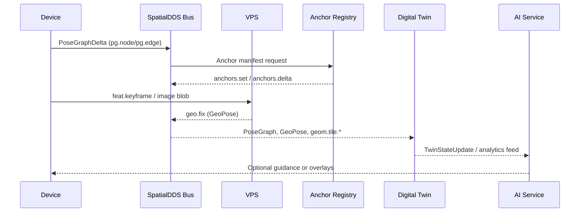

## **3. Operational Scenarios: From SLAM to AI World Models**

SpatialDDS supports a ladder of capabilities that begins with a single device mapping its surroundings and ends with AI systems consuming a live digital twin. Rather than enumerating isolated use cases, this section walks through one coherent flow — from local SLAM to shared anchors, to global positioning, to twin aggregation, and ultimately to AI world models.

### **Narrative Walkthrough: Local → Shared → Global → AI**

1. **Local SLAM on-device.** A headset, drone, or robot runs visual-inertial SLAM, generating keyframes and odometry updates in its private map frame.
2. **Sharing a pose graph.** The device publishes `pg.node` and `pg.edge` samples (often as compact PoseGraphDelta bursts) onto the SpatialDDS bus so nearby peers or edge services can extend or optimize the map.
3. **Anchors stabilize VIO.** By discovering the Anchor Registry, the device resolves durable anchor URIs, retrieves their manifests, and fuses those priors to keep its VIO estimate drift-free.
4. **VPS provides a GeoPose.** When the device needs a global fix, it queries a Visual Positioning Service (VPS). The VPS uses the shared pose graph plus anchor hints to return a `geo.fix` sample that orients the local map in a world frame.
5. **Digital twin aggregation.** Twin backends subscribe to the same streams — pose graphs, anchors, geometry, and semantics — to maintain authoritative state for places, assets, and events.
6. **AI world models consume the twin.** Analytics engines, planning agents, and foundation models read from the digital twin feeds, grounding their predictions and experiences in the synchronized world model.

The end result is a continuous chain: local sensing feeds a shared spatial data bus, anchors and VPS lift content into a global frame, digital twins maintain durable state, and AI systems reason over the fused model.



### **Example 1: Device Localization with SLAM and Anchors**

A field technician’s headset begins indoors with self-contained SLAM. As it walks the “local → shared → global” ladder:

- **Publish local mapping.** Each keyframe produces a PoseGraphDelta that streams to `pg.node` / `pg.edge`. An excerpt looks like:

    ```json
    {
      "topic": "pg.node",
      "map_id": "map/facility-west",
      "node_id": "kf_0120",
      "pose": { "t": [0.12, 0.04, 1.43], "q": [0.99, 0.01, -0.02, 0.03] },
      "frame_id": "map",
      "stamp": { "sec": 1714070452, "nsec": 125000000 },
      "source_id": "device/headset-17"
    }
    ```

- **Discover anchors.** Through `disco.service`, the headset resolves `anchor://facility-west/loading-bay`, fetches the manifest (Appendix A.1), and applies the returned `FrameTransform` to pin its `map` frame to a surveyed ENU.
- **Query VPS.** When entering the yard, it uploads a `feat.keyframe` set to VPS. The service matches against the shared pose graph plus anchor hints and responds with a `geo.fix` sample:

    ```json
    {
      "topic": "geo.fix",
      "anchor_id": "anchor://facility-west/loading-bay",
      "geopose": {
        "lat_deg": 37.79341,
        "lon_deg": -122.39412,
        "alt_m": 12.6,
        "q": [0.71, 0.00, 0.70, 0.05],
        "frame_kind": "ENU",
        "frame_ref": "@37.79340,-122.39410,5.2"
      },
      "cov": [0.04, 0, 0, 0.04, 0, 0, 0, 0, 0.09]
    }
    ```

- **Align to world.** The headset fuses the GeoPose with its local pose graph, hands peers a globally aligned `geo.tf`, and continues publishing drift-stable updates for others to use.

(See Appendix A.1 for the full anchor and VPS manifests referenced here.)

### **Example 2: Updating and Using a Digital Twin**

A facilities digital twin service subscribes to the same DDS topics to maintain a live model, while an AI analytics engine consumes the twin stream:

- **Twin ingestion.** The backend listens to `pg.node`, `geo.anchor`, and `geom.tile.*` to reconcile a persistent state for each asset. When a door actuator changes, an operator microservice emits:

    ```json
    {
      "topic": "twin.state.update",
      "uri": "urn:spatial://facility-west/assets/door-17",
      "anchor_ref": "anchor://facility-west/loading-bay",
      "state": {
        "pose_local": {
          "t": [4.21, -1.02, 0.00],
          "q": [1, 0, 0, 0]
        },
        "door_status": "open",
        "last_maintenance": "2024-03-22"
      },
      "stamp": { "sec": 1714070520, "nsec": 0 }
    }
    ```

  The twin registry validates the anchor reference, signs a manifest (Appendix A.2), and updates the canonical record.

- **AI/analytics consumption.** A predictive maintenance model subscribes to `twin.state.update` and `semantics.det.3d.set` streams. It flags abnormal open durations, publishing alerts and AR overlays back through SpatialDDS.
- **Experience feedback.** AR clients render the AI insight, while robotics planners reuse the same URI-addressable twin objects for navigation.

(See Appendix A.2 for extended twin manifests and analytics payloads.)

### **Why the Ladder Matters**

This end-to-end chain demonstrates how SpatialDDS keeps local SLAM, shared anchors, VPS fixes, digital twins, and AI models in sync without bespoke gateways. Devices gain reliable localization, twins receive authoritative updates, and AI systems operate on a grounded, real-time world model.
